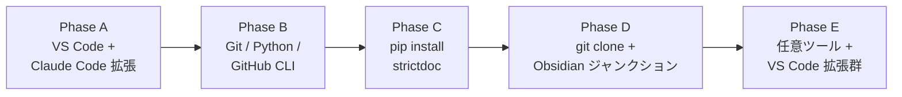

# 01 環境構築 (Phase 0 + Phase 1)

StrictDoc を動かすための **環境を作る (Phase 0)** → **最小の `.sdoc` から HTML を出す (Phase 1)** までを記述する。Phase 2 以降はそれぞれ `02-schema.md` を参照。

| | 内容 | 自動化 |
|---|---|---|
| **Phase 0** | 必須ツール一式の導入 (Git / Python / StrictDoc / GitHub CLI / VS Code + Claude Code 拡張 / 任意ツール) | `setup-strictdoc.bat` |
| **Phase 1** | 最小 `.sdoc` を書いて `strictdoc export` で HTML 生成、`strictdoc server` で Web UI 起動 | 手動 |

---

## Phase 0: インストール

### 目的

- StrictDoc を実行可能な Windows 11 環境を **誰でも再現できる形** で構築する
- 同じ操作で何度でもクリーン環境を作り直せること

### 前提

| 項目 | 値 |
|---|---|
| OS | Windows 11 (winget 標準搭載) |
| 推奨 | Hyper-V VM (クリーン環境 + スナップショットによる再現性) |
| 権限 | 管理者権限 (UAC で取得) |
| ネットワーク | インターネット接続必須 (winget / pip / git) |
| 想定時間 | 15〜30 分 (回線速度依存) |

### 手順 — StrictDocStarter 自動セットアップ

1. **`StrictDocStarter.zip` をデスクトップに転送** (Hyper-V 拡張セッションのクリップボード経由など)
2. **ZIP を展開** (右クリック → 「すべて展開」) → `Desktop\StrictDocStarter\` が作成される
3. **`setup-strictdoc.bat` をダブルクリック**
4. UAC ダイアログ → **「はい」**
5. プラン表示 → **`yes`** と入力 → Enter
6. Phase A〜E が順に実行される (放置可)
7. サマリ表示 → **Enter** で閉じる

StrictDocStarter ツール本体の詳細仕様は [`setup-spec.md`](setup-spec.md)、ファイル構成と各サブコマンドの説明は [`../README.md`](../README.md) を参照。

#### StrictDocStarter が実行する内容



| Phase | 内容 | 既定で実行 |
|---|---|---|
| A | VS Code 本体 + `anthropic.claude-code` 拡張 | ✅ |
| B | Git / Python 3.13 / GitHub CLI を winget で導入 | ✅ |
| C | `python -m pip install --upgrade pip` → `pip install strictdoc` | ✅ |
| D | プロジェクトリポジトリの `git clone` + Obsidian vault ジャンクション作成 | ❌ (URL 空既定でスキップ) |
| E | Obsidian / Windows Terminal / PowerShell 7 / ripgrep / jq + 6 種の VS Code 拡張 | ✅ |

Phase D は **既定でスキップ**。GitHub アカウントが無いユーザでもそのまま完走可能。Phase D を有効化したい場合は `setup.config.json` の `repository.url` に対象リポジトリ URL を記入してから `setup-strictdoc.bat` を再実行。

### 結果確認

VM 内の **新しい PowerShell** (PATH 反映のため新規セッション推奨) で以下を実行:

```powershell
# Claude Code 拡張
code --list-extensions | findstr anthropic
# -> anthropic.claude-code

# 必須ツール
git --version
python --version
gh --version
strictdoc --version

# 任意ツール
rg --version
jq --version
```

すべてバージョン情報が出力されれば成功。

ログファイルは `Desktop\StrictDocStarter\setup.log` に保存され、末尾の `=== Summary ===` で各 Phase の OK / SKIP / FAILED が確認できる。

### トラブルシュート

クリーン Windows 11 VM での実検証で見つかった既知の落とし穴。最新版 StrictDocStarter で **すべて対策済** だが、症状と原因を把握しておくと挙動を読みやすくなる。

| 症状 | 原因 | 対策 (StrictDocStarter で実施済) |
|---|---|---|
| PowerShell の実行可否を訊くダイアログが出る | クリップボード経由で運ばれた `.ps1` に Mark-of-the-Web (MOTW) 属性が付与され、Windows が「別マシン由来」と判定 | `setup-strictdoc.bat` 起動時に `Unblock-File` を全 `.ps1`/`.psm1`/`.bat` に実行 |
| UAC で「いいえ」を押すと窓が即閉鎖 | PowerShell の `Start-Process -Verb RunAs` 失敗時に exit | エラー表示後 `pause` で停止、ログ確認可能 |
| 管理者 PowerShell の CWD が System32 | UAC 自己昇格の Windows 仕様 | `.bat` 内で `cd /d "%~dp0"` により script フォルダに正規化 |
| Phase B で Python install がスキップされる<br />(でも Python は動かない) | Microsoft Store の `python.exe` スタブ (`%LOCALAPPDATA%\Microsoft\WindowsApps\python.exe`) が PATH 上にあり、`Get-Command python` が引っかかる | スタブのパスを除外、`python --version` 出力が `Python X.Y` パターンに合致するか検証 |
| プラン表示中に画面が固まる<br />(30 秒以上無反応) | `winget list --id Obsidian.Obsidian` の初回呼び出しが winget ソース インデックスのダウンロードを起動し時間がかかる | レジストリ Uninstall キーから DisplayName で検出する方式に変更 |
| Phase D で GitHub サインイン GUI が出る | clone 先リポジトリが未作成 / private で git が認証要求 → Git Credential Manager が GUI 起動 | `GIT_TERMINAL_PROMPT=0` + `GCM_INTERACTIVE=Never` で抑止 + 既定 URL を空に |
| Phase D 中に `[ERROR] git clone threw: Cloning into ...` | PowerShell の `$ErrorActionPreference = "Stop"` が git の stderr 進捗 (`Cloning into ...`) を致命的エラー扱い | git clone 実行中だけ `$ErrorActionPreference = "Continue"` に下げる |
| 任意ツール再実行で Obsidian が「未インストール」と誤検知 | `%LOCALAPPDATA%\Obsidian\` 固定パスのみチェックしていた。実体は Squirrel installer により `%LOCALAPPDATA%\Programs\Obsidian\Obsidian.exe` | レジストリ DisplayName=`Obsidian` で検出、フォールバックパスも 4 通りに拡張 |
| VS Code を非標準パス (例: `D:\Tools\VSCode\`) に入れていると未検出 | 既知 3 パスとパス検索のみ | レジストリ Uninstall キーの `InstallLocation` / `DisplayIcon` から `bin\code.cmd` を発見する 3 段階フォールバック |
| `setup.config.json` が `C:\Windows\System32\` に作成される | UAC 後の CWD が System32、`Get-Location` で取得していた | 上記 CWD 正規化で解消 |
| `winget install` 直後の同セッションで新コマンドが見えない | 環境変数 PATH が起動時のスナップショットで固定 | 各 winget 後に `Update-PathFromRegistry` で Machine + User の PATH を再読み込み |

詳細は [`StrictDocStarter/README.md`](StrictDocStarter/README.md) のトラブルシュート節と、`gather-logs.bat` で取得できる `diagnostics.txt` を参照。

### 検証

StrictDocStarter 自体の動作検証は **クリーン VM での自動テスト** で実施済:

| シナリオ | 検証内容 | 結果 |
|---|---|---|
| T1 ベースライン | クリーン VM で全 Phase 完走 | 全 OK |
| Idempotency | 再実行で全 SKIP | 全 OK |
| PartialOptional | jq + ripgrep + gitlens 拡張のみ再 install | 全 OK |
| RequiredOnly | gh のみ再 install | 全 OK |
| ExtensionsOnly | VS Code 拡張 2 件のみ再 install | 全 OK |
| Mixed | 必須 + 任意 + 拡張を 1 つずつ | 全 OK |

自動テストは `run-tests.bat` ダブルクリックで再現可能。詳細は [`StrictDocStarter/vm-test-checklist.md`](StrictDocStarter/vm-test-checklist.md)。

### 次のステップ

Phase 0 完了状態で **`strictdoc --version` が出力される** ことを確認したら、Phase 1 へ進む。

---

## Phase 1: Hello World

### 目的

- 最小の `.sdoc` ファイルを書き、`strictdoc export` で HTML を生成する
- StrictDoc の **ファイル形式**・**コマンド**・**出力構造** の感覚を掴む
- 以降の Phase 2 (Grammar 拡張) で何をいじることになるかを体感する

### 前提

- Phase 0 完了 (`strictdoc --version` が動く)
- Phase 0 で導入した VS Code が起動できる
- ブラウザ (Edge / Chrome / Firefox いずれか)

### 手順

#### 1. 作業ディレクトリを作る

```powershell
mkdir $HOME\Documents\strictdoc-hello
cd $HOME\Documents\strictdoc-hello
```

VM 内に閉じた検証用なので場所は任意。ホスト同期したい場合は OneDrive 配下を避け、Hyper-V 共有や Obsidian vault のジャンクションを使う。

#### 2. 最小の `.sdoc` を書く

`hello.sdoc` を以下の内容で作成 (VS Code か メモ帳):

```text
[DOCUMENT]
TITLE: Hello StrictDoc

[REQUIREMENT]
UID: REQ-1
TITLE: 最初の要求
STATEMENT: >>>
データ収集システムは、起動時に "Hello, StrictDoc" を表示すること。
<<<
```

ポイント:

- 1 つの `.sdoc` ファイルは **1 つの `[DOCUMENT]` ブロック** で始まる
- 要求は `[REQUIREMENT]` ブロックで表現
- `UID` はファイル内で一意 (Phase 2 でプロジェクト全体の命名規約を定める)
- `STATEMENT: >>>` ... `<<<` で複数行の本文を書ける

#### 3. HTML を生成

```powershell
strictdoc export .
```

`output/html/` 以下にファイル一式が生成される。

#### 4. ブラウザで確認

```powershell
start output\html\index.html
```

トップページから `hello.sdoc` に遷移し、`REQ-1` の本文が表示されることを確認。

#### 5. (任意) Web UI を起動

```powershell
strictdoc server .
```

ブラウザで `http://localhost:5111/` を開くと、要求の追加・編集・削除を GUI で行える状態。確認できたら Ctrl+C でサーバ停止。

### 結果確認

| チェック | 期待値 |
|---|---|
| `output\html\index.html` の存在 | あり |
| トップから `REQ-1` までクリックで到達できる | OK |
| 本文の日本語が文字化けせず表示 | OK |
| `strictdoc server .` で Web UI が起動 | OK (ポート 5111) |

### トラブルシュート

| 症状 | 原因 | 対処 |
|---|---|---|
| `strictdoc : The term 'strictdoc' is not recognized` | Phase C で pip install したが現セッションの PATH に反映されていない | 新しい PowerShell を開く、または `python -m strictdoc export .` で代替 |
| `[ERROR] ...` で export 失敗 | `.sdoc` の文法ミス (引用符、`>>>`/`<<<` のペア欠落、TITLE の改行など) | エラーメッセージの行番号を確認し修正。`.sdoc` は前後の空行とインデントに敏感 |
| `strictdoc server` でポート競合 | 既に 5111 を使うプロセスあり | `strictdoc server . --port 5112` 等で別ポート指定 |
| HTML の日本語が文字化け | ブラウザのエンコーディング自動判定失敗 | `.sdoc` を UTF-8 (BOM なし) で保存し直す。`Set-Content -Encoding UTF8` で保存 |

### 次のステップ

Phase 1 が成功したら、Phase 2 (Grammar カスタマイズ) へ。本プロジェクトの ASIL / EARS_PATTERN / VERIFICATION_METHOD などの拡張フィールドを定義し、`hello.sdoc` を本格的なスキーマに移行する。詳細は `02-schema.md` (Phase 2 着手時に作成)。
