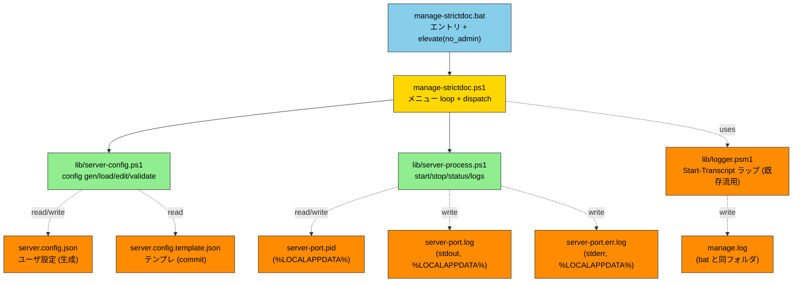
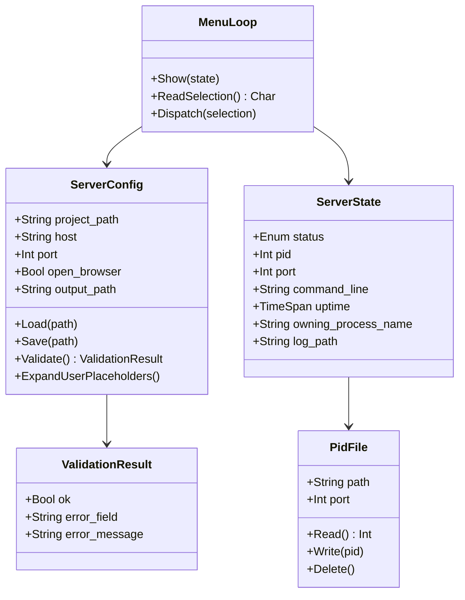
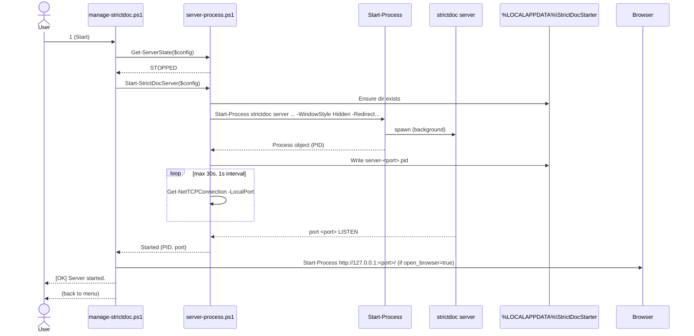
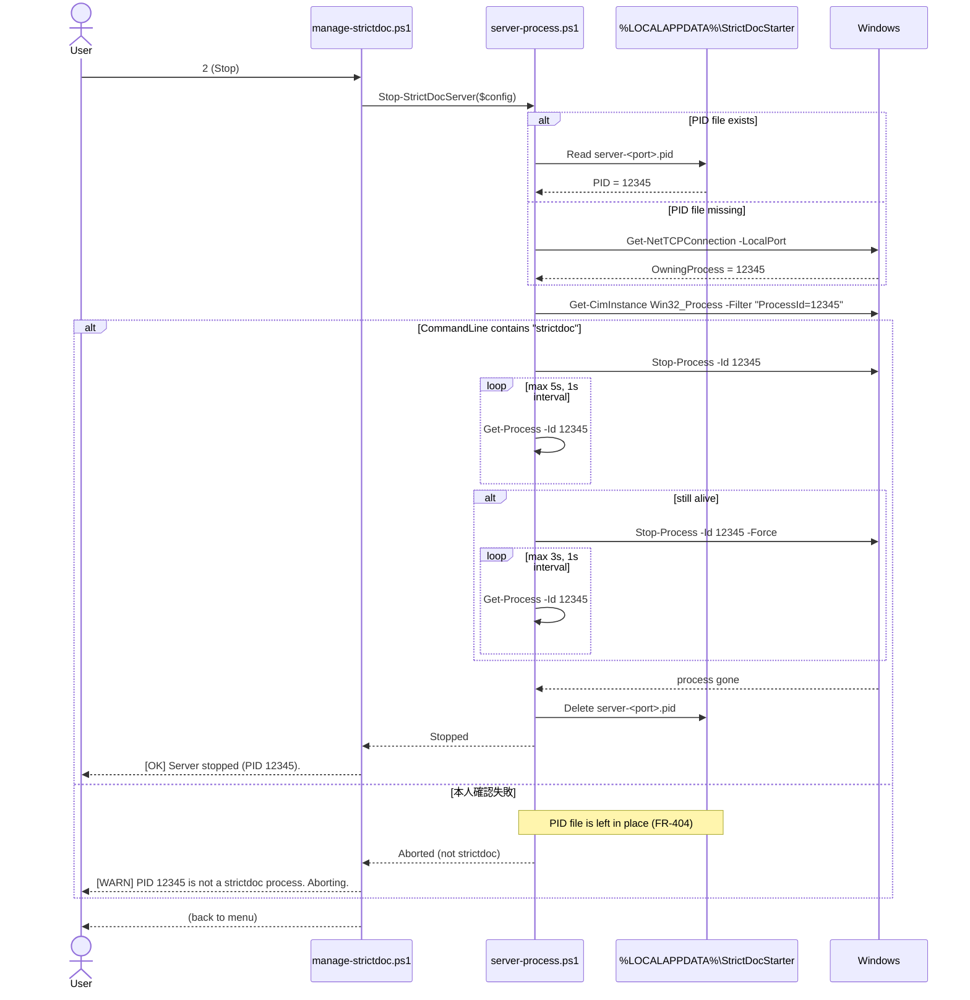
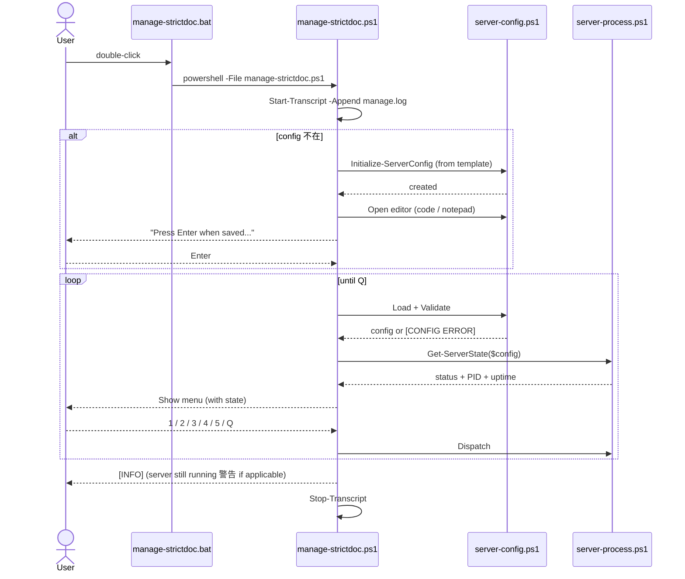

# manage-strictdoc — StrictDoc Server Lifecycle Management 仕様書

| 項目 | 値 |
|---|---|
| 文書名 | manage-strictdoc — StrictDoc Server Lifecycle Management 仕様書 |
| バージョン | v1.1 (改訂: 公式委譲 & 可視ウィンドウ方式) |
| テンプレート | ANMS v0.33 |
| ツール名 | **manage-strictdoc** (StrictDocStarter 同梱) |
| エントリ | `manage-strictdoc.bat` (ダブルクリック → server 窓 + ブラウザ。 v1.1: 最小メニュー Start/Open/Edit config/Quit — FR-1121/D-7) |
| 対象 | strictdoc がインストール済み Windows 11 PC |
| 親仕様 | [`docs/setup-spec.md`](setup-spec.md) (StrictDocStarter v1.0) |
| リポジトリ | `https://github.com/GoodRelax/gr-tools/tree/main/StrictDocStarter` |

---

> ## ⚠️ v1.1 改訂サマリ (2026-06-06) — 必読
>
> 調査の結果、 StrictDoc 公式は **サーバ起動 (`strictdoc server` = 可視コンソール、 readiness/error 表示つき)・プロジェクト雛形 (`strictdoc new`)・設定形式 (`strictdoc_config.py`)** を既に提供しており、 **公式に無いのはインストーラのみ**であることが判明した。 そこで本仕様は方針転換する:
>
> - **D-5 スコープ**: StrictDocStarter は「Windows ブートストラップ + ダブルクリック」に集中し、 サーバ起動 / 雛形 / 設定は **公式へ委譲** (再発明しない)。
> - **D-6 可視ウィンドウ方式**: server を **可視コンソール窓**で起動し、 公式の readiness (`Uvicorn running on …`) / error (`Could not parse …`、 即終了) 表示をそのまま使う。 **隠れバックグラウンド + ポート poll + PID file + Start-Transcript ロックは廃止**。
>
> → これにより **§2.1.3-2.1.7 (FR-300/400/500/700 系)、 ADR-104/105/107/110/112、 3.1-3.5 の隠れデーモン前提は Chapter 6 (改訂 v1.1) により supersede される**。 §1-§5 の当該記述 (例: 1.3 Goal 3-4、 1.4 Approach、 1.6 Scope の 4/5 状態管理) は **v1.0 の歴史的記録**として残置し、 実装時は **Chapter 6 が優先**する。 根拠の全量は [`improvement-items.md`](improvement-items.md)。

## Chapter 1. Foundation

### 1.1 Background

- StrictDoc は `strictdoc server <project-path>` で Web UI を提供 (デフォルト http://127.0.0.1:5111)
- PoC 段階で手動起動/停止を繰り返している → 1-click 化したい
- setup-strictdoc.bat で環境構築済の Windows 11 上で、 「server 起動 → ブラウザで編集 → 停止」 を最短手数で行えるようにする
- 仕様の親は [`docs/setup-spec.md`](setup-spec.md)。 本書は setup の延長サブツール (= manage-strictdoc) の仕様

### 1.2 Issues

- 毎回手動で `strictdoc server` をタイプ (path 入力ミス、 port 衝突確認漏れ)
- バックグラウンド起動方法が定まらず、 ターミナルがブロックされる / ウィンドウが散らかる
- どのプロセスが strictdoc server か特定する手段が乏しく、 終了し損ねが頻発
- 別フォルダで PoC を切り替える際、 古い server を確実に止める手段が必要

### 1.3 Goals

1. **ダブルクリック → メニュー → 1 押し** で start / stop / status / logs / Edit config を選べる (→ v1.1 改訂: 最小メニュー Start/Open/Edit config/Quit へ。 Stop/Status/Logs は可視窓が担う。 G6-1 / FR-1121 / D-7)
2. 設定は `server.config.json` 1 ファイルで宣言、 メニューから Edit config で更新可能
3. server プロセスは確実に終了できる (PID file + 本人確認、 取りこぼしなし)
4. メニュー .bat を Ctrl+C で終了しても server は影響なく稼働継続 (daemon-like)

### 1.4 Approach

- **メニュー対話方式** (vs サブコマンド引数方式): ユーザの記憶負荷ゼロ、 ダブルクリック完結
- **`Start-Process -WindowStyle Hidden` + stdout/stderr redirect** でバックグラウンド起動
- **PID file (主) + port-based (fallback) + 本人確認 (CommandLine に "strictdoc")** の 3 段防御で server 特定
- 設定変更は `Edit config` メニュー → 既定エディタ起動 → メニュー戻り時に毎回再ロード + validate
- ログは **manage 操作 (manage.log) と server stdout (server-\<port\>.log) を分離** (SRP)

### 1.5 Tool Inventory (依存)

新規 install ツールなし。 以下が setup-strictdoc.bat 完了済として前提:

| No | ツール | 用途 | 導入元 |
|---|---|---|---|
| 01 | strictdoc | `strictdoc server` の本体 | pip (setup Phase C) |
| 02 | Python | strictdoc 実行基盤 | winget (setup Phase B) |
| 03 | VS Code (任意) | 既定エディタ fallback の `code` | winget (setup Phase A) |
| 04 | PowerShell 5.1+ | スクリプト実行基盤 | Windows 11 標準 |

### 1.6 Scope

**In-scope:**

- Windows 11 + Python + strictdoc 導入済環境
- 1 つの `project_path` / 1 つの `port` での server 管理 (1 メニュー .bat = 1 server)
- start / stop / status / logs / Edit config の 5 メニュー操作
- `server.config.json` による設定宣言
- PID file + port LISTEN による状態管理 (4 状態: RUNNING / STOPPED / STALE_PID_FILE / OTHER_OWNS_PORT)
- 既定ブラウザ自動 open (`config.open_browser`)
- `gather-logs.bat` への log 統合 (server-*.log / manage.log)

**Out-of-scope (v1.0):**

- 複数 server の並行管理 (1 メニュー .bat = 1 server。 並行検証は別フォルダコピーで対応)
- strictdoc TOML config (`--config`) のパススルー
- 認証 / アクセス制御 (strictdoc 自体に機能なし、 127.0.0.1 bind 前提)
- Windows 10 / non-Windows OS
- メニュー UI の TUI / GUI 化 (text のみ)
- log rotation (サイズ閾値)
- proxy 環境対応 (setup と同じく v1.0 対象外)
- CI/automation 用のサブコマンド引数式 (将来追加余地は残す)

### 1.7 Constraints

- Windows 11 + PowerShell 5.1+
- **管理者権限不要** (server 起動は user 権限、 setup と異なり `_lib/elevate.bat no_admin` で call)
- `strictdoc` / `python` が PATH に通っていること (setup-strictdoc.bat 完了済前提)
- スクリプト本体は **ASCII only** (setup-spec.md ADR-008 継承)
- **単一 Windows アカウントのみが本ツールを使用する PC** を前提 (信頼境界 = 単一ユーザ)。 別アカウントや admin による PID file / log file 改ざんは検出しない
- **実装時の変数名規約**: `$pid` は PowerShell の予約自動変数 (現プロセス PID) のため、 server プロセスの PID を保持する変数には `$serverPid` 等を使用すること (Glossary 参照)

### 1.8 Limitations

- 同じ port で別アプリが LISTEN している場合、 manage は start を拒否 → ユーザに config 編集を促す (別 port を提案しない)
- メニュー .bat を Ctrl+C で終了しても server プロセスは生存継続 (= feature、 ただし多重起動の責任はユーザ)
- `%LOCALAPPDATA%\StrictDocStarter\` 配下の PID file が手動削除されると port-based fallback に依存 (動作は OK だが log で警告)
- Python CLI app の特性上、 graceful shutdown 不可 (Stop-Process 即時終了、 -Force fallback)
- CommandLine 本人確認は `Get-CimInstance Win32_Process` に依存。 **WMI 無効化環境では本人確認に失敗し続け Stop が abort される** → 復旧は PID file の手動削除 (`%LOCALAPPDATA%\StrictDocStarter\server-<port>.pid` を delete) → 次回 Stop で port-based fallback。 escape hatch (強制 stop 確認 prompt) は v1.x で再検討
- `Get-NetTCPConnection` で OwningProcess を取得する際、 **別ユーザ / 昇格プロセスが port を占有していると OwningProcess 取得できず `UNKNOWN_OCCUPANT` として表示** される (FR-505)。 PoC「単一ユーザ」 前提下では稀
- PID file の信頼性: 同一ユーザ ACL 下で書込制限はあるが、 admin プロセスが任意 PID を書き込めば誤検出される。 single-user PoC スコープではこの脅威モデルを採用しない

### 1.9 Glossary

| 用語 | 説明 |
|---|---|
| manage-strictdoc | 本仕様の対象ツール |
| StrictDocStarter | 親ツール (setup-strictdoc + manage-strictdoc + gather-logs) |
| メニュー方式 | `.bat` 起動 → 番号選択 → アクション → メニュー戻り、 のループ UI |
| PID file | プロセス ID を 1 行で保存するファイル (一般的 daemon パターン) |
| port-based fallback | PID file 不在時に LISTEN 中の port から OwningProcess を取得して特定する方式 |
| 本人確認 | 停止対象プロセスの CommandLine に "strictdoc" が含まれるか確認 (誤殺防止) |
| 5 状態 | (v1.0) RUNNING / STARTING / STOPPED / STALE_PID_FILE / OTHER_OWNS_PORT。 **v1.1 (FR-1113) で 3 状態 RUNNING / OTHER_OWNS_PORT / STOPPED へ簡素化** (PID file 廃止に伴い STARTING / STALE_PID_FILE を削除) |
| `%LOCALAPPDATA%` | `C:\Users\<user>\AppData\Local` (Windows のユーザローカルキャッシュ領域、 NTFS ACL でユーザ単位アクセス制御) |
| Expand-UserPlaceholders | setup-spec.md FR-208 由来、 `<user>` を `$env:USERNAME` に展開する関数 |
| Expand-PathPlaceholders | 拡張版。 `<user>` (FR-208) + `<starter_root>` (manage-strictdoc.bat のフォルダ絶対パス) の両方を展開。 unzip-and-go で同梱 `samples/` を default project_path に指せるようにする |
| `<starter_root>` | path placeholder。 `manage-strictdoc.bat` のフォルダの絶対パスに展開される。 template の default `project_path` で `<starter_root>\samples\sovd-automotive` を使用 |
| samples/ | StrictDocStarter 同梱の StrictDoc サンプルプロジェクト 2 個。 `samples/hello-strictdoc/` (5 reqs、 編集用テンプレ)、 `samples/sovd-automotive/` (~105 reqs、 中規模、 **初期 default**、 00 概要 + 01-05 要求/基盤 + 06 設計 + 07 API + 08 テスト仕様 + 09 テスト結果 + 90 付録、 要求→設計→API→テスト仕様→結果の V 字を EARS/L0-L3 + Implements/Satisfies/Verifies/ResultOf でトレース、 ASIL/CAL/Layer/Type custom fields、 共有文法 `sovd-grammar.sgra` (REQUIREMENT/COMPONENT/API/TEST/TEST_RESULT)) |
| `$pid` | **PowerShell の予約自動変数** で現プロセス自身の PID を保持。 server プロセスの PID 変数として **使用禁止** (= 自プロセスを stop 対象にしてしまう事故防止)。 `$serverPid` / `$targetPid` 等を使用 |
| MOTW | Mark-of-the-Web。 Web/Zip 経由で取得したファイルに付くゾーン情報、 PowerShell が実行を阻害することがある |
| WMI | Windows Management Instrumentation。 プロセス情報等を取得する Windows の管理基盤 |
| CIM | Common Information Model。 WMI の新世代 API、 PowerShell では `Get-CimInstance` で参照 |
| OwningProcess | `Get-NetTCPConnection` が返すプロパティで、 該当 TCP socket を所有するプロセス PID |
| LISTEN | TCP socket が接続待ち受け状態であること (`Get-NetTCPConnection -State Listen`) |
| EARS | Easy Approach to Requirements Syntax。 Ubiquitous / Event-driven / State-driven / Unwanted-behaviour / Optional の 5 パターンで要求を書く規約 |
| SRP | Single Responsibility Principle。 1 モジュール = 1 つの変更理由 |
| `_lib\elevate.bat no_admin` | setup-spec.md FR-806 の共通ヘルパ、 引数 `no_admin` は UAC 昇格を要求せず MOTW strip + CWD 正規化のみ実行するモード |
| BOM | Byte Order Mark。 UTF-8 ファイル先頭の ``、 PowerShell 5.1 の `ConvertFrom-Json` が誤動作する原因 |
| HasExited | PowerShell `Start-Process -PassThru` が返す Process object のプロパティ、 子プロセス終了済かを判定 |

### 1.10 Notation

- RFC 2119/8174 準拠
- **SHALL / MUST** = 必須
- **SHOULD** = 推奨
- **MAY** = 任意
- EARS の `shall` は SHALL と同義

---

## Chapter 2. Requirements

### 2.1 Functional Requirements

#### 2.1.1 起動・dispatch (FR-100 系)

| ID | パターン | 要求 |
|---|---|---|
| FR-101 | Ubiquitous | `manage-strictdoc.bat` はダブルクリックで起動可能であること |
| FR-102 | Ubiquitous | `manage-strictdoc.bat` は冒頭で `call _lib\elevate.bat no_admin "%~f0" "%*"` を call して MOTW strip + CWD 正規化を行うこと (UAC 昇格は不要、 setup-spec.md FR-806 表に行追加) |
| FR-103 | Ubiquitous | `manage-strictdoc.bat` は `manage-strictdoc.ps1` を `powershell -ExecutionPolicy Bypass -File` で呼び出すこと |
| FR-104 | Ubiquitous | `manage-strictdoc.ps1` は無限ループでメニューを表示し、 ユーザが `Q` を入力するまで継続すること |
| FR-105 | Ubiquitous | 各メニュー操作 (1〜5) 完了後、 メニュー再表示に戻ること (1 回の操作で終了しない) |
| FR-106 | When | `manage-strictdoc.bat` 起動時、 `Start-Transcript` (既存 `lib/logger.psm1` の `Start-OnboardLog -LogPath <manage.log>` を流用) で `manage.log` (bat と同フォルダ) に全実行ログを **append** モードで記録すること |
| FR-107 | If | もし `Q` または Ctrl+C で終了した時、 server が稼働中ならば `[INFO] Server is still running (PID X on port Y). Use 'Stop' next time to terminate it.` を 1 行表示すること |
| FR-108 | Ubiquitous | メニュー入力は **case-insensitive** で判定すること (`q`/`Q`/`r`/`R` 等両方 OK) |
| FR-109 | If | もし不正な選択肢が入力されたら、 `Invalid selection. Choose [1/2/3/4/5/Q].` warn を表示してメニュー再表示すること |
| FR-110 | If | もし `Start-Transcript` (FR-106) が失敗 (= 同一 `manage.log` を別 PowerShell session が既にロック中、 二重起動の兆候) ならば、 `manage-strictdoc.ps1` は `[ERROR] Another manage-strictdoc session appears to be running (cannot lock manage.log). Close it first, then retry.` を表示して即時 abort (exit code 1) すること。 ロック検出は Start-Transcript の `-ErrorAction Stop` + `try/catch` で実装可能 |

#### 2.1.2 設定ファイル管理 (FR-200 系)

| ID | パターン | 要求 |
|---|---|---|
| FR-201 | If | もし `server.config.json` が存在しなければ、 `manage-strictdoc.ps1` は `server.config.template.json` から copy + `<user>` 即時展開で生成すること。 生成時のエンコーディングは **UTF-8 BOM なし** とすること (PowerShell 5.1 の `ConvertFrom-Json` が BOM 付き UTF-8 を `Unexpected character encountered` で reject するため) |
| FR-202 | When | 初回生成直後、 `manage-strictdoc.ps1` は既定エディタを以下の順で fallback して起動すること: (a) `Get-Command code -ErrorAction SilentlyContinue` で `code` 存在確認 → `Start-Process code -ArgumentList '--reuse-window', '<path>' -PassThru` で起動、 (b) 1 秒後に `Process.HasExited == true` かつ exit code != 0 ならば失敗とみなし notepad fallback、 (c) `code` 不在ならば `Start-Process notepad -ArgumentList '<path>'` で起動 |
| FR-203 | When | 初回 config 編集後、 `manage-strictdoc.ps1` は `Press Enter when you have saved the config...` で待機すること (`yes` 入力は不要、 Enter のみ) |
| FR-204 | Ubiquitous | `server.config.json` は JSON 形式 (**UTF-8 BOM なし推奨**、 `_comment_*` プロパティでコメント表現) であること。 読込時は `Get-Content -Raw -Encoding UTF8` 取得後、 先頭 BOM (``) を strip してから `ConvertFrom-Json` に渡すこと (notepad で保存すると BOM が付くケースに対応) |
| FR-205 | Ubiquitous | `server.config.json` は以下のフィールドを含むこと: `project_path` (必須) / `host` / `port` / `open_browser` / `output_path` (任意、 default あり) |
| FR-206 | Ubiquitous | `server.config.json` は `.gitignore` 対象、 **`server.config.template.json` のみ commit** すること |
| FR-207 | Ubiquitous | `server.config.template.json` および `server.config.json` の top-level に `_comment_overview` キーを含めること。 **値は 1 行 ASCII 文字列** で `Required: <fields>. Optional with defaults: <field (default); ...>.` の形式に従うこと (setup-spec.md FR-210 流儀、 機械検証可能) |
| FR-208 | Ubiquitous | `project_path` および `output_path` 内の path placeholder は path 操作 (`Test-Path` / `Join-Path` / `Start-Process` 等) より **先に** `Expand-PathPlaceholders` で展開すること。 サポートする placeholder: (a) `<user>` → `$env:USERNAME` (setup-spec.md FR-208 継承)、 (b) `<starter_root>` → `manage-strictdoc.bat` の置かれているフォルダの絶対パス (unzip-and-go で同梱 samples/ が見つかるようにする)。 **重要**: Initialize-ServerConfig が template を raw text 置換する際、 `_comment_*` フィールド内に置換対象リテラル (`<user>` / `<starter_root>`) を含めてはならない (説明テキストまで誤置換される。 documentation は別の語 (USERNAME / STARTER_ROOT) を使用するか README に書く) |
| FR-209 | Ubiquitous | メニュー loop の **毎回先頭** で `server.config.json` を再ロード + validate すること (in-memory cache 禁止)。 これにより Edit config 後の変更が即反映される |
| FR-210 | Ubiquitous | validation rules: (a) `project_path` 展開後の絶対パスが存在 + ディレクトリ、 (b) `host` は **IPv4 dotted-decimal** (`^\d{1,3}(\.\d{1,3}){3}$`) **または** `localhost` **または** IPv6 literal (`^[0-9a-fA-F:]+$`) のいずれか (※ StrictDoc 本体の `is_valid_host` は任意のホスト名も許容するが、 本ツールは PoC 安全側として IP/localhost に限定)、 (c) `port` は **1025..64999** の整数 (strictdoc は CLI `--port` が `[1024,65000]` inclusive・config 形式が `(1024,65000)` exclusive と経路で差があるため、 両経路で確実に有効な範囲に安全側で限定)、 (d) `open_browser` bool、 (e) `output_path` 任意 (空文字 or 任意文字列、 存在チェックなし) |
| FR-211 | If | もし validation に失敗したら、 メニューヘッダ直下に `[CONFIG ERROR] <field>: <message>` を表示し、 menu `5` (Edit config) と `Q` のみ enabled、 `1`〜`4` は disabled とすること (選択しても `Fix config first (menu 5).` 警告でメニュー戻り) |
| FR-212 | When | menu `5` (Edit config) は FR-202 と同じ fallback ロジック (`Get-Command code` 存在確認 → `Start-Process -PassThru` + HasExited 確認 → notepad fallback) で `server.config.json` を開くこと。 起動は **ブロックしない** (= エディタを閉じる前にメニューに戻る) |
| FR-213 | Ubiquitous | `_comment_*` キーは **表示専用**、 `Invoke-Expression` / `Start-Process` / `&` 等の評価対象としないこと (setup-spec.md FR-213 継承) |

#### 2.1.3 server start (FR-300 系)

| ID | パターン | 要求 |
|---|---|---|
| FR-301 | When | menu `1` (Start) は `Start-Process strictdoc -ArgumentList 'server', $project_path, '--host', $host, '--port', $port [, '--output-path', $output_path] -WindowStyle Hidden -RedirectStandardOutput <stdout_log> -RedirectStandardError <stderr_log>` で server をバックグラウンド起動すること (output_path が空文字なら引数省略)。 **stdout と stderr は別ファイル** に redirect すること (PowerShell 5.1 が同一ファイル指定を reject するため、 FR-702 参照) |
| FR-302 | When | start 直後、 `manage-strictdoc.ps1` は `%LOCALAPPDATA%\StrictDocStarter\server-<port>.pid` にプロセス PID を **改行 1 文字付きで** 書き出すこと (**生成側は trailing newline 必須**、 読み側は FR-704 で trailing newline を許容)。 **pip launcher 対応**: `strictdoc.exe` (pip-generated wrapper) は内部で `python.exe` を child として spawn し、 child が LISTEN socket を所有する Windows 固有の挙動を持つ。 そこで Wait-ForPortListen (FR-303 a) の成功後、 `Get-NetTCPConnection` の OwningProcess が launcher PID と異なり、 かつその PID の CommandLine に "strictdoc" を含むならば、 **PID file を listener PID で上書き更新** すること。 これにより Status (FR-502) の「PID == OwningProcess」 判定が成立する。 launcher の親プロセスは listener 終了とともに自動 exit する想定 |
| FR-303 | When | start 後、 `manage-strictdoc.ps1` は以下の 2 段確認を行うこと: (a) 最大 30 秒 (1 秒間隔) で `Get-NetTCPConnection -LocalPort $port -ErrorAction SilentlyContinue` の LISTEN 確認、 (b) LISTEN 確認後、 さらに最大 **5 秒** (1 秒間隔) で `Invoke-WebRequest -Uri "http://<host>:<port>/" -UseBasicParsing -TimeoutSec 1 -ErrorAction SilentlyContinue` を発行し、 HTTP 応答 (どの status code でも可、 TCP reset でなければ OK) を受信するまで待機すること。 これにより uvicorn 起動準備中の TCP open / HTTP not-ready 窓を回避 |
| FR-304 | If | もし FR-303 (a) が 30 秒 timeout または (b) が 5 秒 timeout になったら、 `[WARN] Timeout waiting for server to be ready. Check Logs (menu 4) for details.` を表示し PID file は **残置** すること (process は生きてる可能性、 status で再確認可能) |
| FR-305 | If | もし start 時に既起動の server が検出されたら (status RUNNING)、 `Already running (PID X on port Y). [R]estart / [O]pen browser / [C]ancel?` の 3 択 prompt を表示し、 `R`/`O`/`C` (case-insensitive) で分岐すること。 `R` = stop → start 連続実行、 `O` = ブラウザ open のみ、 `C` = メニュー戻り |
| FR-306 | If | もし port が strictdoc 以外のプロセスに占有されていたら (status OTHER_OWNS_PORT)、 `Port <port> is occupied by '<process-name>' (PID <pid>). Cannot start. Edit config (menu 5) to use a different port.` を表示して abort すること (別 port を自動提案しない)。 `<process-name>` が取得不可 (= UNKNOWN_OCCUPANT、 FR-505) ならば `<process-name>` 部分を `<unknown owner>` と表示 |
| FR-307 | If | もし `config.open_browser=true` かつ start が成功 (FR-303 (a) + (b) 共に確認済) ならば、 `manage-strictdoc.ps1` は `Start-Process http://<host>:<port>/` で既定ブラウザを起動すること |
| FR-308 | Ubiquitous | ブラウザ open URL の host が `0.0.0.0` **または IPv6 wildcard `::`** の場合は `127.0.0.1` に置換すること (どちらもブラウザで直接 open 不可) |
| FR-309 | Ubiquitous | server stdout の redirect 先は `%LOCALAPPDATA%\StrictDocStarter\server-<port>.log`、 stderr の redirect 先は `%LOCALAPPDATA%\StrictDocStarter\server-<port>.err.log` (start 毎に追記)。 区切り行 `=== Server started <YYYY-MM-DD HH:MM:SS> ===` は **`Start-Process` 呼出の直前** に `Add-Content -Path <stdout_log>` で stdout log のみに 1 行 append すること (race を防ぐため事後ではなく事前) |
| FR-310 | When | `%LOCALAPPDATA%\StrictDocStarter\` ディレクトリは初回 start 時に `New-Item -ItemType Directory -Force` で自動作成すること |
| FR-311 | Ubiquitous | start "success" の定義は **exit code ではなく** **port LISTEN 確認 (FR-303 a) + HTTP 応答確認 (FR-303 b) + プロセス生存** とすること (background プロセスのため exit code は無意味) |
| FR-312 | When | menu `1` (Start) は実行直前に status を probe し、 もし **`STALE_PID_FILE`** または **`STARTING`** (= 30 秒以上前に start したが LISTEN 未確認) ならば、 PID file を自動削除して **`STOPPED` 扱い** で start に進むこと (= 古い start の残骸を自動 cleanup)。 これにより「前回 start が timeout して以来 ずっと Start ボタンが効かない」 詰みを回避 |

#### 2.1.4 server stop (FR-400 系)

| ID | パターン | 要求 |
|---|---|---|
| FR-401 | When | menu `2` (Stop) は PID file (`%LOCALAPPDATA%\StrictDocStarter\server-<port>.pid`) を読み、 PID を取得すること |
| FR-402 | If | もし PID file が存在しなければ、 port-based fallback として `Get-NetTCPConnection -LocalPort $port -ErrorAction SilentlyContinue` の OwningProcess を取得すること |
| FR-403 | Ubiquitous | 停止対象プロセスの **本人確認** として `Get-CimInstance Win32_Process -Filter "ProcessId=$pid"` から CommandLine を取得し、 文字列 "strictdoc" を含むかを確認すること (大文字小文字無視) |
| FR-404 | If | もし本人確認に失敗したら (CommandLine に strictdoc が含まれない)、 `[WARN] PID <pid> is not a strictdoc process (CommandLine: '<cmd>'). Aborting stop.` を表示してプロセスを殺さず abort し、 PID file は残置すること |
| FR-405 | When | 本人確認パス後、 `Stop-Process -Id $pid` (-Force なし) を試行すること |
| FR-406 | When | Stop-Process 後、 最大 **5 秒** (1 秒間隔) で `Get-Process -Id $pid -ErrorAction SilentlyContinue` によりプロセス消滅を待機すること |
| FR-407 | If | もし 5 秒経過しても生存していたら、 `Stop-Process -Id $pid -Force` で強制終了を試行し、 さらに最大 **3 秒** 待機すること |
| FR-408 | If | もし 3 秒経過しても生存していたら、 `[ERROR] Failed to stop PID <pid> even with -Force. Investigate manually.` を表示し PID file は残置すること |
| FR-409 | When | プロセス消滅を確認した後、 PID file を削除すること |
| FR-410 | If | もし stop が成功したら、 `[OK] Server stopped (PID <pid>).` を表示すること |
| FR-411 | If | もし PID file も port LISTEN も無ければ (status STOPPED)、 `[INFO] Server is not running.` を表示してメニューに戻ること |

#### 2.1.5 server status (FR-500 系)

| ID | パターン | 要求 |
|---|---|---|
| FR-501 | Ubiquitous | status は以下の **5 状態** のいずれかを返すこと: `RUNNING` / `STARTING` / `STOPPED` / `STALE_PID_FILE` / `OTHER_OWNS_PORT` |
| FR-502 | Ubiquitous | `RUNNING` 判定: PID file 存在 **かつ** PID プロセス生存 **かつ** CommandLine に "strictdoc" **かつ** 該当 port LISTEN 中 |
| FR-503 | Ubiquitous | `STARTING` 判定: PID file 存在 **かつ** PID プロセス生存 **かつ** CommandLine に "strictdoc" **かつ** port LISTEN まだなし **かつ** プロセス起動から **30 秒以内**。 = start 直後の TCP socket open 待ち窓を表現 (誤って STALE 表示しないため) |
| FR-504 | Ubiquitous | `STOPPED` 判定: PID file 無 **かつ** port LISTEN 無 |
| FR-505 | Ubiquitous | `STALE_PID_FILE` 判定: PID file 存在 だが以下のいずれか: (a) プロセス無、 (b) strictdoc でない、 (c) port LISTEN していない **かつ** プロセス起動から 30 秒超過 (STARTING 範囲外) |
| FR-506 | Ubiquitous | `OTHER_OWNS_PORT` 判定: PID file 無 **かつ** port LISTEN 中 だが本人確認失敗 (= strictdoc でない別アプリが占有)。 `Get-NetTCPConnection` の OwningProcess が取得できない (別ユーザ / 昇格プロセス占有) 場合は **`UNKNOWN_OCCUPANT`** をサブ状態として `Status:` 行に注記表示すること (1.8 Limitations 参照) |
| FR-507 | Ubiquitous | メニューヘッダの `Status:` 行に現在状態を表示すること。 RUNNING 時は PID + uptime を併記 (`[RUNNING] PID X (uptime: hh:mm:ss)`)、 STARTING 時は `[STARTING] PID X (waiting for LISTEN, <elapsed>s/30s)` を表示 |
| FR-508 | When | menu `3` (Status) は再 probe して結果を 1 行 + 詳細 (PID/uptime/log path/port owner 等、 状態に応じて) を表示し、 `Press Enter to return to menu...` で待機すること |
| FR-509 | Ubiquitous | uptime 計算は `(Get-Process -Id $serverPid).StartTime` を基点に算出し、 `hh:mm:ss` 形式で表示すること (24h 超過時は `dd.hh:mm:ss` のように day を prefix)。 変数名は `$pid` (PowerShell 予約自動変数) との衝突を避けるため `$serverPid` を使用 (Glossary 参照) |

#### 2.1.6 logs 表示 (FR-600 系)

| ID | パターン | 要求 |
|---|---|---|
| FR-601 | When | menu `4` (Logs) は `%LOCALAPPDATA%\StrictDocStarter\server-<port>.log` (stdout) の **末尾 50 行** を表示すること。 続いて `server-<port>.err.log` (stderr) が存在しかつ非空ならば、 `--- stderr (last 20 lines) ---` ヘッダ付きで stderr 末尾 20 行も表示すること |
| FR-602 | If | もし stdout log file が存在しなければ、 `[INFO] No log file yet at <path>. Start the server first.` を表示すること (.err.log だけの存在は無視) |
| FR-603 | Ubiquitous | 末尾表示後、 `Press Enter to return to menu...` で待機すること |
| FR-604 | Ubiquitous | log 表示は `Get-Content -Tail 50` (stderr 側は `-Tail 20`) を使用すること (ファイル全読みを禁止、 巨大 log でも O(1) 相当) |

#### 2.1.7 PID file / log file 管理 (FR-700 系)

| ID | パターン | 要求 |
|---|---|---|
| FR-701 | Ubiquitous | PID file パス: `%LOCALAPPDATA%\StrictDocStarter\server-<port>.pid` |
| FR-702 | Ubiquitous | server stdout log パス: `%LOCALAPPDATA%\StrictDocStarter\server-<port>.log`、 server stderr log パス: `%LOCALAPPDATA%\StrictDocStarter\server-<port>.err.log` (FR-301 で別ファイル必須) |
| FR-703 | Ubiquitous | manage 操作ログパス: `<manage-strictdoc.bat と同フォルダ>\manage.log` (Start-Transcript で append、 FR-106) |
| FR-704 | Ubiquitous | PID file の中身は 1 行の整数 (PID)、 trailing newline は **読み側で許容** (生成側は FR-302 で必須)。 PID parse は `[int]::TryParse((Get-Content -Raw -TotalCount 1 $pidFile).Trim(), [ref]$serverPid)` を使用 |
| FR-705 | Ubiquitous | server log の rotation は行わず、 start 毎に区切り行 `=== Server started <YYYY-MM-DD HH:MM:SS> ===` を追記 (FR-309)。 .err.log には区切り行を付けない (stderr は OS / strictdoc 由来でフォーマット制御が難しい、 タイムスタンプは stdout 側のみで十分) |
| FR-706 | Ubiquitous | manage log の rotation は行わず、 起動毎に Start-Transcript の append モードで継続。 起動毎の区切りは Start-Transcript 既定の `**********************` separator を許容 |

#### 2.1.8 メニュー UX (FR-800 系)

| ID | パターン | 要求 |
|---|---|---|
| FR-801 | Ubiquitous | メニューヘッダは以下を含むこと: title + horizontal line (`=` 連続) + `Config:` 絶対パス + `Project:` (展開後 path) + `Host:` + `Port:` + `Status:` 行 |
| FR-802 | Ubiquitous | メニュー本体は 1〜5 + Q の 6 項目、 各項目 1 行で表示。 各項目は `<番号>. <名称> - <短い説明>` 形式 |
| FR-803 | If | もし CONFIG ERROR 状態ならば、 メニュー本体は `5` (Edit config) と `Q` のみ表示すること (1〜4 行を suppress) |
| FR-804 | Ubiquitous | プロンプトは `Select [1/2/3/4/5/Q]: ` (CONFIG ERROR 時は `Select [5/Q]: `) |
| FR-805 | Ubiquitous | アクション完了後はメニュー再表示前に 1 行空けて視認性を保つこと |
| FR-806 | Ubiquitous | メニュー画面は毎回 `Clear-Host` で screen clear してから描画すること (旧出力との混在で誤読を防ぐ) |

#### 2.1.9 エラー処理 / ログ統合 (FR-900 系)

| ID | パターン | 要求 |
|---|---|---|
| FR-901 | Ubiquitous | manage-strictdoc は `setup.log` を読み書きしないこと (setup-strictdoc.bat との独立性確保、 NFR-008) |
| FR-902 | Ubiquitous | (**v1.1 改訂**) 既存 `gather-logs.ps1` は **`<bat フォルダ>\manage.log` (存在時のみ)** を回収対象に追加すること。 ~~`server-*.log` / `*.pid`~~ は **ADR-113 (可視ウィンドウ方式) で生成されなくなったため回収対象外** (窓がログそのもの。 `%LOCALAPPDATA%\StrictDocStarter\` 自体を作らない) |
| FR-903 | Ubiquitous | 外部コマンド (`strictdoc` / `code` / `notepad`) を呼び出す関数は `$ErrorActionPreference = "Continue"` ローカル退避 + `$LASTEXITCODE` 信頼パターン (setup-spec.md FR-311 / ADR-011 流儀) を踏襲すること |
| FR-904 | Ubiquitous | エラー出力タグは `[INFO]` / `[WARN]` / `[ERROR]` / `[OK]` の 4 種に統一すること (setup の流儀踏襲) |
| FR-905 | Ubiquitous | `Get-CimInstance Win32_Process` 呼び出し失敗時 (WMI 無効化、 権限不足、 CommandLine が `$null` 等) は本人確認を「失敗 (= strictdoc でない)」 と判定して安全側に倒すこと (誤殺防止)。 ユーザが詰んだ場合の復旧手段 (PID file 手動削除) は 1.8 Limitations に明記 |

#### 2.1.10 テスト要件 (FR-1000 系)

host テストとして以下を最低限カバーする (詳細手順は §5 Test Strategy)。

| ID | パターン | 要求 |
|---|---|---|
| FR-1001 | Ubiquitous | **正常系**: start → status RUNNING → logs (末尾 50 行表示) → stop → status STOPPED の 5 段階を 1 セッションで通すこと |
| FR-1002 | Ubiquitous | **negative**: port 競合 (別アプリが 5111 を LISTEN している状態で start) で FR-306 警告 + abort を確認 |
| FR-1003 | Ubiquitous | **negative**: PID file 手動削除後の stop が port-based fallback で動くことを確認 (FR-402 / FR-403) |
| FR-1004 | Ubiquitous | **negative**: CONFIG ERROR 状態 (project_path 存在しないディレクトリ) で menu 1〜4 が disabled、 5/Q のみ有効を確認 (FR-211) |
| FR-1005 | Ubiquitous | **negative**: 本人確認失敗ケース (notepad などの非 strictdoc プロセスの PID を server-<port>.pid に書いて stop) で誤殺されないことを確認 (FR-404) |
| FR-1006 | Ubiquitous | **UI**: Edit config (menu 5) でエディタが開き、 ブロックせずメニューに戻ることを確認 (FR-212) |
| FR-1007 | Ubiquitous | **UI**: Q 入力で server 稼働中の警告 (FR-107) が表示されることを確認 |
| FR-1008 | Ubiquitous | **negative**: メニュー二重起動で 2 つ目の session が abort されることを確認 (FR-110) |
| FR-1009 | Ubiquitous | **timing**: STARTING 状態が start 直後に観測可能であることを確認 (FR-503) |
| FR-1010 | Ubiquitous | **正常系**: HTTP probe 完了後にブラウザ open されることを確認 (LISTEN だけでなく HTTP 応答も検証、 FR-303 b) |

### 2.2 Non-Functional Requirements

| ID | カテゴリ | 要求 |
|---|---|---|
| NFR-001 | 応答性 | メニュー表示 → 入力 prompt までの遅延は **初回 5 秒以内、 2 回目以降 1 秒以内** (毎回 config 再ロード + validate + status probe 込み)。 初回が緩いのは Windows の `Get-CimInstance` cold call が 1〜3 秒かかるため (Limitations) |
| NFR-002 | 起動時間 | Start ボタン → ブラウザ open までは **strictdoc 起動時間 + 数秒**、 LISTEN 確認 30 秒 + HTTP 応答確認 5 秒の合計 **最大 35 秒** (FR-303) |
| NFR-003 | 停止時間 | Stop ボタン → プロセス消滅までは **正常時 5 秒以内**、 -Force fallback 含めて最大 8 秒 (FR-406 + FR-407) |
| NFR-004 | 文字 | 全ログは **UTF-8 / 文字化けなし** |
| NFR-005 | 文字コード | スクリプト本体 **および console 出力メッセージ** は **ASCII only** (setup-spec.md NFR-006 / ADR-008 継承)。 仕様書 (本書) と config の `_comment_*` 値は ASCII の範囲で英語表記 |
| NFR-006 | 配置 | 任意フォルダから実行可能 (CWD 非依存、 setup-spec.md NFR-005 継承) |
| NFR-007 | 互換 | `server.config.json` は標準 JSON パーサで読めること (拡張記法なし、 `_comment_*` のみ慣習)。 PowerShell 5.1 の `ConvertFrom-Json` を前提に BOM strip を FR-204 で要求 |
| NFR-008 | 独立性 | manage-strictdoc は setup-strictdoc が生成する `setup.log` / `setup.config.json` / `env-report.json` を読まない / 書かないこと (= 独立稼働) |
| NFR-009 | 機密 | パスワード / PAT / トークンを `server.config.json` および log file に保存しないこと (strictdoc 自体が認証機能なし、 そもそも該当情報なし) |

---

## Chapter 3. Architecture

### 3.1 Architecture Concept

**Layered + Menu Loop + Adapter**。 setup-strictdoc と同じ層構成 (Framework: .bat / Use case: dispatcher .ps1 / Adapter: lib/*.ps1 / Entity: config.json + log files)。 differences from setup:

- Use case 層は **メニュー loop** (vs setup の `auto` Phase オーケストレーション)
- Adapter 層は **`server-config.ps1` + `server-process.ps1`** の 2 ファイル (SRP: config 管理 と server lifecycle が別 concern)
- Entity 層に **PID file** を新規追加 (server プロセス特定のキー)

### 3.2 Components



### 3.3 File Structure

```text
StrictDocStarter/
├── setup-strictdoc.bat                  # (既存) 環境構築 launcher
├── setup-strictdoc.ps1                  # (既存)
├── manage-strictdoc.bat                 # (新規) サーバ管理 launcher
├── manage-strictdoc.ps1                 # (新規) メニュー loop + dispatch
├── gather-logs.bat                      # (既存)
├── gather-logs.ps1                      # (既存、 改修: server-*.log / *.pid / manage.log 回収)
├── _lib/
│   └── elevate.bat                      # (既存) no_admin で manage が call
├── lib/
│   ├── check.ps1                        # (既存、 影響なし)
│   ├── config.ps1                       # (既存、 影響なし)
│   ├── install.ps1                      # (既存、 影響なし)
│   ├── clone.ps1                        # (既存、 影響なし)
│   ├── auto.ps1                         # (既存、 影響なし)
│   ├── proxy.ps1                        # (既存、 影響なし)
│   ├── logger.psm1                      # (既存、 manage も流用)
│   ├── server-config.ps1                # (新規) config gen/load/edit/validate
│   └── server-process.ps1               # (新規) start/stop/status/logs
├── setup.config.template.json           # (既存)
├── setup.config.json                    # (既存、 gitignore)
├── server.config.template.json          # (新規、 commit、 default project_path = <starter_root>\samples\sovd-automotive)
├── server.config.json                   # (新規、 gitignore)
├── samples/                             # (新規、 commit) 同梱サンプル
│   ├── hello-strictdoc/                 # 5 reqs、 編集用テンプレ
│   │   ├── 01-hello.sdoc
│   │   ├── 02-design.sdoc
│   │   └── strictdoc_config.py          # (D-8) MERMAID/MATHJAX 有効、 project_path 直下 (D-1/FR-1141)
│   └── sovd-automotive/                 # 初期 default、 ASIL/CAL/Layer/Type custom fields、 SOVD 教材
│       ├── sovd-grammar.sgra            # (D-9b) 共有要求文法。 全 .sdoc が IMPORT_FROM_FILE で参照
│       ├── 00-overview.sdoc             # (D-9b) 前付け: 背景ストーリー/範囲/用語/参照規格/表記規約/構成図
│       ├── 01-stakeholder-requirements.sdoc  # (D-9f) ステークホルダ要求 (最上位 SYS-L0-001 + 各 L0、 EARS)
│       ├── 02-usecases.sdoc            # (D-9g) ユースケース (アクター/UC図/UC-000〜004、 UC→要求 / UC←受入AT)
│       ├── 03-auth.sdoc                 # 認証・認可 (OAuth2/JWT/TLS/RBAC)、 EARS/L1-L3
│       ├── 04-data-access.sdoc          # 車両データ識別 (DID) / 読取
│       ├── 05-dtc-diagnostics.sdoc      # DTC / フリーズフレーム
│       ├── 06-sw-update.sdoc            # OTA / 署名検証 / rollback
│       ├── 07-common-platform.sdoc      # (D-9c) 共通基盤: 機能横断の共有ユニット (PLAT-、 収束 N→1)
│       ├── 08-architecture.sdoc         # (D-9d) システム設計: コンポーネント/クラス/モジュール/ADR (Implements)
│       ├── 09-api.sdoc                  # (D-9d) HTTP API 契約 (連携相手向け、 Satisfies)
│       ├── 10-test-spec.sdoc            # (D-9d) テスト仕様: 単体/結合/システム/受入 (Verifies)
│       ├── 11-test-results.sdoc         # (D-9d) テスト結果: 実行記録 (仕様と分離、 ResultOf)
│       ├── 90-appendix-notation.sdoc    # (D-9b) 付録: 表記・記法リファレンス (旧 05/06 を統合)
│       ├── _assets/                     # 図素材: sovd-architecture.drawio (編集ソース) + .svg + .png
│       └── strictdoc_config.py          # (D-8) MERMAID/MATHJAX 有効、 project_path 直下 (D-1/FR-1141)
├── setup.log                            # (既存、 gitignore)
├── manage.log                           # (新規、 gitignore)
├── env-report.json                      # (既存、 gitignore)
└── docs/
    ├── setup-spec.md                    # (既存)
    └── serve-spec.md                    # (新規、 本書)

%LOCALAPPDATA%\StrictDocStarter\         # (新規 dir、 manage 初回 start 時に作成)
├── server-<port>.pid                    # (新規、 manage が生成)
├── server-<port>.log                    # (新規、 stdout)
└── server-<port>.err.log                # (新規、 stderr)
```

### 3.4 Domain Model



`ServerState.status` enum (v1.0): `RUNNING` / `STOPPED` / `STALE_PID_FILE` / `OTHER_OWNS_PORT` (FR-501)。 **v1.1 (FR-1113) では 3 状態 `RUNNING` / `OTHER_OWNS_PORT` / `STOPPED` へ簡素化** (PID file 廃止)。

### 3.5 Behavior

#### Start シーケンス



#### Stop シーケンス



#### メニュー loop



### 3.6 Decisions

#### ADR-101: バッチファイル名 = manage-strictdoc.bat

- **Status**: Accepted
- **Context**: 候補比較 (serve-strictdoc / strictdoc-server / start-strictdoc / manage-strictdoc / control-strictdoc / strictdoc-ctl 等)。 評価軸: (a) setup-strictdoc.bat との命名対称性、 (b) lifecycle 含意、 (c) 短さ、 (d) 既存 `strictdoc server` CLI との衝突有無、 (e) 英語自然さ、 (f) **日本人 (非 native) にとっての馴染み度**
- **Decision**: `manage-strictdoc.bat`。 manage = 「マネジメント」 でカタカナ完全定着、 中学〜高校英語頻出、 lifecycle 全体管理を最適に表現、 setup と動詞 prefix で対称
- **Consequences**: ファイル一覧で setup-strictdoc.bat と並んだ時、 動詞対比 (setup = 導入 vs manage = 運用管理) が自然に伝わる

#### ADR-102: メニュー対話方式 (vs サブコマンド引数方式)

- **Status**: Accepted (v1.0)。 **v1.1 で一部 superseded by FR-1121 (D-7)**: 可視ウィンドウ方式採用後は **最小メニュー (Start / Open browser / Edit config / Quit)** に決定。 旧「5 メニュー対話 (start/stop/status/logs/edit)」前提は撤回
- **Context**: `manage-strictdoc.bat start <path>` 等のサブコマンド引数式と、 `manage-strictdoc.bat` ダブルクリック → メニュー番号選択式の 2 案を比較
- **Decision**: メニュー対話方式。 1〜5 番号 + Q で全操作
- **Consequences**: ダブルクリック完結。 CI/automation には不向きだが v1.0 スコープ外。 将来サブコマンド引数式を追加するなら互換性ありで拡張可

#### ADR-103: 1 ポート専用 (vs マルチサーバ管理) — YAGNI

- **Status**: Accepted
- **Context**: 「複数 PoC を並行検証したい」 ニーズに対し、 (i) 1 ポート専用 / (ii) ポート切替 / (iii) マルチサーバ一覧管理 の 3 案
- **Decision**: 1 ポート専用 (v1.0)。 並行検証は「StrictDocStarter フォルダを別場所にコピーして config 分離」 で対応
- **Consequences**: メニュー UI が劇的にシンプル化。 PID file 命名は `server-<port>.pid` で port suffix を残し将来 (iii) 化への拡張余地保持

#### ADR-104: PID file 主 + port-based fallback + 本人確認 (vs プロセス名検索)

- **Status**: Accepted
- **Context**: 停止対象 server プロセスの特定方式 3 案 (PID file / port-based / プロセス名検索)
- **Decision**: PID file を主、 PID file 不在時のみ port-based fallback、 さらに殺す前に本人確認 (CommandLine に "strictdoc" 含む) を必須化
- **Consequences**: 3 段防御 (PID file → port → 本人確認)。 PID file 削除/破損や別アプリ port 占有でも誤殺を防ぐ。 `Get-Process strictdoc` 全停止案は不採用 (他フォルダの manage が動かす strictdoc を巻き込むため)

#### ADR-105: Start-Process Hidden + log redirect (vs Start-Job / 別ターミナル)

- **Status**: Accepted
- **Context**: バックグラウンド起動方式 3 案
- **Decision**: `Start-Process -WindowStyle Hidden -RedirectStandardOutput/-Error` で独立プロセス起動
- **Consequences**: メニュー .bat を Ctrl+C しても server は動き続ける (feature: 後で再起動して stop 可能)。 出力は log file へ。 リアルタイム閲覧したい時は menu 4 Logs で末尾 50 行を tail。 Start-Job は親 PS セッション終了で死ぬので daemon に不向き、 別ターミナルは画面が散らかる

#### ADR-106: %LOCALAPPDATA% に PID/log 配置 (vs カレント or %TEMP%)

- **Status**: Accepted
- **Context**: PID file / log file の配置先
- **Decision**: `%LOCALAPPDATA%\StrictDocStarter\` 配下に統一
- **Consequences**: OneDrive 同期から除外 (本来 OneDrive にあるべき情報ではない、 sync 負荷も減る)。 ユーザローカル state として自然。 `%TEMP%` は OS 自動削除リスク、 カレントは OneDrive 配下になる可能性ありで両方不適

#### ADR-107: manage 操作ログと server stdout を分離 (SRP) + manage.log は bat 同フォルダ配置

- **Status**: Accepted
- **Context**: 1 つの log にまとめる vs 分離する。 manage.log の配置先を `%LOCALAPPDATA%` (server log と統一) vs bat 同フォルダ (= リポジトリ root、 OneDrive 配下になる可能性あり) で検討
- **Decision**: `manage.log` (メニュー操作 / 判断トレース) と `server-<port>.log` (strictdoc 出力) を分離。 `manage.log` は **bat と同フォルダ** に配置 (理由: ユーザが障害時にすぐ見つけられる、 `setup.log` と並んで「StrictDocStarter family の log」 という家族感を出す)。 `.gitignore` で commit を防ぐ
- **Consequences**: SRP 遵守 (変更理由が異なる: manage 操作 UX 変更 vs strictdoc アプリ出力)、 trouble shooting で「どっち見るべきか」 が明確 (manage 起動失敗なら manage.log、 server アプリ失敗なら server-<port>.log)。 manage.log は OneDrive 同期下に置かれる可能性あり (デスクトップ展開時) だが、 size は数 KB〜数十 KB なので sync 負荷は無視可能

#### ADR-108: 初回 config 編集後の確認は Enter のみ (vs yes 入力)

- **Status**: Accepted
- **Context**: setup-strictdoc.bat の config フローは「edit → `yes` 入力で確定」 だが、 manage の config は daily-use で頻繁に編集する可能性あり、 yes は煩雑
- **Decision**: 初回 config 編集後は `Press Enter when you have saved the config...` で Enter のみで先進む
- **Consequences**: setup と異なる UX。 setup は重大な install 操作の前の最終確認 (yes 必須が妥当)、 manage の config 確定はミスっても server 起動失敗で巻き戻し容易 → リスク低くて Enter のみで妥当

#### ADR-109: stop 時の本人確認 = CommandLine に "strictdoc" 含むか

- **Status**: Accepted
- **Context**: 停止対象プロセスが本当に strictdoc であることをどう確認するか。 (a) `(Get-Process).Path` で strictdoc.exe 確認、 (b) `(Get-Process).Path` で python.exe 確認、 (c) `Get-CimInstance Win32_Process` の CommandLine に "strictdoc" 文字列含むか
- **Decision**: (c) CommandLine 文字列 match
- **Consequences**: strictdoc が `strictdoc.exe` 直接 / `python.exe -m strictdoc` 両ケースに対応 (どちらも CommandLine に "strictdoc" は含まれる)。 (a)/(b) は実装の違いで誤判定の余地あり。 WMI 無効化された特殊環境では FR-905 で安全側 (= 殺さない) に倒す

#### ADR-110: stop 方式 = Stop-Process + 5 秒 wait + -Force fallback (graceful 不要)

- **Status**: Accepted
- **Context**: graceful shutdown を試行すべきか
- **Decision**: Windows + Python CLI app の制約上、 SIGTERM 等の graceful シグナルを strictdoc は受けない。 WM_CLOSE も console app には届かない。 → `Stop-Process` (内部 TerminateProcess) で即時終了が事実上の最善
- **Consequences**: 5 秒 wait + -Force fallback で確実性確保。 graceful 不要は Windows コンソール app の一般的特性、 strictdoc 仕様変更なき限り維持

#### ADR-111: メニュー画面は毎回 Clear-Host

- **Status**: Accepted
- **Context**: メニュー再描画前に screen clear するかどうか。 (a) Clear-Host で常にクリーンな画面 / (b) アクション出力を上に残し、 メニューを下に再描画 (scroll back)
- **Decision**: (a) `Clear-Host`。 ヘッダの Status 行を最新で見せるのが第一目的。 過去のアクション出力は `manage.log` で永続化されているため、 ターミナル上でのスクロールバック必要性は低い
- **Consequences**: 画面が毎回リセットされる。 アクション直後の出力 (e.g. `[OK] Server started.`) はメニュー再描画前に user が読むタイミングを取らせる必要あり (FR-805 で「アクション完了後 1 行空ける」 + 必要なら `Press Enter to return...` で待機)

#### ADR-112: 二重起動検出は Start-Transcript ロック失敗検出で行う

- **Status**: Accepted
- **Context**: メニュー .bat の二重起動を許すと、 同じ PID file を巡って Start / Stop が競合する。 検出方式は (a) lock file (`manage.lock`) 専用、 (b) `Start-Transcript` のファイルロック失敗を流用、 (c) 検出しない (undefined behavior)
- **Decision**: (b) `Start-Transcript` のファイルロック失敗を流用 (FR-110)。 既に `manage.log` を append オープンしている session があれば 2 つ目の Start-Transcript は失敗 (Windows のファイル共有モードによる)、 これを catch して abort
- **Consequences**: 専用 lock file を作らないので追加 file が増えない。 lock の解放は session 終了時の Stop-Transcript で自動。 制約: Start-Transcript の Windows 上の共有モード挙動に依存 (`-Force` を付けると共有許可される可能性があるため、 FR-110 では `-Force` を使わない方針)

#### ADR-113: 隠れデーモン → 可視ウィンドウ方式へ転換 (v1.1)

- **Status**: Accepted (v1.1)。 **supersedes ADR-104 / ADR-105 / ADR-107 / ADR-110 / ADR-112**、 および FR-107 / FR-110 / FR-301..312 / FR-401..411 / FR-501..509 / FR-601..604 / FR-701..706 / NFR-002 / NFR-003
- **Context**: v1.0 は server を `-WindowStyle Hidden` でバックグラウンド起動し、 PID file + port poll + 本人確認 + Start-Transcript ロックで lifecycle を自作していた。 これにより (a) 文法エラー時にポート poll が最大 30 秒待ち切ってから失敗、 (b) 大規模文書で固定 30 秒タイムアウトの誤判定、 (c) 実 listener が `python.exe` で「strictdoc」プロセス名検索に出ない、 (d) `manage.log` を Start-Transcript で排他ロックするため OneDrive/SharePoint 同期と競合し誤「別セッション動作中」で起動不能、 という 4 問題が発生 (improvement-items #1-#3, S-2)。 一方、 公式 `strictdoc server` は **foreground のコンソール**に readiness (`Uvicorn running on http://<host>:<port>` / `Application startup complete.`) と error (`error: Could not parse … TextXSyntaxError`、 出力後 **即終了**) を出している (実機確認済)
- **Decision**: server を **可視コンソール窓**で起動し、 公式コンソールの readiness/error 表示をそのまま使う。 ポート poll / 固定タイムアウト / PID file / 子 PID 追跡 / Start-Transcript 二重起動ロック / stdout-stderr redirect を **すべて廃止**。 Stop = 窓を閉じる or Ctrl+C (or ポート所有プロセス kill)。 二重起動検出 = **ポート使用中チェック** (port LISTEN していれば既起動)。 詳細要求は Chapter 6 (FR-1100 系)
- **Consequences**: (a)-(d) がすべて解消。 自作 lifecycle コードが大幅減。 失うのは「隠れバックグラウンド + 統合メニューで Stop/Status/Logs」 だが、 可視窓では Status=窓の有無 / Logs=窓そのもの / Stop=窓を閉じる で代替できる。 制約: server を止めるには窓を閉じる操作が要る (メニューからの遠隔 Stop は任意機能 FR-1112 へ降格)

---

## Chapter 4. Specification

> ⚠️ **v1.1 supersession**: §4.1 の server-lifecycle 系シナリオ (SC-101..SC-601、 start/stop/status/logs/Quit) は **ADR-113 / Chapter 6 (FR-1100 系) により supersede**。 PID file・port poll・30 秒タイムアウト・5 状態・Logs メニュー・daemon 継続を前提とする Then 句は v1.0 の歴史的記録。 可視ウィンドウ方式の最小シナリオは **§6.9** を参照。 **§4.2 Configuration (config schema) は有効**。

### 4.1 Scenarios (Gherkin)

```gherkin
Feature: manage-strictdoc - StrictDoc Server Lifecycle Management

  Background:
    Given strictdoc がインストール済 (setup-strictdoc.bat 完了)
    And Windows 11 + PowerShell 5.1+

  Rule: 初回起動とメニュー (FR-101..109, FR-201..212)

    Scenario: SC-001 初回起動 = config 自動生成 + Edit + メニュー表示 (traces: FR-101, FR-201, FR-202, FR-203)
      Given server.config.json が存在しない
      When ユーザが manage-strictdoc.bat をダブルクリックする
      Then server.config.json が template から生成される
      And 既定エディタが起動して server.config.json を開く
      And manage は "Press Enter when you have saved the config..." で待機する
      And ユーザが Enter を押すと config が再ロード + validate される
      And validation OK ならメニューが表示される

    Scenario: SC-002 メニュー表示 = ヘッダ情報 + 6 項目 (traces: FR-801, FR-802, FR-104, FR-105)
      Given config が valid
      When メニューが表示される
      Then ヘッダに Config / Project / Host / Port / Status が表示される
      And 本体に 1〜5 + Q の 6 項目が表示される
      And ユーザが選択 → アクション → メニュー再表示 のループが続く

    Scenario: SC-003 不正入力 (traces: FR-108, FR-109)
      Given メニュー表示中
      When ユーザが "9" を入力する
      Then "Invalid selection. Choose [1/2/3/4/5/Q]." 警告が表示される
      And メニューが再表示される

  Rule: server start (FR-301..311)

    Scenario: SC-101 STOPPED 状態から start (traces: FR-301, FR-302, FR-303, FR-307, FR-309)
      Given Status が STOPPED
      When ユーザが 1 (Start) を選択する
      Then 区切り行 "=== Server started ... ===" が server-<port>.log に append される (FR-309)
      And strictdoc server がバックグラウンドで起動される (FR-301、 stdout/stderr 別 file)
      And server-<port>.pid が改行付きで書き出される (FR-302)
      And 30 秒以内に port LISTEN が確認される (FR-303 a)
      And さらに 5 秒以内に HTTP 応答が確認される (FR-303 b)
      And open_browser=true なら既定ブラウザで http://<host>:<port>/ が開く (FR-307)
      And メニューに戻り Status が [RUNNING] に更新される

    Scenario: SC-106 START 中 (STARTING 状態) で再 probe (traces: FR-503, FR-507)
      Given Start 実行直後 で TCP LISTEN まだなし (10 秒経過)
      When status を probe する
      Then STARTING を返す
      And ヘッダに "[STARTING] PID X (waiting for LISTEN, 10s/30s)" が表示される

    Scenario: SC-107 STARTING 30 秒超過 = STALE 遷移 (traces: FR-503, FR-505)
      Given Start 実行から 31 秒経過 で TCP LISTEN まだなし
      When status を probe する
      Then STALE_PID_FILE を返す

    Scenario: SC-108 STALE/STARTING 状態からの自動 cleanup Start (traces: FR-312)
      Given Status が STALE_PID_FILE (前回 start が timeout 残骸)
      When ユーザが 1 (Start) を選択する
      Then 古い PID file が自動削除される
      And STOPPED 扱いで通常 Start パスに進む

    Scenario: SC-109 メニュー二重起動の検出と abort (traces: FR-110, ADR-112)
      Given manage-strictdoc.bat が既に 1 session 動作中 (manage.log を Start-Transcript でロック中)
      When ユーザが もう 1 つの manage-strictdoc.bat を起動する
      Then 2 つ目の session で Start-Transcript が失敗する
      And "[ERROR] Another manage-strictdoc session appears to be running (cannot lock manage.log). Close it first, then retry." が表示される
      And 2 つ目の session は exit code 1 で終了する

    Scenario: SC-102 既起動状態で start (traces: FR-305)
      Given Status が RUNNING
      When ユーザが 1 (Start) を選択する
      Then "Already running (PID X on port Y). [R]estart / [O]pen browser / [C]ancel?" が表示される
      And R 選択で stop → start が連続実行される
      And O 選択でブラウザのみ open される
      And C 選択でメニューに戻る

    Scenario: SC-103 port 競合 (別アプリ占有) (traces: FR-306)
      Given 別アプリが port 5111 を LISTEN している
      When ユーザが 1 (Start) を選択する
      Then "Port 5111 is occupied by '<process>' (PID Y). Cannot start. Edit config (menu 5) to use a different port." 警告が表示される
      And メニューに戻る

    Scenario: SC-104 起動 timeout (traces: FR-303, FR-304)
      Given strictdoc が 30 秒以内に LISTEN しない
      When ユーザが 1 (Start) を選択する
      Then "[WARN] Timeout waiting for server to listen. Check Logs (menu 4) for details." 警告が表示される
      And PID file は残置される (process は生きてる可能性)

    Scenario: SC-105 host=0.0.0.0 でブラウザ open (traces: FR-307, FR-308)
      Given config.host = "0.0.0.0" かつ config.open_browser = true
      When ユーザが 1 (Start) を選択する
      Then Start-Process http://127.0.0.1:<port>/ で既定ブラウザが開く (0.0.0.0 ではなく 127.0.0.1)

  Rule: server stop (FR-401..411)

    Scenario: SC-201 RUNNING 状態から stop (traces: FR-401, FR-403, FR-405, FR-406, FR-409, FR-410)
      Given Status が RUNNING (PID file あり)
      When ユーザが 2 (Stop) を選択する
      Then PID file から PID を取得する
      And CommandLine に "strictdoc" を含むことを確認する
      And Stop-Process を試行する
      And 5 秒以内にプロセス消滅が確認される
      And PID file が削除される
      And "[OK] Server stopped (PID X)." が表示される
      And メニューに戻り Status が [STOPPED] に更新される

    Scenario: SC-202 PID file 不在で port-based fallback (traces: FR-402, FR-403)
      Given PID file が手動削除済 だが port LISTEN している strictdoc プロセスは存在
      When ユーザが 2 (Stop) を選択する
      Then port-based fallback で OwningProcess を取得する
      And 本人確認 (CommandLine に "strictdoc") をパスする
      And 通常 stop パスで停止される

    Scenario: SC-203 本人確認失敗 (traces: FR-403, FR-404)
      Given PID file の PID が strictdoc 以外のプロセス (PID 再利用 等)
      When ユーザが 2 (Stop) を選択する
      Then "[WARN] PID X is not a strictdoc process (CommandLine: '...'). Aborting stop." 警告が表示される
      And プロセスは殺さず PID file は残置される

    Scenario: SC-204 graceful 失敗 → -Force fallback (traces: FR-407, FR-408)
      Given Stop-Process 後も 5 秒以内に消えない
      When stop 処理続行
      Then -Force で再試行される
      And 3 秒以内に消えれば成功
      And 消えなければ "[ERROR] Failed to stop PID X even with -Force." が表示される

    Scenario: SC-205 STOPPED 状態で stop (traces: FR-411)
      Given Status が STOPPED
      When ユーザが 2 (Stop) を選択する
      Then "[INFO] Server is not running." が表示される
      And メニューに戻る

  Rule: status (FR-501..508)

    Scenario: SC-301 RUNNING 判定 (traces: FR-502)
      Given PID file あり + PID プロセス生存 + CommandLine "strictdoc" + port LISTEN
      When status を probe する
      Then RUNNING を返す

    Scenario: SC-302 STOPPED 判定 (traces: FR-504)
      Given PID file 無 + port LISTEN 無
      When status を probe する
      Then STOPPED を返す

    Scenario: SC-303 STALE_PID_FILE 判定 (traces: FR-505)
      Given PID file あり、 だが PID プロセスが既に消滅 (かつ start から 30 秒超過)
      When status を probe する
      Then STALE_PID_FILE を返す

    Scenario: SC-304 OTHER_OWNS_PORT 判定 (traces: FR-506)
      Given PID file 無 + 別アプリ (notepad 等) が同 port を LISTEN
      When status を probe する
      Then OTHER_OWNS_PORT を返す

    Scenario: SC-306 UNKNOWN_OCCUPANT (別ユーザ昇格プロセス) (traces: FR-506)
      Given PID file 無 + 別ユーザ / 昇格プロセスが同 port を LISTEN (OwningProcess 取得不可)
      When status を probe する
      Then OTHER_OWNS_PORT (UNKNOWN_OCCUPANT) を返す
      And ヘッダに "[OTHER_OWNS_PORT] port X is in use by <unknown owner>" が表示される

    Scenario: SC-305 RUNNING で uptime 表示 (traces: FR-507, FR-509)
      Given Status が RUNNING (PID X)
      When ヘッダを表示する
      Then "Status: [RUNNING] PID X (uptime: hh:mm:ss)" 形式で表示される
      And uptime は (Get-Process -Id $serverPid).StartTime から算出される

  Rule: logs (FR-601..604)

    Scenario: SC-401 末尾 50 行表示 (traces: FR-601, FR-603, FR-604)
      Given server-<port>.log に 100 行以上のログが蓄積
      When ユーザが 4 (Logs) を選択する
      Then 末尾 50 行が表示される (Get-Content -Tail 50)
      And "Press Enter to return to menu..." で待機される
      And Enter でメニューに戻る

    Scenario: SC-402 log 未生成 (traces: FR-602)
      Given server-<port>.log が存在しない (server 未起動)
      When ユーザが 4 (Logs) を選択する
      Then "[INFO] No log file yet at <path>. Start the server first." が表示される

  Rule: Edit config + validation (FR-211, FR-212)

    Scenario: SC-501 Edit config メニュー (traces: FR-212)
      Given メニュー表示中
      When ユーザが 5 (Edit config) を選択する
      Then 既定エディタ (code → notepad fallback) で server.config.json が開く
      And エディタはブロックせず即メニューに戻る
      And ユーザがエディタで保存後、 メニューで他項目を選ぶと config が再ロード + validate される

    Scenario: SC-502 CONFIG ERROR 状態 (traces: FR-211, FR-803)
      Given project_path が存在しないディレクトリ
      When メニューが再表示される
      Then ヘッダ直下に "[CONFIG ERROR] project_path does not exist..." が表示される
      And メニュー本体は 5 (Edit config) と Q のみ enabled
      And 1〜4 を選択しても "Fix config first (menu 5)." 警告でメニューに戻る

  Rule: 終了時の警告 (FR-107)

    Scenario: SC-601 Q 入力時に server 稼働中 (traces: FR-107)
      Given Status が RUNNING
      When ユーザが Q を入力する
      Then "[INFO] Server is still running (PID X on port Y). Use 'Stop' next time to terminate it." が 1 行表示される
      And メニューが終了する (server プロセスは生存継続)
```

**Result:** SKIP (実装前)
**Remark:** Phase 1 実施時に各シナリオを host で実行・結果記録 (§5 Test Strategy 参照)

### 4.2 Configuration (JSON スキーマ)

**`server.config.template.json`:**

```jsonc
{
  "_comment_root": "manage-strictdoc server configuration. Edit this file via menu 5 (Edit config).",
  "_comment_overview": "Required: project_path. Optional with defaults: host (127.0.0.1); port (5111); open_browser (true); output_path (empty=strictdoc default).",

  "_comment_project_path": "Absolute path to the StrictDoc project root (folder with .sdoc files). <user> is replaced with $env:USERNAME at runtime (FR-208).",
  "project_path": "C:\\Users\\<user>\\Documents\\GitHub\\YourRepo\\strictdoc-project",

  "_comment_host": "Server bind host. Allowed: IPv4 dotted-decimal (e.g. 127.0.0.1, 0.0.0.0), 'localhost', or IPv6 literal (e.g. ::, ::1). 127.0.0.1 = local only (recommended). 0.0.0.0 and :: = LAN exposed (browser open auto-translates to 127.0.0.1).",
  "host": "127.0.0.1",

  "_comment_port": "Server port (1024..65535). Default 5111 = strictdoc default. Change to run multiple instances in parallel (use separate StrictDocStarter folders).",
  "port": 5111,

  "_comment_open_browser": "Auto-open default browser to http://<host>:<port>/ after Start succeeds. true|false.",
  "open_browser": true,

  "_comment_output_path": "strictdoc --output-path. Leave empty to use strictdoc default (<project>/output). <user> placeholder supported.",
  "output_path": ""
}
```

**validation rules** (FR-210):

| field | rule | error message format |
|---|---|---|
| `project_path` | 展開後の絶対パスが存在 + ディレクトリ | `project_path does not exist or is not a directory: <expanded path>` |
| `host` | IPv4 dotted-decimal `^\d{1,3}(\.\d{1,3}){3}$` / `localhost` / IPv6 literal `^[0-9a-fA-F:]+$` のいずれか (StrictDoc 自体は任意ホスト名も許容。 本ツールは安全側に限定) | `host must be IPv4, localhost, or IPv6 literal (got: <value>)` |
| `port` | **1025..64999** の整数 (strictdoc の CLI `[1024,65000]` inclusive と config `(1024,65000)` exclusive の両経路で確実に有効な範囲に安全側限定) | `port must be an integer in 1025..64999 (got: <value>)` |
| `open_browser` | bool | `open_browser must be true or false (got: <value>)` |
| `output_path` | 空文字 or 任意文字列 | (warn のみ、 fatal にしない) |

---

## Chapter 5. Test Strategy

> ⚠️ **v1.1 supersession**: T1-T10 と §5.3 Pass Criteria は **ADR-113 / Chapter 6 により supersede** (PID file / 30 秒タイムアウト / STARTING / HTTP probe / Start-Transcript 二重起動 / `*.pid`・`server-*.log` 依存)。 可視ウィンドウ方式の host テストは **§6.9** を参照。

### 5.1 Test Scope

v1.0 では **host 手動テスト** (VM テスト不要、 strictdoc は host にもインストール済み) で正常系 + negative ケースをカバーする。 自動テストランナー (setup-strictdoc の `vm-tests/run-tests.bat` 相当) は v1.x で再検討。

### 5.2 Test Scenarios

`FR-1001` 〜 `FR-1007` を host で実施。 各シナリオで PASS / FAIL / SKIP を記録、 違和感のある挙動は手動メモ。

| # | シナリオ | 手順概要 | 期待 | traces |
|---|---|---|---|---|
| T1 | 正常系 5 段階 | (1) start → (2) status → (3) logs → (4) stop → (5) status | RUNNING → STOPPED まで完走、 各 log 出力 | FR-1001, SC-101, SC-201, SC-205, SC-301, SC-302, SC-401 |
| T2 | port 競合 | 別アプリ (e.g. `python -m http.server 5111`) で 5111 占有 → manage で 1 (Start) | FR-306 warn + abort | FR-1002, SC-103 |
| T3 | PID file 手動削除 + stop | start → server-<port>.pid を手で del → 2 (Stop) | port-based fallback で stop 成功 | FR-1003, SC-202 |
| T4 | CONFIG ERROR | project_path を存在しないパスに編集 → メニュー再表示 | [CONFIG ERROR] + 1〜4 disabled、 5/Q のみ | FR-1004, SC-502 |
| T5 | 本人確認失敗 (誤殺防止) | server-<port>.pid に notepad の PID を手書き → 2 (Stop) | FR-404 warn、 notepad は生存 | FR-1005, SC-203 |
| T6 | Edit config UX | 5 (Edit config) → エディタ起動 → 保存 → メニュー戻り → 変更反映確認 | エディタ open、 メニュー non-blocking | FR-1006, SC-501 |
| T7 | Quit 警告 | start → Q | [INFO] Server is still running... 表示 + メニュー終了、 server 継続 | FR-1007, SC-601 |
| T8 | 二重起動検出 | 1 つ目の manage を起動したまま、 2 つ目を起動 | 2 つ目で [ERROR] Another manage-strictdoc session... 表示 + exit 1 | FR-110, SC-109 |
| T9 | STARTING 状態確認 | start 直後、 LISTEN 確認前に 3 (Status) 即押し | [STARTING] PID X (waiting for LISTEN, Ns/30s) 表示 | FR-503, SC-106 |
| T10 | HTTP 応答確認 | start → ブラウザ open される瞬間に curl で同 URL を叩く | LISTEN 後にも HTTP 200 系応答が返る (ERR_EMPTY_RESPONSE が出ない) | FR-303 (b) |

### 5.3 Pass Criteria

- T1〜T7 全 PASS (FAIL は v1.0 リリースブロッカー)
- 各シナリオの所要時間が NFR-001 / NFR-002 / NFR-003 範囲内
- manage.log と server-<port>.log の両方に期待される行が記録される
- gather-logs.bat 拡張で manage.log + server-*.log + *.pid が ZIP に含まれる

### 5.4 Out-of-Scope (本仕様の test)

- 自動テストランナー (Pester / run-tests.bat 相当) → v1.x
- proxy 環境下の挙動 (setup と同じく v1.0 対象外)
- VM テスト (host で完結する規模)
- 性能テスト (NFR-001..003 は spot check で OK)

---

## Chapter 6. 改訂 v1.1 — 公式委譲 & 可視ウィンドウ方式

> 本章は v1.1 の **authoritative** な要求。 §2-§5 の server-lifecycle 記述と矛盾する場合、 **本章が優先**する。 根拠: [`improvement-items.md`](improvement-items.md) の D-1..D-6 / S-1..S-5 / O-1..O-6。 supersede 対象は §6.7 一覧を参照。

### 6.1 方針 (Goals 改訂)

- **G6-1**: StrictDocStarter のコア価値を **① Windows ブートストラップ ② ドメイン教材サンプル ③ Windows 配慮 (プロキシ/MOTW/ブラウザ自動) ④ 薄いランチャ** に限定する。 サーバ起動・プロジェクト雛形・設定形式・readiness/error 表示は **公式に委譲**し再発明しない (D-5)。 → 1.3 Goal 1 (5 メニュー) は FR-1121 で薄いランチャ/最小メニューに改訂、 Goal 3-4 (PID 本人確認 / daemon-like) は撤回。
- **G6-2**: server は **可視コンソール窓**で起動し、 ユーザが公式の readiness/error をその窓で直接視認できること (D-6)。

### 6.2 server start (FR-1100 系) — FR-301..312 を supersede

| ID | パターン | 要求 |
|---|---|---|
| FR-1101 | When | 起動アクションは `strictdoc server <project_path> --host <host> --port <port> [--output-path <output_path>]` を **独立した可視コンソール窓**で起動すること。 **既定方式は `cmd /c start "StrictDoc Server (<host>:<port>)" strictdoc server …`** (タイトル付きの新規コンソール窓を確実に開く)。 `Start-Process strictdoc`(`-WindowStyle Hidden` 無し) 単独は **親コンソールを継承して独立窓が開かない場合があるため非推奨**。 引数 (空白/日本語を含むパス) は個別に正しく引用すること (FR-1133)。 **stdout/stderr の redirect は行わない** (窓がログそのもの) |
| FR-1102 | Ubiquitous | **PID file を作らない / port poll をしない / 固定タイムアウトを設けない**こと。 起動成否はユーザが窓で視認する: 成功は公式の `Uvicorn running on http://<host>:<port>` / `Application startup complete.` 行、 失敗 (文法エラー等) は `error: Could not parse … TextXSyntaxError` 行 + プロセス即終了 |
| FR-1103 | If | もし `config.open_browser=true` ならば、 server 窓を起動した後に `Start-Process http://<host>:<port>/` で既定ブラウザを開くこと (host が `0.0.0.0`/`::` なら `127.0.0.1` に置換、 旧 FR-308 を踏襲)。 server の準備完了を待たずに開いてよい (ブラウザ側 reload で吸収。 大規模初回は数秒〜十数秒かかる旨を README に記載) |
| FR-1104 | If | 二重起動検出は **ポート使用中チェック**で行うこと: 起動前に `Get-NetTCPConnection -LocalPort <port> -State Listen` が存在すれば「既に起動中」とみなし、 `[INFO] Server already running on port <port>. Opening browser…` としてブラウザを開くだけに留める (新規 server を起動しない)。 Start-Transcript ロック (旧 FR-110 / ADR-112) は使わない |
| FR-1105 | Ubiquitous | strictdoc の解決は `Resolve-StrictDocExecutable` で絶対パス化すること。 未導入なら `[ERROR] strictdoc not found. Run setup-strictdoc.bat first.` で abort |

### 6.3 server stop / status (FR-1110 系) — FR-401..411 / FR-501..509 を supersede

| ID | パターン | 要求 |
|---|---|---|
| FR-1111 | Ubiquitous | **正規の停止手段は「server 窓を閉じる or Ctrl+C」**とすること。 README/メニューにその旨を明示 |
| FR-1112 | Optional | メニューから遠隔 Stop を提供する場合は **ポート所有プロセス基準**で停止すること: `Get-NetTCPConnection -LocalPort <port> -State Listen` の OwningProcess (= 実 listener の `python.exe`) を取得し、 `taskkill /PID <pid> /T /F` (プロセスツリーごと) で停止すること。 PID file は使わない。 **本人確認**: OwningProcess の CommandLine に "strictdoc" を含めば即実行。 含まない場合 (pip launcher 経由で `python.exe` の CommandLine に "strictdoc" が出ないケースあり) は、 親プロセス (`strictdoc.exe` ランチャ) の CommandLine を辿るか、 それも不可なら **ユーザに `Stop port <port> owned by <process> (PID <pid>)? [y/N]` と確認**してから実行すること (旧 FR-905 安全側判定の趣旨を維持しつつ「止められない」も回避) |
| FR-1113 | Ubiquitous | status は **ポート基準の 3 状態**に簡素化すること: `RUNNING` (port LISTEN かつ owner の CommandLine に "strictdoc") / `OTHER_OWNS_PORT` (LISTEN だが strictdoc でない) / `STOPPED` (LISTEN 無)。 旧 `STARTING` / `STALE_PID_FILE` は PID file 廃止に伴い不要 |
| FR-1114 | Ubiquitous | Status 表示時、 RUNNING なら **実 listener (`python.exe`) の PID** と「`strictdoc.exe` ランチャ → `python.exe` listener (ポート所有)」の関係を 1 行注記すること (Task Manager で「strictdoc」名検索では listener が出ない旨、 improvement-items #3) |

### 6.4 起動 UX / メニュー (FR-1120 系)

| ID | パターン | 要求 |
|---|---|---|
| FR-1121 | Ubiquitous | (**v1.1 決定 D-7**) UI は **最小メニュー**とすること: `manage-strictdoc.bat` ダブルクリックで **Start (server 窓を開く + ブラウザ) / Open browser (再オープン) / Edit config / Quit** の4項目を表示する。 **Stop / Status / Logs は載せない** (可視窓が担う: 窓を閉じる=停止 / 窓=状態とログ)。 隠れデーモン + 旧5メニューは採らない。 初回は config scaffold (FR-1142) + エディタ起動 (旧 FR-201/202 流儀) |
| FR-1122 | Ubiquitous | `manage.log` の **Start-Transcript 排他ロックによる二重起動検出 (旧 FR-110/ADR-112) は廃止**すること。 manage 操作ログが必要なら追記専用で残してよいが、 **ロック目的では使わない**。 → これにより OneDrive/SharePoint 同期との競合 (S-2 根本原因) が解消する |

### 6.5 OneDrive / 空白 / 日本語パス対応 (FR-1130 系) — S-2

| ID | パターン | 要求 |
|---|---|---|
| FR-1131 | Ubiquitous | S-2 の根本原因 (`manage.log` の Start-Transcript ロック × 同期) は FR-1122 (ロック廃止) で解消済とすること |
| FR-1132 | If | もし `manage-strictdoc.bat` の配置パスが OneDrive/SharePoint 同期配下、 または空白・非ASCII (日本語等) を含むならば、 起動時に `[WARN] Running from a synced/space/non-ASCII path. A local path like C:\StrictDocStarter is recommended.` を表示すること (起動は継続)。 検出は `$env:OneDrive` 配下判定 + パス文字種判定 |
| FR-1133 | Ubiquitous | `.bat`/`.ps1` 内のパス引数は空白・日本語を含んでも壊れないよう、 `%*` 等の引用と `Start-Process`/`cmd /c start` 引数の事前引用 (setup-spec FR-807 の delayed expansion を含む) を総点検すること |
| FR-1134 | Optional | OneDrive Files On-Demand で `lib\*.ps1` がプレースホルダ化し dot-source が失敗する場合に備え、 起動時に `lib\` 配下の存在チェックを行い、 欠落時は `[WARN]` で「OneDrive のファイルをダウンロード (常にこのデバイスに保持) してください」 を案内すること |

### 6.6 strictdoc_config.py の scaffold (FR-1140 系) — D-1/D-3

| ID | パターン | 要求 |
|---|---|---|
| FR-1141 | Ubiquitous | `strictdoc_config.py` は **`project_path` 直下**に置くこと (StrictDoc は入力フォルダ直下の設定のみ読み、 親を遡らない。 D-1) |
| FR-1142 | When | server 起動の **前**に、 `<project_path>\strictdoc_config.py` が **無ければ** scaffold すること。 **有れば触らない** (毎回上書き・確認プロンプトはしない。 既存 `Initialize-ServerConfig` の if-missing 流儀) |
| FR-1143 | Ubiquitous | scaffold の元は **公式 `strictdoc new` の出力に準拠**すること (自前テンプレをゼロから作らない。 D-3)。 bundled samples 用には `MERMAID`/`MATHJAX` を有効化した config を用意 (`strictdoc new` の生成物は MERMAID を含まないため追記)。 新規プロジェクト作成は公式 `strictdoc new <path>` を案内 |
| FR-1144 | If | scaffold のコピーに失敗 (権限/読み取り専用/外部パス) した場合は **非致命**とし、 `[WARN]` 表示のうえ server 起動を継続すること |
| FR-1145 | If | `project_path` に legacy `strictdoc.toml` が既存の場合、 `.py` を置くと StrictDoc が `.py` を優先する旨を `[WARN]` で通知し、 scaffold を skip すること (上書き衝突回避) |

### 6.7 supersession 一覧

| v1.0 (supersede) | v1.1 置換 | 備考 |
|---|---|---|
| FR-301..312 (Hidden 起動 + PID + port poll + timeout) | FR-1101..1105 | 可視窓 + 公式 readiness |
| FR-401..411 (PID file 基準 Stop) | FR-1111..1112 | 窓閉じ / ポート基準 |
| FR-501..509 (5 状態 / PID 基準) + Glossary「5 状態」+ Domain Model「4 状態」(3.4) | FR-1113..1114 の **3 状態** (RUNNING / OTHER_OWNS_PORT / STOPPED) | ポート基準。 v1.0 内の 4/5 表記不整合も解消 |
| FR-601..604 (Logs メニュー) | (窓がログ) | Logs メニュー不要化 |
| FR-701..706 (PID/log file 管理) | (大半廃止) | redirect/PID 廃止、 manage.log は任意 |
| FR-110 (二重起動 = transcript ロック) | FR-1104 / FR-1122 | ポートチェック |
| FR-107 (Quit 時 daemon 継続警告) | (不要) | 窓を閉じれば停止 |
| ADR-104/105/107/110/112 | ADR-113 | |
| 3.1-3.5 (隠れデーモン architecture/sequence/domain) | 6.1-6.6 | PID file entity / Start/Stop シーケンス改訂 |
| FR-307/308 (ブラウザ open + `0.0.0.0`/`::` 置換) | FR-1103 へ吸収 | |
| §2.1.10 FR-1001..FR-1010 (daemon host tests: 5 段階 / PID fallback / STARTING / HTTP probe / 二重起動) | §6.9 TV1-TV9 / FR-1100 系 | テスト正規要求も可視ウィンドウへ差替 |
| §1.3 Goal 1/3/4・§1.6 In-scope (5 メニュー / PID file 状態管理 / Logs 統合) | FR-1121 / FR-1113 / FR-1102 | Chapter 1 のメニュー・状態管理記述 |
| §4 Chapter 4 SC-101..SC-601 (Gherkin、 server-lifecycle 系の全シナリオ) | FR-1100 系 / §6.9 | 旧 daemon シナリオ。 可視ウィンドウ最小シナリオ (§6.9) へ差替 |
| §5 Chapter 5 T1-T10 / §5.3 Pass Criteria | FR-1100 系 / §6.9 | テスト全面改訂 (§6.9)。 Pass Criteria の `*.pid`/`server-*.log` 依存は削除 |
| NFR-002 (最大 35 秒 timeout) | (撤廃) | 固定タイムアウト無し、 公式 readiness 行で判定 |
| NFR-003 (停止 5-8 秒) | FR-1112 準拠 | 窓閉じは即時 |

> **未 supersede で有効に残るもの**: FR-101..106 / FR-108..109 (起動/dispatch, elevate, メニューloop。 ただし **FR-107 と FR-110 は除く**)、 FR-200 系 (config gen/load/validate, placeholders)、 FR-901 (setup.log 不読) / FR-903 (外部コマンド EAP=Continue + LASTEXITCODE) / FR-904 (エラータグ) / FR-905 安全側判定 (FR-1112 に継承)、 NFR-001/004/005/006/007/008/009。 §4.2 Configuration (config schema) も有効。 (FR-902 は前述のとおり更新済。)
>
> **本改訂で更新済 (下流へ伝播)**: **FR-902 本文 / Appendix A.3 (gather-logs)** は v1.1 では `*.pid` / `server-*.log` が生成されないため、 回収対象を「`manage.log` (存在時のみ)」へ更新済 (本改訂で両方修正)。

### 6.8 サンプル / バージョン / その他 (S-1, S-3, S-4, O-* への参照)

- **S-1 サンプル (D-9 決定)**: `samples/sovd-automotive/` に `05-notation-rst.sdoc` (RST raw html の Mermaid + 数式 `.. math::` + 図 `.. image::`、 全版で有効) / `06-notation-markdown.sdoc` (表 / コードハイライト / 画像 + **0.23.0+ なら ` ```mermaid ` フェンス**、 `MARKUP: Markdown`) を追加。 `samples/sovd-automotive/_assets/` 新設。 **hello-strictdoc は最小 (01-hello + 02-design) に戻し、 `03-try.sdoc` を削除、 `04-mermaid.sdoc` を削除して Mermaid デモを上記 `05-notation-rst.sdoc` へ昇格** (hello=最小テンプレ / sovd=ドメイン教材)。 公式 `strictdoc new` の generic skeleton と差別化。 **Mermaid 記法は版依存**: RST raw html は全版で有効、 **Markdown の ` ```mermaid ` フェンスは 0.23.0+ で MERMAID 有効時に正式レンダリング** (公式 0.23.0 リリースノート#8)。 latest 既定 (D-4=0.23.x) なので 06 はフェンス記法を主に使える。 導入版を O-4 smoke test で検証。 **【Phase 1 実装済 (2026-06-06, strictdoc 0.23.1)】`05-notation-rst.sdoc` / `06-notation-markdown.sdoc` と `_assets/`(drawio 編集ソース → svg + png) を作成し export 検証済 (05: `class="mermaid"`×2 + math + SVG=`<object type="image/svg+xml">`、 06: ```mermaid フェンス×1〔`language-mermaid` 化せず〕 + 表 + コードハイライト + PNG=``)。 hello-strictdoc は 01/02 に最小化 (03-try/04-mermaid 削除、 01 の壊れた markdown 画像参照を除去)。 D-8 の config は各 `project_path` 直下 (`samples/sovd-automotive/strictdoc_config.py` / `samples/hello-strictdoc/strictdoc_config.py`) に配置。 旧 `samples/strictdoc_config.py` は親フォルダにあり default project_path=`samples/sovd-automotive` からは読まれない (D-1/FR-1141) ため撤去。**
- **D-9b サンプル品質リライト (S-1 の後継、 2026-06-06)**: 上記 Phase 1 の `05/06` 記法デモ文書は「仕様書として不自然」 (ツール解説と要求が混在) のため**廃止**し、 ANMS テンプレート準拠の自然な仕様書へ全面リライトした。 (a) 遠隔診断の背景ストーリーを起点に前付け `00-overview.sdoc` (目的/範囲/用語/参照規格/表記規約/構成図/改訂履歴) を新設、 (b) 要求文を **EARS 化**・単一要求化・受入基準 (VERIFICATION 欄) 付与、 (c) **ASIL (安全) と CAL (セキュリティ) を分離** (00-overview §6.3)、 (d) 図/数式を本来の要求文書へ統合 (認証シーケンス→01、 SOVD↔UDS→02、 DTC ガード→03、 OTA 状態機械→04、 構成図→00)、 (e) 旧 05/06 の記法カバレッジは付録 `90-appendix-notation.sdoc` (Markdown マークアップで RST/Markdown 両記法を実演) に集約、 (f) 共有文法を `sovd-grammar.sgra` に切り出し全 .sdoc が `IMPORT_FROM_FILE` で参照 (ボイラープレート削減・整合保証)。 セクションは 0.23.1 で廃止された `[SECTION]` の後継 `[[SECTION]]` (`IS_COMPOSITE: True`) を使用。 strictdoc 0.23.1 で export クリーン・全図/数式/表/トレース描画確認済。
- **S-3 / S-4 / O-1 / O-5**: setup 側の責務。 [`setup-spec.md`](setup-spec.md) の改訂 (strictdoc.version, uninstall, chromedriver, install phase 完成) を参照
- **O-2**: `.gitignore` に `__pycache__/` `*.pyc` を追加 (strictdoc_config.py 読込の副生成物)

### 6.9 可視ウィンドウ方式の最小シナリオ / テスト (§4 SC-xxx・§5 T1-T10 を置換)

**Gherkin (可視ウィンドウ)**:

```gherkin
  Rule: 可視ウィンドウ方式 (FR-1101..1145)
    Scenario: SC-V01 STOPPED から起動 (traces: FR-1101, FR-1102, FR-1103)
      Given port が未 LISTEN
      When 起動アクションを実行する
      Then 独立コンソール窓が開き strictdoc server が前面で動く
      And 窓に "Uvicorn running on http://<host>:<port>" が表示される
      And open_browser=true なら既定ブラウザが開く

    Scenario: SC-V02 文法エラーで即失敗 (traces: FR-1102)
      Given project_path に文法エラーの .sdoc がある
      When 起動アクションを実行する
      Then 窓に "error: Could not parse ... TextXSyntaxError" が出て process が即終了する
      And ユーザはタイムアウトを待たず原因を視認できる

    Scenario: SC-V03 既起動で再起動抑止 (traces: FR-1104)
      Given port が既に strictdoc で LISTEN
      When 起動アクションを実行する
      Then 新規 server は起動せず "[INFO] Server already running ..." + ブラウザ open のみ

    Scenario: SC-V04 停止 = 窓を閉じる (traces: FR-1111)
      Given server 窓が動作中
      When ユーザが窓を閉じる (or Ctrl+C)
      Then server が停止し port が解放される

    Scenario: SC-V05 同期/空白/日本語パス警告 (traces: FR-1132)
      Given manage-strictdoc.bat が OneDrive 配下 or 空白/日本語パスにある
      When 起動する
      Then "[WARN] Running from a synced/space/non-ASCII path ..." 表示 (起動は継続)

    Scenario: SC-V06 strictdoc_config.py scaffold (traces: FR-1142, FR-1144)
      Given project_path に strictdoc_config.py が無い
      When 起動する
      Then strictdoc new 準拠の config が project_path 直下に生成される
      And 既存があれば触らない / コピー失敗は WARN で起動継続
```

**Host テスト (T1-T10 を置換)**:

| # | シナリオ | 期待 | traces |
|---|---|---|---|
| TV1 | 正常起動 | 窓に Uvicorn 行 + ブラウザ open | FR-1101, FR-1103, SC-V01 |
| TV2 | 文法エラー即失敗 | 窓に Could not parse + 即終了 (タイムアウト無し) | FR-1102, SC-V02 |
| TV3 | 既起動で再起動抑止 | 新規起動せずブラウザのみ | FR-1104, SC-V03 |
| TV4 | 窓を閉じて停止 | port 解放 | FR-1111, SC-V04 |
| TV5 | 任意 Stop (実装時) | ポート所有 python.exe をツリー停止 (本人確認/確認 prompt) | FR-1112 |
| TV6 | Status 表示 | RUNNING + listener python.exe PID 注記 | FR-1113, FR-1114 |
| TV7 | 同期/空白/日本語パス警告 | WARN 表示 + 起動継続 | FR-1132, SC-V05 |
| TV8 | config scaffold (if-missing) | strictdoc new 準拠 config 生成、 既存は不変 | FR-1142..1145, SC-V06 |
| TV9 | 大規模初回 (キャッシュ無) | 数秒〜十数秒で Uvicorn 行 (固定タイムアウトで誤失敗しない) | FR-1102 |

**Pass Criteria (§5.3 を置換)**: TV1-TV4 / TV7 / TV8 全 PASS。 `*.pid` / `server-*.log` への依存は無い (生成しない)。 TV5/TV6 は遠隔 Stop/Status を実装する場合のみ。

---

## Appendix A. 親仕様 (setup-spec.md) との関連

### A.1 setup-spec.md 既存 FR で本仕様が依存するもの

| 既存 FR | 内容 | 本仕様での扱い |
|---|---|---|
| FR-208 | `<user>` placeholder 展開 (`Expand-UserPlaceholders`) | 本仕様 FR-208 で継承、 同関数を流用 |
| FR-210 | `_comment_inventory` 1 行形式 | 本仕様 FR-207 で `_comment_overview` として類似形式採用 |
| FR-213 | `_comment_*` は評価対象としない | 本仕様 FR-213 で継承 |
| FR-311 | EAP=Continue + LASTEXITCODE パターン | 本仕様 FR-903 で継承 |
| FR-806 | `_lib/elevate.bat` 共通化 | 本仕様 FR-102 で manage-strictdoc.bat の `no_admin` call を表に追加 |
| ADR-008 | スクリプト本体は ASCII only | 本仕様 NFR-005 で継承 |
| ADR-011 | EAP=Continue + LASTEXITCODE | 本仕様 FR-903 / ADR で言及済 |
| ADR-013 | install 関数の二段防御 | 本仕様 FR-311 で start 成功判定の二段 (exit code 不使用 + LISTEN 確認 + プロセス生存) に流儀踏襲 |
| logger.psm1 | Start-Transcript ラップ | 本仕様 FR-106 で manage.log への Start-Transcript に流用。 **既に `Start-OnboardLog -LogPath <path>` 形式で引数化済** (logger.psm1 v1.0 確認済) のため manage 側からそのまま `Start-OnboardLog -LogPath "<manage.log path>"` で呼べる。 **logger.psm1 の改修は不要** |

### A.2 setup-spec.md 既存 FR-806 の表に追加すべき行

setup-spec.md FR-806 の `_lib/elevate.bat` 呼出規約表へ以下を追加すること。 **(setup-spec.md v1.1 で反映済み — 下記 2 行を FR-806 表に追加済)**:

| .bat | 呼出 |
|---|---|
| `StrictDocStarter/manage-strictdoc.bat` | `call _lib\elevate.bat no_admin` |
| `StrictDocStarter/uninstall-strictdoc.bat` | `call _lib\elevate.bat need_admin` (setup-spec §7.2 FR-340) |

### A.3 setup-spec.md 既存 FR-501 / gather-logs への影響

setup-spec.md `gather-logs.ps1` (`docs/setup-spec.md` には明示的 FR なし、 README.md に記述あり) を改修して以下を収集対象に追加 (本仕様 FR-902):

- `<bat フォルダ>\manage.log` (存在時のみ)

> **v1.1 (ADR-113)**: `%LOCALAPPDATA%\StrictDocStarter\*.log` / `*.pid` は可視ウィンドウ方式で生成されなくなったため **回収対象から除外**。 `%LOCALAPPDATA%\StrictDocStarter\` ディレクトリ自体も作らない。
