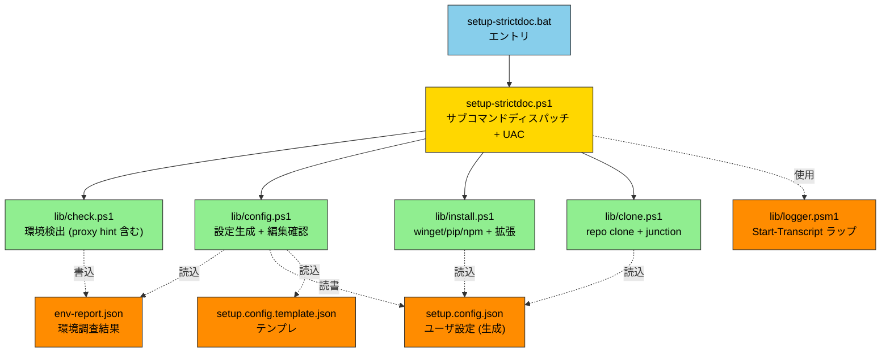
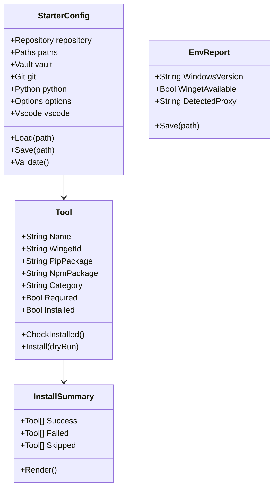
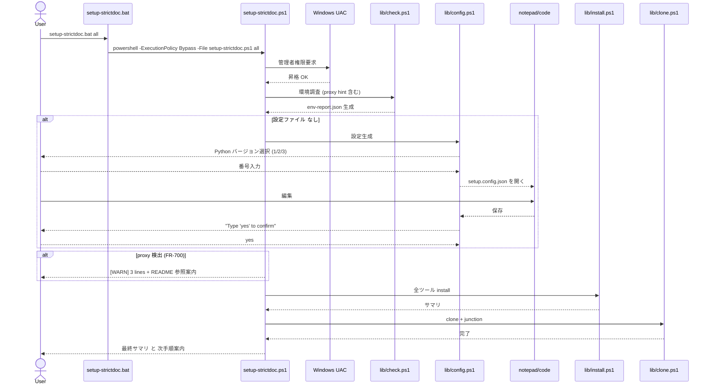

# StrictDocStarter — StrictDoc 環境セットアップ自動化 仕様書

| 項目 | 値 |
|---|---|
| 文書名 | StrictDocStarter — StrictDoc 環境セットアップツール 仕様書 |
| バージョン | v1.0 |
| テンプレート | ANMS v0.33 |
| ツール名 | **StrictDocStarter** |
| エントリ | `setup-strictdoc.bat <subcommand>` |
| 対象 | クリーン Windows 11 PC (Hyper-V VM 想定) |
| リポジトリ | `https://github.com/GoodRelax/gr-tools/tree/main/StrictDocStarter` |

---

## Chapter 1. Foundation

### 1.1 Background

- StrictDoc プロジェクトの Phase 0 (環境構築) を、毎回手動で行うのは煩雑かつ再現性が低い
- ホスト PC で稼働中の構成を、クリーンな Windows 11 VM 等で **30 分以内に再現** したい
- AI 駆動の要求管理プロジェクト全体の入口として、誰がやっても同じ結果になる導入手順を確立する

### 1.2 Issues

- 新規 PC / VM 立ち上げ毎に同じ手順を手動実行 → 時間と漏れリスク
- ホスト側でうまく動いていた構成を別環境で再現する標準が無い
- 漏れがあると Phase 1 以降で詰まる (例: PATH 未通過 / Python バージョン違い)
- 設定 (リポジトリ URL / Vault 場所 / Git ユーザ情報) が毎回手入力

### 1.3 Goals

1. **クリーン Win11 → `setup-strictdoc.bat all` → 開発可能環境完成** を実現
2. 1 つの **JSON 設定ファイル** で各種パスとリポジトリを切替可能
3. **dry-run** で本番前リハーサル可能
4. 失敗時もログ記録して続行し、**最終サマリで把握**

### 1.4 Approach

- **winget 主体** でツール導入 (Microsoft 標準、追加マネージャ不要)
- **JSON 設定ファイル** (`_comment` プロパティで擬似コメント) + **PowerShell スクリプト** + **`.bat` ランチャ** の 3 層
- **サブコマンド方式** (`setup-strictdoc.bat <command>`) で `git` / `docker` 風に統一
- **UAC 自己昇格** で管理者権限を自動取得
- `Start-Transcript` で **全実行ログ** 取得

### 1.5 Tool Inventory

本セットアップで取り扱う全ツールの一覧。**この章が唯一のツール定義箇所**。

| No | ツール | 目的 | インストール方法 | 必須/任意 | 設定デフォルト | 備考 |
|---|---|---|---|---|---|---|
| 01 | Git | 版管理、リポジトリ clone | `winget: Git.Git` | 必須 | ✓ on | — |
| 02 | Python | StrictDoc 実行基盤、検証スクリプト | `winget: Python.Python.<ver>` | 必須 | ✓ on | バージョン対話選択 |
| 03 | Node.js LTS | Claude Code (npm 版) 実行基盤 | `winget: OpenJS.NodeJS.LTS` | 条件 | ✗ off | Claude npm 採用時のみ必要 |
| 04 | GitHub CLI (gh) | private リポ認証、`gh repo clone` | `winget: GitHub.cli` | 必須 | ✓ on | — |
| 05 | StrictDoc | 要求管理コア | `pip: strictdoc` | 必須 | ✓ on | Python 先行 |
| 06 | Claude Code (winget) | AI コーディング/要求生成支援 (winget 版) | `winget: Anthropic.Claude` (要確認) | 任意 | **✗ off (opt-in)** | 契約者のみ。npm 版と排他 |
| 07 | Claude Code (npm) | AI コーディング/要求生成支援 (npm 版) | `npm: @anthropic-ai/claude-code` | 任意 | **✗ off (opt-in)** | 契約者のみ。Node.js 先行。winget 版と排他 |
| 09 | VS Code | `.sdoc` / `.md` / `.json` 編集 | `winget: Microsoft.VisualStudioCode` | 任意 | ✓ on | 拡張も自動 install |
| 10 | VS Code 拡張群 | Markdown / Mermaid / PS / Python / 日本語 | `code --install-extension <id>` | 任意 | ✓ on | 09 完了後 |
| 11 | Obsidian | マニュアル閲覧/編集 (vault 経由) | `winget: Obsidian.Obsidian` | 任意 | ✓ on | ジャンクション併用 |
| 12 | Windows Terminal | モダンターミナル | `winget: Microsoft.WindowsTerminal` | 任意 | ✓ on | — |
| 13 | PowerShell 7 | 拡張シェル | `winget: Microsoft.PowerShell` | 任意 | ✓ on | 5.1 と共存 |
| 14 | ripgrep (rg) | 高速 grep、要求検索 | `winget: BurntSushi.ripgrep.MSVC` | 任意 | ✓ on | — |
| 15 | jq | StrictDoc `export` の JSON 処理 | `winget: jqlang.jq` | 任意 | ✓ on | — |

#### 1.5.1 VS Code 拡張サブリスト

| 拡張 ID | 用途 |
|---|---|
| `yzhang.markdown-all-in-one` | Markdown 編集 (TOC、ショートカット) |
| `bierner.markdown-mermaid` | Mermaid プレビュー |
| `ms-vscode.PowerShell` | PowerShell 編集 (setup script) |
| `ms-python.python` | Python 編集 (validate.py 等) |
| `MS-CEINTL.vscode-language-pack-ja` | UI 日本語化 |
| `eamodio.gitlens` | Git 履歴可視化 |

### 1.6 Scope

**In-scope:**
- Windows 11 (winget 標準搭載) 環境
- ツール導入 (winget / pip / npm)
- 設定ファイルの **テンプレ生成 + 編集後 yes 確認** ワークフロー
- 既インストール検出 (重複インストール回避)
- リポジトリクローン (GoodRelax 配下 既定、設定で任意 URL)
- Obsidian vault のジャンクション作成
- 環境調査 (`setup-strictdoc.bat check`) によるプロキシ検出 (**診断のみ、 自動設定はしない / FR-700**)
- VS Code 拡張の自動インストール
- ログ取得、エラー継続、dry-run

**Out-of-scope:**
- Windows 10 サポート
- **proxy 環境の自動設定** (v1.0、 ADR-007 撤回 / FR-700 参照。 検出 + warn は行うが setup ロジックは proxy を考慮しない。 ユーザは事前に直接接続環境で実行するか、 各ツールに env var 等で proxy を手動設定する必要がある。 v2.x 以降で再検討予定)
- Claude Code 認証 (手動、完了後に案内)
- GitHub 認証の完全自動化 (`gh auth login` 対話に委ねる)
- パスワード / PAT の永続保管
- OneDrive サインインの自動化
- PDF 出力環境 (weasyprint) — Phase 6 で別途
- WSL 導入
- Chocolatey / Scoop の併用

### 1.7 Constraints

- 動作環境: **Windows 11 + winget**
- 実行権限: **管理者権限**必須 (自己昇格で取得)
- ネットワーク: インターネット接続必須 (winget / git / pip / npm)
- シェル: **PowerShell 5.1 以上** (Win11 標準)
- **スクリプト本体は ASCII only** (バッチ / PowerShell コード / コメント / 出力メッセージすべて英語)

### 1.8 Limitations

- パスワード / PAT は設定ファイルに保管しない → 都度入力
- Claude Code が winget で取れない場合は **npm fallback** に切替を促す
- winget 直後の PATH は同セッションで自動反映されない → `RefreshEnv` で対処、失敗時はターミナル再起動を案内
- 一部ツールは管理者権限下でもユーザインストール扱いになる場合あり (Obsidian 等)
- StrictDoc 公式の VS Code 拡張は**未確認** (2026 年時点)。サードパーティ製の `.sdoc` 拡張があれば後で追加検討
- "latest" Python バージョンは実行時の winget レポジトリに依存 → 再現性低下のため `"3.13"` 固定が推奨

### 1.9 Glossary

| 用語 | 説明 |
|---|---|
| StrictDocStarter | 本ツールの名称 |
| StrictDoc | OSS の要求管理ツール (Python 製、Apache 2.0) |
| JSON + `_comment` | JSON にコメントを書く慣習。`_comment` プロパティに説明を入れる |
| winget | Windows Package Manager (Microsoft 公式 CLI) |
| ジャンクション | Windows のディレクトリリンク (`mklink /J` で作成) |
| Vault | Obsidian の作業フォルダ単位 |
| dry-run | 実際の変更を行わず、予定アクションだけ列挙するモード |
| RefreshEnv | 現プロセスの環境変数を再読込する操作 |
| UAC | User Account Control (Windows の権限昇格機構) |

### 1.10 Notation

- RFC 2119/8174 準拠
- **SHALL / MUST** = 必須
- **SHOULD** = 推奨
- **MAY** = 任意
- EARS の `shall` は SHALL と同義

---

## Chapter 2. Requirements

### 2.1 Functional Requirements

#### 2.1.1 環境検出 (FR-100 系)

| ID | パターン | 要求 |
|---|---|---|
| FR-101 | Ubiquitous | `setup-strictdoc.bat check` は **インストール済みツール一覧** を検出して表示すること |
| FR-102 | Ubiquitous | `setup-strictdoc.bat check` は **Windows / PowerShell / winget の有無** を検出すること |
| FR-103 | Ubiquitous | `setup-strictdoc.bat check` は **プロキシ情報** (IE 設定 / WinHTTP / 環境変数 / PAC URL) を検出すること (**診断専用 / FR-700**。 setup ロジックには使わない) |
| FR-104 | Ubiquitous | `setup-strictdoc.bat check` は **認証方式** (NTLM / Negotiate / Basic) をプロキシレスポンスから検出すること (診断専用) |
| FR-105 | Ubiquitous | `setup-strictdoc.bat check` は **SSL インスペクション** の有無を証明書発行元から判定すること (診断専用) |
| FR-106 | Ubiquitous | `setup-strictdoc.bat check` は結果を `env-report.json` に書き出すこと |
| FR-107 | If | もし Windows が 10 以下、または winget が無ければ、`setup-strictdoc.bat` は警告を出して終了すること |

#### 2.1.2 設定ファイル管理 (FR-200 系)

| ID | パターン | 要求 |
|---|---|---|
| FR-201 | If | もし `setup.config.json` が存在しなければ、`setup-strictdoc.bat config` はテンプレートから新規作成すること |
| FR-202 | When | 設定ファイル新規作成時、`setup-strictdoc.bat config` は **Python バージョン** のみ対話で選択させること (3.13 / latest / custom) |
| FR-203 | When | 設定ファイル新規作成後、`setup-strictdoc.bat config` は **エディタ (notepad or code) で開いて編集を促し、`yes` 入力で確定** すること |
| FR-204 | Ubiquitous | 設定ファイルは **JSON 形式 (UTF-8、`_comment` プロパティでコメント表現)** であること |
| FR-205 | Ubiquitous | 設定ファイルは以下を含むこと: リポジトリ URL / 公開状態 / クローン先パス / Vault モード / Vault パス / ジャンクション名 / Git ユーザ名 / Git メール / Python バージョン / 各任意ツールの導入有無 (`proxy` block は v1.0 では参照しない placeholder、 FR-700 参照) |
| FR-206 | Ubiquitous | 設定ファイルは `.gitignore` 対象とし、**テンプレ (`setup.config.template.json`) のみコミット対象** とすること |
| FR-207 | If | もし `env-report.json` が存在すれば、`setup-strictdoc.bat config` はその内容を設定ファイルの初期値に反映すること |
| FR-208 | Ubiquitous | 設定ファイル内の `<user>` 文字列は、 全ての path 操作 (`Test-Path` / `Join-Path` / `Copy-Item` 等) より **先に** `$env:USERNAME` に置換 (`Expand-UserPlaceholders`) すること。 Windows ファイル名で `<` `>` は禁止文字なので、 未展開のまま path 関数に渡してはならない |
| FR-209 | When | **どの subcommand であっても** (現状は `auto` の Read-YesConfirmation と `config` の edit-then-yes 確認の 2 箇所) `yes` 以外が入力されて abort する場合、 StrictDocStarter は以下 3 要素を English ASCII (ADR-008) で表示して終了すること: (a) 1 行目に abort 理由 (`Aborted - 'yes' not entered.` 等)、 (b) `setup.config.json` の **絶対パス** (実行時の `$env:USERNAME` で展開済、 ユーザがそのまま編集可能)、 (c) 再実行コマンド `setup-strictdoc.bat` (冪等性を明示)。 旧来の `Aborted by user` 一行で終わってはならない。 abort 時の `setup.log` (FR-501) には同メッセージが残ること。 `yes` 入力で続行する場合の追加メッセージ仕様は無く、 旧来通り Phase 実行に進む |
| FR-210 | Ubiquitous | `setup.config.template.json` および `setup.config.json` の **top-level** に `_comment_inventory` キーを含めること。 **値は 1 行の英語 ASCII 文字列** とし、 `Always installed (required): <semicolon-separated tools>. Toggleable below: <semicolon-separated items>.` の形式に従うこと (機械検証可能)。 「required tools」 は §1.5 Tool Inventory で必須 (`✓ on`) と分類された行 + VS Code (Phase A 前提、 FR-313) + Claude Code 拡張 (FR-805) を含む。 「Toggleable」 は `install_<key>` および `skip_clone` で制御される項目 (Claude CLI winget/npm / Obsidian / Windows Terminal / PowerShell 7 / ripgrep / jq / Phase D clone+junction) |
| FR-211 | Ubiquitous | `options.install_<key>` および `options.skip_clone` の各キーには、 **`_comment_<key>` という命名規約のキー** で個別コメントを設けること (英語 ASCII)。 内容は (a) 何をインストール / 制御するか、 (b) 既定値 (true / false)、 (c) 排他制約や前提があれば明示。 配置順は「`_comment_<key>` の直後に `install_<key>`」 を **推奨** するが、 JSON spec (RFC 8259) はオブジェクトキー順を保証しないため必須要件はキー名の prefix `_comment_` 対応付けのみ。 単一 block `_comment` で全 option をまとめる方式は採用しない |
| FR-213 | Ubiquitous | `_comment_*` キーは **表示専用** であり、 StrictDocStarter は `Invoke-Expression` / `Start-Process` / `&` 等の評価対象としてはならない。 将来の自動表示機能で template 由来のコード注入を防ぐ |

#### 2.1.3 ツールインストール (FR-300 系)

| ID | パターン | 要求 |
|---|---|---|
| FR-301 | Ubiquitous | `setup-strictdoc.bat install` は **必須ツール** を winget で導入すること: Git / Python / GitHub CLI |
| FR-302 | Ubiquitous | `setup-strictdoc.bat install` は設定ファイルに応じて **任意ツール** を導入すること: Obsidian / Windows Terminal / PowerShell 7 / ripgrep / jq (VS Code は Phase A の責務、 ここには含めない / FR-313 参照) |
| FR-303 | If | もし `options.install_claude_winget = true` であれば、`setup-strictdoc.bat install` は winget で Claude Code を導入すること |
| FR-304 | If | もし `options.install_claude_npm = true` であれば、`setup-strictdoc.bat install` は Node.js を先行 install してから npm で Claude Code を導入すること |
| FR-305 | If | もし `install_claude_winget` と `install_claude_npm` が **両方 true** なら、`setup-strictdoc.bat install` はエラーで停止すること |
| FR-306 | Ubiquitous | Python 導入後、`setup-strictdoc.bat install` は **pip で StrictDoc を導入** すること |
| FR-308 | When | winget インストール完了後、`setup-strictdoc.bat install` は **PATH を再読込** すること (RefreshEnv 相当) |
| FR-309 | If | もしツールが既にインストールされていれば、`setup-strictdoc.bat install` はスキップしてログに「既存」と記録すること |
| FR-310 | When | VS Code 導入後、`setup-strictdoc.bat install` は **`vscode.extensions` 配列** の各拡張を `code --install-extension` で導入すること |
| FR-311 | Ubiquitous | 外部コマンド (`pip` / `code --install-extension` / `winget` 等) を呼び出す install 関数は、 **`$ErrorActionPreference = "Continue"` ローカル退避 + `$LASTEXITCODE` 信頼パターン** を用いること。 `EAP="Stop"` + `2>&1` の組合せで stderr 出力 (例: pip dependency resolver 警告) を terminating error として拾うことを禁止 |
| FR-312 | Ubiquitous | install 関数は **exit code に加えて最終状態確認** (`Test-*Installed` + バージョン取得) で成否を二段判定すること。 exit code が成功でも `Test-*Installed` が false なら警告ログ + 失敗扱い、 exit code が失敗でも `Test-*Installed` が true ならバージョン取得を試行し成功扱いに格上げする。 格上げ時はサマリ (FR-504) に `[VERIFIED]` タグ + 取得バージョンをログに残し、 単なる "OK" と区別すること |
| FR-313 | Ubiquitous | VS Code は Phase A (Claude Code 拡張の前提) として install 計画される。 `options.install_vscode` フラグは廃止し、 VS Code を Optional ツールとしてはならない |

#### 2.1.4 リポジトリと vault (FR-400 系)

| ID | パターン | 要求 |
|---|---|---|
| FR-401 | Ubiquitous | `setup-strictdoc.bat clone` は設定の `RepoUrl` を `CloneTarget` に clone すること |
| FR-402 | If | もし `RepoVisibility = "private"` であれば、`setup-strictdoc.bat clone` は clone 前に `gh auth login` を起動すること |
| FR-403 | Ubiquitous | `setup-strictdoc.bat clone` は `VaultPath/<JunctionName>` のジャンクションを `CloneTarget` に向けて作成すること |
| FR-404 | If | もしジャンクションが既存なら、`setup-strictdoc.bat clone` はスキップして警告を出すこと |

#### 2.1.5 ログとエラー処理 (FR-500 系)

| ID | パターン | 要求 |
|---|---|---|
| FR-501 | Ubiquitous | StrictDocStarter は全実行ログを `setup.log` に **UTF-8 で記録** すること |
| FR-502 | If | もし個別ツールの install が失敗しても、StrictDocStarter は **ログ記録して継続実行** すること |
| FR-503 | If | もし **致命的エラー** (winget なし / 管理者権限取得失敗 / 設定 parse 失敗) が発生したら、StrictDocStarter は **停止** すること |
| FR-504 | Ubiquitous | 終了時に **成功 / 失敗 / スキップ のサマリ** を表示すること |

#### 2.1.6 dry-run と権限昇格 (FR-600 系)

| ID | パターン | 要求 |
|---|---|---|
| FR-601 | Ubiquitous | `setup-strictdoc.bat dryrun` は `all` と同等の予定アクションを **実行せず列挙** するのみで終了すること |
| FR-602 | When | dry-run 中、StrictDocStarter は **副作用 (ファイル作成 / 環境変数変更 / install) を一切起こさない** こと |
| FR-603 | If | もし管理者権限で起動されていなければ、StrictDocStarter は **PowerShell を UAC 経由で再起動** すること |
| FR-604 | Ubiquitous | `setup-strictdoc.bat dryrun` は `auto` と同じ planner (`Build-AutoPlan` + `Show-AutoPlan`) を使用すること。 dryrun 専用の planner を別経路で持ってはならない |
| FR-605 | Ubiquitous | `setup-strictdoc.bat dryrun` は host を probe して `Test-*Installed` の実態を反映した 4 状態タグを表示すること (config フラグだけでなく実環境を見る) |
| FR-606 | Ubiquitous | `setup-strictdoc.bat dryrun` の Phase D skip 意味論は `auto` と同じであること: `options.skip_clone=true` または `repository.url` が空ならば SKIP として列挙する |
| FR-607 | Ubiquitous | `setup-strictdoc.bat dryrun` は Phase A の Claude Code 拡張行も probe 結果に基づいて表示すること (拡張が未導入なら `[INSTALL]`、 既導入なら `[SKIP]`) |

#### 2.1.7 プロキシ (FR-700 系)

| ID | パターン | 要求 |
|---|---|---|
| FR-700 | Ubiquitous | v1.0 では proxy 環境の自動設定を **対象外** とする (§1.6 Out-of-scope)。 ただし `setup-strictdoc.bat` (`auto` および `dryrun`) は起動時に IE proxy / 環境変数 / WinHTTP のいずれかで proxy が検出された場合、 plan 表示後・ yes プロンプト直前に `[WARN]` で 3 行表示すること (English ASCII / ADR-008): (a) 検出された proxy 1 件 (優先順 IE > env > WinHTTP)、 (b) 本ツールは proxy を設定しない旨、 (c) `README 'Proxy / Corporate Network'` 参照案内。 install は止めない (yes でそのまま続行)。 検出は `lib/check.ps1` の `Get-ProxyHint` ヘルパで行う。 `setup.config.json` の `proxy` ブロックは将来予約 placeholder として残すが setup ロジックは参照しない |

#### 2.1.8 サブコマンド (FR-800 系)

| ID | パターン | 要求 |
|---|---|---|
| FR-801 | Ubiquitous | `setup-strictdoc.bat` は以下のサブコマンドを受け付けること: `check`, `config`, `install`, `clone`, `all`, `auto`, `dryrun`, `help` |
| FR-802 | When | `setup-strictdoc.bat all` が呼ばれたら、StrictDocStarter は **`check → config → install → clone`** を順次実行すること |
| FR-803 | If | もし引数なしで起動されたら、StrictDocStarter は **`auto` モードを起動** すること (旧仕様: `help` を表示) |
| FR-804 | When | `setup-strictdoc.bat auto` が呼ばれたら、StrictDocStarter は (a) 環境 check (b) 必要なツールのプラン提示 (c) **1 回の `yes` 入力** で全 Phase を一気通貫実行すること |
| FR-805 | If | もし `auto` 実行中に Claude Code (VS Code 拡張: `anthropic.claude-code`) が未導入と判定されたら、yes プロンプトに「VS Code + Claude Code 拡張」の install を含めること |
| FR-806 | Ubiquitous | UAC 自己昇格 / MOTW strip / CWD 正規化 (`cd /d %~dp0`) の 3 パターンは **`StrictDocStarter/_lib/elevate.bat` に共通化** すること。 引数規約は `call <相対パス>\_lib\elevate.bat <ADMIN_MODE>` で、 `ADMIN_MODE` は `need_admin` (auto/install/clone/all) または `no_admin` (check/config/dryrun/help/gather-logs/manage) の 2 値 (`uninstall-strictdoc.bat` は need_admin)。 6 .bat の呼出パスは下表の通り (ロジックを各 .bat に重複コピペしてはならない): |
| | | <table><tr><th>.bat</th><th>呼出</th></tr><tr><td>`StrictDocStarter/setup-strictdoc.bat`</td><td>`call _lib\elevate.bat need_admin`</td></tr><tr><td>`StrictDocStarter/gather-logs.bat`</td><td>`call _lib\elevate.bat no_admin`</td></tr><tr><td>`StrictDocStarter/manage-strictdoc.bat`</td><td>`call _lib\elevate.bat no_admin` (詳細は docs/serve-spec.md FR-102)</td></tr><tr><td>`StrictDocStarter/uninstall-strictdoc.bat`</td><td>`call _lib\elevate.bat need_admin` (pip/winget uninstall は admin 要、 詳細は §7.2 FR-340)</td></tr><tr><td>`StrictDocStarter/vm-tests/run-tests.bat`</td><td>`call ..\_lib\elevate.bat need_admin`</td></tr><tr><td>`StrictDocStarter/vm-tests/gather-test-logs.bat`</td><td>`call ..\_lib\elevate.bat no_admin`</td></tr></table> |
| FR-807 | If | もしバッチファイル内で `if (...)` / `for /f (...) do (...)` ブロック中、 または `&&` / `\|\|` 連結で **`set "VAR=..."` してその直後に `%VAR%` を参照** する場合、 **必ず `setlocal EnableDelayedExpansion` を有効化し `!VAR!` を使う** こと。 cmd の parse-time 展開で未設定値 (空または前の値) を見る誤動作を防ぐ |

#### 2.1.9 プラン表示 UX (FR-900 系)

| ID | パターン | 要求 |
|---|---|---|
| FR-901 | Ubiquitous | プラン行 (`Format-PlanRow` 等) の name 列幅は、 **Phase A〜E 全体を横断して** 最長 name に合わせて動的に決定すること (固定 `PadRight(36)` は禁止)。 長い拡張 ID で列ずれが起きてはならない。 縦揃えの範囲は Phase 横断で統一する (Phase ごとに幅が変わると視認性が低下する) |
| FR-902 | Ubiquitous | Phase E (Optional tools + VS Code 拡張) のステップは `[SKIP]` 行を先に、 `[INSTALL]` 行を後にソートして表示すること (一覧性向上) |
| FR-903 | Ubiquitous | プラン行は **4 状態タグ** で実態を示すこと: `[INSTALL] ... required` / `[SKIP] ... already installed` / `[INSTALL] ... optional, enabled in config` / `[SKIP] ... optional, disabled in config` |
| FR-904 | Ubiquitous | プラン Phase ヘッダは責務分類タグ (`[REQUIRED]` / `[OPTIONAL]`) を末尾に表示すること |

#### 2.1.10 自動テスト要件 (FR-1000 系)

VM 上で `setup-strictdoc.bat` の挙動を回帰検知する自動テストスイート (`vm-tests/run-tests.bat` / `run-tests.ps1`) に対する要件。 §5 Test Strategy で対応シナリオ一覧を定義する。

| ID | パターン | 要求 |
|---|---|---|
| FR-1001 | Ubiquitous | 自動テストランナーは **シナリオ独立性** を保つこと: あるシナリオが uninstall するツールは、 他シナリオが前提とするツールと重複してはならない (例: T_required_only と T_mixed が両方 gh を uninstall すると、 cascade failure の原因を切り分け不能になる) |
| FR-1002 | Ubiquitous | 自動テストランナーは **PATH 反映** を `Update-PathFromRegistry` (`lib/install.ps1` で提供) を呼び出すことで決定論的に行うこと。 `Start-Sleep` による「PATH が反映されるのを祈る」 設計は禁止 (winget は registry を書き換えるが現プロセスの `$env:Path` を自動更新しないため、 sleep では解決しない) |
| FR-1003 | Ubiquitous | DryRun モード切替は **位置引数 + `[ValidateSet]`** で限定すること。 認識できない mode 文字列 (typo 等) は **fatal で停止**、 silent に real mode に fall back してはならない (誤って winget uninstall を始める危険を避ける) |
| FR-1004 | Ubiquitous | sub-process (`setup-strictdoc.ps1`) の出力を `\| Out-Null` で完全破棄してはならない。 失敗時に **per-scenario log path をエラーメッセージに含めて誘導** すること (FR-501 と整合) |
| FR-1005 | Ubiquitous | シナリオ判定は `Test-CmdOnPath` 一本足ではなく、 **少なくとも `--version` 実行で exit 0 + 妥当な出力** を確認すること (DLL 欠落・Microsoft Store stub 等の誤 PASS を防ぐ) |
| FR-1006 | Ubiquitous | テストランナーは **negative test を必ず 1 件以上含む** こと: 例 (a) yes 以外入力時に FR-209 abort guidance が表示されることを log grep で確認、 (b) `install_claude_winget` と `install_claude_npm` 両 true で FR-305 排他エラー停止を確認 |
| FR-1007 | Ubiquitous | テストランナーは **dryrun 出力の文字列 assert** を 1 件以上含むこと: `[INSTALL]` / `[SKIP]` タグ (FR-903)、 Phase ヘッダ `[REQUIRED]` / `[OPTIONAL]` (FR-904)、 Phase E sort 順 (FR-902、 SKIP 行が INSTALL 行より前) の少なくとも 1 つを正規表現で検証 |
| FR-1008 | Ubiquitous | テストランナーは **Phase A の Claude Code 拡張** (`anthropic.claude-code`) の uninstall + 再 install シナリオを含むこと (FR-805 / FR-607 のカバレッジ) |
| FR-1009 | Ubiquitous | テストランナーは **Phase C の StrictDoc** (`pip uninstall strictdoc -y`) の uninstall + 再 install シナリオを含むこと (二段防御 FR-312 + EAP パターン FR-311 が実動作することの確認) |
| FR-1010 | Ubiquitous | フォーマット文字列は **`-f` 演算子** を使うこと (`"{0:0.0}s" -f $elapsed`)。 PowerShell の `"$var"` 補間内では `:` 以降が format spec として解釈されない (`"${var:0.0}s"` は無効)。 文字列バグを防ぐ |

### 2.2 Non-Functional Requirements

| ID | カテゴリ | 要求 |
|---|---|---|
| NFR-001 | 時間 | クリーン Win11 → 完了まで **30 分以内** (回線 100Mbps 想定) |
| NFR-002 | 文字 | 全ログは **UTF-8 / 文字化けなし** |
| NFR-003 | 機密 | 個人情報 (パスワード / PAT) を **スクリプト本体・設定ファイル・永続環境変数に持たない** |
| NFR-004 | リハ | dry-run 実行は **1 分以内** に完了 |
| NFR-005 | 配置 | バッチファイルは **任意フォルダから実行可能** (CWD 非依存) |
| NFR-006 | 文字コード | スクリプト本体は **ASCII only** (バッチ / PS / コメント / 出力) |
| NFR-007 | 互換 | 設定ファイル形式 (JSON) は標準パーサで読めること (拡張記法を使わない、`_comment` のみ慣習) |
| NFR-008 | 時間 (テスト) | NFR-001 は **本番セットアップ** (`setup-strictdoc.bat auto` 単体実行) に適用。 自動テストスイート (`vm-tests/run-tests.bat`) は **REAL モード 60 分以内**、 **DRYRUN モード 2 分以内** とする (NFR-001 と分離) |

---

## Chapter 3. Architecture

### 3.1 Architecture Concept

**Layered + Pipeline + Subcommand Dispatch**。`setup-strictdoc.bat` がエントリポイントとなり、`setup-strictdoc.ps1` がサブコマンドをディスパッチして `lib/*.ps1` を呼び出す。色分けは Clean Architecture デフォルト凡例 (Framework / Adapter / Use Case / Entity)。

### 3.2 Components

**コンポーネント図:**



注: `lib/proxy.ps1` は将来予約の reserved stub (v1.0 では参照されない、 FR-700)。

### 3.3 File Structure

```text
StrictDocStarter/                     # GitHub リポジトリのルート (StrictDocStarter/ 配下)
├── setup-strictdoc.bat                           # エントリ (任意フォルダから実行可)
├── setup-strictdoc.ps1                           # サブコマンドディスパッチ
├── gather-logs.bat                       # ログ収集 (admin 不要)
├── gather-logs.ps1                       # ↑ 本体
├── _lib/                                 # バッチ用共通ヘルパ (FR-806)
│   └── elevate.bat                       # UAC 自昇格 + MOTW strip + CWD 正規化 (need_admin|no_admin 引数)
│                                         #   呼出元: setup-strictdoc.bat / gather-logs.bat /
│                                         #          vm-tests/{run-tests,gather-test-logs}.bat
├── lib/                                  # PowerShell モジュール群
│   ├── check.ps1                         # 環境検出 (Get-ProxyHint 含む、 FR-700)
│   ├── config.ps1                        # 設定生成 + 編集 + yes 確認 / Expand-UserPlaceholders
│   ├── install.ps1                       # winget / pip + VS Code 拡張 / Test-*Installed
│   ├── clone.ps1                         # git clone + junction
│   ├── proxy.ps1                         # (v1.0: reserved stub、 v2.x で再検討 / FR-700)
│   ├── auto.ps1                          # Phase A〜E オーケストレーション + Build-AutoPlan
│   └── logger.psm1                       # Start-Transcript ラップ
├── vm-tests/                     # VM 検証スクリプト
│   ├── run-tests.bat                     # 10 シナリオ自動テスト (dryrun モード可、 FR-A3.3)
│   ├── run-tests.ps1                     # ↑ 本体
│   ├── gather-test-logs.bat              # テスト後ログ収集
│   ├── gather-test-logs.ps1              # ↑ 本体
│   └── vm-test-checklist.md              # VM テスト手順
├── setup.config.template.json            # 設定テンプレ (commit)
├── setup.config.json                     # ユーザ生成 (gitignore)
├── env-report.json                       # check 結果 (gitignore)
├── setup.log                           # 実行ログ (gitignore)
└── README.md                             # 使い方
```

### 3.4 Domain Model

**クラス図:**



注: proxy 関連クラス (`ProxyMode` enumeration、 StarterConfig の `+Proxy proxy` field、 EnvReport の `AuthMethods`/`SslInspection`/`CertIssuer`/`RecommendedProxyMode`) は v1.0 では参照されない (FR-700)。 v2.x で再導入予定。

### 3.5 Behavior

**シーケンス図 (`setup-strictdoc.bat all` フルパス):**



### 3.6 Decisions

#### ADR-001: 設定ファイル形式 = JSON + `_comment` プロパティ
- **Status**: Accepted
- **Context**: PowerShell には `ConvertFrom-Json` / `ConvertTo-Json` が標準内蔵。TOML は別パーサ要、YAML は仕様複雑、ini は仕様未定義
- **Decision**: JSON を採用。コメントは `_comment` プロパティ ("_" 始まりキーは慣習的に無視) で実現
- **Consequences**: パース時に `_comment` は単に無視される。標準 JSON ツールで読書可能

#### ADR-002: エントリは `.bat` + `.ps1` + サブコマンド方式
- **Status**: Accepted
- **Context**: ユーザはダブルクリック起動を希望。`.ps1` は ExecutionPolicy で直接不可。複数 `.bat` を作るとファイル散乱
- **Decision**: `setup-strictdoc.bat <command>` のサブコマンド方式 (`git`/`docker` 風)。`.bat` は薄いランチャ、`setup-strictdoc.ps1` がディスパッチ
- **Consequences**: 単一エントリポイント、覚えやすい。ps1 内で `$Command = $args[0]` で switch

#### ADR-003: Claude Code は winget / npm の **2 行表現** + 排他
- **Status**: Accepted
- **Context**: ユーザは winget を希望するが、winget 配布が不安定。npm は確実だが Node.js 必須化
- **Decision**: 設定ファイルに `install_claude_winget` と `install_claude_npm` の 2 フラグを独立保持。**両方 true ならエラーで停止**
- **Consequences**: ユーザが明示選択。デフォルトは両方 false (契約者のみ opt-in)

#### ADR-004: UAC 自己昇格
- **Status**: Accepted
- **Context**: winget の system-wide install は管理者権限要
- **Decision**: PowerShell が `Start-Process -Verb RunAs` で自身を再起動
- **Consequences**: 引数は `-ArgumentList` で再渡し。CWD はスクリプトの位置に正規化

#### ADR-005: dry-run サブコマンド
- **Status**: Accepted
- **Context**: 本番実行前リハーサルが必要
- **Decision**: `setup-strictdoc.bat dryrun` で `all` 相当を予定列挙のみで実行
- **Consequences**: 各 install / clone 関数は DryRun フラグを受け取り副作用なし分岐

#### ADR-006: ファイル分割粒度
- **Status**: Accepted
- **Context**: 1 ps1 にまとめると 500 行超になりメンテ困難
- **Decision**: 機能別に `lib/*.ps1` へ分割 (check / config / install / clone / proxy / logger)
- **Consequences**: SRP 遵守。各機能を Pester で個別テスト可能

#### ADR-007: (撤回) — proxy 自動設定は v1.0 では対象外
- **Status**: Withdrawn (元 Decision: proxy 3 モード + Px 採用)
- **Replaced by**: FR-700 (proxy 検出 + warn のみ、 自動設定なし) / §1.6 Out-of-scope
- v2.x で再導入を検討。 現状の `setup.config.json` の `proxy` ブロックは将来予約 placeholder

#### ADR-008: スクリプト本体は ASCII only
- **Status**: Accepted
- **Context**: Windows コンソールの cp932 vs UTF-8 で文字化け頻発。日本語コメントや日本語出力はトラブル源
- **Decision**: `.bat` / `.ps1` / `.psm1` のコード・コメント・出力すべて **英語 ASCII** に統一
- **Consequences**: 仕様書 (`setup-spec.md`) とユーザ手順書 (`01-environment.md`) は日本語 OK。スクリプトとログ出力は英語

#### ADR-009: 設定対話は最小化 + edit-then-yes
- **Status**: Accepted
- **Context**: 全項目を対話で訊くと長く、テスト困難
- **Decision**: 対話は **Python バージョンのみ**。それ以外はテンプレ生成後、エディタで開いて手動編集 → `yes` 入力で確定
- **Consequences**: 実装が劇的に簡素化。ユーザは慣れたエディタで JSON 編集可

#### ADR-010: 共通 `_lib\elevate.bat`
- **Status**: Accepted
- **Context**: UAC 自昇格 + MOTW strip + `cd /d %~dp0` の 3 パターンが 5 .bat に散在し、 修正もれリスクが高い
- **Decision**: `StrictDocStarter/_lib/elevate.bat` に集約。 各エントリ .bat は冒頭で `call <相対パス>\_lib\elevate.bat [need_admin|no_admin]` を実行
- **Consequences**: 修正は 1 箇所、 リスク低減。 ただし呼出規約 (admin 必要性、 MOTW strip 対象パス) を `elevate.bat` 内 comment で明文化する必要あり。 各 .bat の独立性は失われるが、 .bat 同士は同一配布物内なので問題なし

#### ADR-011: 外部コマンドは EAP=Continue + `$LASTEXITCODE` パターン
- **Status**: Accepted
- **Context**: `$ErrorActionPreference = "Stop"` + `2>&1` で外部コマンド (`pip` / `winget` / `code --install-extension`) の stderr 出力を terminating error として拾い、 実態は成功なのに failed と判定する誤検知が L-5 で発生
- **Decision**: 外部コマンドラッパは EAP をローカル退避して Continue に切替、 `$LASTEXITCODE` のみを真実とする。 `Install-StrictDoc` で確立した pattern を全 install 関数 (`Install-VSCodeExtensions` / `Install-ClaudeCodeExtension` / `Invoke-WingetInstall`) に展開
- **Consequences**: コマンド失敗は exit code でしか判定できないため、 ADR-013 (二段防御) と組合せて運用

#### ADR-012: dryrun と auto は同一 planner
- **Status**: Accepted
- **Context**: dryrun と auto が別経路でプランを生成していた結果、 dryrun が host を probe せず config のフラグだけで列挙する誤情報が出ていた (L-1)
- **Decision**: 両者ともに `Build-AutoPlan` + `Show-AutoPlan` を経由する。 dryrun は副作用なし、 auto は yes 確認後に install 実行
- **Consequences**: planner 修正は両者に同時反映される。 新規 subcommand 追加時も同 planner を流用すること

#### ADR-014: required ツールは setup.config.json に toggle として公開しない
- **Status**: Accepted
- **Context**: 「全ツールを setup.config.json に列挙して可視化したい」 という UX 要望に対し、 全ツール (required 含む) を `install_*` フラグで toggle 化する案を検討した。 しかし required ツール (§1.5 Tool Inventory で `✓ on` 必須行: Git / Python / gh / StrictDoc + Phase A 前提の VS Code (FR-313) + Phase A の Claude Code 拡張 (FR-805)) は disable すると後続 Phase が破綻する (例: `install_git=false` → strictdoc install 不能、 `install_vscode=false` → Claude Code 拡張 install 不能)。 ユーザに「設定できる」 と誤解させる foot-gun
- **Decision**: required ツールは toggle として公開せず、 常時 install する。 代わりに **top-level `_comment_inventory`** (FR-210) で「何が必ず入って、 何が toggle 可能か」 を 1 行で示し、 透明性を担保する。 既に該当ツールがある環境では `Test-*Installed` (FR-312) により自動 SKIP されるので追加コストはほぼゼロ
- **Consequences**: setup.config.json は optional 項目のみ膨れず可読性を保つ。 required ツールが本当に不要な特殊環境では、 ユーザは setup-spec.md §1.5 Tool Inventory + FR-313 / FR-805 を参照して該当 Phase を別経路 (例: 手動 install 後 setup-strictdoc.bat dryrun で SKIP 確認) で運用する。 検証メカニズム (新規 `install_<key>` 追加時に対応する `_comment_<key>` が書かれているか) は **当面人手レビューに依存** (CI assert スクリプトは将来課題)

#### ADR-013: install 関数は最終状態確認で二段防御
- **Status**: Accepted
- **Context**: ADR-011 で exit code 信用を採用したが、 単独では誤検知耐性に限界がある (pip exit code 0 でもツール未配置の可能性 / exit code 1 でも実は install 済の可能性)
- **Decision**: 全 install 関数は exit code 評価の後に **`Test-*Installed` + version 取得** で実態確認し、 両者で総合判定する
- **Consequences**: 関数戻り値は「exit code OK かつ実態 OK」 のみ true。 誤検知に対する二段防御として機能

---

## Chapter 4. Specification

### 4.1 Scenarios (Gherkin)

```gherkin
Feature: StrictDocStarter - StrictDoc Environment Setup

  Background:
    Given Windows 11 がインストールされたクリーンな PC
    And winget が利用可能

  Rule: 初回フルセットアップ (グリーンフィールド)

    Scenario: SC-001 完全自動セットアップ (traces: FR-101, FR-201, FR-202, FR-203, FR-301, FR-401, FR-403, FR-801, FR-802)
      Given StrictDocStarter 一式を任意のフォルダに配置済
      And setup.config.json は存在しない
      When ユーザが setup-strictdoc.bat all を実行する
      Then UAC 昇格ダイアログが表示される
      And 環境検査 (check) 結果が env-report.json に書き出される
      And Python バージョン選択肢が表示される
      And ユーザが番号を選択すると setup.config.json が生成される
      And エディタが開いて編集を促す
      And ユーザが yes と入力して確定する
      And 必要なツール群が winget で導入される
      And StrictDoc が pip で導入される
      And リポジトリが clone される
      And ジャンクションが作成される
      And 最終サマリと次手順案内が表示される

  Rule: dry-run

    Scenario: SC-002 dry-run でリハーサル (traces: FR-601, FR-602)
      Given setup.config.json が存在する
      When ユーザが setup-strictdoc.bat dryrun を実行する
      Then 実際のインストールは行われない
      And 予定アクションが一覧表示される
      And 終了コード 0 で正常終了する

  Rule: 既存環境の保護

    Scenario: SC-003 既導入ツールのスキップ (traces: FR-101, FR-309)
      Given Git と Python が既にインストールされている
      When setup-strictdoc.bat install を実行する
      Then 環境検査で Git と Python が検出される
      And winget は Git と Python の install をスキップする
      And ログに「既存」と記録される

    Scenario: SC-004 既存ジャンクション保護 (traces: FR-403, FR-404)
      Given Vault パス配下に同名のジャンクションが既に存在する
      When setup-strictdoc.bat clone を実行する
      Then ジャンクションは再作成されない
      And 警告がログに残る

  Rule: エラー継続

    Scenario: SC-005 一部 install 失敗時の継続性 (traces: FR-502, FR-504)
      Given winget が動作する
      When 一部ツール (例: Obsidian) の install が一時的失敗する
      Then エラーはログに記録される
      And 残りのツール install は継続実行される
      And 最終サマリで失敗ツール一覧が表示される

  Rule: Private リポジトリ

    Scenario: SC-006 Private リポジトリ clone (traces: FR-402)
      Given setup.config.json の RepoVisibility が private
      When setup-strictdoc.bat clone を実行する
      Then gh auth login が起動される
      And ユーザがブラウザで認証する
      And 認証完了後に clone が実行される

  Rule: 権限昇格

    Scenario: SC-007 通常権限で起動 (traces: FR-603)
      Given ユーザが管理者ではない権限で setup-strictdoc.bat を起動した
      When setup-strictdoc.ps1 が権限チェックする
      Then UAC ダイアログが表示される
      And ユーザが承認すると管理者として再起動される

  Rule: Claude 排他

    Scenario: SC-008 Claude 両方有効はエラー (traces: FR-305)
      Given setup.config.json の install_claude_winget と install_claude_npm が両方 true
      When setup-strictdoc.bat install を実行する
      Then エラーで停止する
      And 「Choose only one of npm or winget for Claude Code」と表示される

  Rule: プロキシ検出 (warn のみ、 v1.0 では自動設定なし / FR-700)

    Scenario: SC-009 proxy 検出時の warn 表示 (traces: FR-700)
      Given IE Internet Options に proxy.example.com:8080 が設定済
      When setup-strictdoc.bat auto を実行し plan が表示された
      Then yes プロンプト直前に [WARN] 3 行が表示される
      And 1 行目に検出された proxy (IE proxy: proxy.example.com:8080)
      And 2 行目に「StrictDocStarter does NOT configure proxies in v1.0」
      And 3 行目に「See README 'Proxy / Corporate Network' for details」
      But install は止めず yes でそのまま続行できる

    Scenario: SC-010 proxy 未検出時は静音 (traces: FR-700)
      Given proxy 設定が IE / 環境変数 / WinHTTP のいずれにも無い
      When setup-strictdoc.bat auto を実行し plan が表示された
      Then proxy 関連の [WARN] 行は一切表示されない

  Rule: 自動テスト coverage (FR-1000 系、 §5.2 シナリオ #6〜#10 対応)

    Scenario: SC-011 Phase A Claude 拡張カバレッジ (traces: FR-805, FR-607, FR-1008)
      Given 全ツール導入済 VM で Claude Code 拡張がインストール済
      When run-tests.bat T_claude_extension シナリオが Claude 拡張を uninstall
      And  setup-strictdoc.bat auto を NonInteractive で実行する
      Then Phase A で拡張が再 install される
      And  exit 0 + 拡張が再検出される

    Scenario: SC-012 Phase C StrictDoc 再 install (traces: FR-311, FR-312, FR-1009)
      Given 全ツール導入済 VM で strictdoc がインストール済
      When run-tests.bat T_strictdoc_pip シナリオが pip uninstall strictdoc -y
      And  setup-strictdoc.bat auto を NonInteractive で実行する
      Then Phase C で pip install strictdoc が実行される
      And  exit 0 + strictdoc --version 復活
      And  log に [VERIFIED] タグが出ない (正常 path 経由)

    Scenario: SC-013 negative: Claude 排他 (traces: FR-305, FR-1006)
      Given setup.config.json で install_claude_winget と install_claude_npm 両 true
      When run-tests.bat T_negative_claude_both シナリオを実行する
      Then setup-strictdoc.bat auto は非 0 exit またはエラー文言を log に残す
      And  cleanup でテスト前の setup.config.json が復元される

    Scenario: SC-014 dryrun 出力 assert (traces: FR-902, FR-903, FR-904, FR-1007)
      Given 全ツール導入済 VM
      When run-tests.bat T_dryrun_assert シナリオを実行する
      Then plan 出力に [REQUIRED] と [OPTIONAL] phase header が両方含まれる
      And  [SKIP] row が 1 件以上含まれる
      And  Phase E 内に [SKIP] と [INSTALL] が両方ある場合は [SKIP] が先

    Scenario: SC-015 negative: abort guidance は **手動テスト** (traces: FR-209)
      Given setup-strictdoc.bat auto の yes プロンプト
      When ユーザが "no" を入力する
      Then FR-209 abort guidance 3 行 (Aborted - / 1. Edit setup.config.json / Config:) が表示される
      But  自動化は v1.0 では実装制約により不可 (PowerShell Read-Host は piped stdin を読まない)
      And  vm-test-checklist.md に手動 negative test として記載される
```

**Result:** SKIP (実装前)
**Remark:** Phase 0 実施時に各シナリオを実行・結果記録

### 4.2 Configuration (JSON スキーマ)

**setup.config.template.json:**

```json
{
  "_comment_root": "StrictDocStarter configuration. Edit this file, then type 'yes' to confirm.",
  "_comment_inventory": "Always installed (required): Git; Python; GitHub CLI; StrictDoc; VS Code; Claude Code extension. Toggleable below: Claude Code CLI (winget|npm, opt-in); Obsidian; Windows Terminal; PowerShell 7; ripgrep; jq; skip_clone (Phase D).",

  "repository": {
    "_comment": "GitHub repository to clone in Phase D. Leave 'url' empty to skip Phase D entirely. Example: 'https://github.com/YourName/YourRepo.git'",
    "url": "",
    "visibility": "public"
  },

  "paths": {
    "_comment": "Where to clone the repository on this machine. <user> is replaced with $env:USERNAME at runtime (FR-208 / Expand-UserPlaceholders). Replace 'YourRepo' with the actual repo name when repository.url is set.",
    "clone_target": "C:\\Users\\<user>\\Documents\\GitHub\\YourRepo"
  },

  "vault": {
    "_comment": "Obsidian vault location. mode: 'local' or 'onedrive'. junction_name is a placeholder - set it to your actual project name (used as the junction display name in the vault).",
    "mode": "local",
    "path": "C:\\Users\\<user>\\Documents\\gr_vault",
    "junction_name": "YourProject"
  },

  "git": {
    "_comment": "Git user info (password is asked at runtime, not stored)",
    "user_name": "Your Name",
    "user_email": "your@email.com"
  },

  "proxy": {
    "_comment": "Proxy mode: 'none' (no proxy), 'local' (Px local proxy, recommended), 'env' (env var, password asked at runtime)",
    "mode": "none",
    "host": "proxy.company.com",
    "port": 8080,
    "user": "",
    "px_local_port": 3128,
    "ca_cert_path": ""
  },

  "python": {
    "_comment": "Version: '3.13' (recommended), 'latest' (winget newest), or specific like '3.12'",
    "version": "3.13"
  },

  "strictdoc": {
    "_comment": "StrictDoc pip version spec. Default 'latest' (pip install strictdoc). For reproducibility pin a range, e.g. '~=0.21.0' (>=0.21,<0.22) or '==0.21.1'. Tested version is recorded in README. Consumed by install Phase C (FR-331).",
    "version": "latest"
  },

  "options": {
    "_comment_claude_winget": "Anthropic Claude Code CLI via winget. Default: false (opt-in, requires subscription). Mutually exclusive with install_claude_npm (FR-305).",
    "install_claude_winget": false,
    "_comment_claude_npm": "Anthropic Claude Code CLI via npm. Installs Node.js LTS first. Default: false (opt-in). Mutually exclusive with install_claude_winget.",
    "install_claude_npm": false,
    "_comment_obsidian": "Obsidian markdown editor. Used as the project's vault viewer. Default: true.",
    "install_obsidian": true,
    "_comment_terminal": "Windows Terminal (modern multi-tab terminal). Default: true.",
    "install_terminal": true,
    "_comment_pwsh7": "PowerShell 7 (modern cross-platform PowerShell; coexists with built-in 5.1). Default: true.",
    "install_pwsh7": true,
    "_comment_ripgrep": "ripgrep (rg) -- fast text search. Default: true.",
    "install_ripgrep": true,
    "_comment_jq": "jq -- JSON processor for strictdoc export output. Default: true.",
    "install_jq": true,
    "_comment_skip_clone": "Skip Phase D entirely (no git clone, no junction). Default: false. Use when you have no GitHub account or repository.url is empty. Phase D is also skipped automatically when repository.url is empty.",
    "skip_clone": false
  },

  "vscode": {
    "_comment": "VS Code extensions auto-installed after VS Code itself",
    "extensions": [
      "yzhang.markdown-all-in-one",
      "bierner.markdown-mermaid",
      "ms-vscode.PowerShell",
      "ms-python.python",
      "MS-CEINTL.vscode-language-pack-ja",
      "eamodio.gitlens"
    ]
  }
}
```

### 4.3 CLI

```text
setup-strictdoc.bat <subcommand> [options]

Subcommands:
  (none)         Equivalent to 'auto' (run full automated setup with one yes prompt) [FR-803]
  auto           Detect env, present plan (Phase A-E + Proxy), ask one yes, run all phases [FR-804]
  check          Detect existing tools, proxy, SSL inspection. Writes env-report.json    [FR-101..107]
  config         Generate setup.config.json from template (asks Python version, then edit-then-yes) [FR-201..208]
  install        Install tools per setup.config.json (Phase A only; full flow uses 'auto')
  clone          Clone repository and create junction                                     [FR-401..404]
  all            Run check -> config -> install -> clone in sequence (legacy power-user flow)
  dryrun         Show planned actions using the same planner as 'auto', no side effects   [FR-601..607]
  help           Show this help

Options:
  -ConfigPath <path>    Use a non-default config path (default: ./setup.config.json)
  -LogPath <path>       Override setup.log location
  -SkipCheck            Skip 'check' phase in 'all' or 'dryrun'
  -ForceConfig          Regenerate setup.config.json from template
  -NonInteractive       Skip prompts (used by automated tests)

Admin requirement (for setup-strictdoc.bat sub-commands):
  - admin required: auto, install, clone, all
  - admin not required: check, config, dryrun, help
  - UAC self-elevation is performed by _lib\elevate.bat (FR-806)

Separate entry .bat files (not subcommands of setup-strictdoc.bat):
  - gather-logs.bat                   (no_admin) -- bundles logs + diagnostics into a ZIP
  - vm-tests\run-tests.bat            (need_admin) -- 10-scenario automated test runner
  - vm-tests\gather-test-logs.bat     (no_admin) -- bundles test-results + parent log into a ZIP
  - uninstall-strictdoc.bat           (need_admin) -- uninstall StrictDoc + StrictDocStarter artifacts (config-driven, dry-run + yes; FR-340..345)
  All separate entry .bat files go through _lib\elevate.bat (FR-806).
```

### 4.4 Python Version Selection Dialog

```text
Python version to install:
  [1] 3.13   (recommended, current Python latest stable as of 2026-05-14)
  [2] latest (auto-detect newest in winget at install time, less reproducible)
  [3] custom (type version like 3.12 or 3.14)
Choose (1-3) [default: 1]:
```

選択結果は `setup.config.json` の `python.version` に書き込まれる。

### 4.5 env-report.json スキーマ

```json
{
  "_comment": "Generated by 'setup-strictdoc.bat check'",
  "windows_version": "10.0.22631",
  "powershell_version": "5.1.22621.4111",
  "winget_available": true,
  "winget_version": "1.7.10000",

  "proxy": {
    "ie_proxy_server": "proxy.company.com:8080",
    "ie_proxy_enabled": true,
    "pac_url": "",
    "winhttp_proxy": "Direct access (no proxy server)",
    "env_http_proxy": "",
    "direct_connection_works": false,
    "proxy_connection_works": true,
    "auth_methods": ["Negotiate", "NTLM", "Basic"],
    "ssl_inspection_detected": false,
    "cert_issuer": "CN=DigiCert TLS Hybrid ECC SHA384 2020 CA1"
  },

  "recommended_proxy_mode": "local",

  "existing_tools": {
    "git": "2.49.0",
    "python": "3.13.3",
    "node": null,
    "vscode": null
  }
}
```

### 4.6 Language Policy

| ファイル | 言語 |
|---|---|
| `setup-strictdoc.bat`, `setup-strictdoc.ps1`, `lib/*.ps1`, `lib/*.psm1` | **英語 ASCII only** |
| `setup.config.template.json` (キー名, `_comment` 値) | **英語 ASCII only** |
| `env-report.json` | **英語 ASCII only** |
| `setup.log` | **英語 ASCII only** (出力が英語のため自然に) |
| `setup-spec.md` (本仕様書) | 日本語 OK |
| `01-environment.md` (ユーザ手順) | 日本語 OK |
| `README.md` (リポジトリトップ) | 日本語 OK (英語併記可) |

### 4.7 Error Handling

| エラー種別 | 区分 | ハンドリング |
|---|---|---|
| winget 未導入 | 致命的 | 停止 (Win10 以下想定) |
| 管理者権限取得失敗 | 致命的 | 停止 |
| 設定ファイル parse 失敗 | 致命的 | テンプレ再生成 (-ForceConfig 案内) して停止 |
| `install_claude_winget` と `_npm` 両方 true | 致命的 | エラーメッセージ表示して停止 |
| 個別ツール install 失敗 | 継続 | ログ記録、サマリで明示 |
| ネットワーク切断 (一時) | 継続 | 該当ツールを失敗扱い、サマリで明示 |
| junction 既存 | 継続 | 警告して継続 |
| repo clone 失敗 (auth) | 継続 | `gh auth login` 起動を促してリトライ、失敗時はスキップ |
| Python pip 失敗 | 継続 | StrictDoc install 失敗を記録、サマリで明示 |
| VS Code 拡張 install 失敗 | 継続 | 該当拡張のみスキップ、サマリで明示 |

---

## Chapter 5. Test Strategy

### 5.1 テストレベル一覧

| テストレベル | 対象 | 方針 | ツール | 合格基準 |
|---|---|---|---|---|
| 単体 | JSON parser ラップ / detect ロジック / config-builder | Pester で関数単位テスト | Pester | 全 PASS |
| 結合 | dryrun 実行 | `setup-strictdoc.bat dryrun` で副作用なし全 step 走破 | 手動 | 予定アクションが各 step で列挙される (FR-604〜607) |
| E2E auto | クリーン Win11 VM での `setup-strictdoc.bat auto` 完全実行 | Hyper-V スナップショット → 実行 → スナップショット復元 | 手動チェックリスト | Ch 4.1 全 Gherkin PASS |
| **E2E 自動 (10 シナリオ)** | 既存全ツール導入済 VM 上での挙動回帰検知 | `vm-tests\run-tests.bat` (5.2 シナリオ表参照) | 自動 (FR-1000 系) | 10 シナリオ全 PASS |
| **E2E dryrun** | dryrun 経路の plan 出力検証 | `vm-tests\run-tests.bat dryrun` (host でも可) | 自動 | dryrun assert シナリオ (T_dryrun_assert) で 4 状態タグ / Phase ヘッダ / Phase E sort のいずれかを正規表現で検証 |
| **negative test** | 異常系の挙動 | `vm-tests\run-tests.bat` 内に組込み (T_negative_*) | 自動 (FR-1006) | 期待 exit code + 期待 log 文字列の存在を確認 |
| 失敗注入 | install 失敗時の継続性 | 存在しない winget ID を混ぜる | 手動 | サマリで失敗が見える、後続継続 |
| proxy 検出 | proxy 環境での warn 表示 | proxy 設定環境で `setup-strictdoc.bat auto` 実行 | 手動 | yes プロンプト直前に 3 行 warn 表示 (FR-700) |

### 5.2 自動テストシナリオ一覧 (10 件)

`vm-tests\run-tests.ps1` で実装。 シナリオ独立性 (FR-1001) を保つため、 uninstall 対象は **シナリオ間で重複させない**。 各シナリオは pre-condition / action / post-condition / cleanup の 4 段で記述。

| # | シナリオ名 | 対象 Phase / FR | uninstall 対象 (action 前) | 検証 (action 後) |
|---|---|---|---|---|
| 1 | `T_idempotency` | 全 Phase | (なし) | 全ツールが揃ったまま、 exit 0、 全 [SKIP] |
| 2 | `T_partial_optional` | Phase E | jq + ripgrep + gitlens 拡張 | 3 件全て再 install 検出 |
| 3 | `T_required_only` | Phase B | gh CLI | gh が再 install 検出 |
| 4 | `T_extensions_only` | Phase E (拡張のみ) | bierner.markdown-mermaid + ms-vscode.PowerShell | 2 拡張再 install 検出 (gh と重複しないよう ms-python は対象外) |
| 5 | `T_mixed` | Phase E (他シナリオと完全独立) | **Obsidian + MS-CEINTL.vscode-language-pack-ja** (他シナリオの対象と全く重ならない / FR-1001) | Obsidian + 日本語パック再 install 検出 |
| 6 | **`T_claude_extension`** (新) | Phase A / FR-805 / FR-607 / FR-1008 | `anthropic.claude-code` 拡張 | 拡張再 install 検出 (Phase A 経路カバレッジ) |
| 7 | **`T_strictdoc_pip`** (新) | Phase C / FR-311 / FR-312 / FR-1009 | `pip uninstall strictdoc -y` | `strictdoc --version` 復活 + log に [VERIFIED] が無いこと (= 正常 install path 経由) |
| 8 | **`T_negative_abort`** (新) | FR-209 / FR-1006 | (なし) | **実装制約**: PowerShell `Read-Host` は piped stdin を読まないため自動化不能。 v1.0 では `vm-test-checklist.md` に **手動 negative test** として記載 (run-tests.ps1 では SKIP + warn 表示)。 v2.x で Read-YesConfirmation に test-mode escape hatch (env var) 追加を再検討 |
| 9 | **`T_negative_claude_both`** (新) | FR-305 / FR-1006 | (`setup.config.json` を一時改変、 両 true) | exit 非 0 + log にエラー停止メッセージ含む + cleanup で改変を戻す |
| 10 | **`T_dryrun_assert`** (新) | FR-604〜607 / FR-901〜904 / FR-1007 | (なし、 dryrun 実行) | plan 出力 capture → `[REQUIRED]` / `[OPTIONAL]` phase header 両方含む / `[SKIP]` row 1 件以上 / Phase E 内に `[SKIP]` と `[INSTALL]` が両方ある場合は `[SKIP]` が先 |

### 5.3 シナリオ独立性保証 (FR-1001 厳守、 重複なし)

| ツール / 対象 | uninstall するシナリオ |
|---|---|
| `jq` | #2 のみ |
| `ripgrep` | #2 のみ |
| `eamodio.gitlens` | #2 のみ |
| `gh CLI` | #3 のみ |
| `bierner.markdown-mermaid` | #4 のみ |
| `ms-python.python` (拡張) | #4 のみ |
| `Obsidian` | #5 のみ |
| `MS-CEINTL.vscode-language-pack-ja` (拡張) | #5 のみ |
| `anthropic.claude-code` (拡張) | #6 のみ |
| `strictdoc` (pip) | #7 のみ |
| `setup.config.json` の改変 | #9 のみ (backup + restore で他シナリオに影響なし) |

各ツールは **1 シナリオでのみ** uninstall される。 cascade failure 発生時の原因切分けが確実にできる。

### 5.4 タイムアウト / リトライ

| 項目 | 仕様 |
|---|---|
| 1 シナリオの最大時間 | 6 分 (内 sub-process タイムアウト 5 分) |
| sub-process タイムアウト実装手段 | `Start-Job` + `Wait-Job -Timeout` + `Stop-Job` で実装。 タイムアウト到達時はジョブを停止しスタックトレースを per-scenario log に保存。 ただし孫プロセス (winget → msiexec 等) までは追跡しないため、 ユーザが手動で kill する必要がある場合は warn 表示 |
| sub-process タイムアウト到達時の挙動 | テストランナーが sub-process を kill し FAIL 判定、 per-scenario log path をエラー msg に含めて誘導 (FR-1004) |
| リトライ | なし (失敗即 FAIL、 再実行はユーザが手動で `run-tests.bat` 再起動) |
| dryrun mode 1 シナリオ時間 | 30 秒以内 (副作用なしのため、 install は走らない) |
| **合計時間目標** | REAL モード 10 シナリオ計 **60 分以内** (NFR-008、 1 シナリオ平均 6 分上限)、 DRYRUN モード計 **2 分以内** |

### 5.5 実装 dependency

| 機能 | 依存ファイル | 経路 |
|---|---|---|
| FR-1002 `Update-PathFromRegistry` | `lib/install.ps1` で定義 | dot-source 結合は避け、 `vm-tests/run-tests.ps1` 内で **同等関数を duplicate** (5 行)。 lib/install.ps1 が logger module に依存しているため、 dot-source すると test runner が logger を抱えてしまい責務が混在する |
| FR-1003 `[ValidateSet]` violation の cmd 翻訳 | `vm-tests/run-tests.bat` | PowerShell が ValidationError で exit 1 した場合、 .bat 側で `if errorlevel 1` で受けて user-friendly メッセージ ("invalid mode argument; use 'real' or 'dryrun'") を表示してから exit |
| FR-1005 検証関数 | run-tests.ps1 内 | `Test-CmdWorks` (PATH + `--version` exit 0) と `Test-VSCodeExtensionInstalled` (PATH + `code --list-extensions` で id 含む) の **2 系統**。 拡張は `--version` 持たないため別経路 |
| Sub-process タイムアウト | run-tests.ps1 内 | `Start-Job -ScriptBlock { & powershell.exe ... }` + `Wait-Job -Timeout 300` + `Stop-Job`。 子孫プロセス追跡は範囲外、 user kill 案内のみ |

---

## Chapter 6. Design Principles Compliance

| カテゴリ | 識別名 | 確認観点 |
|---|---|---|
| 命名 | Naming | サブコマンド / 関数 / ファイル名がドメイン語彙 (setup-strictdoc / check / config / install / clone / proxy) と一致 |
| 依存関係 | Dependency Direction | `setup-strictdoc.bat → setup-strictdoc.ps1 → lib/*.ps1 → logger.psm1` の単方向 |
| 簡潔性 | KISS | バッチは薄いランチャ、ps1 はディスパッチ、lib は機能別。複雑なロジックを避ける |
| 簡潔性 | YAGNI | weasyprint / WSL / Chocolatey / 設定ファイル全項目対話、等の不要要素を入れない |
| 簡潔性 | DRY | install 共通処理は `Install-WingetPackage` / `Install-PipPackage` 等の関数に集約 |
| 責務分離 | SRP | 1 ファイル = 1 役割 (check / config / install / clone / proxy / logger) |
| SOLID | DIP | install 関数は具体ツール名ではなく Tool オブジェクトに依存 |
| 結合 | CQS | check は Query (副作用なし)、install は Command (副作用あり) を分離 |
| 可読性 | POLA | dryrun は本当に何も install しない。「dryrun でも実行された」が起きない |
| エラー | Error Propagation | 個別失敗を握り潰さず logger 経由で記録、致命的は停止、軽微は継続 |
| 資源管理 | Resource Lifecycle | ログは `try/finally` で `Stop-Transcript` 確実実行 |
| 機密 | Confidentiality | パスワード / PAT をスクリプト・設定・ログ・永続環境変数に残さない |
| 文字 | Encoding | スクリプト本体 ASCII only。`.json` / `.log` も英語のみ |

---

## Chapter 7. 改訂 v1.1 — strictdoc バージョン / uninstall / 公式委譲

> serve-spec.md v1.1 (公式委譲 & 可視ウィンドウ方式) と対になる setup 側の改訂。 根拠: [`improvement-items.md`](improvement-items.md) の D-4/D-5, S-3, S-4, O-1/O-2/O-5。

### 7.1 strictdoc バージョン指定 (FR-330 系) — O-1 / D-4 (FR-306 を改訂)

| ID | パターン | 要求 |
|---|---|---|
| FR-330 | Ubiquitous | `setup.config.json` に `strictdoc.version` フィールドを設けること (`python.version` と対称)。 既定値は `"latest"`。 PEP 440 のバージョン指定子 (`~=0.21.0` / `==0.21.1` / `>=0.21,<0.22`) または `latest` を受け付ける |
| FR-331 | When | install Phase C (**旧 FR-306 を改訂**) は `strictdoc.version` を解釈してインストールすること: `latest` ならば `pip install strictdoc`、 それ以外 (指定子) ならば `pip install "strictdoc<spec>"` を実行する。 指定子は pip に渡す前に簡易 validate (先頭が `~=`/`==`/`>=`/`<=`/`!=`/`<`/`>` または数字) すること |
| FR-332 | Ubiquitous | **動作確認済みの strictdoc バージョンを `README.md` に明記**すること (現状: strictdoc 0.21.x で検証。 公式最新は 0.23.x)。 既定 `latest` は最新を取りに行くため、 同梱サンプル/設定が将来版で壊れ得る旨も注記 (O-4 smoke test で検知) |
| FR-333 | Optional | doctor/health-check (将来) を設ける場合、 インストール済み strictdoc 版がテスト済み版/範囲外なら `[WARN]` を出すこと (O-1 連動) |

### 7.2 uninstall-strictdoc.bat (FR-340 系) — S-4

| ID | パターン | 要求 |
|---|---|---|
| FR-340 | Ubiquitous | `uninstall-strictdoc.bat` を **新規の独立エントリ .bat** として設けること (setup-strictdoc.bat と対称、 `_lib\elevate.bat` 経由)。 設定は `uninstall.config.template.json` → `uninstall.config.json` (gitignore) で宣言し、 `setup.config.json` と同じ生成/編集流儀 |
| FR-341 | Ubiquitous | **dry-run と明示確認 (`yes`) を必須**とすること (破壊的操作。 setup の dryrun/yes 流儀を踏襲) |
| FR-342 | Ubiquitous | (**D-10**) 既定 ON で削除: (a) StrictDoc (`pip uninstall -y strictdoc`)、 (b) 再生成可能な生成物 = `%LOCALAPPDATA%\StrictDocStarter\` / 各 project の `output/` / `temp/` / `*.log` / `__pycache__` (`remove_generated_artifacts`)。 **scaffold した `strictdoc_config.py` (project_path 内、 ユーザー編集の可能性) は既定 OFF** — 別キー `remove_scaffolded_config` が明示 true の時のみ削除 |
| FR-343 | Ubiquitous | 任意で削除可能な対象 (config 既定 OFF): setup が導入した VS Code 拡張、 winget 追加ツール (ripgrep / jq / Windows Terminal / PowerShell 7 / Obsidian) |
| FR-344 | Ubiquitous | **絶対に削除しない対象**: Python / VS Code 本体 / Claude Code (拡張・CLI) / Git。 これらは共有資産であり巻き添え削除を禁止する (config でも ON にできない) |
| FR-345 | Ubiquitous | (**D-10**) `uninstall.config.template.json` のキーと既定値: `uninstall_strictdoc`=true / `remove_generated_artifacts`=true / **`remove_scaffolded_config`=false** / `remove_vscode_extensions`=false / `remove_winget_optionals`=false / `keep_user_documents`=true (常に。 project_path 配下の .sdoc は削除しない) |

### 7.3 HTML2PDF 用 chromedriver (FR-350 系) — S-3

| ID | パターン | 要求 |
|---|---|---|
| FR-350 | Ubiquitous | StrictDoc の feature 用 JS 資産 (Mermaid/MathJax/Nestor/RapiDoc) は pip `strictdoc` に同梱されるため、 setup で別途取得しないこと (取りに行くのは誤り) |
| FR-351 | Optional | `HTML2PDF` feature を使う環境向けに、 **Chrome/chromedriver の事前取得を任意機能**として設けること (strictdoc は PDF 生成時にオンデマンド DL するが、 オフライン/プロキシ環境で失敗するため)。 既定は OFF (PDF 不要なユーザに不要な DL を強いない) |

### 7.4 install Phase 完成 / gitignore (O-5 / O-2)

| ID | パターン | 要求 |
|---|---|---|
| FR-360 | Ubiquitous | `lib/install.ps1` の Phase B (Git/Python/gh) / C (pip strictdoc) / D (clone) / E (extras) のスタブを実装完成させること (現状 Phase A のみ実装)。 **Phase C の strictdoc version 解釈は FR-331 に従う** (version 適用責務は FR-331 に一意化)。 公式委譲スコープ (D-5) において StrictDocStarter のコア価値 (Windows ブートストラップ) の中核 |
| FR-361 | Ubiquitous | `.gitignore` に `__pycache__/` と `*.pyc` を追加すること (strictdoc_config.py 読込時に `samples/__pycache__/` 等が生成されるため。 O-2) |

### 7.5 serve-spec.md からの依存 (cross-ref)

- serve-spec.md v1.1 Appendix A.2 (`_lib/elevate.bat` 表に `manage-strictdoc.bat` / `uninstall-strictdoc.bat` 行追加) / A.3 (gather-logs は v1.1 で `*.pid`/`server-*.log` が生成されないため回収対象を見直し) を本 setup-spec 側でも反映すること。
- serve-spec.md FR-1141..1145 (strictdoc_config.py scaffold) は manage 側の責務だが、 公式 `strictdoc new` 準拠 (D-3) の方針は本 setup-spec の install 完成 (FR-360) と整合させること。

---

## Appendix

### A.1 References

- TOML 公式 (採用見送り、参考): https://toml.io/
- JSON RFC 8259: https://datatracker.ietf.org/doc/html/rfc8259
- winget Documentation: https://learn.microsoft.com/windows/package-manager/
- Pester (PS テストフレームワーク): https://pester.dev/
- Px (Python NTLM Proxy): https://github.com/genotrance/px
- ADR フォーマット (Nygard): https://cognitect.com/blog/2011/11/15/documenting-architecture-decisions
- StrictDoc 親仕様: `./README.md` (本リポジトリ)

### A.2 Licenses

各導入ツールのライセンスは個別に確認 (Git=GPL v2 / Python=PSF / Node.js=MIT / Px=MIT 等)

### A.3 Changelog

| バージョン | 日付 | 内容 |
|---|---|---|
| v1.0 | 2026-05-27 | Initial public release |
| v1.1 | 2026-06-06 | Chapter 7 追加: strictdoc バージョン指定 (FR-330系, O-1/D-4)、 uninstall-strictdoc.bat (FR-340系, S-4)、 HTML2PDF chromedriver (FR-350系, S-3)、 install Phase 完成 + __pycache__ gitignore (FR-360系, O-5/O-2)。 公式委譲スコープ (D-5) で serve-spec.md v1.1 と対。 |
