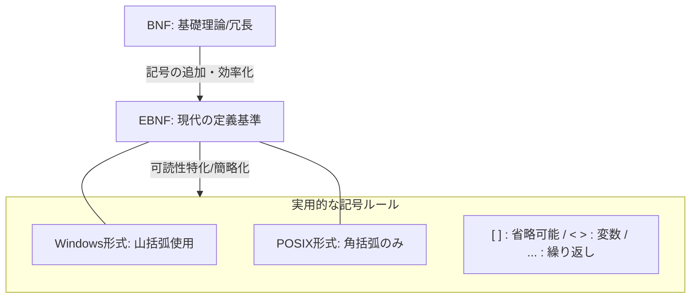

提供された2つの資料（）を統合し、バッチファイルのコマンド構文表記に関するガイドを常体でまとめる。

---

## 1. 文書の背景・目的

ソフトウェアやバッチファイルを公開する際、ユーザーへ「実行方法」を正確に伝える「コマンド構文（Usage/Synopsis）」の記載は不可欠である 。
歴史的には、コンピュータ言語を定義する**BNF（Backus-Naur Form）や、その拡張版であるEBNF**の考え方がベースとなっている 。本稿では、これら理論的背景を整理し、WindowsやPOSIXにおける実用的かつ標準的な書き方を解説する 。

## 2. コマンド構文の主要なスタイル

マニュアルに記載する場合、以下の2つのスタイルが主流である 。

### Windows / 一般的なヘルプ形式

Windowsの標準コマンド（`dir /?`など）でよく見られる、初心者にも直感的で優しい形式 。

- **`< >`**: ユーザーが具体的な値（ファイル名等）を指定する変数部分 。

- **`[ ]`**: 省略可能なオプション部分 。

- **大文字表記**: 必須項目を強調するために使われることもある 。

**記述例:**

`cat_files.bat -i <target_list> [-o <output_file>]`

### POSIX スタイル

LinuxやUnixの`man`ページで標準とされる、エンジニア向けのスッキリした形式 。

- **イタリック/小文字**: 山括弧を使わず、単語の書体やケースで変数を表す 。

- **`[ ]`**: オプション部分 。

**記述例:**

`cat_files.bat [-i target_list] [-o output_file]`

---

## 3. BNFとEBNF：記法のルーツ

現代の書き方のルーツである2つの理論的記法を比較する 。

### BNF (Backus-Naur Form)

1960年代に登場した原始的な記法である 。記号が少なく、繰り返しや省略を表現するために自分自身を再定義（再帰的表現）する必要があるため、人間向けのマニュアルとしては冗長で難解になりやすい 。

**BNFによる定義例:**

```bnf
<command>     ::= "cat_files.bat" <sp> <input_opt> <sp> <output_opt>
<input_opt>   ::= "-i" <sp> <filename>
<output_opt>  ::= "-o" <sp> <filename> | <empty>
<empty>       ::= ""
<sp>          ::= " "

```

### EBNF (Extended BNF)

BNFを拡張し、正規表現に近い直感的な記号を追加したものである 。1行で効率的に記述できるため、現代の定義基準となっている 。

- **`[ ]`**: 省略可能（0回または1回）

- **`{ }`**: 繰り返し（0回以上）

- **`|`**: 選択（AまたはB）

**EBNFによる定義例:**

```ebnf
command = "cat_files.bat" , "-i" , filename , [ "-o" , filename ] ;

```

---

## 4. 記法の進化と実用への関係図

理論がどのように実用的なマニュアル表記（Usage）へと落とし込まれたかの相関を示す。



---

## 5. まとめと提言

- 現代のドキュメント作成においては、厳密なBNFを記載するよりも、EBNFの記号ルール（特に `[ ]` ）を流用した**「Windowsスタイルのハイブリッド」**（`[ ]` と `< >` の組み合わせ）を用いるのが、最もユーザーフレンドリーである 。

- BNFそのものを記述する必要はないが、`[ ]` が「省略可能」を意味するといった背景知識を持つことで、ドキュメントの信頼性と正確性は格段に向上する 。
