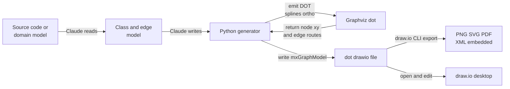

# Clean UML Class Diagrams with Claude Code + Graphviz + draw.io

目的：**Claude Code に DrawIO で綺麗なクラス図を描かせる**ための道具立て・インストール・手順を、友人がそのまま再現できる形でまとめる。

検証環境（tested on, this machine）：Graphviz 13.1.2 / draw.io desktop 30.0.4 / Python 3.13.3 / Node 24.12.0（Windows 11)。

## 1. なぜ3つの道具に分けるのか（mental model）

「綺麗なクラス図」は2種類の品質に分けられる：

- **中身の品質**：どのクラス・属性・メソッド・関連を、UML の作法（コンパートメント、可視性、矢印種別）で正しく描くか。→ 指示（プロンプト）と生成器の仕事。
- **配置の品質**：箱をどこに置き、線をどう引き回して交差・貫通を避けるか。→ **レイアウトアルゴリズム**の仕事。プロンプトをいくら詳しくしても手では解けない。

だから3役で分業する：

- **Claude Code** … 中身を作る（コードを読む → モデル化 → 生成器を書く/実行）。
- **Graphviz `dot`** … 配置を解く（座標 ＋ 線の経路を最適化）。
- **draw.io** … 描画・人手編集・最終出力（PNG/SVG/PDF）。

**Toolchain pipeline:**



肝は2点：(1) draw.io の**ネイティブ UML クラス図形**を使う、(2) 配置だけでなく**線の引き回しも `dot` に計算させて取り込む**（`splines=ortho`)。

## 2. 各ツールの正体（what each tool is）

### Graphviz と dot

- **Graphviz** = ノードとエッジの「グラフ」を受け取り**自動レイアウト**して図にする、定番のオープンソース・ツール群。
- **`dot`** = Graphviz のレイアウトエンジン（コマンド）のひとつ。**階層型（layered / Sugiyama 式）レイアウト**を計算し、**辺の交差を最小化**する。クラス図・依存図・フロー図に最適。
- 入力は **DOT 言語**（`digraph G { A -> B }` のようなプレーンテキスト)。
- 仲間のエンジン：`neato`/`fdp`（力学）、`circo`（円形)、`twopi`（放射状)。**クラス図は `dot`**。
- 本チェーンでの役割：**各クラスの座標**と、`splines=ortho` 指定時は**各エッジの直交経路（折れ点列）**を返す。

### draw.io（diagrams.net）

- 無料の作図エディタ。**デスクトップ版／ブラウザ版／VSCode 拡張**がある。
- ファイル形式は **`.drawio`**（`mxGraphModel` という XML)。
- **ネイティブ UML クラス図形**を持つ：1つの「スイムレーン」コンテナに、名前バー＋属性コンパートメント＋操作コンパートメントを罫線で区切って積む（これが汎用ボックスとの差)。
- デスクトップ版は **CLI** を内蔵：`.drawio` → PNG/SVG/PDF に書き出せ、`-e` で**元の XML を埋め込む**ので**書き出した画像も draw.io で再編集可能**。
- 役割：**描画・人手編集・最終出力**。

### Claude Code

- 役割：**中身の生成 ＋ 接着**。実コードを読んでクラス/属性/メソッド/関連を抽出し、draw.io ネイティブ UML 図形を出力する Python 生成器を書き、`dot` を呼んで配置を取り込み、draw.io CLI で書き出す。

### dot と draw.io の関係（誤解されやすい点）

- **dot は「設計図（座標と経路）」を計算するだけ**。絵は描かない。
- **draw.io は「描画・編集・出力」**。レイアウト計算は dot に任せ、結果の座標・経路を受け取って UML 図形として描く。
- 両者は**直接は繋がらない**。間を **Python 生成器（Claude が書く）**が翻訳する：dot の数値 → `.drawio` XML。

**分業表（プロンプト vs ツール）:**

| 層 | 何を決めるか | 道具 |
|---|---|---|
| プロンプト | どのクラス／関連、グループ化、向き(TB/LR)、詳細度、主従(継承=主・依存=従) | 指示文 |
| アルゴリズム | 座標・階層・**交差最小化**・**線の引き回し** | `dot`（または draw.io の Arrange to Layout) |
| 描画・出力 | UML 図形の描画、人手微調整、PNG/SVG/PDF | draw.io（GUI ＋ CLI) |

## 3. インストール（友人のマシン用）

必須：**Graphviz**・**draw.io desktop**・**Python 3.10+**。任意：**Node.js**（`elkjs` や `@drawio/postprocess` を使う場合のみ。基本ワークフローには不要)。

**Install commands (per OS):**

```bash
# ===== Graphviz (REQUIRED -- the layout engine, provides `dot`) =====
winget install Graphviz.Graphviz            # Windows
brew install graphviz                       # macOS
sudo apt-get install -y graphviz            # Debian / Ubuntu
sudo dnf install -y graphviz                # Fedora

# ===== draw.io desktop (REQUIRED -- editing + CLI export) =====
winget install JGraph.Draw                  # Windows
brew install --cask drawio                  # macOS
# Linux: download .deb / .rpm / .AppImage from the official releases page:
#   github.com/jgraph/drawio-desktop/releases

# ===== Python 3.10+ (REQUIRED -- runs the generator) =====
winget install Python.Python.3.12           # Windows
brew install python                         # macOS
sudo apt-get install -y python3             # Debian / Ubuntu

# ===== Node.js (OPTIONAL -- only for elkjs / @drawio/postprocess) =====
winget install OpenJS.NodeJS.LTS            # Windows
brew install node                           # macOS
sudo apt-get install -y nodejs npm          # Debian / Ubuntu
```

winget の ID は実機で確認済み：`Graphviz.Graphviz`、`JGraph.Draw`。インストール後は**新しいシェルを開く**と PATH が通る（特に Windows の Graphviz)。

**Verify the toolchain:**

```bash
dot -V            # expect: dot - graphviz version 13.x ...
python --version  # expect: 3.10 or newer
node -v           # optional; only if you will use elkjs / postprocess

# draw.io desktop CLI location (the binary you call for export):
#   Windows : C:\Program Files\draw.io\draw.io.exe
#   macOS   : /Applications/draw.io.app/Contents/MacOS/draw.io
#   Linux   : drawio        (on PATH if installed via package; else the AppImage path)
```

`dot -V` が出れば配置エンジンは準備完了。draw.io は GUI で開ければ CLI も同梱されている。

## 4. ワークフロー（手順の全体像）

1. **対象を決める**：実コードのクラス、または概念ドメインモデル。
2. **モデル化**：クラス ＝ (name, stereotype, attrs[], methods[])、関連 ＝ (source, target, kind)。kind は gen/real/comp/aggr/assoc/dep。
3. **生成器を実行**：下の Python が (a) draw.io ネイティブ UML 図形を組み立て、(b) `dot -Tplain` を呼んで座標と直交経路を取得、(c) `.drawio` を書き出す。
4. **書き出し**：draw.io CLI で PNG/SVG（`-e` で XML 埋め込み)。
5. **検証・微調整**：画像を見て、必要なら draw.io で `Arrange to Layout` や手ドラッグ。

## 5. 生成器（完全・汎用テンプレート）

**class diagram generator (generic, runnable):**

```python
#!/usr/bin/env python3
# Clean UML class diagram for draw.io: native class shapes + Graphviz dot layout
# (positions AND orthogonal edge routes). Requires: Python 3.10+, Graphviz `dot`.
import subprocess
import xml.dom.minidom as minidom

# ---- 1) DEFINE YOUR MODEL (edit this block) ------------------------------
# name -> (stereotype, fillColor, strokeColor, attributes[], methods[])
CLASSES = {
    "Animal": ("abstract", "#DAE8FC", "#6C8EBF",
               ["+ name: str", "# age: int"],
               ["+ speak(): str"]),
    "Dog":    ("", "#D5E8D4", "#82B366",
               ["+ breed: str"],
               ["+ speak(): str", "+ fetch(): None"]),
    "Owner":  ("", "#FFE6CC", "#D79B00",
               ["+ name: str"],
               ["+ adopt(d: Dog): None"]),
}
# (source, target, kind);  kind in: gen, real, comp, aggr, assoc, dep
EDGES = [
    ("Dog", "Animal", "gen"),
    ("Owner", "Dog", "aggr"),
]
OUT = "class-diagram.drawio"
COL_W = 260                      # class box width (px); raise for long signatures

# ---- 2) UML ARROW STYLES --------------------------------------------------
ARROW = {
    "gen":   "endArrow=block;endFill=0;endSize=14;",
    "real":  "endArrow=block;endFill=0;endSize=14;dashed=1;",
    "comp":  "startArrow=diamondThin;startFill=1;startSize=14;endArrow=open;endFill=0;",
    "aggr":  "startArrow=diamondThin;startFill=0;startSize=14;endArrow=open;endFill=0;",
    "assoc": "endArrow=open;",
    "dep":   "endArrow=open;dashed=1;",
}
EDGE_BASE = "edgeStyle=orthogonalEdgeStyle;rounded=0;html=1;strokeColor=#3A3A3A;"
TITLE_H, ROW_H, DIV_H = 40, 22, 10


def esc(s):
    return s.replace("&", "&amp;").replace("<", "&lt;").replace(">", "&gt;")


def box_h(attrs, methods):
    h = TITLE_H + ROW_H * len(attrs) + ROW_H * len(methods)
    return h + DIV_H if attrs and methods else h


# ---- 3) ASK GRAPHVIZ FOR POSITIONS + ORTHOGONAL EDGE ROUTES ---------------
def dot_layout():
    g = ["digraph G {", "rankdir=TB; nodesep=0.7; ranksep=1.1; splines=ortho;",
         "node [shape=box, fixedsize=true];"]
    for n, (st, f, sc, a, m) in CLASSES.items():
        g.append('"%s" [width=%.3f, height=%.3f];' % (n, COL_W / 72.0, box_h(a, m) / 72.0))
    for s, d, k in EDGES:
        a, b = (d, s) if k in ("gen", "real") else (s, d)   # parent ranks above child
        g.append('"%s" -> "%s";' % (a, b))
    g.append("}")
    out = subprocess.run(["dot", "-Tplain"], input="\n".join(g),
                         capture_output=True, text=True, check=True).stdout
    H = None
    pos, routes = {}, {}
    for ln in out.splitlines():
        p = ln.split()
        if not p:
            continue
        if p[0] == "graph":
            H = float(p[3])
        elif p[0] == "node":
            n = p[1].strip('"')
            cx, cy, w, h = (float(v) for v in p[2:6])
            pos[n] = ((cx - w / 2) * 72, (H - cy - h / 2) * 72)
        elif p[0] == "edge":
            t, hd, k = p[1].strip('"'), p[2].strip('"'), int(p[3])
            c = p[4:4 + 2 * k]
            routes[(t, hd)] = [(float(c[2 * i]) * 72, (H - float(c[2 * i + 1])) * 72)
                               for i in range(k)]
    mnx = min(x for x, _ in pos.values())
    mny = min(y for _, y in pos.values())
    pos = {n: (x - mnx + 40, y - mny + 40) for n, (x, y) in pos.items()}
    routes = {e: [(x - mnx + 40, y - mny + 40) for x, y in pts]
              for e, pts in routes.items()}
    return pos, routes


# ---- 4) EMIT NATIVE draw.io UML CLASS SHAPES + ROUTED EDGES ---------------
def build():
    pos, routes = dot_layout()
    rs = ("text;strokeColor=none;fillColor=none;align=left;verticalAlign=middle;"
          "spacingLeft=8;overflow=hidden;html=1;fontSize=12;")
    cells = []
    for n, (stereo, fill, stroke, attrs, meths) in CLASSES.items():
        x, y = pos[n]
        title = ("«%s»<br>" % stereo if stereo else "") + "<b>%s</b>" % n
        cells.append(
            '<mxCell id="%s" value="%s" style="swimlane;html=1;childLayout=stackLayout;'
            'startSize=%d;horizontal=1;horizontalStack=0;resizeParent=1;resizeParentMax=0;'
            'collapsible=0;swimlaneFillColor=#FFFFFF;fillColor=%s;strokeColor=%s;" '
            'vertex="1" parent="1"><mxGeometry x="%d" y="%d" width="%d" height="%d" '
            'as="geometry"/></mxCell>'
            % (n, esc(title), TITLE_H, fill, stroke, round(x), round(y), COL_W,
               box_h(attrs, meths)))
        off = TITLE_H
        for i, a in enumerate(attrs):
            cells.append('<mxCell id="%s_a%d" value="%s" style="%s" vertex="1" parent="%s">'
                         '<mxGeometry y="%d" width="%d" height="%d" as="geometry"/></mxCell>'
                         % (n, i, esc(a), rs, n, off, COL_W, ROW_H))
            off += ROW_H
        if attrs and meths:
            cells.append('<mxCell id="%s_div" value="" style="line;strokeColor=%s;html=1;" '
                         'vertex="1" parent="%s"><mxGeometry y="%d" width="%d" height="%d" '
                         'as="geometry"/></mxCell>' % (n, stroke, n, off, COL_W, DIV_H))
            off += DIV_H
        for j, mm in enumerate(meths):
            cells.append('<mxCell id="%s_m%d" value="%s" style="%s" vertex="1" parent="%s">'
                         '<mxGeometry y="%d" width="%d" height="%d" as="geometry"/></mxCell>'
                         % (n, j, esc(mm), rs, n, off, COL_W, ROW_H))
            off += ROW_H
    for i, (s, d, k) in enumerate(EDGES):
        key, rev = ((d, s), True) if k in ("gen", "real") else ((s, d), False)
        pts = routes.get(key, [])
        if rev:
            pts = pts[::-1]
        inner = "".join('<mxPoint x="%d" y="%d"/>' % (round(x), round(y))
                        for x, y in pts[1:-1])
        geo = ('<mxGeometry relative="1" as="geometry"><Array as="points">%s</Array>'
               '</mxGeometry>' % inner) if inner else '<mxGeometry relative="1" as="geometry"/>'
        cells.append('<mxCell id="e%d" style="%s" edge="1" parent="1" source="%s" '
                     'target="%s">%s</mxCell>' % (i, EDGE_BASE + ARROW[k], s, d, geo))
    xml = ('<mxGraphModel><root><mxCell id="0"/><mxCell id="1" parent="0"/>%s</root>'
           '</mxGraphModel>' % "".join(cells))
    minidom.parseString(xml)          # fail fast if the XML is malformed
    with open(OUT, "w", encoding="utf-8") as fh:
        fh.write(xml)
    print("wrote", OUT, "(", len(CLASSES), "classes,", len(EDGES), "edges )")


if __name__ == "__main__":
    build()
```

このテンプレートはそのまま動く（`CLASSES` と `EDGES` を自分のモデルに書き換えるだけ)。肝は3つ：

1. **ネイティブ UML 図形**：`swimlane` ＋ `childLayout=stackLayout`。子セル（属性行・罫線・操作行）を縦に積むと、名前/属性/操作のコンパートメントになる。汎用ボックスとの差はここ。
2. **配置も配線も dot**：`splines=ortho` を付け、`dot -Tplain` の出力から**ノード座標**と**エッジの折れ点列**の両方を読む。線を draw.io 任せの直線にせず dot の経路を waypoint として渡すので、**箱の貫通が消える**。
3. **座標系の変換**：dot は左下原点・インチ単位、draw.io は左上原点・ピクセル。`px = inch * 72`、Y は `H - y` で反転、最後に全体平行移動。ノードとエッジ点に**同じ変換**を当てるのが要。

XML 属性値に入るので `&` `<` `>` は必ずエスケープ（`esc()`)。HTML タグ（`<b>`,`<br>`）も同様にエスケープして書く（draw.io が `html=1` で解釈する)。

## 6. 書き出し and 検証コマンド

**export with the draw.io CLI:**

```bash
# Pick the draw.io binary for your OS, then export PNG and SVG (XML embedded):
#   Windows : DRAWIO="/c/Program Files/draw.io/draw.io.exe"
#   macOS   : DRAWIO="/Applications/draw.io.app/Contents/MacOS/draw.io"
#   Linux   : DRAWIO="drawio"
DRAWIO="/c/Program Files/draw.io/draw.io.exe"

"$DRAWIO" -x -f png -e -b 12 -o class-diagram.drawio.png class-diagram.drawio
"$DRAWIO" -x -f svg -e -b 12 -o class-diagram.drawio.svg class-diagram.drawio

# Flags: -x export | -f format | -e embed editable XML | -b border(px) | -o output
# Linux headless (no display): wrap with xvfb and disable the sandbox:
#   xvfb-run -a "$DRAWIO" -x -f png -e -b 12 -o out.png in.drawio --no-sandbox
```

`-e` を付けると PNG/SVG に元の図が埋め込まれ、その画像を draw.io で開けば再編集できる。

## 7. プロンプトのコツ（中身・構造側）

- **向き**：「上 → 下に 基底クラス → 実装 → 協調クラスの階層で」（TB/LR）。
- **グループ**：「実装クラスは同じ段に」「同系統は片側に固める」。
- **線を減らす**：「依存(uses)は破線 or 省略」「継承・実現を主役に」。
- **詳細度**：「属性は public のみ」「value object は名前だけ」。
- これらは**レイアウトの素性**を良くするので、どのエンジンでも交差が減る。

## 8. 再現チェックリスト（友人向け）

1. Graphviz・draw.io・Python を入れる（セクション3)。
2. `dot -V` と `python --version` で確認。
3. セクション5の生成器を `gen.py` で保存し、`CLASSES`/`EDGES` を自分のモデルに書き換える。
4. `python gen.py` を実行 → `class-diagram.drawio` ができる。
5. セクション6の CLI で PNG/SVG を書き出す。
6. draw.io で開いて確認。詰めたければ `Arrange to Layout`（Vertical Tree / Hierarchical）や手ドラッグ。

本プロジェクトでの実例：`docs/StrictDoc-specs/_assets/gr-arc-3-class-core.drawio`（15クラス)。同じ技法を規模拡大しただけ。

## 9. トラブルシュート

| 症状 | 原因 | 対処 |
|---|---|---|
| `dot: command not found` | Graphviz 未導入 or PATH 未反映 | 導入後に新しいシェルを開く。`dot -V` で確認 |
| 線が箱を貫通する | dot の経路を取り込まず座標だけ使用 | `splines=ortho` ＋ エッジ折れ点を waypoint 化（本テンプレ対応済み) |
| 図が空 or 壊れる | XML 不正（未エスケープの `& < >`） | `esc()` を通す。`minidom.parseString` で事前検証 |
| Linux で CLI が固まる | Electron に表示先が無い | `xvfb-run -a ... --no-sandbox` |
| 属性が見切れる | `COL_W` が狭い | `COL_W` を上げる or クラス毎に幅指定 |
| まだ交差が多い | ノードが多い or 密集 | `ranksep`/`nodesep` を上げる、`subgraph cluster_` で層化、draw.io の Arrange to Layout |

## 10. 用語まとめ

- **Graphviz**：グラフ自動レイアウトのツール群。
- **dot**：Graphviz の階層レイアウトエンジン（コマンド)。座標と（ortho 指定で）線の経路を返す。
- **DOT 言語**：`digraph { A -> B }` 形式のグラフ記述テキスト。
- **draw.io / diagrams.net**：作図エディタ。`.drawio`（mxGraphModel XML）を編集し、CLI で PNG/SVG/PDF を書き出す。
- **mxGraphModel**：draw.io のファイル内部の XML スキーマ。
- **swimlane + stackLayout**：draw.io でネイティブ UML クラス（コンパートメント付き）を作る図形の仕組み。
