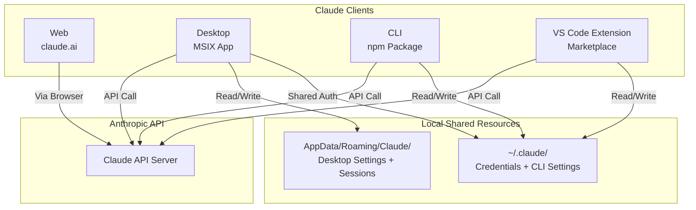
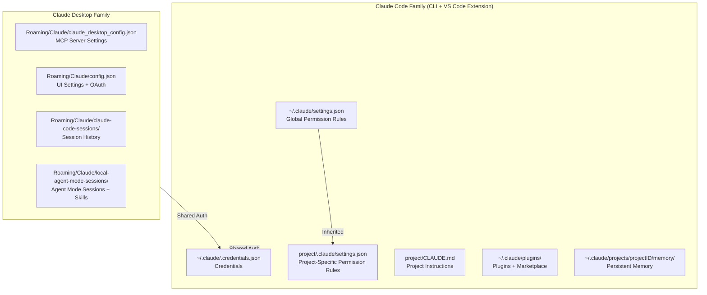
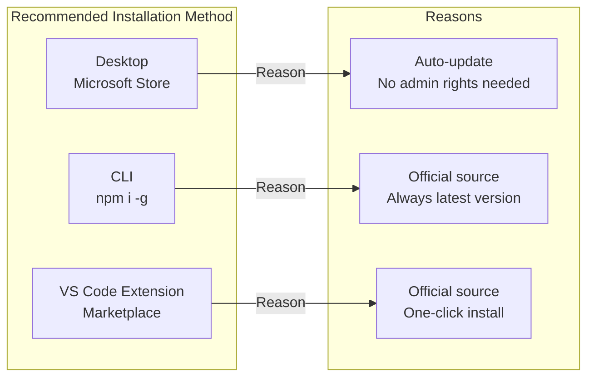
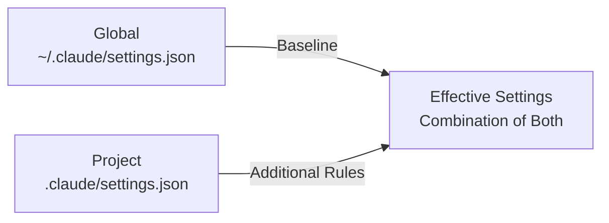

``````markdown
# Claude Ecosystem Complete Guide (Windows 11 Edition)

> Target audience: Developers who are introducing Claude into their work environment
> Last updated: 2026-03-14

---

## 1. Claude Client Types

Claude has multiple usage forms, each operating as an independent client.

| Type | Official Name | Execution Format | Main Use |
|---|---|---|---|
| Web | Claude.ai | Browser | Chat, file upload, Projects |
| Desktop | Claude Desktop | MSIX app (Electron) | Chat + MCP server integration + Cowork + Agent Mode |
| CLI | Claude Code | Node.js CLI (`claude` command) | Coding assistance and automation in the terminal |
| VS Code Extension | Claude Code for VS Code | VS Code Extension | Editor integration, inline coding assistance |

**Claude Ecosystem Overview:**



Desktop primarily uses `AppData/Roaming/Claude/`, while CLI and VS Code Extension primarily use `~/.claude/`. Credentials (`~/.claude/.credentials.json`) are shared across all clients.

### Characteristics of Each Type

**Web (claude.ai)**
- No installation required. Just access it in a browser
- Can build knowledge bases with the Projects feature
- Cannot read/write files or execute commands

**Desktop (Claude Desktop)**
- Distributed as an MSIX package on Windows
- The same MSIX package is installed whether from the Microsoft Store, winget, or direct download from the official site (PackageID: `Claude_pzs8sxrjxfjjc`, Publisher: `Anthropic, PBC`)
- Can integrate with MCP (Model Context Protocol) servers
- Includes Cowork feature (autonomously progresses tasks in the background)
- Agent Mode provides GUI access to the same capabilities as Claude Code

**CLI (Claude Code)**
- Install with `npm i -g @anthropic-ai/claude-code`
- Directly performs file read/write, command execution, Git operations, etc. in the terminal
- Safe command execution control through permission management (allow/deny)
- Supports per-project configuration files (`.claude/settings.json`)

**VS Code Extension (Claude Code for VS Code)**
- Install from VS Code Marketplace
- Shares the same `~/.claude/` settings as CLI
- Operates from the side panel within the editor
- Integrated diff preview for file edits

### Folder Structure on Windows (Application Files + Configuration Files)

**Application and Configuration File Unified Tree:**

```text
C:\
├── Program Files\WindowsApps\
│   └── AnthropicPBC.Claude_version_xxx\
│       └── Claude.exe                         ... Desktop app binary (MSIX / auto-managed)
│
└── Users\username\
    ├── .claude\                                ─── Claude Code family (CLI + VS Code Extension) ───
    │   ├── settings.json                      ... Global permission rules    (★ manually edited)
    │   ├── .credentials.json                  ... Auth token                 (auto / shared by all clients)
    │   ├── plugins\                           ... Plugins                    (auto-managed)
    │   │   └── marketplaces\                  ... Plugins from marketplace
    │   └── projects\
    │       └── {projectID}\
    │           └── memory\                    ... Persistent memory          (auto-managed)
    │
    ├── AppData\
    │   ├── Roaming\
    │   │   ├── Claude\                         ─── Claude Desktop family ───
    │   │   │   ├── claude_desktop_config.json  ... MCP server settings       (★ manually edited)
    │   │   │   ├── config.json                 ... UI settings + OAuth       (auto-managed)
    │   │   │   ├── claude-code\                ... CLI binary for Agent Mode (auto-managed)
    │   │   │   │   └── {version}\
    │   │   │   │       └── claude.exe          ... CLI downloaded by Desktop (approx. 239MB/version)
    │   │   │   ├── claude-code-sessions\       ... Session history           (auto-managed)
    │   │   │   └── local-agent-mode-sessions\  ... Agent Mode                (auto-managed)
    │   │   │       └── skills-plugin\          ... Skills for Desktop
    │   │   │
    │   │   └── npm\                             ─── CLI executable ───
    │   │       ├── claude.cmd                  ... CLI entry point           (placed by npm install)
    │   │       └── node_modules\
    │   │           └── @anthropic-ai\
    │   │               └── claude-code\        ... CLI main package          (placed by npm install)
    │   │
    │   └── Local\
    │       └── Programs\
    │           └── Microsoft VS Code\
    │               └── Code.exe                ... VS Code binary
    │
    └── .vscode\
        └── extensions\
            └── anthropic.claude-code-version\
                ├── ...                         ... VS Code extension files   (placed by Marketplace)
                └── resources\
                    └── native-binary\
                        └── claude.exe          ... Embedded CLI binary in extension (approx. 239MB)

Project folder\                                 ─── Per project ───
├── CLAUDE.md                                   ... Project instructions      (★ manually created)
└── .claude\
    └── settings.json                           ... Project-specific permission rules (★ manually edited)
```

Only files marked with `★ manually edited` need to be managed by developers. Everything else is automatically managed by installers and applications.

---

## 2. Configuration Files Explained

### Configuration File Overview Map



GlobalSettings serves as the baseline, and ProjectSettings adds or overrides rules per project. Desktop configuration files are completely independent from CLI.

### File Details

#### 2.1 Files Edited by Users (3 types)

| File | Path | Purpose |
|---|---|---|
| Global settings.json | `%USERPROFILE%\.claude\settings.json` | CLI/VS Code permissions (allow/deny). Applied to all projects |
| Project settings.json | `project root\.claude\settings.json` | Additional permissions specific to that project. Added on top of global settings |
| Desktop config | `%APPDATA%\Claude\claude_desktop_config.json` | MCP server definitions. Settings for external tool integration used in Desktop's Agent Mode / Cowork |

#### 2.2 Auto-Managed Files (no manual editing needed)

| File | Path | Purpose |
|---|---|---|
| .credentials.json | `%USERPROFILE%\.claude\.credentials.json` | OAuth auth token. Shared by all clients. Generated by `claude login` |
| config.json | `%APPDATA%\Claude\config.json` | Desktop UI settings (locale, theme) and OAuth token cache |
| CLAUDE.md | `project root\CLAUDE.md` | Project instructions. Claude automatically reads this every time. Content is written by developers |
| local_*.json | Under `%APPDATA%\Claude\claude-code-sessions\` | History metadata for Claude Code sessions launched from Desktop |
| memory/ | `%USERPROFILE%\.claude\projects\projectID\memory\` | Claude Code persistent memory. Retains information across conversations |
| plugins/ | `%USERPROFILE%\.claude\plugins\` | Installed plugins and marketplace information |

For full paths of each file, refer to the "Application and Configuration File Unified Tree" at the end of Section 1.

---

## 3. Recommended Installation Setup and Procedure

### Recommended Setup



The recommended installation method for each client is shown above. None of them require administrator privileges.

| Client | Recommended Method | Reason |
|---|---|---|
| Desktop | **Microsoft Store** | Reliable auto-updates. winget or direct download installs the same MSIX, but the Store is the easiest |
| CLI | **npm i -g** | The only official distribution method. npm delivers the latest version |
| VS Code Extension | **VS Code Marketplace** | Simply search and install from the Extensions panel |

### Prerequisites

- Windows 11 (Windows 10 is also supported)
- Node.js 18 or higher must be installed (for CLI)
- VS Code must be installed (for the extension)

### Procedure

#### Step 1: Install Claude Desktop

Open the Microsoft Store and search for "Claude" to install.

**Install from Store:**

```powershell
# Alternatively, winget installs the same package
winget install Anthropic.Claude
```

Even when installed via winget, the PackageID is the same (`Claude_pzs8sxrjxfjjc`), so the Microsoft Store manages auto-updates.

After installation, launch Claude Desktop and log in. At this point, `~/.claude/.credentials.json` is generated, and authentication is shared with CLI and VS Code Extension.

#### Step 2: Install Claude Code CLI

**CLI installation command:**

```bash
npm install -g @anthropic-ai/claude-code
```

The installation destination is under `%APPDATA%\npm\` (user space). No administrator privileges required.

**Verify installation:**

```bash
claude --version
```

If a version number is displayed, the installation was successful. If you already logged in to Desktop in Step 1, credentials are shared, so `claude login` is not needed.

#### Step 3: Install VS Code Extension

1. Open VS Code
2. Open the Extensions panel (`Ctrl+Shift+X`)
3. Search for "Claude Code"
4. Install "Claude Code" (official by Anthropic)

It automatically shares the same `~/.claude/` settings and authentication as CLI. No additional configuration is needed.

#### Step 4: Verify Operation

**Verify each client:**

```bash
# Verify CLI operation
claude --version
claude "Hello, Claude!"

# Desktop: Launch the app and confirm that chat works
# VS Code: Confirm that chat works from the Claude icon in the side panel
```

If all three clients respond, the installation is complete.

---

## 4. Recommended Configuration File Settings

### 4.1 Global settings.json

**Path: `%USERPROFILE%\.claude\settings.json`**

Applied to both CLI and VS Code Extension. Only write operations that you want to allow across all projects here.

**Recommended settings:**

```json
{
  "permissions": {
    "allow": [
      "WebSearch",
      "Bash(npm test)",
      "Bash(npm run build)",
      "Bash(npm run test)",
      "Bash(npx vitest run)",
      "Bash(npx vitest run --passWithNoTests)",
      "Bash(pnpm test:*)",
      "Bash(python:*)",
      "Bash(python3 -c \":*)"
    ],
    "additionalDirectories": [
      "C:\\Users\\username\\AppData\\Local\\Temp"
    ]
  }
}
```

Configuration guidelines:

- Only put general-purpose commands that are safe to use in any project in `allow`
- `WebSearch` allows web searches. Frequently used for research tasks
- `Bash(npm test)` commands are standard test/build commands. Safe to allow for all projects
- `Bash(python:*)` is a general permission for Python script execution
- `additionalDirectories` specifies the Temp folder for temporary file operations
- Settings that include project-specific domains or paths should be written in the project-level config, not here

**Anti-patterns (settings to avoid):**

```json
{
  "permissions": {
    "allow": [
      "WebFetch(domain:specific-project-site.com)",
      "Bash(npx vite build)",
      "Bash(mkdir -p some-specific-dir)",
      "Read(//c/Users/name/specific-project/**)"
    ]
  }
}
```

The above examples -- specific project domains, project-specific build commands, one-time commands, and Read permissions for specific paths -- should not be placed in the global settings. They may be automatically added during Claude Code operations, but you should periodically clean them up by moving them to the project-level config or deleting them.

### 4.2 Project-Specific settings.json

**Path: `project root\.claude\settings.json`**

Write permissions that are only needed for that project here. These are applied in addition to the global settings.

**Example configuration (for a web frontend development project):**

```json
{
  "permissions": {
    "allow": [
      "Bash(npx vite build)",
      "Bash(npx playwright test)",
      "WebFetch(domain:my-staging-site.example.com)",
      "WebFetch(domain:api-docs.example.com)"
    ],
    "additionalDirectories": [
      "C:\\Users\\username\\shared-design-tokens"
    ]
  }
}
```

Configuration guidelines:

- Allow build commands and test commands specific to that project
- Allow WebFetch for external domains referenced by that project
- If access to a related separate directory is needed, add it to `additionalDirectories`

### 4.3 claude_desktop_config.json (Desktop MCP Settings)

**Path: `%APPDATA%\Claude\claude_desktop_config.json`**

If you do not use MCP servers, this file can be an empty object or have minimal settings.

**Without MCP servers:**

```json
{
  "preferences": {
    "menuBarEnabled": false,
    "coworkWebSearchEnabled": true
  }
}
```

**Example configuration with MCP servers:**

```json
{
  "mcpServers": {
    "filesystem": {
      "command": "npx",
      "args": [
        "-y",
        "@anthropic-ai/mcp-filesystem",
        "C:\\Users\\username\\Documents"
      ]
    },
    "github": {
      "command": "npx",
      "args": [
        "-y",
        "@anthropic-ai/mcp-github"
      ],
      "env": {
        "GITHUB_TOKEN": "ghp_xxxxxxxxxxxxxxxxxxxx"
      }
    }
  },
  "preferences": {
    "menuBarEnabled": false,
    "coworkWebSearchEnabled": true
  }
}
```

MCP server settings are exclusive to Desktop. MCP settings for CLI and VS Code Extension are managed through a separate mechanism (`.mcp.json` files).

### 4.4 CLAUDE.md (Project Instructions)

**Path: `project root\CLAUDE.md`**

Although not a configuration file, it is documented here because it significantly affects Claude Code's behavior. When placed in the project root, Claude automatically reads it at the start of every conversation.

**Content to include:**

```markdown
# CLAUDE.md

## Project Overview
Briefly describe the purpose and overview of the project.

## File Structure
Describe the roles of key directories and files.

## Coding Standards
Describe language, framework, naming conventions, prohibited practices, etc.

## Testing Policy
Describe how to run tests, coverage targets, etc.

## Prohibited Actions
Explicitly state things you do not want Claude to do.
(e.g., Do not add a backend, do not add external network calls without permission)
```

The difference between what to write in CLAUDE.md vs. settings.json:

- **CLAUDE.md**: Instructions for "what to do / what not to do" (natural language)
- **settings.json**: Technical controls for "what to allow / what to deny" (JSON)

### 4.5 Settings Priority

**Settings application order:**



The global settings serve as the baseline, and the project settings' allow/deny rules are added to produce the effective settings. If you want to override a global allow at the project level, add it to the project's `deny` list.

### 4.6 Configuration Management Best Practices

| Rule | Reason |
|---|---|
| Only put general-purpose commands in global settings | Prevents unnecessary permissions from spreading to all projects |
| Put project-specific settings in the project-level config | Separation of concerns. Permissions disappear when you leave the project |
| Periodically delete one-time command permissions | Permissions auto-added by Claude during interaction accumulate as clutter |
| Do not add `.claude/settings.json` to `.gitignore` | Allows sharing permission rules with team members |
| Do not write secrets in settings.json | Because it gets committed to Git. Use environment variables for API keys, etc. |
``````
