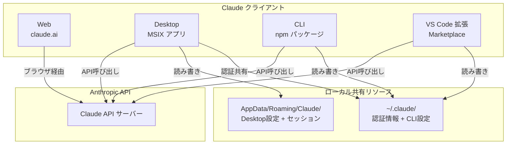
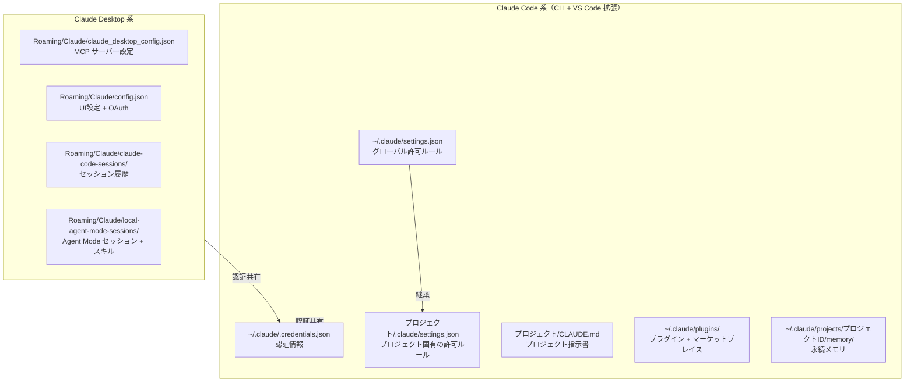
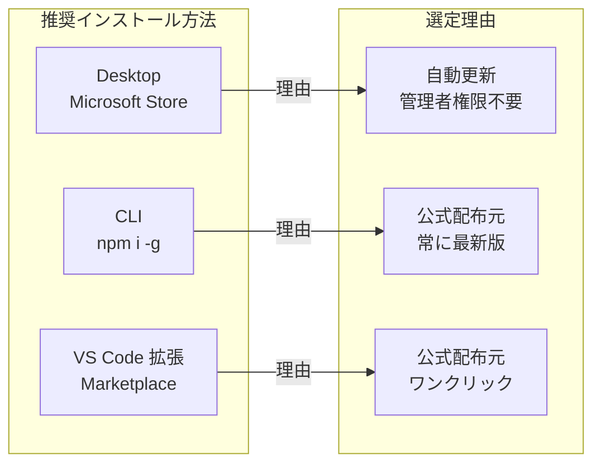
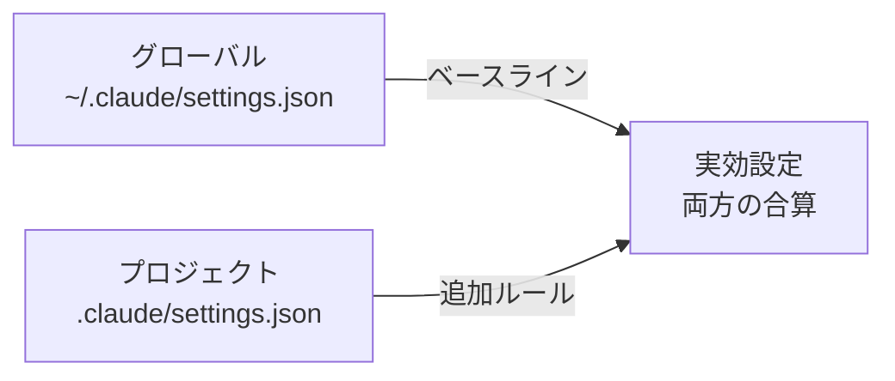

``````markdown
# Claude エコシステム完全ガイド（Windows 11 編）

> 対象読者: これから Claude を業務環境に導入する開発者
> 最終更新: 2026-03-14

---

## 1. Claude の形態（クライアント）一覧

Claude には複数の利用形態があり、それぞれ独立したクライアントとして動作する。

| 形態 | 正式名称 | 実行形式 | 主な用途 |
|---|---|---|---|
| Web | Claude.ai | ブラウザ | チャット、ファイルアップロード、Projects |
| Desktop | Claude Desktop | MSIX アプリ（Electron） | チャット + MCP サーバー連携 + Cowork + Agent Mode |
| CLI | Claude Code | Node.js CLI (`claude` コマンド) | ターミナルでのコーディング支援、自動化 |
| VS Code 拡張 | Claude Code for VS Code | VS Code Extension | エディタ統合、インラインコーディング支援 |

**Claude エコシステム概観:**



Desktop は `AppData/Roaming/Claude/` を主に使い、CLI と VS Code 拡張は `~/.claude/` を主に使う。認証情報（`~/.claude/.credentials.json`）は全クライアントで共有される。

### 各形態の特徴

**Web（claude.ai）**
- インストール不要。ブラウザでアクセスするだけ
- Projects 機能でナレッジベースを構築可能
- ファイルの読み書きやコマンド実行はできない

**Desktop（Claude Desktop）**
- Windows では MSIX パッケージとして配布される
- Microsoft Store、winget、公式サイト直接ダウンロードのいずれでも同一の MSIX パッケージがインストールされる（PackageID: `Claude_pzs8sxrjxfjjc`、Publisher: `Anthropic, PBC`）
- MCP（Model Context Protocol）サーバーとの連携が可能
- Cowork 機能（バックグラウンドで自律的にタスクを進行）を搭載
- Agent Mode で Claude Code と同等の機能をGUIから利用可能

**CLI（Claude Code）**
- `npm i -g @anthropic-ai/claude-code` でインストール
- ターミナル上でファイル読み書き、コマンド実行、Git 操作などを直接実行
- パーミッション管理（allow/deny）による安全なコマンド実行制御
- プロジェクト単位の設定ファイル（`.claude/settings.json`）をサポート

**VS Code 拡張（Claude Code for VS Code）**
- VS Code Marketplace からインストール
- CLI と同じ `~/.claude/` 設定を共有
- エディタ内のサイドパネルから操作
- ファイル編集の diff プレビュー統合

### Windows 環境でのフォルダ構成（アプリ本体 + 設定ファイル）

**アプリ・設定ファイル統合ツリー:**

```text
C:\
├── Program Files\WindowsApps\
│   └── AnthropicPBC.Claude_バージョン_xxx\
│       └── Claude.exe                         ... Desktop アプリ本体（MSIX / 自動管理）
│
└── Users\ユーザー名\
    ├── .claude\                                ─── Claude Code 系（CLI + VS Code 拡張）───
    │   ├── settings.json                      ... グローバル許可ルール       （★ 手動編集）
    │   ├── .credentials.json                  ... 認証トークン               （自動 / 全クライアント共有）
    │   ├── plugins\                           ... プラグイン                  （自動管理）
    │   │   └── marketplaces\                  ... マーケットプレイスからのプラグイン
    │   └── projects\
    │       └── {プロジェクトID}\
    │           └── memory\                    ... 永続メモリ                  （自動管理）
    │
    ├── AppData\
    │   ├── Roaming\
    │   │   ├── Claude\                         ─── Claude Desktop 系 ───
    │   │   │   ├── claude_desktop_config.json  ... MCP サーバー設定           （★ 手動編集）
    │   │   │   ├── config.json                 ... UI設定 + OAuth             （自動管理）
    │   │   │   ├── claude-code\                ... Agent Mode 用 CLI バイナリ （自動管理）
    │   │   │   │   └── {version}\
    │   │   │   │       └── claude.exe          ... Desktop が DL した CLI（約239MB/版）
    │   │   │   ├── claude-code-sessions\       ... セッション履歴             （自動管理）
    │   │   │   └── local-agent-mode-sessions\  ... Agent Mode                 （自動管理）
    │   │   │       └── skills-plugin\          ... Desktop 用スキル
    │   │   │
    │   │   └── npm\                             ─── CLI 実行ファイル ───
    │   │       ├── claude.cmd                  ... CLI エントリポイント       （npm install で配置）
    │   │       └── node_modules\
    │   │           └── @anthropic-ai\
    │   │               └── claude-code\        ... CLI 本体                   （npm install で配置）
    │   │
    │   └── Local\
    │       └── Programs\
    │           └── Microsoft VS Code\
    │               └── Code.exe                ... VS Code 本体
    │
    └── .vscode\
        └── extensions\
            └── anthropic.claude-code-バージョン\
                ├── ...                         ... VS Code 拡張本体           （Marketplace で配置）
                └── resources\
                    └── native-binary\
                        └── claude.exe          ... 拡張内蔵 CLI バイナリ（約239MB）

プロジェクトフォルダ\                            ─── プロジェクト単位 ───
├── CLAUDE.md                                   ... プロジェクト指示書          （★ 手動作成）
└── .claude\
    └── settings.json                           ... プロジェクト固有の許可ルール （★ 手動編集）
```

`★ 手動編集` のファイルのみ開発者が管理する対象。他はすべてインストーラーやアプリが自動管理する。

---

## 2. 設定ファイル類の説明

### 設定ファイル全体マップ



GlobalSettings はベースラインとなり、ProjectSettings がプロジェクトごとにルールを追加・上書きする。Desktop 系の設定ファイルは CLI とは完全に独立している。

### 各ファイルの詳細

#### 2.1 ユーザーが編集するファイル（3種類）

| ファイル | パス | 用途 |
|---|---|---|
| グローバル settings.json | `%USERPROFILE%\.claude\settings.json` | CLI/VS Code のパーミッション（allow/deny）。全プロジェクト共通で適用される |
| プロジェクト settings.json | `プロジェクトルート\.claude\settings.json` | そのプロジェクト固有の追加パーミッション。グローバル設定に加算される |
| Desktop config | `%APPDATA%\Claude\claude_desktop_config.json` | MCP サーバーの定義。Desktop の Agent Mode / Cowork で使う外部ツール連携の設定 |

#### 2.2 自動管理されるファイル（手動編集不要）

| ファイル | パス | 用途 |
|---|---|---|
| .credentials.json | `%USERPROFILE%\.claude\.credentials.json` | OAuth 認証トークン。全クライアント共有。`claude login` で生成される |
| config.json | `%APPDATA%\Claude\config.json` | Desktop の UI 設定（locale, theme）および OAuth トークンキャッシュ |
| CLAUDE.md | `プロジェクトルート\CLAUDE.md` | プロジェクトの指示書。Claude が毎回自動で読み込む。開発者が内容を書く |
| local_*.json | `%APPDATA%\Claude\claude-code-sessions\` 配下 | Desktop から起動した Claude Code セッションの履歴メタデータ |
| memory/ | `%USERPROFILE%\.claude\projects\プロジェクトID\memory\` | Claude Code の永続メモリ。会話をまたいで記憶を保持する |
| plugins/ | `%USERPROFILE%\.claude\plugins\` | インストール済みプラグインとマーケットプレイス情報 |

各ファイルのフルパスは、セクション1末尾の「アプリ・設定ファイル統合ツリー」を参照。

---

## 3. 推奨インストール構成と手順

### 推奨構成



各クライアントの推奨インストール方法は上記の通り。いずれも管理者権限は不要。

| クライアント | 推奨方法 | 理由 |
|---|---|---|
| Desktop | **Microsoft Store** | 自動更新が確実。winget や直接 DL でも同一 MSIX が入るが、Store 経由が最も手軽 |
| CLI | **npm i -g** | 公式の唯一の配布方法。npm が最新版を配信する |
| VS Code 拡張 | **VS Code Marketplace** | Extensions パネルから検索してインストールするだけ |

### 前提条件

- Windows 11（Windows 10 でも可）
- Node.js 18 以上がインストール済みであること（CLI 用）
- VS Code がインストール済みであること（拡張用）

### 手順

#### Step 1: Claude Desktop のインストール

Microsoft Store を開き「Claude」で検索してインストールする。

**Store からインストール:**

```powershell
# または winget でも同一パッケージがインストールされる
winget install Anthropic.Claude
```

winget でインストールした場合でも、PackageID が同一（`Claude_pzs8sxrjxfjjc`）のため、Microsoft Store が自動更新を管理する。

インストール後、Claude Desktop を起動してログインする。この時点で `~/.claude/.credentials.json` が生成され、CLI や VS Code 拡張と認証が共有される。

#### Step 2: Claude Code CLI のインストール

**CLI インストールコマンド:**

```bash
npm install -g @anthropic-ai/claude-code
```

インストール先は `%APPDATA%\npm\` 配下（ユーザースペース）。管理者権限は不要。

**インストール確認:**

```bash
claude --version
```

バージョン番号が表示されれば成功。Step 1 で Desktop にログイン済みであれば、認証情報が共有されているため `claude login` は不要。

#### Step 3: VS Code 拡張のインストール

1. VS Code を開く
2. 拡張機能パネル（`Ctrl+Shift+X`）を開く
3. 「Claude Code」で検索
4. 「Claude Code」（Anthropic 公式）をインストール

CLI と同じ `~/.claude/` の設定と認証を自動的に共有する。追加の設定は不要。

#### Step 4: 動作確認

**各クライアントの動作確認:**

```bash
# CLI の動作確認
claude --version
claude "Hello, Claude!"

# Desktop: アプリを起動してチャットが動作することを確認
# VS Code: サイドパネルの Claude アイコンからチャットが動作することを確認
```

3つのクライアントすべてで応答が返れば、インストール完了。

---

## 4. 設定ファイルの推奨設定内容

### 4.1 グローバル settings.json

**パス: `%USERPROFILE%\.claude\settings.json`**

CLI と VS Code 拡張の両方に適用される。全プロジェクト共通で許可したい操作のみをここに書く。

**推奨設定:**

```json
{
  "permissions": {
    "allow": [
      "WebSearch",
      "Bash(npm test)",
      "Bash(npm run build)",
      "Bash(npm run test)",
      "Bash(npx vitest run)",
      "Bash(npx vitest run --passWithNoTests)",
      "Bash(pnpm test:*)",
      "Bash(python:*)",
      "Bash(python3 -c \":*)"
    ],
    "additionalDirectories": [
      "C:\\Users\\ユーザー名\\AppData\\Local\\Temp"
    ]
  }
}
```

設定方針:

- `allow` にはどのプロジェクトでも安全に使う汎用コマンドだけを入れる
- `WebSearch` はWeb検索許可。調査作業で頻繁に使う
- `Bash(npm test)` 系はテスト・ビルドの定型コマンド。安全なので全プロジェクト許可
- `Bash(python:*)` は Python スクリプト実行の汎用許可
- `additionalDirectories` には一時ファイル操作用の Temp フォルダを指定
- プロジェクト固有のドメインやパスを含む設定は、ここではなくプロジェクト側に書く

**アンチパターン（避けるべき設定）:**

```json
{
  "permissions": {
    "allow": [
      "WebFetch(domain:specific-project-site.com)",
      "Bash(npx vite build)",
      "Bash(mkdir -p some-specific-dir)",
      "Read(//c/Users/name/specific-project/**)"
    ]
  }
}
```

上記のような特定プロジェクトのドメイン、特定プロジェクト固有のビルドコマンド、一回限りのコマンド、特定パスの Read 許可はグローバルに置くべきではない。Claude Code の操作中に自動追加されることがあるが、定期的に整理してプロジェクト側へ移動するか削除すること。

### 4.2 プロジェクト固有 settings.json

**パス: `プロジェクトルート\.claude\settings.json`**

そのプロジェクトでのみ必要な許可をここに書く。グローバル設定に加算して適用される。

**設定例（Webフロントエンド開発プロジェクトの場合）:**

```json
{
  "permissions": {
    "allow": [
      "Bash(npx vite build)",
      "Bash(npx playwright test)",
      "WebFetch(domain:my-staging-site.example.com)",
      "WebFetch(domain:api-docs.example.com)"
    ],
    "additionalDirectories": [
      "C:\\Users\\ユーザー名\\shared-design-tokens"
    ]
  }
}
```

設定方針:

- そのプロジェクト特有のビルドコマンドやテストコマンドを許可
- そのプロジェクトで参照する外部ドメインの WebFetch を許可
- 関連する別ディレクトリへのアクセスが必要な場合は `additionalDirectories` に追加

### 4.3 claude_desktop_config.json（Desktop MCP設定）

**パス: `%APPDATA%\Claude\claude_desktop_config.json`**

MCP サーバーを使わない場合、このファイルは空オブジェクトまたは最小限の設定でよい。

**MCP サーバーなしの場合:**

```json
{
  "preferences": {
    "menuBarEnabled": false,
    "coworkWebSearchEnabled": true
  }
}
```

**MCP サーバーを使う場合の設定例:**

```json
{
  "mcpServers": {
    "filesystem": {
      "command": "npx",
      "args": [
        "-y",
        "@anthropic-ai/mcp-filesystem",
        "C:\\Users\\ユーザー名\\Documents"
      ]
    },
    "github": {
      "command": "npx",
      "args": [
        "-y",
        "@anthropic-ai/mcp-github"
      ],
      "env": {
        "GITHUB_TOKEN": "ghp_xxxxxxxxxxxxxxxxxxxx"
      }
    }
  },
  "preferences": {
    "menuBarEnabled": false,
    "coworkWebSearchEnabled": true
  }
}
```

MCP サーバーの設定は Desktop 専用。CLI や VS Code 拡張の MCP 設定は別の仕組み（`.mcp.json` ファイル）で管理する。

### 4.4 CLAUDE.md（プロジェクト指示書）

**パス: `プロジェクトルート\CLAUDE.md`**

設定ファイルではないが、Claude Code の動作に大きく影響するため記載する。プロジェクトルートに置くと、Claude が毎回の会話開始時に自動で読み込む。

**記載すべき内容:**

```markdown
# CLAUDE.md

## プロジェクト概要
プロジェクトの目的と概要を簡潔に記載する。

## ファイル構成
主要なディレクトリとファイルの役割を記載する。

## コーディング規約
言語、フレームワーク、命名規則、禁止事項などを記載する。

## テスト方針
テストの実行方法、カバレッジ目標などを記載する。

## 禁止事項
Claude にやってほしくないことを明示する。
（例: バックエンドを追加しない、外部通信を勝手に追加しない）
```

CLAUDE.md に書くべきことと settings.json に書くべきことの違い:

- **CLAUDE.md**: 「何をすべきか / すべきでないか」の指示（自然言語）
- **settings.json**: 「何を許可するか / 拒否するか」の技術的制御（JSON）

### 4.5 設定の優先順位

**設定の適用順序:**



グローバル設定がベースラインとなり、プロジェクト設定の allow/deny が加算されて実効設定となる。プロジェクト設定でグローバルの allow を打ち消したい場合は、プロジェクト側の `deny` に記載する。

### 4.6 設定管理のベストプラクティス

| ルール | 理由 |
|---|---|
| グローバルには汎用コマンドのみ置く | 不要な許可が全プロジェクトに波及するのを防ぐ |
| プロジェクト固有の設定はプロジェクト側に置く | 関心の分離。そのプロジェクトを離れれば許可も消える |
| 一度限りのコマンド許可は定期的に削除する | Claude が対話中に自動追加した許可がゴミとして蓄積する |
| `.claude/settings.json` は `.gitignore` に入れない | チームメンバーと許可ルールを共有できる |
| 秘密情報は settings.json に書かない | Git にコミットされるため。API キー等は環境変数を使う |
``````
