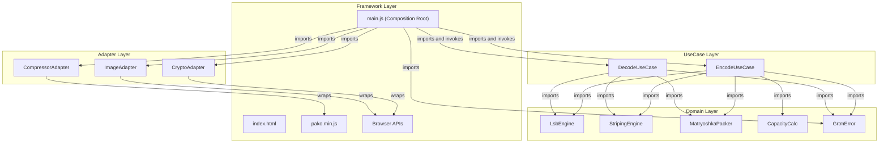
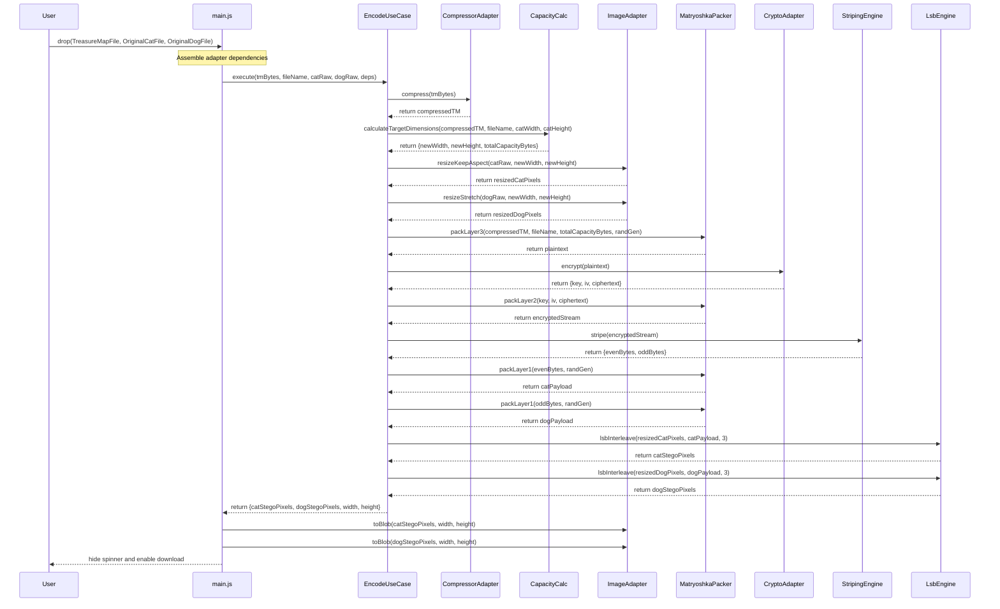
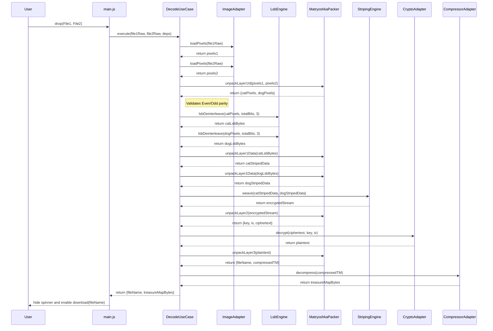
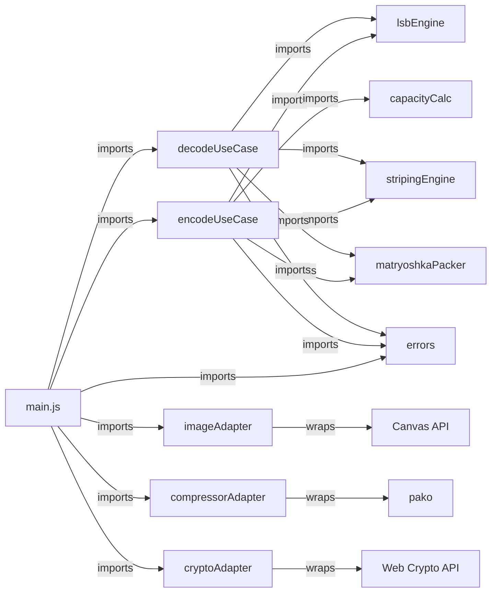

# GRTM2CD — Software Requirements Specification

## GoodRelax Treasure Map to Cat and Dog

**Version:** 0.6.0

**Date:** 2026-02-21

**Status:** Baselined

---

## 0. Story

Sometimes we find a treasure map and want to keep it secret.
What if the map were split in two, and a cat and a dog each kept a piece?
When we want to use the map, we have to call the cat and the dog.
This web page helps in situations like that.
Don’t worry—this web page works only on your computer, and your data is not sent to the web.

## 1. Background and Motivation

### 1.1 Problem Context

When a person possesses sensitive binary data — a treasure map, a private document, a secret key, or any confidential payload — and wishes to store or transmit it covertly, the act of carrying a file named `secret.bin` or `treasure_map.pdf` is itself a signal. The existence of the secret is revealed before its contents are ever inspected.

Steganography addresses this by hiding data inside innocent-looking carrier media. Existing OSS tools (OpenStego, stego-lsb, Steghide) solve the hiding problem but require server-side runtimes, command-line expertise, or surrender privacy by uploading data to a remote service. Furthermore, they often leave identifiable metadata signatures in the image.

### 1.2 Core Insight: Absolute Deniability

Any binary payload (Treasure Map) can be losslessly embedded into two ordinary images (Cat Image and Dog Image) using a "Matryoshka" encryption structure:

1. **Deniability:** The payload is encrypted with AES-256-GCM and the entire remaining LSB capacity is filled with random noise. Neither the Cat Image alone nor the Dog Image alone contains enough information to reconstruct the Treasure Map.
2. **Signature Removal:** By encrypting the compressed stream and the original metadata (filename), standard file signatures are completely destroyed. To an observer, the LSBs are mathematically indistinguishable from pure white noise.
3. **Self-Decrypting Pair:** The AES key and IV are stored within the split carriers. If you have both the Cat Image and the Dog Image, you have the map.

### 1.3 Why Two Images?

Splitting across two carriers serves two critical purposes:

1. **Capacity:** Each carrier needs to hold only half the payload, halving the minimum required carrier resolution.
2. **Cryptographic Striping:** By alternating bytes between two images after AES encryption, even standard cipher block structures are fragmented. In isolation, a single carrier holds only "incomplete white noise," guaranteeing absolute mathematical deniability.

---

## 2. Goals and Non-Goals

### 2.1 Goals

| ID  | Goal                                                                                             |
| --- | ------------------------------------------------------------------------------------------------ |
| G-1 | Enable lossless recovery: bit-perfect.                                                           |
| G-2 | Preserve visual fidelity: Maintain aspect ratios and ensure LSB noise is practically invisible.  |
| G-3 | Zero server involvement: All processing in the user's browser.                                   |
| G-4 | Zero installation: Runs from a local HTML file, no build tools.                                  |
| G-5 | Metadata Protection: File names and sizes are encrypted and hidden within the LSB stream.        |
| G-6 | Support arbitrary binary Treasure Map: Not limited to images.                                    |
| G-7 | Signature Elimination: Complete removal of zlib magic numbers or fixed headers from the carrier. |

### 2.2 Non-Goals

| Non-Goal                   | Rationale                                                                                                            |
| -------------------------- | -------------------------------------------------------------------------------------------------------------------- |
| Manual Password Entry      | YAGNI. The system uses auto-generated one-time keys stored in the carriers for a seamless "Treasure Map" experience. |
| Resistance to steganalysis | LSB is detectable; the goal is to ensure that detected LSBs look like meaningless white noise.                       |
| Runtime PSNR validation    | YAGNI. Math guarantees baseline quality ($\text{PSNR} \geq 40\ \text{dB}$ at $n_{\text{lsb}} = 3$).                  |
| Mobile native app          | Browser is sufficient.                                                                                               |
| Multi-user / collaboration | YAGNI.                                                                                                               |

---

## 3. Constraints

| ID  | Constraint                                                                   | Source                                                          |
| --- | ---------------------------------------------------------------------------- | --------------------------------------------------------------- |
| C-1 | No network requests after page load                                          | Privacy requirement (G-3)                                       |
| C-2 | Output images MUST be PNG (lossless); no metadata in output                  | Technical necessity: JPEG DCT destroys LSBs. G-5.               |
| C-3 | $n_{\text{lsb}} = 3$ fixed                                                   | Max LSB that mathematically guarantees $\text{PSNR} \geq 40$ dB |
| C-4 | Dependencies: `pako.js` (compression) and Web Crypto API (native)            | KISS + offline operation                                        |
| C-5 | Single HTML file + `pako.min.js` (≈ 50 KB); no build tools                   | G-4                                                             |
| C-6 | ES Modules (`type="module"`); no transpiler                                  | G-4                                                             |
| C-7 | Browser support: Chrome 90+, Firefox 88+, Safari 16.4+ (iOS/macOS)           | OffscreenCanvas and Web Crypto requirements                     |
| C-8 | Max carrier image size: 16,777,216 pixels (iOS Safari limit)                 | Lowest common denominator across C-7 targets                    |
| C-9 | Accepted carrier input formats: JPEG, PNG, WebP, BMP, GIF (first frame only) | Canvas `drawImage` compatibility. SVG and AVIF excluded.        |

---

## 4. Mathematical Model (Matryoshka Structure)

### 4.1 Constants

| Constant Name           | Symbol           | Value      | Rationale                             |
| ----------------------- | ---------------- | ---------- | ------------------------------------- |
| LSB Depth               | $n_{\text{lsb}}$ | 3          | ADR-1. PSNR ≥ 40 dB guarantee         |
| Usable Channels         | $C$              | 3 (RGB)    | Alpha channel is skipped (always 255) |
| Snap Unit               | $S$              | 16 px      | ADR-16. Standard macroblock alignment |
| AES Key Size            |                  | 32 bytes   | AES-256                               |
| AES IV Size             |                  | 12 bytes   | GCM standard                          |
| AES Auth Tag Size       |                  | 16 bytes   | GCM standard                          |
| AES Overhead            | $O_{\text{aes}}$ | 60 bytes   | $32 + 12 + 16$                        |
| Carrier ID Size (total) | $O_{\text{id}}$  | 2 bytes    | 1 byte per carrier                    |
| Header Size             | $O_{\text{hdr}}$ | 5 bytes    | actualLen(4) + nameLen(1)             |
| Max Carrier Pixels      |                  | 16,777,216 | C-8. iOS Safari hardware limit        |
| Max Carrier Dimension   |                  | 4,096 px   | $\lfloor\sqrt{16{,}777{,}216}\rfloor$ |
| Max Filename Bytes      |                  | 255        | nameLen is 1 byte (uint8)             |

### 4.2 Information-Theoretic Capacity & 16-Pixel Snapping

Available embedding capacity per carrier ($H \times W$ pixels, $C = 3$ RGB channels, $n_{\text{lsb}} = 3$):

$$\text{availableBytes}(H, W) = \left\lfloor \frac{H \times W \times C \times n_{\text{lsb}}}{8} \right\rfloor = \left\lfloor \frac{H \times W \times 9}{8} \right\rfloor$$

Note: The carrier pixel data is RGBA (4 bytes per pixel) as returned by Canvas `getImageData()`. The Alpha channel is always skipped during LSB embedding; only the R, G, B channels are used.

To determine the minimum required carrier resolution, compute the total byte overhead across all three layers:

$$\text{minTotal} = O_{\text{hdr}} + \text{len}(\text{FileName}_{\text{utf8}}) + \text{len}(\text{CompressedTM}) + O_{\text{aes}} + O_{\text{id}}$$

$$= 5 + \text{len}(\text{FileName}_{\text{utf8}}) + \text{len}(\text{CompressedTM}) + 60 + 2$$

Each carrier must hold at least half of the total:

$$\text{bytesPerCarrier} = \left\lceil \frac{\text{minTotal}}{2} \right\rceil$$

The minimum number of pixels per carrier:

$$\text{minPixels} = \left\lceil \frac{\text{bytesPerCarrier} \times 8}{C \times n_{\text{lsb}}} \right\rceil = \left\lceil \frac{\text{bytesPerCarrier} \times 8}{9} \right\rceil$$

The image resize logic MUST scale the Original Cat Image while **maintaining its original aspect ratio**, then snap dimensions to 16-pixel boundaries (rounding up to guarantee capacity):

$$W_{\text{new}} = \left\lceil \frac{W_{\text{calc}}}{16} \right\rceil \times 16$$

$$H_{\text{new}} = \left\lceil \frac{H_{\text{calc}}}{16} \right\rceil \times 16$$

If $W_{\text{new}} \times H_{\text{new}} > 16{,}777{,}216$, raise `ERR_PAYLOAD_TOO_LARGE`.

The Original Dog Image is **stretched** to match $W_{\text{new}} \times H_{\text{new}}$ regardless of its original aspect ratio. If the Dog's original aspect ratio differs from the Cat's, the system displays a warning to the user.

### 4.3 Layered Data Structure

The system's security is achieved through three nested layers.

**Layer 3: Plaintext Payload (The Core)**

Determined by the total LSB capacity of the _resized_ carriers.

| Size      | Content         | Description                                                    |
| --------- | --------------- | -------------------------------------------------------------- |
| 4 bytes   | `actualLen`     | uint32 BE. Total length of (nameLen + FileName + CompressedTM) |
| 1 byte    | `nameLen`       | uint8. Byte length of original filename (max 255)              |
| Variable  | `FileName`      | UTF-8 encoded original filename                                |
| Variable  | `CompressedTM`  | Zlib-compressed Treasure Map payload                           |
| Remainder | `RandomPadding` | Cryptographically secure noise to fill 100% of capacity        |

**Layer 2: Encrypted Stream**

Layer 3 is encrypted via AES-256-GCM. The resulting stream is indistinguishable from white noise.

| Size     | Content      | Description                                   |
| -------- | ------------ | --------------------------------------------- |
| 32 bytes | `Key`        | One-time AES-256 key                          |
| 12 bytes | `IV`         | One-time Initialization Vector                |
| Variable | `Ciphertext` | Encrypted Layer 3 (includes 16-byte Auth Tag) |

**Layer 1: Carrier Embedding**

Layer 2 is striped (byte-interleaved) and embedded into the two carrier images.

| Size      | Content       | Description                                       |
| --------- | ------------- | ------------------------------------------------- |
| 1 byte    | `CarrierID`   | Random Even byte for Cat, Random Odd byte for Dog |
| Remainder | `StripedData` | Layer 2 bytes: even indices to Cat, odd to Dog    |

---

## 5. Architecture

### 5.1 Clean Architecture Overview

GRTM2CD follows Clean Architecture. The Dependency Rule is absolute:
**inner layers never import from outer layers.**

```text
 ┌─────────────────────────────────────────────────┐
 │  Framework                                      │  ← outermost
 │   ┌─────────────────────────────────────────┐   │
 │   │  Interface Adapters                     │   │
 │   │   ┌─────────────────────────────────┐   │   │
 │   │   │  Use Cases                      │   │   │
 │   │   │   ┌─────────────────────────┐   │   │   │
 │   │   │   │  Entities (Domain)      │   │   │   │  ← innermost
 │   │   │   │  Pure business rules    │   │   │   │
 │   │   │   └─────────────────────────┘   │   │   │
 │   │   └─────────────────────────────────┘   │   │
 │   └─────────────────────────────────────────┘   │
 └─────────────────────────────────────────────────┘
```

### 5.2 Clean Architecture Layer Map

**contents_name:**
ca_layer_map



UseCases orchestrate the entire business flow. They do **not** import Adapters directly. `main.js` injects Adapter instances into UseCases at invocation time.

### 5.3 Layer Responsibilities

| Layer              | Contents                                                                                   | Knows about           |
| ------------------ | ------------------------------------------------------------------------------------------ | --------------------- |
| Entities (Domain)  | `lsbEngine.js`, `stripingEngine.js`, `matryoshkaPacker.js`, `capacityCalc.js`, `errors.js` | Nothing               |
| Use Cases          | `encodeUseCase.js`, `decodeUseCase.js`                                                     | Domain only           |
| Interface Adapters | `compressorAdapter.js`, `imageAdapter.js`, `cryptoAdapter.js`                              | Domain (transitively) |
| Framework          | `index.html`, `main.js`, Browser APIs, `pako.min.js`                                       | All layers            |

### 5.4 Composition Root

`main.js` acts strictly as a **Composition Root**. Its responsibilities are:

1. Listen to DOM events (file drops, button clicks).
2. Gather raw inputs (file bytes, filenames).
3. Instantiate Adapters.
4. Invoke UseCases with injected Adapter dependencies.
5. Receive UseCase results and update the DOM (download links, error messages, spinner).
6. Catch `GrtmError` exceptions thrown by UseCases and display the corresponding error message.

---

## 6. Functional Requirements

### 6.1 Use Case: Encode

```text
Actor : User
Goal  : Hide a Treasure Map inside a Cat Image and a Dog Image with absolute deniability

Preconditions:
  - User has a Treasure Map file (any binary, > 0 bytes).
  - User has an Original Cat Image and an Original Dog Image.

Flow:
  1. User drops or selects the Treasure Map file.
     [Alt-E] File is 0 bytes → show ERR_EMPTY_PAYLOAD.
  2. System compresses the Treasure Map and displays the compressed size.
  3. User drops or selects the Original Cat Image and Original Dog Image.
     [Alt-F] File format not in accepted list (C-9) → show ERR_UNSUPPORTED_FORMAT.
  4. If the Original Dog Image aspect ratio differs from the Original Cat Image,
     the system displays a warning that the Dog Image will be stretched.
  5. If either carrier exceeds 16,777,216 pixels (C-8), system auto-downscales
     it (maintaining aspect ratio) to fit within the limit and displays a warning.
  6. System computes target dimensions (16px snap) based on the Cat Image aspect ratio.
     [Alt-A] Required dimensions exceed MAX_CARRIER_PIXELS → show ERR_PAYLOAD_TOO_LARGE
             with actual and maximum compressed sizes.
  7. System resizes the Cat Image (aspect-ratio preserved) and the Dog Image
     (stretched to match Cat dimensions).
  8. System encrypts payload, applies noise padding, stripes data, and embeds into LSBs.
  9. System hides spinner, shows previews, and enables download buttons.
     Output filenames: c_{OriginalCatFilename}.png and d_{OriginalDogFilename}.png.
     [Alt-G] Original filename exceeds 255 UTF-8 bytes → show ERR_FILENAME_TOO_LONG.

```

### 6.2 Use Case: Decode

```text
Actor : User
Goal  : Recover the Treasure Map from any two valid carrier images

Preconditions:
  - User has two PNG carrier images from the same encoding session.

Flow:
  1. User drops or selects two images into the Decode panel.
  2. System loads pixel data from both images.
  3. System reads the first byte (Carrier ID) from each image and validates Even/Odd parity.
     [Alt-A] Both IDs are even or both are odd → show ERR_HEADER_MISMATCH.
  4. System extracts all LSBs, reconstructs the Encrypted Stream, and decrypts via AES-GCM.
     [Alt-B] AES Auth Tag validation fails → show ERR_CRYPTO.
  5. System parses the plaintext, extracts original filename, and decompresses the Treasure Map.
     [Alt-C] Decompression fails → show ERR_DECOMPRESS.
  6. System hides spinner and enables Download button with the original filename restored.

```

### 6.3 Use Case: Size Reference Table

```text
Actor : User (passive)
Goal  : Understand carrier size requirements before starting

Flow:
  1. On page load, system renders the Reference Table in a collapsible help section.
  2. User reads the table to select appropriately sized carrier images.

```

---

## 7. Data Flow

### 7.1 Encode Data Flow

**contents_name:**
encode_data_flow



### 7.2 Decode Data Flow

**contents_name:**
decode_data_flow



---

## 8. Module Specifications

### 8.1 Domain Layer

#### 8.1.1 errors.js _(SRP: Domain error definitions)_

| Export      | Type  | Properties                        | Description                             |
| ----------- | ----- | --------------------------------- | --------------------------------------- |
| `GrtmError` | class | `code: string`, `message: string` | Extends `Error`. Domain-specific error. |

Error codes:

| Code                     | Thrown by         | Condition                                             |
| ------------------------ | ----------------- | ----------------------------------------------------- |
| `ERR_EMPTY_PAYLOAD`      | EncodeUseCase     | Treasure Map file is 0 bytes                          |
| `ERR_UNSUPPORTED_FORMAT` | ImageAdapter      | Carrier image format not in accepted list (C-9)       |
| `ERR_PAYLOAD_TOO_LARGE`  | EncodeUseCase     | Required dimensions exceed MAX_CARRIER_PIXELS         |
| `ERR_FILENAME_TOO_LONG`  | EncodeUseCase     | Original filename exceeds 255 UTF-8 bytes             |
| `ERR_HEADER_MISMATCH`    | DecodeUseCase     | Carrier ID parity check fails (both even or both odd) |
| `ERR_CRYPTO`             | CryptoAdapter     | AES-GCM Auth Tag validation fails                     |
| `ERR_DECOMPRESS`         | CompressorAdapter | pako.inflate throws                                   |

#### 8.1.2 lsbEngine.js _(SRP: bit-level LSB manipulation)_

| Function          | Signature                                                               | Contract                                                                                            |
| ----------------- | ----------------------------------------------------------------------- | --------------------------------------------------------------------------------------------------- |
| `lsbInterleave`   | `(carrier: Uint8Array, payload: Uint8Array, nLsb: number) → Uint8Array` | Pure. Input is RGBA pixel data (4 bytes/pixel). Writes to R, G, B only. Skips A. Returns new array. |
| `lsbDeinterleave` | `(stego: Uint8Array, numBits: number, nLsb: number) → Uint8Array`       | Pure. Reads from R, G, B channels only. Skips A. Returns extracted bytes.                           |

#### 8.1.3 stripingEngine.js _(SRP: byte-level array striping)_

| Function | Signature                                                              | Contract                                       |
| -------- | ---------------------------------------------------------------------- | ---------------------------------------------- |
| `stripe` | `(data: Uint8Array) → { evenBytes: Uint8Array, oddBytes: Uint8Array }` | Pure. Splits by alternating byte index.        |
| `weave`  | `(evenBytes: Uint8Array, oddBytes: Uint8Array) → Uint8Array`           | Pure. Merges arrays by alternating byte index. |

#### 8.1.4 matryoshkaPacker.js _(SRP: Matryoshka binary frame construction and parsing for all 3 layers)_

**Encode functions:**

| Function     | Signature                                                                                                  | Contract                                                                                                                    |
| ------------ | ---------------------------------------------------------------------------------------------------------- | --------------------------------------------------------------------------------------------------------------------------- |
| `packLayer3` | `(compressedTM: Uint8Array, fileName: string, totalCapacityBytes: number, randGen: Function) → Uint8Array` | Constructs Layer 3 frame: actualLen(4) + nameLen(1) + fileName + compressedTM + random padding. Uses `randGen` for padding. |
| `packLayer2` | `(key: Uint8Array, iv: Uint8Array, ciphertext: Uint8Array) → Uint8Array`                                   | Concatenates Key(32) + IV(12) + Ciphertext into a single buffer.                                                            |
| `packLayer1` | `(stripedData: Uint8Array, randGen: Function) → Uint8Array`                                                | Prepends a random Carrier ID byte. Even for Cat (first call), Odd for Dog (second call). Uses `randGen`.                    |

**Decode functions:**

| Function           | Signature                                                                                                                  | Contract                                                                                                                       |
| ------------------ | -------------------------------------------------------------------------------------------------------------------------- | ------------------------------------------------------------------------------------------------------------------------------ |
| `unpackLayer1Id`   | `(pixels1: Uint8Array, pixels2: Uint8Array, lsbDeinterleave: Function) → { catPixels: Uint8Array, dogPixels: Uint8Array }` | Reads Carrier ID from each image. Validates parity. Assigns Cat (even) and Dog (odd). Throws `ERR_HEADER_MISMATCH` on failure. |
| `unpackLayer1Data` | `(lsbBytes: Uint8Array) → Uint8Array`                                                                                      | Strips the 1-byte Carrier ID prefix, returns remaining striped data.                                                           |
| `unpackLayer2`     | `(encryptedStream: Uint8Array) → { key: Uint8Array, iv: Uint8Array, ciphertext: Uint8Array }`                              | Slices Key(0..31), IV(32..43), Ciphertext(44..).                                                                               |
| `unpackLayer3`     | `(plaintext: Uint8Array) → { fileName: string, compressedTM: Uint8Array }`                                                 | Parses actualLen, nameLen, extracts fileName and compressedTM.                                                                 |

Note on `packLayer1`: The function itself generates a random byte via `randGen`. The caller is responsible for ensuring the first call produces an **even** ID and the second call produces an **odd** ID, or the function handles this internally via a `isEven: boolean` parameter. The exact API is an implementation detail; the contract is that Cat always gets Even and Dog always gets Odd.

#### 8.1.5 capacityCalc.js _(SRP: carrier dimension and capacity mathematics)_

| Function                    | Signature                                                                                                                                                             | Contract                                                                                                                                             |
| --------------------------- | --------------------------------------------------------------------------------------------------------------------------------------------------------------------- | ---------------------------------------------------------------------------------------------------------------------------------------------------- |
| `calculateTargetDimensions` | `(compressedTMLength: number, fileNameByteLength: number, catWidth: number, catHeight: number) → { newWidth: number, newHeight: number, totalCapacityBytes: number }` | Pure. Computes minimum dimensions preserving Cat aspect ratio with 16px snap. Throws `ERR_PAYLOAD_TOO_LARGE` if result exceeds `MAX_CARRIER_PIXELS`. |
| `availableBytes`            | `(height: number, width: number) → number`                                                                                                                            | Pure. Returns $\lfloor H \times W \times 9 / 8 \rfloor$.                                                                                             |

**Domain Constants (exported):**

| Constant                 | Value      |
| ------------------------ | ---------- |
| `N_LSB`                  | 3          |
| `CHANNELS`               | 3          |
| `SNAP_UNIT`              | 16         |
| `MAX_CARRIER_PIXELS`     | 16,777,216 |
| `MAX_CARRIER_DIMENSION`  | 4,096      |
| `AES_OVERHEAD_BYTES`     | 60         |
| `CARRIER_ID_TOTAL_BYTES` | 2          |
| `HEADER_BYTES`           | 5          |
| `MAX_FILENAME_BYTES`     | 255        |

### 8.2 UseCase Layer

#### 8.2.1 encodeUseCase.js _(SRP: Encode business flow orchestration)_

**contents_name:**
encode_usecase_pseudo

```javascript
import { lsbInterleave } from "../domain/lsbEngine.js";
import { stripe } from "../domain/stripingEngine.js";
import {
  packLayer3,
  packLayer2,
  packLayer1,
} from "../domain/matryoshkaPacker.js";
import { calculateTargetDimensions } from "../domain/capacityCalc.js";
import { GrtmError } from "../domain/errors.js";

/**
 * @param {Object} params
 * @param {Uint8Array} params.tmBytes - Raw Treasure Map bytes (must be > 0)
 * @param {string} params.fileName - Original Treasure Map filename
 * @param {Uint8Array} params.catRaw - Original Cat Image raw file bytes
 * @param {Uint8Array} params.dogRaw - Original Dog Image raw file bytes
 * @param {number} params.catWidth - Original Cat Image width in pixels
 * @param {number} params.catHeight - Original Cat Image height in pixels
 * @param {Object} params.deps - Injected dependencies
 * @param {Object} params.deps.compressor - { compress(Uint8Array) → Uint8Array }
 * @param {Object} params.deps.imageAdapter - { resizeKeepAspect(...), resizeStretch(...) }
 * @param {Object} params.deps.cryptoAdapter - { encrypt(Uint8Array), getRandomValues(number) }
 * @returns {Promise<{catStegoPixels: Uint8Array, dogStegoPixels: Uint8Array, width: number, height: number}>}
 * @throws {GrtmError} ERR_EMPTY_PAYLOAD, ERR_PAYLOAD_TOO_LARGE, ERR_FILENAME_TOO_LONG
 */
export async function execute({
  tmBytes,
  fileName,
  catRaw,
  dogRaw,
  catWidth,
  catHeight,
  deps: { compressor, imageAdapter, cryptoAdapter },
}) {
  if (tmBytes.length === 0) {
    throw new GrtmError("ERR_EMPTY_PAYLOAD", "Treasure Map file is empty.");
  }

  const fileNameBytes = new TextEncoder().encode(fileName);
  if (fileNameBytes.length > 255) {
    throw new GrtmError(
      "ERR_FILENAME_TOO_LONG",
      "Filename exceeds 255 UTF-8 bytes.",
    );
  }

  // 1. Compress
  const compressedTM = await compressor.compress(tmBytes);

  // 2. Calculate target dimensions (may throw ERR_PAYLOAD_TOO_LARGE)
  const { newWidth, newHeight, totalCapacityBytes } = calculateTargetDimensions(
    compressedTM.length,
    fileNameBytes.length,
    catWidth,
    catHeight,
  );

  // 3. Resize carriers
  const resizedCatPixels = await imageAdapter.resizeKeepAspect(
    catRaw,
    newWidth,
    newHeight,
  );
  const resizedDogPixels = await imageAdapter.resizeStretch(
    dogRaw,
    newWidth,
    newHeight,
  );

  // 4. Layer 3: Pack plaintext with noise padding
  const randGen = cryptoAdapter.getRandomValues;
  const plaintext = packLayer3(
    compressedTM,
    fileName,
    totalCapacityBytes,
    randGen,
  );

  // 5. Layer 2: AES-256-GCM encryption
  const { key, iv, ciphertext } = await cryptoAdapter.encrypt(plaintext);
  const encryptedStream = packLayer2(key, iv, ciphertext);

  // 6. Layer 1: Stripe and add Carrier IDs
  const { evenBytes, oddBytes } = stripe(encryptedStream);
  const catPayload = packLayer1(evenBytes, true, randGen);
  const dogPayload = packLayer1(oddBytes, false, randGen);

  // 7. LSB embed
  const catStegoPixels = lsbInterleave(resizedCatPixels, catPayload, 3);
  const dogStegoPixels = lsbInterleave(resizedDogPixels, dogPayload, 3);

  return { catStegoPixels, dogStegoPixels, width: newWidth, height: newHeight };
}
```

#### 8.2.2 decodeUseCase.js _(SRP: Decode business flow orchestration)_

**contents_name:**
decode_usecase_pseudo

```javascript
import { lsbDeinterleave } from "../domain/lsbEngine.js";
import { weave } from "../domain/stripingEngine.js";
import {
  unpackLayer1Id,
  unpackLayer1Data,
  unpackLayer2,
  unpackLayer3,
} from "../domain/matryoshkaPacker.js";
import { GrtmError } from "../domain/errors.js";

/**
 * @param {Object} params
 * @param {Uint8Array} params.file1Raw - First dropped file (raw bytes)
 * @param {Uint8Array} params.file2Raw - Second dropped file (raw bytes)
 * @param {Object} params.deps - Injected dependencies
 * @param {Object} params.deps.imageAdapter - { loadPixels(Uint8Array) → {pixels, width, height} }
 * @param {Object} params.deps.cryptoAdapter - { decrypt(ciphertext, key, iv) → Uint8Array }
 * @param {Object} params.deps.compressor - { decompress(Uint8Array) → Uint8Array }
 * @returns {Promise<{fileName: string, treasureMapBytes: Uint8Array}>}
 * @throws {GrtmError} ERR_HEADER_MISMATCH, ERR_CRYPTO, ERR_DECOMPRESS
 */
export async function execute({
  file1Raw,
  file2Raw,
  deps: { imageAdapter, cryptoAdapter, compressor },
}) {
  // 1. Load pixel data
  const img1 = await imageAdapter.loadPixels(file1Raw);
  const img2 = await imageAdapter.loadPixels(file2Raw);

  // 2. Identify Cat and Dog by Carrier ID parity (may throw ERR_HEADER_MISMATCH)
  const { catPixels, dogPixels } = unpackLayer1Id(
    img1.pixels,
    img2.pixels,
    lsbDeinterleave,
  );

  // 3. Extract full LSB streams
  const catTotalBits = catPixels.length * 3;
  const dogTotalBits = dogPixels.length * 3;
  const catLsbBytes = lsbDeinterleave(catPixels, catTotalBits, 3);
  const dogLsbBytes = lsbDeinterleave(dogPixels, dogTotalBits, 3);

  // 4. Strip Carrier ID prefix
  const catStripedData = unpackLayer1Data(catLsbBytes);
  const dogStripedData = unpackLayer1Data(dogLsbBytes);

  // 5. Weave striped data back together
  const encryptedStream = weave(catStripedData, dogStripedData);

  // 6. Unpack Layer 2
  const { key, iv, ciphertext } = unpackLayer2(encryptedStream);

  // 7. Decrypt (may throw ERR_CRYPTO)
  const plaintext = await cryptoAdapter.decrypt(ciphertext, key, iv);

  // 8. Unpack Layer 3
  const { fileName, compressedTM } = unpackLayer3(plaintext);

  // 9. Decompress (may throw ERR_DECOMPRESS)
  const treasureMapBytes = await compressor.decompress(compressedTM);

  return { fileName, treasureMapBytes };
}
```

### 8.3 Adapter Layer (Interface Contracts)

#### 8.3.1 compressorAdapter.js

| Method       | Signature                         | Precondition         | Postcondition                                    | Throws           |
| ------------ | --------------------------------- | -------------------- | ------------------------------------------------ | ---------------- |
| `compress`   | `(data: Uint8Array) → Uint8Array` | `data.length > 0`    | Returns zlib-compressed bytes via `pako.deflate` | —                |
| `decompress` | `(data: Uint8Array) → Uint8Array` | `data` is valid zlib | Returns decompressed bytes via `pako.inflate`    | `ERR_DECOMPRESS` |

#### 8.3.2 imageAdapter.js

| Method             | Signature                                                                                                   | Precondition                | Postcondition                                                                  | Throws                   |
| ------------------ | ----------------------------------------------------------------------------------------------------------- | --------------------------- | ------------------------------------------------------------------------------ | ------------------------ |
| `loadPixels`       | `(fileBytes: Uint8Array) → Promise<{pixels: Uint8Array, width: number, height: number}>`                    | Valid image format (C-9)    | Returns RGBA Uint8Array + dimensions                                           | `ERR_UNSUPPORTED_FORMAT` |
| `resizeKeepAspect` | `(fileBytes: Uint8Array, targetW: number, targetH: number) → Promise<Uint8Array>`                           | Image loadable              | Returns RGBA pixels at target dimensions (aspect ratio preserved)              | —                        |
| `resizeStretch`    | `(fileBytes: Uint8Array, targetW: number, targetH: number) → Promise<Uint8Array>`                           | Image loadable              | Returns RGBA pixels at exact target dimensions (may distort)                   | —                        |
| `toBlob`           | `(pixels: Uint8Array, width: number, height: number) → Promise<Blob>`                                       | `pixels` is valid RGBA data | Returns PNG Blob with no metadata                                              | —                        |
| `downscaleToLimit` | `(fileBytes: Uint8Array, maxPixels: number) → Promise<{pixels: Uint8Array, width: number, height: number}>` | Valid image                 | Downscales if exceeding limit, preserving aspect ratio. No-op if within limit. | —                        |

#### 8.3.3 cryptoAdapter.js

| Method            | Signature                                                                                      | Precondition                                    | Postcondition                                                                                         | Throws       |
| ----------------- | ---------------------------------------------------------------------------------------------- | ----------------------------------------------- | ----------------------------------------------------------------------------------------------------- | ------------ |
| `encrypt`         | `(plaintext: Uint8Array) → Promise<{key: Uint8Array, iv: Uint8Array, ciphertext: Uint8Array}>` | `plaintext.length > 0`                          | Generates one-time key(32) and IV(12). Returns AES-256-GCM encrypted data with appended Auth Tag(16). | —            |
| `decrypt`         | `(ciphertext: Uint8Array, key: Uint8Array, iv: Uint8Array) → Promise<Uint8Array>`              | Valid key(32), iv(12), ciphertext with Auth Tag | Returns decrypted plaintext.                                                                          | `ERR_CRYPTO` |
| `getRandomValues` | `(length: number) → Uint8Array`                                                                | `length > 0`                                    | Returns cryptographically secure random bytes via `crypto.getRandomValues`.                           | —            |

---

## 9. File Structure

```text
grtm2cd/
├── index.html                # Markup + tab routing only.
└── js/
    ├── domain/
    │   ├── errors.js             # GrtmError class and error codes
    │   ├── lsbEngine.js          # Bit-level LSB interleave / deinterleave
    │   ├── stripingEngine.js     # Byte-level array striping / weaving
    │   ├── matryoshkaPacker.js   # Layer 1, 2, 3 frame construction / parsing
    │   └── capacityCalc.js       # Dimension calculation, constants, 16px snap
    ├── usecase/
    │   ├── encodeUseCase.js      # Encode business flow orchestrator
    │   └── decodeUseCase.js      # Decode business flow orchestrator
    ├── adapter/
    │   ├── compressorAdapter.js  # Wraps pako.deflate / pako.inflate
    │   ├── imageAdapter.js       # Wraps Canvas API / File API
    │   └── cryptoAdapter.js      # Wraps Web Crypto API
    ├── pako.min.js               # Local bundle (≈ 50 KB, MIT).
    └── main.js                   # Composition Root + DOM event handling
```

### 9.1 Dependency Graph

**contents_name:**
dependency_graph



UseCases import only from the Domain Layer. They receive Adapter instances at runtime via dependency injection from `main.js`, preserving strict layer isolation.

---

## 10. UI Specification

### 10.1 Layout

```text
┌──────────────────────────────────────────────────────────────────┐
│  GRTM2CD — GoodRelax Treasure Map to Cat and Dog                 │
│  [ Encode ]  [ Decode ]                           (tab selector) │
├──────────────────────────────────────────────────────────────────┤
│  [ENCODE TAB]                                                    │
│                                                                  │
│  Step 1: Drop your Treasure Map                                  │
│  ┌────────────────────────────────────────────────────────────┐  │
│  │  Drop Treasure Map here  (any file)    [or click to open]  │  │
│  └────────────────────────────────────────────────────────────┘  │
│  Treasure Map: secret.pdf  (1.2 MB → compressed 780 KB)          │
│                                                                  │
│  Step 2: Select carrier images  (Output will be PNG)             │
│  Accepted formats: JPEG, PNG, WebP, BMP, GIF                    │
│  Minimum required capacity: ≈ 832 × 832 px each                  │
│                                                                  │
│  ┌─────────────────────┐    ┌─────────────────────┐             │
│  │  Drop Cat Image     │    │  Drop Dog Image     │             │
│  │  here               │    │  here               │             │
│  └─────────────────────┘    └─────────────────────┘             │
│                                                                  │
│  ⟳ Encoding...                                (spinner)         │
│                                                                  │
│  ┌──────────────────┐    ┌──────────────────┐                   │
│  │  [Cat preview]   │    │  [Dog preview]   │                   │
│  │[Download         │    │[Download         │                   │
│  │ c_mycat.png]     │    │ d_mydog.png]     │                   │
│  └──────────────────┘    └──────────────────┘                   │
├──────────────────────────────────────────────────────────────────┤
│  [DECODE TAB]                                                    │
│                                                                  │
│  Drop any 2 carrier images (order and filenames do not matter)   │
│  ┌─────────────────────┐    ┌─────────────────────┐             │
│  │  Drop Image 1       │    │  Drop Image 2       │             │
│  └─────────────────────┘    └─────────────────────┘             │
│                                                                  │
│  ⟳ Decoding...                                (spinner)         │
│                                                                  │
│  [Download recovered: secret.pdf]                                │
├──────────────────────────────────────────────────────────────────┤
│  ▼ Reference: Required Carrier Size                              │
│                                                                  │
│  Compressed Payload    │  Minimum Carrier (each, square equiv.)  │
│  ─────────────────────────────────────────────────               │
│  10 KB                 │     80 × 80 px                          │
│  100 KB                │    224 × 224 px                         │
│  500 KB                │    480 × 480 px                         │
│  1 MB                  │    688 × 688 px                         │
│  5 MB                  │  1,536 × 1,536 px                      │
│  10 MB                 │  2,160 × 2,160 px                      │
│  35 MB                 │  4,048 × 4,048 px                      │
│                                                                  │
│  System maximum: ≈ 36 MB compressed payload                      │
│  (Carrier limit: 16,777,216 pixels per image)                    │
└──────────────────────────────────────────────────────────────────┘
```

### 10.2 Warnings

| Condition                                     | Message                                                                          |
| --------------------------------------------- | -------------------------------------------------------------------------------- |
| Dog Image aspect ratio differs from Cat Image | "Dog Image aspect ratio differs from Cat Image. Dog will be stretched to match." |
| Carrier image exceeds 16,777,216 pixels       | "Image exceeds maximum pixel count. It will be automatically downscaled."        |

### 10.3 Error Messages

| Error Code               | Condition                                | Message                                                                                                                 |
| ------------------------ | ---------------------------------------- | ----------------------------------------------------------------------------------------------------------------------- |
| `ERR_EMPTY_PAYLOAD`      | Treasure Map file is 0 bytes             | "Treasure Map file is empty. Please select a file with content."                                                        |
| `ERR_UNSUPPORTED_FORMAT` | Carrier image format not accepted        | "Unsupported image format. Accepted formats: JPEG, PNG, WebP, BMP, GIF."                                                |
| `ERR_PAYLOAD_TOO_LARGE`  | Required resolution exceeds system limit | "Compressed payload is {actual} MB but maximum supported size is approximately 36 MB. Reduce payload size."             |
| `ERR_FILENAME_TOO_LONG`  | Filename exceeds 255 UTF-8 bytes         | "Filename is too long ({actual} bytes). Maximum is 255 UTF-8 bytes."                                                    |
| `ERR_HEADER_MISMATCH`    | Carrier IDs parity check fails           | "Invalid pairing. Both images must belong to the same encoding session."                                                |
| `ERR_CRYPTO`             | AES Auth Tag validation fails            | "Decryption failed. Ensure both images are from the same encoding session and have not been modified or re-compressed." |
| `ERR_DECOMPRESS`         | pako.inflate throws                      | "Decompression failed. Data payload may be corrupt."                                                                    |

---

## 11. Key Design Decisions (ADR Summary)

| ID     | Decision                                   | Rationale                                                                                                                                                         |
| ------ | ------------------------------------------ | ----------------------------------------------------------------------------------------------------------------------------------------------------------------- |
| ADR-1  | $n_{\text{lsb}} = 3$ fixed                 | Maximum LSB depth satisfying $\text{PSNR} \geq 40$ dB. Removes user-facing knob. KISS.                                                                            |
| ADR-2  | _[Superseded by ADR-17]_                   | Originally: embed `compLen` in LSB Header. Replaced to eliminate magic numbers.                                                                                   |
| ADR-3  | Agnostic Input, PNG Output                 | User can drop JPEG/WebP/BMP/GIF. System draws to Canvas and exports strictly as PNG. SVG and AVIF excluded.                                                       |
| ADR-4  | Treasure Map is arbitrary binary           | Not limited to images. Widens applicability without implementation cost.                                                                                          |
| ADR-5  | pako.js local bundle                       | Zero CDN dependency. Consistent with zero-server privacy guarantee.                                                                                               |
| ADR-6  | OffscreenCanvas with Canvas fallback       | Safari 16.4+ supported natively; older Safari via synchronous Canvas fallback.                                                                                    |
| ADR-7  | Original filename encrypted                | Filename is metadata that can reveal the secret's nature. Must be encrypted inside Layer 3.                                                                       |
| ADR-8  | Domain layer is pure functions             | `Uint8Array in → Uint8Array out`. No DOM, no Browser API, no side effects. `randGen` injected as parameter.                                                       |
| ADR-9  | Vanilla JS, zero build tools               | G-4. Single HTML + JS files run directly from filesystem.                                                                                                         |
| ADR-10 | Interfaces as JSDoc contracts              | TypeScript not required at this scale. DIP enforced architecturally via Composition Root.                                                                         |
| ADR-11 | _[Refined by ADR-21]_                      | Originally: main.js orchestrates APIs. Now: UseCases orchestrate via injected dependencies.                                                                       |
| ADR-12 | Byte Striping (Interleaving)               | Fragments ciphertext across two files. Enhances physical and cryptographic deniability.                                                                           |
| ADR-13 | Removed Runtime PSNR                       | Math proves baseline quality. Scanning whole image arrays for UI display is wasteful (YAGNI).                                                                     |
| ADR-14 | Aspect Ratio Resizing (Cat-primary)        | Cat Image preserves its aspect ratio. Dog Image is stretched to match Cat dimensions. Avoids complexity of independent sizing. KISS.                              |
| ADR-15 | AES-GCM + Full Noise Padding               | Eliminates any statistical regularity in LSBs. The entire LSB capacity is filled, making the stream indistinguishable from white noise.                           |
| ADR-16 | 16-Pixel Snapping                          | Aligns resized images with standard MCU block sizes to avoid suspicion from unusual resolutions.                                                                  |
| ADR-17 | Random Parity Carrier IDs                  | Replaces fixed magic numbers (0x00/0x01) with random even/odd values to prevent pattern detection.                                                                |
| ADR-18 | Self-Decrypting Keys                       | Keys and IVs are stored within the paired carriers. Possessing both images = possessing the key.                                                                  |
| ADR-19 | MatryoshkaPacker as unified frame Entity   | All 3 layers' binary frame construction and parsing consolidated in one Domain Entity. "Matryoshka" name reflects nested structure. SRP: binary frame management. |
| ADR-20 | Canvas Hard-Limit via Domain Constant      | MAX_CARRIER_PIXELS = 16,777,216 defined as Domain constant (iOS Safari limit). No Browser API dependency for limit checking.                                      |
| ADR-21 | Composition Root with Dependency Injection | UseCases orchestrate the full business flow. `main.js` injects Adapters. Strict Clean Architecture adherence.                                                     |
| ADR-22 | Spinner instead of Progress Bar            | Processing completes within 5 seconds for realistic payloads (≤ 50 MB). Discrete step progress is YAGNI at this scale.                                            |
| ADR-23 | iOS Safari Support (C-8)                   | 16M pixel limit is the lowest common denominator across all C-7 target browsers. Practical payload limit (≈ 36 MB compressed) covers primary use cases.           |
| ADR-24 | Dog stretched to Cat aspect ratio          | When aspect ratios differ, Dog is stretched (not cropped) to match Cat dimensions. Warning displayed. KISS over crop logic.                                       |
| ADR-25 | Carrier auto-downscale                     | Images exceeding 16M pixels are automatically downscaled (aspect ratio preserved) rather than rejected. Better UX for smartphone photos.                          |

---

## 12. Open Issues

_No open issues remain at this revision._

---

## Revision History

| Version   | Date           | Changes                                                                                                                                                                                                                                                                                                                                                                                                                                                                                                                                                                                                                                                       |
| --------- | -------------- | ------------------------------------------------------------------------------------------------------------------------------------------------------------------------------------------------------------------------------------------------------------------------------------------------------------------------------------------------------------------------------------------------------------------------------------------------------------------------------------------------------------------------------------------------------------------------------------------------------------------------------------------------------------- |
| 0.1.0     | 2026-02-20     | Initial draft.                                                                                                                                                                                                                                                                                                                                                                                                                                                                                                                                                                                                                                                |
| 0.4.0     | 2026-02-21     | Added Clean Architecture layer design, pako integration, fixed $n_{\text{lsb}} = 3$.                                                                                                                                                                                                                                                                                                                                                                                                                                                                                                                                                                          |
| 0.5.1     | 2026-02-21     | Introduced Byte Striping, 5-byte LSB internal header, removed runtime PSNR, fixed aspect ratio logic.                                                                                                                                                                                                                                                                                                                                                                                                                                                                                                                                                         |
| 0.5.2     | 2026-02-21     | Upgraded to Matryoshka 3-Layer encryption. Replaced 5-byte headers with Random IDs + AES-GCM + full noise padding. Added 16-pixel snap.                                                                                                                                                                                                                                                                                                                                                                                                                                                                                                                       |
| 0.5.3     | 2026-02-21     | Merged architectural definitions, UI specs, and algorithms with cryptographic requirements. Finalized comprehensive English specification.                                                                                                                                                                                                                                                                                                                                                                                                                                                                                                                    |
| 0.5.4     | 2026-02-21     | Introduced MatryoshkaPacker for SLAP/SRP. Fixed DIP violation in CryptoAdapter. Renamed zip to weave. Added hardware-limit bounds checking.                                                                                                                                                                                                                                                                                                                                                                                                                                                                                                                   |
| 0.5.5     | 2026-02-21     | Applied Dependency Injection and Composition Root pattern. Moved orchestration logic from main.js to UseCases.                                                                                                                                                                                                                                                                                                                                                                                                                                                                                                                                                |
| **0.6.0** | **2026-02-21** | **Major revision. Restored missing math formulas. Consolidated MatryoshkaPacker to handle all 3 layers. Moved CapacityCalc to Domain Layer. Defined iOS Safari support (16M px limit). Added explicit Adapter interface contracts (JSDoc). Defined GrtmError and complete error handling strategy. Fixed Math.random() security violation. Unified naming conventions. Replaced progress bar with spinner (ADR-22). Added carrier input format restrictions (C-9). Added carrier auto-downscale (ADR-25). Added Dog-stretches-to-Cat aspect ratio policy (ADR-24). Recalculated Reference Table. Defined output filenames. Removed stale conversation text.** |

---

_End of Specification_
