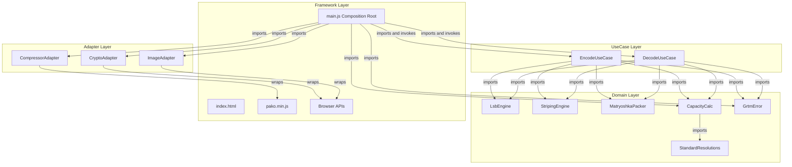
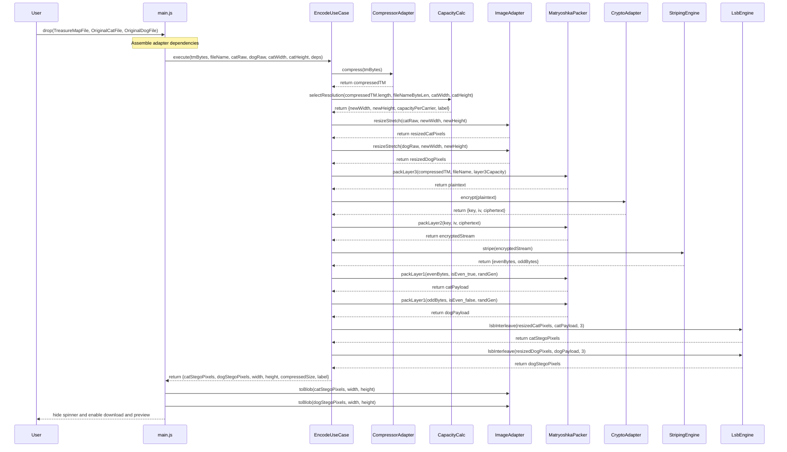
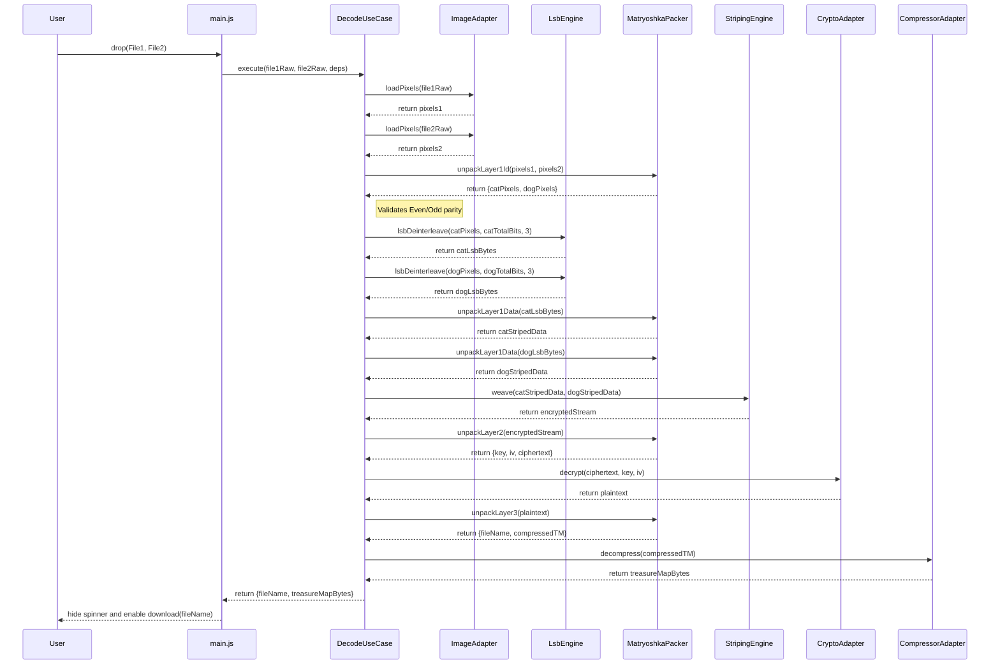
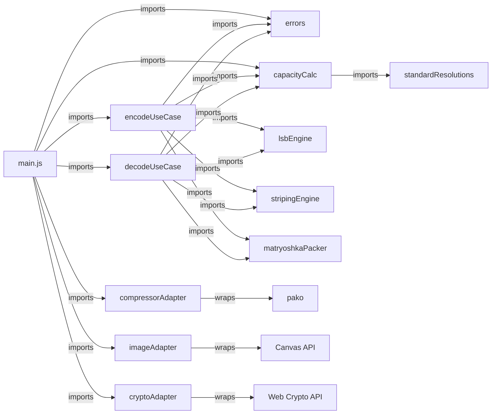

# GRTM2CD — Software Requirements Specification

## GoodRelax Treasure Map to Cat and Dog

**Version:** 0.7.3

**Date:** 2026-02-22

**Status:** Baselined

---

## 0. Story

Sometimes we find a treasure map and want to keep it secret.
What if the map were split in two, and a cat and a dog each kept a piece?
When we want to use the map, we have to call the cat and the dog.
This web page helps in situations like that.
Don't worry—this web page works only on your computer, and your data is not sent to the web.

## 1. Background and Motivation

### 1.1 Problem Context

When a person possesses sensitive binary data — a treasure map, a private document, a secret key, or any confidential payload — and wishes to store or transmit it covertly, the act of carrying a file named `secret.bin` or `treasure_map.pdf` is itself a signal. The existence of the secret is revealed before its contents are ever inspected.

Steganography addresses this by hiding data inside innocent-looking carrier media. Existing OSS tools (OpenStego, stego-lsb, Steghide) solve the hiding problem but require server-side runtimes, command-line expertise, or surrender privacy by uploading data to a remote service. Furthermore, they often leave identifiable metadata signatures in the image.

### 1.2 Core Insight: Absolute Deniability

Any binary payload (Treasure Map) can be losslessly embedded into two ordinary images (Cat Image and Dog Image) using a "Matryoshka" encryption structure:

1. **Deniability:** The payload is encrypted with AES-256-GCM and the entire remaining LSB capacity is filled with random noise. Neither the Cat Image alone nor the Dog Image alone contains enough information to reconstruct the Treasure Map.
2. **Signature Removal:** By encrypting the compressed stream and the original metadata (filename), standard file signatures are completely destroyed. To an observer, the LSBs are mathematically indistinguishable from pure white noise.
3. **Self-Decrypting Pair:** The AES key and IV are stored within the split carriers. If you have both the Cat Image and the Dog Image, you have the map.

### 1.3 Why Two Images?

Splitting across two carriers serves two critical purposes:

1. **Capacity:** Each carrier needs to hold only half the payload, halving the minimum required carrier resolution.
2. **Cryptographic Striping:** By alternating bytes between two images after AES encryption, even standard cipher block structures are fragmented. In isolation, a single carrier holds only "incomplete white noise," guaranteeing absolute mathematical deniability.

---

## 2. Goals and Non-Goals

### 2.1 Goals

| ID  | Goal                                                                                                                                                                                     |
| --- | ---------------------------------------------------------------------------------------------------------------------------------------------------------------------------------------- |
| G-1 | Enable lossless recovery: bit-perfect.                                                                                                                                                   |
| G-2 | Standard output dimensions: Output carrier images use well-known resolutions (e.g., 1920×1080, 640×480) to avoid suspicion from unusual image sizes.                                     |
| G-3 | Zero server involvement: All processing in the user's browser.                                                                                                                           |
| G-4 | Zero installation: Runs from a local HTML file, no build tools.                                                                                                                          |
| G-5 | Metadata Protection: File names and sizes are encrypted and hidden within the LSB stream.                                                                                                |
| G-6 | Support arbitrary binary Treasure Map: Not limited to images.                                                                                                                            |
| G-7 | Signature Elimination: Complete removal of zlib magic numbers or fixed headers from the carrier. The entire LSB capacity of both carriers is filled with cryptographically secure noise. |

### 2.2 Non-Goals

| Non-Goal                       | Rationale                                                                                                                                                              |
| ------------------------------ | ---------------------------------------------------------------------------------------------------------------------------------------------------------------------- |
| Manual Password Entry          | YAGNI. The system uses auto-generated one-time keys stored in the carriers for a seamless "Treasure Map" experience.                                                   |
| Resistance to steganalysis     | LSB is detectable; the goal is to ensure that detected LSBs look like meaningless white noise.                                                                         |
| Runtime PSNR validation        | YAGNI. Math guarantees baseline quality ($\text{PSNR} \geq 40\ \text{dB}$ at $n_{\text{lsb}} = 3$).                                                                    |
| Mobile native app              | Browser is sufficient.                                                                                                                                                 |
| Multi-user / collaboration     | YAGNI.                                                                                                                                                                 |
| Preserve original aspect ratio | Output dimensions are selected from a Standard Resolution Table. Cat and Dog images are stretched to the selected standard resolution. KISS over crop/letterbox logic. |
| 8K resolution output           | Exceeds MAX_CARRIER_PIXELS (C-8). Not supported.                                                                                                                       |

---

## 3. Constraints

| ID   | Constraint                                                                   | Source                                                          |
| ---- | ---------------------------------------------------------------------------- | --------------------------------------------------------------- |
| C-1  | No network requests after page load                                          | Privacy requirement (G-3)                                       |
| C-2  | Output images MUST be PNG (lossless); no metadata in output                  | Technical necessity: JPEG DCT destroys LSBs. G-5.               |
| C-3  | $n_{\text{lsb}} = 3$ fixed                                                   | Max LSB that mathematically guarantees $\text{PSNR} \geq 40$ dB |
| C-4  | Dependencies: `pako.js` (compression) and Web Crypto API (native)            | KISS + offline operation                                        |
| C-5  | Single HTML file + `pako.min.js` (≈ 50 KB); no build tools                   | G-4                                                             |
| C-6  | ES Modules (`type="module"`); no transpiler                                  | G-4                                                             |
| C-7  | Browser support: Chrome 90+, Firefox 88+, Safari 16.4+ (iOS/macOS)           | OffscreenCanvas and Web Crypto requirements                     |
| C-8  | Max carrier image size: 16,777,216 pixels (iOS Safari limit)                 | Lowest common denominator across C-7 targets                    |
| C-9  | Accepted carrier input formats: JPEG, PNG, WebP, BMP, GIF (first frame only) | Canvas `drawImage` compatibility. SVG and AVIF excluded.        |
| C-10 | Output dimensions MUST be a member of the Standard Resolution Table (§4.2)   | G-2. Ensures output images have common, recognizable sizes.     |

---

## 4. Mathematical Model (Matryoshka Structure)

### 4.1 Constants

| Constant Name           | Symbol           | Value      | Rationale                             |
| ----------------------- | ---------------- | ---------- | ------------------------------------- |
| LSB Depth               | $n_{\text{lsb}}$ | 3          | ADR-1. PSNR ≥ 40 dB guarantee         |
| Usable Channels         | $C$              | 3 (RGB)    | Alpha channel is skipped (always 255) |
| AES Key Size            |                  | 32 bytes   | AES-256                               |
| AES IV Size             |                  | 12 bytes   | GCM standard                          |
| AES Auth Tag Size       |                  | 16 bytes   | GCM standard                          |
| AES Overhead            | $O_{\text{aes}}$ | 60 bytes   | $32 + 12 + 16$                        |
| Carrier ID Size (total) | $O_{\text{id}}$  | 2 bytes    | 1 byte per carrier                    |
| Header Size             | $O_{\text{hdr}}$ | 5 bytes    | actualLen(4) + nameLen(1)             |
| Max Carrier Pixels      |                  | 16,777,216 | C-8. iOS Safari hardware limit        |
| Max Filename Bytes      |                  | 255        | nameLen is 1 byte (uint8)             |

Note: `Snap Unit` and `Max Carrier Dimension` from v0.6.0 have been removed. Output dimensions are now determined exclusively by the Standard Resolution Table (ADR-26).

### 4.2 Standard Resolution Table & Capacity

Available embedding capacity per carrier ($H \times W$ pixels, $C = 3$ RGB channels, $n_{\text{lsb}} = 3$):

$$\text{availableBytes}(H, W) = \left\lfloor \frac{H \times W \times C \times n_{\text{lsb}}}{8} \right\rfloor = \left\lfloor \frac{H \times W \times 9}{8} \right\rfloor$$

Note: The carrier pixel data is RGBA (4 bytes per pixel) as returned by Canvas `getImageData()`. The Alpha channel is always skipped during LSB embedding; only the R, G, B channels are used.

#### 4.2.1 Standard Resolution Table

The system defines a fixed table of well-known image resolutions. All output carrier images MUST use dimensions from this table (C-10). Entries are defined in landscape orientation (width ≥ height); portrait is obtained by swapping width and height (§4.2.3).

**4:3 Aspect Ratio Category** ($\text{AR} = 1.333$)

| Label       | Width | Height | Pixels     | Max Compressed Payload (approx.) |
| ----------- | ----- | ------ | ---------- | -------------------------------- |
| qVGA        | 320   | 240    | 76,800     | ≤ 169 KB                         |
| VGA         | 640   | 480    | 307,200    | ≤ 675 KB                         |
| SVGA        | 800   | 600    | 480,000    | ≤ 1.0 MB                         |
| XGA         | 1024  | 768    | 786,432    | ≤ 1.7 MB                         |
| UXGA        | 1600  | 1200   | 1,920,000  | ≤ 4.1 MB                         |
| QXGA        | 2048  | 1536   | 3,145,728  | ≤ 6.7 MB                         |
| iPhone 12MP | 4032  | 3024   | 12,192,768 | ≤ 26.2 MB                        |

**16:9 Aspect Ratio Category** ($\text{AR} = 1.778$)

| Label  | Width | Height | Pixels    | Max Compressed Payload (approx.) |
| ------ | ----- | ------ | --------- | -------------------------------- |
| 360p   | 640   | 360    | 230,400   | ≤ 506 KB                         |
| 720p   | 1280  | 720    | 921,600   | ≤ 2.0 MB                         |
| 1080p  | 1920  | 1080   | 2,073,600 | ≤ 4.4 MB                         |
| QHD    | 2560  | 1440   | 3,686,400 | ≤ 7.9 MB                         |
| 4K UHD | 3840  | 2160   | 8,294,400 | ≤ 17.8 MB                        |

**1:1 Aspect Ratio Category** ($\text{AR} = 1.000$)

| Label  | Width | Height | Pixels     | Max Compressed Payload (approx.) |
| ------ | ----- | ------ | ---------- | -------------------------------- |
| 256sq  | 256   | 256    | 65,536     | ≤ 144 KB                         |
| 512sq  | 512   | 512    | 262,144    | ≤ 576 KB                         |
| 1024sq | 1024  | 1024   | 1,048,576  | ≤ 2.2 MB                         |
| 2048sq | 2048  | 2048   | 4,194,304  | ≤ 9.0 MB                         |
| 4096sq | 4096  | 4096   | 16,777,216 | ≤ 36.0 MB                        |

Total: **17 entries** across 3 aspect ratio categories.

The "Max Compressed Payload" column is approximate, assuming a 20-byte filename. The exact capacity depends on the filename length and is computed at runtime.

#### 4.2.2 Aspect Ratio Category Selection

The system classifies the Original Cat Image's aspect ratio into one of three categories.

Define the normalized aspect ratio:

$$\text{normalizedAR} = \begin{cases} W_{\text{cat}} / H_{\text{cat}} & \text{if } W_{\text{cat}} \geq H_{\text{cat}} \\[4pt] H_{\text{cat}} / W_{\text{cat}} & \text{if } W_{\text{cat}} < H_{\text{cat}} \end{cases}$$

Define the category boundaries as the arithmetic mean of adjacent reference ratios:

$$B_{\text{low}} = \frac{1.000 + 4/3}{2} = 1.1\overline{6}$$

$$B_{\text{high}} = \frac{4/3 + 16/9}{2} = 1.5\overline{5}$$

Category assignment:

$$\text{arCategory} = \begin{cases} \text{1:1} & \text{if } \text{normalizedAR} < B_{\text{low}} \\[4pt] \text{4:3} & \text{if } B_{\text{low}} \leq \text{normalizedAR} < B_{\text{high}} \\[4pt] \text{16:9} & \text{if } \text{normalizedAR} \geq B_{\text{high}} \end{cases}$$

Portrait detection:

$$\text{portrait} = (W_{\text{cat}} < H_{\text{cat}})$$

#### 4.2.3 Resolution Selection Algorithm

Given the compressed payload and Cat Image dimensions, select the optimal standard resolution.

**Step 1: Compute required capacity per carrier.**

$$\text{minTotal} = O_{\text{hdr}} + \text{len}(\text{FileName}_{\text{utf8}}) + \text{len}(\text{CompressedTM}) + O_{\text{aes}} + O_{\text{id}}$$

$$\text{bytesPerCarrier} = \left\lceil \frac{\text{minTotal}}{2} \right\rceil$$

**Step 2: Determine AR category and portrait flag** (§4.2.2).

**Step 3: Filter candidates.**

From the Standard Resolution Table, select all entries where:

- The entry belongs to the determined AR category, AND
- $\text{availableBytes}(H, W) \geq \text{bytesPerCarrier}$

If no candidates remain, throw `ERR_PAYLOAD_TOO_LARGE`.

**Step 4: Select the best entry.**

Among candidates, select the entry with the smallest pixel count.
(This guarantees the most compact output while still holding the payload.)

**Step 5: Apply portrait orientation.**

If $\text{portrait} = \text{true}$, swap the selected entry's width and height:

$$W_{\text{new}} = H_{\text{entry}}, \quad H_{\text{new}} = W_{\text{entry}}$$

Otherwise:

$$W_{\text{new}} = W_{\text{entry}}, \quad H_{\text{new}} = H_{\text{entry}}$$

**Step 6: Return results.**

$$\text{capacityPerCarrier} = \text{availableBytes}(H_{\text{entry}}, W_{\text{entry}})$$

Return $\{ W_{\text{new}},\ H_{\text{new}},\ \text{capacityPerCarrier},\ \text{label} \}$.

If $W_{\text{new}} \times H_{\text{new}} > 16{,}777{,}216$, raise `ERR_PAYLOAD_TOO_LARGE`.

**Note on `layer3Capacity`**: `capacityPerCarrier` is the embedding capacity of ONE carrier. The caller (`encodeUseCase`) MUST compute the Layer 3 frame size as:

$$\text{layer3Capacity} = 2 \times \text{capacityPerCarrier} - O_{\text{aes}} - O_{\text{id}} = 2 \times \text{capacityPerCarrier} - 62$$

This guarantees that the encrypted stream exactly fills both carriers to 100% capacity (G-7, ADR-15, ADR-28). Verification:

$$\text{encryptedStream} = 44 + \text{layer3Capacity} + 16 = 44 + (2 \times \text{capacityPerCarrier} - 62) + 16 = 2 \times \text{capacityPerCarrier} - 2$$

After striping: each side $= \text{capacityPerCarrier} - 1$ bytes. After `packLayer1` (adds 1-byte Carrier ID): each carrier payload $= \text{capacityPerCarrier}$ bytes $=$ exact carrier capacity. ✓

#### 4.2.4 Carrier Resize Policy

Both the Cat Image and the Dog Image are **stretched** to the selected standard resolution $W_{\text{new}} \times H_{\text{new}}$. This may change the aspect ratio of both images. The system always displays the selected resolution as a notification (ADR-26, ADR-29).

### 4.3 Layered Data Structure

The system's security is achieved through three nested layers.

**Layer 3: Plaintext Payload (The Core)**

Determined by the total LSB capacity of the _resized_ carriers. The frame size is `layer3Capacity` bytes (§4.2.3).

| Size      | Content        | Description                                                                                                                          |
| --------- | -------------- | ------------------------------------------------------------------------------------------------------------------------------------ |
| 4 bytes   | `actualLen`    | uint32 BE. Total length of (nameLen + FileName + CompressedTM)                                                                       |
| 1 byte    | `nameLen`      | uint8. Byte length of original filename (max 255)                                                                                    |
| Variable  | `FileName`     | UTF-8 encoded original filename                                                                                                      |
| Variable  | `CompressedTM` | Zlib-compressed Treasure Map payload                                                                                                 |
| Remainder | `ZeroPadding`  | Zero bytes to fill 100% of `layer3Capacity`. <br> AES-GCM encryption renders these statistically indistinguishable from white noise. |

**Layer 2: Encrypted Stream**

Layer 3 is encrypted via AES-256-GCM. The resulting stream is indistinguishable from white noise.

| Size     | Content      | Description                                   |
| -------- | ------------ | --------------------------------------------- |
| 32 bytes | `Key`        | One-time AES-256 key                          |
| 12 bytes | `IV`         | One-time Initialization Vector                |
| Variable | `Ciphertext` | Encrypted Layer 3 (includes 16-byte Auth Tag) |

**Layer 1: Carrier Embedding**

Layer 2 is striped (byte-interleaved) and embedded into the two carrier images.

| Size      | Content       | Description                                       |
| --------- | ------------- | ------------------------------------------------- |
| 1 byte    | `CarrierID`   | Random Even byte for Cat, Random Odd byte for Dog |
| Remainder | `StripedData` | Layer 2 bytes: even indices to Cat, odd to Dog    |

---

## 5. Architecture

### 5.1 Clean Architecture Overview

GRTM2CD follows Clean Architecture. The Dependency Rule is absolute:
**inner layers never import from outer layers.**

```text
 ┌─────────────────────────────────────────────────┐
 │  Framework                                      │  ← outermost
 │   ┌─────────────────────────────────────────┐   │
 │   │  Interface Adapters                     │   │
 │   │   ┌─────────────────────────────────┐   │   │
 │   │   │  Use Cases                      │   │   │
 │   │   │   ┌─────────────────────────┐   │   │   │
 │   │   │   │  Entities (Domain)      │   │   │   │  ← innermost
 │   │   │   │  Pure business rules    │   │   │   │
 │   │   │   └─────────────────────────┘   │   │   │
 │   │   └─────────────────────────────────┘   │   │
 │   └─────────────────────────────────────────┘   │
 └─────────────────────────────────────────────────┘
```

### 5.2 Clean Architecture Layer Map

**contents_name:**
ca_layer_map



UseCases orchestrate the entire business flow. They do **not** import Adapters directly. `main.js` injects Adapter instances into UseCases at invocation time.

### 5.3 Layer Responsibilities

| Layer              | Contents                                                                                                             | Knows about           |
| ------------------ | -------------------------------------------------------------------------------------------------------------------- | --------------------- |
| Entities (Domain)  | `lsbEngine.js`, `stripingEngine.js`, `matryoshkaPacker.js`, `capacityCalc.js`, `standardResolutions.js`, `errors.js` | Nothing               |
| Use Cases          | `encodeUseCase.js`, `decodeUseCase.js`                                                                               | Domain only           |
| Interface Adapters | `compressorAdapter.js`, `imageAdapter.js`, `cryptoAdapter.js`                                                        | Domain (transitively) |
| Framework          | `index.html`, `main.js`, Browser APIs, `pako.min.js`                                                                 | All layers            |

### 5.4 Composition Root

`main.js` acts strictly as a **Composition Root**. Its responsibilities are:

1. Listen to DOM events (file drops, button clicks).
2. Gather raw inputs (file bytes, filenames).
3. Instantiate Adapters.
4. Invoke UseCases with injected Adapter dependencies.
5. Receive UseCase results and update the DOM (download links, error messages, spinner).
6. Catch `GrtmError` exceptions thrown by UseCases and display the corresponding error message.
7. After Treasure Map drop, call `compressor.compress` and `capacityCalc.findMinimumEntry` directly to display the compressed size and the minimum required resolution hint (§6.1 Step 2). This is the only place where `main.js` uses a domain function outside of UseCase invocation.

---

## 6. Functional Requirements

### 6.1 Use Case: Encode

```text
Actor : User
Goal  : Hide a Treasure Map inside a Cat Image and a Dog Image with absolute deniability

Preconditions:
  - User has a Treasure Map file (any binary, > 0 bytes).
  - User has an Original Cat Image and an Original Dog Image.

Flow:
  1. User drops or selects the Treasure Map file.
     [Alt-E] File is 0 bytes → show ERR_EMPTY_PAYLOAD.
  2. System compresses the Treasure Map (via compressor.compress), displays the compressed
     size, and calls findMinimumEntry to display the minimum required resolution across all
     AR categories (e.g., "Required: ≥ XGA"). If findMinimumEntry returns null, the payload
     is already too large; show ERR_PAYLOAD_TOO_LARGE.
  3. User drops or selects the Original Cat Image and Original Dog Image.
     [Alt-F] File format not in accepted list (C-9) → show ERR_UNSUPPORTED_FORMAT.
  4. If either carrier exceeds 16,777,216 pixels (C-8), system auto-downscales
     it (maintaining aspect ratio) to fit within the limit and displays a warning.
  5. System selects a standard resolution from the Standard Resolution Table
     based on the Cat Image aspect ratio and required payload capacity (§4.2.3).
     [Alt-A] No entry in the table can hold the payload → show ERR_PAYLOAD_TOO_LARGE
             with actual and maximum compressed sizes.
  6. System displays the selected standard resolution label and dimensions as a
     notification: "Output: {label} ({W}×{H}) — Both images will be stretched
     to this resolution."
  7. System stretches the Cat Image and the Dog Image to the selected
     standard resolution dimensions.
  8. System encrypts payload, applies noise padding, stripes data, and embeds into LSBs.
  9. System hides spinner, shows previews of the output carrier images, and enables
     download buttons.
     Output filenames: c_{OriginalCatFilename}.png and d_{OriginalDogFilename}.png.
     [Alt-G] Original filename exceeds 255 UTF-8 bytes → show ERR_FILENAME_TOO_LONG.

```

### 6.2 Use Case: Decode

```text
Actor : User
Goal  : Recover the Treasure Map from any two valid carrier images

Preconditions:
  - User has two PNG carrier images from the same encoding session.

Flow:
  1. User drops or selects two images into the Decode panel.
  2. System loads pixel data from both images.
  3. System reads the first byte (Carrier ID) from each image and validates Even/Odd parity.
     [Alt-A] Both IDs are even or both are odd → show ERR_HEADER_MISMATCH.
  4. System extracts all LSBs, reconstructs the Encrypted Stream, and decrypts via AES-GCM.
     [Alt-B] AES Auth Tag validation fails → show ERR_CRYPTO.
  5. System parses the plaintext, extracts original filename, and decompresses the Treasure Map.
     [Alt-C] Decompression fails → show ERR_DECOMPRESS.
  6. System hides spinner and enables Download button with the original filename restored.

```

### 6.3 Use Case: Size Reference Table

```text
Actor : User (passive)
Goal  : Understand carrier size requirements before starting

Flow:
  1. On page load, system renders the Standard Resolution Table in a collapsible help section.
  2. User reads the table to select appropriately sized carrier images.

```

---

## 7. Data Flow

### 7.1 Encode Data Flow

**contents_name:**
encode_data_flow



### 7.2 Decode Data Flow

**contents_name:**
decode_data_flow



---

## 8. Module Specifications

### 8.1 Domain Layer

#### 8.1.1 errors.js _(SRP: Domain error definitions)_

| Export      | Type  | Properties                        | Description                             |
| ----------- | ----- | --------------------------------- | --------------------------------------- |
| `GrtmError` | class | `code: string`, `message: string` | Extends `Error`. Domain-specific error. |

Error codes:

| Code                     | Thrown by         | Condition                                               |
| ------------------------ | ----------------- | ------------------------------------------------------- |
| `ERR_EMPTY_PAYLOAD`      | EncodeUseCase     | Treasure Map file is 0 bytes                            |
| `ERR_UNSUPPORTED_FORMAT` | ImageAdapter      | Carrier image format not in accepted list (C-9)         |
| `ERR_PAYLOAD_TOO_LARGE`  | CapacityCalc      | No Standard Resolution Table entry can hold the payload |
| `ERR_FILENAME_TOO_LONG`  | EncodeUseCase     | Original filename exceeds 255 UTF-8 bytes               |
| `ERR_HEADER_MISMATCH`    | DecodeUseCase     | Carrier ID parity check fails (both even or both odd)   |
| `ERR_CRYPTO`             | CryptoAdapter     | AES-GCM Auth Tag validation fails                       |
| `ERR_DECOMPRESS`         | CompressorAdapter | pako.inflate throws                                     |

#### 8.1.2 lsbEngine.js _(SRP: bit-level LSB manipulation)_

| Function          | Signature                                                               | Contract                                                                                            |
| ----------------- | ----------------------------------------------------------------------- | --------------------------------------------------------------------------------------------------- |
| `lsbInterleave`   | `(carrier: Uint8Array, payload: Uint8Array, nLsb: number) → Uint8Array` | Pure. Input is RGBA pixel data (4 bytes/pixel). Writes to R, G, B only. Skips A. Returns new array. |
| `lsbDeinterleave` | `(stego: Uint8Array, numBits: number, nLsb: number) → Uint8Array`       | Pure. Reads from R, G, B channels only. Skips A. Returns `⌊numBits / 8⌋` extracted bytes.           |

#### 8.1.3 stripingEngine.js _(SRP: byte-level array striping)_

| Function | Signature                                                              | Contract                                       |
| -------- | ---------------------------------------------------------------------- | ---------------------------------------------- |
| `stripe` | `(data: Uint8Array) → { evenBytes: Uint8Array, oddBytes: Uint8Array }` | Pure. Splits by alternating byte index.        |
| `weave`  | `(evenBytes: Uint8Array, oddBytes: Uint8Array) → Uint8Array`           | Pure. Merges arrays by alternating byte index. |

#### 8.1.4 matryoshkaPacker.js _(SRP: Matryoshka binary frame construction and parsing for all 3 layers)_

**Encode functions:**

| Function     | Signature                                                                           | Contract                                                                                                                                                                                                                                        |
| ------------ | ----------------------------------------------------------------------------------- | ----------------------------------------------------------------------------------------------------------------------------------------------------------------------------------------------------------------------------------------------- |
| `packLayer3` | `(compressedTM: Uint8Array, fileName: string, layer3Capacity: number) → Uint8Array` | Constructs Layer 3 frame: actualLen(4) + nameLen(1) + fileName + compressedTM + zero padding. Total size = `layer3Capacity`. <br> Padding is zero-filled; AES-GCM encryption makes the output statistically indistinguishable from white noise. |
| `packLayer2` | `(key: Uint8Array, iv: Uint8Array, ciphertext: Uint8Array) → Uint8Array`            | Concatenates Key(32) + IV(12) + Ciphertext into a single buffer.                                                                                                                                                                                |
| `packLayer1` | `(stripedData: Uint8Array, isEven: boolean, randGen: Function) → Uint8Array`        | Prepends a random Carrier ID byte of the specified parity. `isEven = true` for Cat (even byte), `isEven = false` for Dog (odd byte). Uses `randGen`.                                                                                            |

**Decode functions:**

| Function           | Signature                                                                                                                  | Contract                                                                                                                       |
| ------------------ | -------------------------------------------------------------------------------------------------------------------------- | ------------------------------------------------------------------------------------------------------------------------------ |
| `unpackLayer1Id`   | `(pixels1: Uint8Array, pixels2: Uint8Array, lsbDeinterleave: Function) → { catPixels: Uint8Array, dogPixels: Uint8Array }` | Reads Carrier ID from each image. Validates parity. Assigns Cat (even) and Dog (odd). Throws `ERR_HEADER_MISMATCH` on failure. |
| `unpackLayer1Data` | `(lsbBytes: Uint8Array) → Uint8Array`                                                                                      | Strips the 1-byte Carrier ID prefix, returns remaining striped data.                                                           |
| `unpackLayer2`     | `(encryptedStream: Uint8Array) → { key: Uint8Array, iv: Uint8Array, ciphertext: Uint8Array }`                              | Slices Key(0..31), IV(32..43), Ciphertext(44..).                                                                               |
| `unpackLayer3`     | `(plaintext: Uint8Array) → { fileName: string, compressedTM: Uint8Array }`                                                 | Parses actualLen, nameLen, extracts fileName and compressedTM.                                                                 |

Note on `packLayer1`: The function generates a random byte via `randGen` and enforces the specified parity. When `isEven = true`, the generated byte is guaranteed to be even (Carrier ID for Cat); when `isEven = false`, it is guaranteed to be odd (Carrier ID for Dog). The contract is absolute: Cat always gets an Even Carrier ID, Dog always gets an Odd Carrier ID.

#### 8.1.5 standardResolutions.js _(SRP: Standard Resolution Table data)_

This module exports the Standard Resolution Table as a frozen array of resolution entry objects. It contains **data only** — no logic, no functions. This separation follows SRP: the table data is independent of the selection algorithm in `capacityCalc.js`.

| Export                 | Type                                                   | Description                                   |
| ---------------------- | ------------------------------------------------------ | --------------------------------------------- |
| `STANDARD_RESOLUTIONS` | `ReadonlyArray<{w: number, h: number, label: string}>` | Frozen array of 17 entries in landscape form. |

Each entry has the following shape:

| Property | Type   | Description                                     |
| -------- | ------ | ----------------------------------------------- |
| `w`      | number | Width in pixels (landscape, i.e., `w >= h`)     |
| `h`      | number | Height in pixels                                |
| `label`  | string | Human-readable label (e.g., `"1080p"`, `"VGA"`) |

The array is ordered by pixel count ascending within each AR category. The AR category of each entry is derived at runtime from `w / h` — it is NOT stored as a property (DRY: AR is computable from w and h).

#### 8.1.6 capacityCalc.js _(SRP: carrier dimension and capacity mathematics)_

| Function           | Signature                                                                                                                                                                            | Contract                                                                                                                                                                                                                                                                            |
| ------------------ | ------------------------------------------------------------------------------------------------------------------------------------------------------------------------------------ | ----------------------------------------------------------------------------------------------------------------------------------------------------------------------------------------------------------------------------------------------------------------------------------- |
| `selectResolution` | `(compressedTMLength: number, fileNameByteLength: number, catWidth: number, catHeight: number) → { newWidth: number, newHeight: number, capacityPerCarrier: number, label: string }` | Pure. Selects the optimal Standard Resolution Table entry per §4.2.3. Applies portrait swap. Throws `ERR_PAYLOAD_TOO_LARGE` if no entry can hold the payload.                                                                                                                       |
| `availableBytes`   | `(height: number, width: number) → number`                                                                                                                                           | Pure. Returns $\lfloor H \times W \times 9 / 8 \rfloor$.                                                                                                                                                                                                                            |
| `findMinimumEntry` | `(bytesPerCarrier: number) → { w: number, h: number, label: string } \| null`                                                                                                        | Pure. Scans all 17 Standard Resolution Table entries (all AR categories). Returns the entry with the smallest pixel count where `availableBytes(h, w) >= bytesPerCarrier`, or `null` if none qualifies. Does NOT throw. Used by `main.js` for the pre-carrier-drop "Required" hint. |

**Exported values:**

| Export                 | Type                                                   | Description                                                                                                                                                         |
| ---------------------- | ------------------------------------------------------ | ------------------------------------------------------------------------------------------------------------------------------------------------------------------- |
| `STANDARD_RESOLUTIONS` | `ReadonlyArray<{w: number, h: number, label: string}>` | Re-exported from `standardResolutions.js`. Exposed for `main.js` to render the Standard Resolution Table without importing `standardResolutions.js` directly (LOD). |

**Domain Constants (exported):**

| Constant                 | Value                       |
| ------------------------ | --------------------------- |
| `N_LSB`                  | 3                           |
| `CHANNELS`               | 3                           |
| `MAX_CARRIER_PIXELS`     | 16,777,216                  |
| `AES_OVERHEAD_BYTES`     | 60                          |
| `CARRIER_ID_TOTAL_BYTES` | 2                           |
| `HEADER_BYTES`           | 5                           |
| `MAX_FILENAME_BYTES`     | 255                         |
| `AR_BOUNDARY_LOW`        | 1.1667 ($(1 + 4/3) / 2$)    |
| `AR_BOUNDARY_HIGH`       | 1.5556 ($(4/3 + 16/9) / 2$) |

Note: `SNAP_UNIT` and `MAX_CARRIER_DIMENSION` have been removed (ADR-26). `STANDARD_RESOLUTIONS` is imported from `standardResolutions.js` and re-exported for `main.js` access (SRP, SoC, LOD).

### 8.2 UseCase Layer

#### 8.2.1 encodeUseCase.js _(SRP: Encode business flow orchestration)_

**contents_name:**
encode_usecase_pseudo

```javascript
import { lsbInterleave } from "../domain/lsbEngine.js";
import { stripe } from "../domain/stripingEngine.js";
import {
  packLayer3,
  packLayer2,
  packLayer1,
} from "../domain/matryoshkaPacker.js";
import {
  selectResolution,
  AES_OVERHEAD_BYTES,
  CARRIER_ID_TOTAL_BYTES,
} from "../domain/capacityCalc.js";
import { GrtmError } from "../domain/errors.js";

/**
 * @param {Object} params
 * @param {Uint8Array} params.tmBytes - Raw Treasure Map bytes (must be > 0)
 * @param {string} params.fileName - Original Treasure Map filename
 * @param {Uint8Array} params.catRaw - Original Cat Image raw file bytes
 * @param {Uint8Array} params.dogRaw - Original Dog Image raw file bytes
 * @param {number} params.catWidth - Original Cat Image width in pixels (after downscale if applied)
 * @param {number} params.catHeight - Original Cat Image height in pixels (after downscale if applied)
 * @param {Object} params.deps - Injected dependencies
 * @param {Object} params.deps.compressor - { compress(Uint8Array) → Uint8Array }
 * @param {Object} params.deps.imageAdapter - { resizeStretch(...) }
 * @param {Object} params.deps.cryptoAdapter - { encrypt(Uint8Array), getRandomValues(number) }
 * @returns {Promise<{catStegoPixels: Uint8Array, dogStegoPixels: Uint8Array, width: number, height: number, compressedSize: number, label: string}>}
 * @throws {GrtmError} ERR_EMPTY_PAYLOAD, ERR_PAYLOAD_TOO_LARGE, ERR_FILENAME_TOO_LONG
 */
export async function execute({
  tmBytes,
  fileName,
  catRaw,
  dogRaw,
  catWidth,
  catHeight,
  deps: { compressor, imageAdapter, cryptoAdapter },
}) {
  if (tmBytes.length === 0) {
    throw new GrtmError("ERR_EMPTY_PAYLOAD", "Treasure Map file is empty.");
  }

  const fileNameBytes = new TextEncoder().encode(fileName);
  if (fileNameBytes.length > 255) {
    throw new GrtmError(
      "ERR_FILENAME_TOO_LONG",
      "Filename exceeds 255 UTF-8 bytes.",
    );
  }

  // 1. Compress
  const compressedTM = compressor.compress(tmBytes);

  // 2. Select standard resolution (may throw ERR_PAYLOAD_TOO_LARGE)
  const { newWidth, newHeight, capacityPerCarrier, label } = selectResolution(
    compressedTM.length,
    fileNameBytes.length,
    catWidth,
    catHeight,
  );

  // 3. Stretch both carriers to selected standard resolution
  const resizedCatPixels = await imageAdapter.resizeStretch(
    catRaw,
    newWidth,
    newHeight,
  );
  const resizedDogPixels = await imageAdapter.resizeStretch(
    dogRaw,
    newWidth,
    newHeight,
  );

  // 4. Layer 3: Pack plaintext with noise padding.
  // layer3Capacity fills exactly both carriers to 100% capacity (§4.2.3, ADR-28).
  const layer3Capacity =
    2 * capacityPerCarrier - AES_OVERHEAD_BYTES - CARRIER_ID_TOTAL_BYTES;
  const plaintext = packLayer3(compressedTM, fileName, layer3Capacity);

  // 5. Layer 2: AES-256-GCM encryption
  const { key, iv, ciphertext } = await cryptoAdapter.encrypt(plaintext);
  const encryptedStream = packLayer2(key, iv, ciphertext);

  // 6. Layer 1: Stripe and add Carrier IDs
  const { evenBytes, oddBytes } = stripe(encryptedStream);
  const catPayload = packLayer1(evenBytes, true, randGen);
  const dogPayload = packLayer1(oddBytes, false, randGen);

  // 7. LSB embed
  const catStegoPixels = lsbInterleave(resizedCatPixels, catPayload, 3);
  const dogStegoPixels = lsbInterleave(resizedDogPixels, dogPayload, 3);

  return {
    catStegoPixels,
    dogStegoPixels,
    width: newWidth,
    height: newHeight,
    compressedSize: compressedTM.length,
    label,
  };
}
```

#### 8.2.2 decodeUseCase.js _(SRP: Decode business flow orchestration)_

**contents_name:**
decode_usecase_pseudo

```javascript
import { lsbDeinterleave } from "../domain/lsbEngine.js";
import { weave } from "../domain/stripingEngine.js";
import {
  unpackLayer1Id,
  unpackLayer1Data,
  unpackLayer2,
  unpackLayer3,
} from "../domain/matryoshkaPacker.js";
import { N_LSB, CHANNELS } from "../domain/capacityCalc.js";
import { GrtmError } from "../domain/errors.js";

/**
 * @param {Object} params
 * @param {Uint8Array} params.file1Raw - First dropped file (raw bytes)
 * @param {Uint8Array} params.file2Raw - Second dropped file (raw bytes)
 * @param {Object} params.deps - Injected dependencies
 * @param {Object} params.deps.imageAdapter - { loadPixels(Uint8Array) → {pixels, width, height} }
 * @param {Object} params.deps.cryptoAdapter - { decrypt(ciphertext, key, iv) → Uint8Array }
 * @param {Object} params.deps.compressor - { decompress(Uint8Array) → Uint8Array }
 * @returns {Promise<{fileName: string, treasureMapBytes: Uint8Array}>}
 * @throws {GrtmError} ERR_HEADER_MISMATCH, ERR_CRYPTO, ERR_DECOMPRESS
 */
export async function execute({
  file1Raw,
  file2Raw,
  deps: { imageAdapter, cryptoAdapter, compressor },
}) {
  // 1. Load pixel data
  const img1 = await imageAdapter.loadPixels(file1Raw);
  const img2 = await imageAdapter.loadPixels(file2Raw);

  // 2. Identify Cat and Dog by Carrier ID parity (may throw ERR_HEADER_MISMATCH)
  const { catPixels, dogPixels } = unpackLayer1Id(
    img1.pixels,
    img2.pixels,
    lsbDeinterleave,
  );

  // 3. Extract full LSB streams.
  // numBits = (number of pixels) × CHANNELS × N_LSB = total bits in RGB channels.
  // lsbDeinterleave returns floor(numBits / 8) bytes = availableBytes(H, W) per carrier.
  const catTotalBits = Math.floor(catPixels.length / 4) * CHANNELS * N_LSB;
  const dogTotalBits = Math.floor(dogPixels.length / 4) * CHANNELS * N_LSB;
  const catLsbBytes = lsbDeinterleave(catPixels, catTotalBits, N_LSB);
  const dogLsbBytes = lsbDeinterleave(dogPixels, dogTotalBits, N_LSB);

  // 4. Strip Carrier ID prefix
  const catStripedData = unpackLayer1Data(catLsbBytes);
  const dogStripedData = unpackLayer1Data(dogLsbBytes);

  // 5. Weave striped data back together.
  // Result length = 2 × capacityPerCarrier − 2 = exact encryptedStream length (§4.2.3).
  const encryptedStream = weave(catStripedData, dogStripedData);

  // 6. Unpack Layer 2
  const { key, iv, ciphertext } = unpackLayer2(encryptedStream);

  // 7. Decrypt (may throw ERR_CRYPTO)
  const plaintext = await cryptoAdapter.decrypt(ciphertext, key, iv);

  // 8. Unpack Layer 3
  const { fileName, compressedTM } = unpackLayer3(plaintext);

  // 9. Decompress (may throw ERR_DECOMPRESS)
  const treasureMapBytes = compressor.decompress(compressedTM);

  return { fileName, treasureMapBytes };
}
```

### 8.3 Adapter Layer (Interface Contracts)

#### 8.3.1 compressorAdapter.js

| Method       | Signature                         | Precondition         | Postcondition                                    | Throws           |
| ------------ | --------------------------------- | -------------------- | ------------------------------------------------ | ---------------- |
| `compress`   | `(data: Uint8Array) → Uint8Array` | `data.length > 0`    | Returns zlib-compressed bytes via `pako.deflate` | —                |
| `decompress` | `(data: Uint8Array) → Uint8Array` | `data` is valid zlib | Returns decompressed bytes via `pako.inflate`    | `ERR_DECOMPRESS` |

#### 8.3.2 imageAdapter.js

| Method             | Signature                                                                                                                        | Precondition                | Postcondition                                                                                                                                                              | Throws                   |
| ------------------ | -------------------------------------------------------------------------------------------------------------------------------- | --------------------------- | -------------------------------------------------------------------------------------------------------------------------------------------------------------------------- | ------------------------ |
| `loadPixels`       | `(fileBytes: Uint8Array) → Promise<{pixels: Uint8Array, width: number, height: number}>`                                         | Valid image format (C-9)    | Returns RGBA Uint8Array + dimensions                                                                                                                                       | `ERR_UNSUPPORTED_FORMAT` |
| `resizeStretch`    | `(fileBytes: Uint8Array, targetW: number, targetH: number) → Promise<Uint8Array>`                                                | Image loadable              | Returns RGBA pixels at exact target dimensions (may distort)                                                                                                               | —                        |
| `toBlob`           | `(pixels: Uint8Array, width: number, height: number) → Promise<Blob>`                                                            | `pixels` is valid RGBA data | Returns PNG Blob with no metadata                                                                                                                                          | —                        |
| `downscaleToLimit` | `(fileBytes: Uint8Array, maxPixels: number) → Promise<{pixels: Uint8Array, width: number, height: number, downscaled: boolean}>` | Valid image                 | Downscales if exceeding limit (aspect ratio preserved), no-op if within limit. `pixels` are used for output preview in UI. `downscaled` flag drives the downscale warning. | —                        |

Note: `resizeKeepAspect` has been removed. Both Cat and Dog images are now stretched to the selected standard resolution via `resizeStretch` (ADR-26).

#### 8.3.3 cryptoAdapter.js

| Method            | Signature                                                                                      | Precondition                                    | Postcondition                                                                                         | Throws       |
| ----------------- | ---------------------------------------------------------------------------------------------- | ----------------------------------------------- | ----------------------------------------------------------------------------------------------------- | ------------ |
| `encrypt`         | `(plaintext: Uint8Array) → Promise<{key: Uint8Array, iv: Uint8Array, ciphertext: Uint8Array}>` | `plaintext.length > 0`                          | Generates one-time key(32) and IV(12). Returns AES-256-GCM encrypted data with appended Auth Tag(16). | —            |
| `decrypt`         | `(ciphertext: Uint8Array, key: Uint8Array, iv: Uint8Array) → Promise<Uint8Array>`              | Valid key(32), iv(12), ciphertext with Auth Tag | Returns decrypted plaintext.                                                                          | `ERR_CRYPTO` |
| `getRandomValues` | `(length: number) → Uint8Array`                                                                | `length > 0`                                    | Returns cryptographically secure random bytes via `crypto.getRandomValues`.                           | —            |

---

## 9. File Structure

```text
grtm2cd/
├── index.html                # Markup + tab routing only.
└──assets/
    └── js/
        ├── domain/
        │   ├── errors.js               # GrtmError class and error codes
        │   ├── lsbEngine.js            # Bit-level LSB interleave / deinterleave
        │   ├── stripingEngine.js       # Byte-level array striping / weaving
        │   ├── matryoshkaPacker.js     # Layer 1, 2, 3 frame construction / parsing
        │   ├── standardResolutions.js  # Standard Resolution Table (data only)
        │   └── capacityCalc.js         # Resolution selection, capacity math, constants
        ├── usecase/
        │   ├── encodeUseCase.js        # Encode business flow orchestrator
        │   └── decodeUseCase.js        # Decode business flow orchestrator
        ├── adapter/
        │   ├── compressorAdapter.js    # Wraps pako.deflate / pako.inflate
        │   ├── imageAdapter.js         # Wraps Canvas API / File API
        │   └── cryptoAdapter.js        # Wraps Web Crypto API
        ├── pako.min.js                 # Local bundle (≈ 50 KB, MIT).
        └── main.js                     # Composition Root + DOM event handling
```

### 9.1 Dependency Graph

**contents_name:**
dependency_graph



UseCases import only from the Domain Layer. They receive Adapter instances at runtime via dependency injection from `main.js`, preserving strict layer isolation.

---

## 10. UI Specification

### 10.1 Layout

```text
┌──────────────────────────────────────────────────────────────────┐
│  GRTM2CD — GoodRelax Treasure Map to Cat and Dog                 │
│  [ Encode ]  [ Decode ]                           (tab selector) │
├──────────────────────────────────────────────────────────────────┤
│  [ENCODE TAB]                                                    │
│                                                                  │
│  Step 1: Drop your Treasure Map                                  │
│  ┌────────────────────────────────────────────────────────────┐  │
│  │  Drop Treasure Map here  (any file)    [or click to open]  │  │
│  └────────────────────────────────────────────────────────────┘  │
│  Treasure Map: secret.pdf  (1.2 MB → compressed 780 KB)          │
│  Required: ≥ XGA (1024×768)                                      │
│                                                                  │
│  Step 2: Select carrier images  (Output will be PNG)             │
│  Accepted formats: JPEG, PNG, WebP, BMP, GIF                    │
│                                                                  │
│  ┌─────────────────────┐    ┌─────────────────────┐             │
│  │  Drop Cat Image     │    │  Drop Dog Image     │             │
│  │  here               │    │  here               │             │
│  └─────────────────────┘    └─────────────────────┘             │
│                                                                  │
│  Output: 1080p (1920×1080) — Both images will be stretched.      │
│  ⟳ Encoding...                                (spinner)         │
│                                                                  │
│  ┌──────────────────┐    ┌──────────────────┐                   │
│  │  [Cat preview]   │    │  [Dog preview]   │                   │
│  │[Download         │    │[Download         │                   │
│  │ c_mycat.png]     │    │ d_mydog.png]     │                   │
│  └──────────────────┘    └──────────────────┘                   │
├──────────────────────────────────────────────────────────────────┤
│  [DECODE TAB]                                                    │
│                                                                  │
│  Drop any 2 carrier images (order and filenames do not matter)   │
│  ┌─────────────────────┐    ┌─────────────────────┐             │
│  │  Drop Image 1       │    │  Drop Image 2       │             │
│  └─────────────────────┘    └─────────────────────┘             │
│                                                                  │
│  ⟳ Decoding...                                (spinner)         │
│                                                                  │
│  [Download recovered: secret.pdf]                                │
├──────────────────────────────────────────────────────────────────┤
│  ▼ Reference: Standard Resolution Table                          │
│                                                                  │
│  4:3          │ 16:9         │ 1:1                               │
│  ─────────────┼──────────────┼──────────                         │
│  qVGA  320×240│ 360p  640×360│ 256sq  256×256                    │
│  VGA   640×480│ 720p 1280×720│ 512sq  512×512                    │
│  SVGA  800×600│ 1080p1920×..│ 1024sq 1024×1024                  │
│  XGA  1024×768│ QHD  2560×..│ 2048sq 2048×2048                  │
│  UXGA 1600×.. │ 4KUHD3840×..│ 4096sq 4096×4096                  │
│  QXGA 2048×.. │              │                                   │
│  iPhone  4032×│              │                                   │
│               │              │                                   │
│  Portrait sizes available (W and H swapped)                      │
│  System maximum: ≈ 36 MB compressed payload                      │
│  (Carrier limit: 16,777,216 pixels per image)                    │
└──────────────────────────────────────────────────────────────────┘
```

### 10.2 Notifications and Warnings

| Condition                                                   | Type         | Message                                                                         |
| ----------------------------------------------------------- | ------------ | ------------------------------------------------------------------------------- |
| Standard resolution is selected (always shown, encode flow) | Notification | "Output: {label} ({W}×{H}) — Both images will be stretched to this resolution." |
| Carrier image exceeds 16,777,216 pixels                     | Warning      | "Image exceeds maximum pixel count. It will be automatically downscaled."       |

Note: The stretch notification is always displayed once a standard resolution has been selected (ADR-29). Because both images are always stretched to the selected dimensions (ADR-24), the notification is unconditional and informs the user of the output dimensions before encoding begins.

### 10.3 Error Messages

| Error Code               | Condition                         | Message                                                                                                                 |
| ------------------------ | --------------------------------- | ----------------------------------------------------------------------------------------------------------------------- |
| `ERR_EMPTY_PAYLOAD`      | Treasure Map file is 0 bytes      | "Treasure Map file is empty. Please select a file with content."                                                        |
| `ERR_UNSUPPORTED_FORMAT` | Carrier image format not accepted | "Unsupported image format. Accepted formats: JPEG, PNG, WebP, BMP, GIF."                                                |
| `ERR_PAYLOAD_TOO_LARGE`  | No Standard Resolution entry fits | "Compressed payload is {actual} MB but maximum supported size is approximately 36 MB. Reduce payload size."             |
| `ERR_FILENAME_TOO_LONG`  | Filename exceeds 255 UTF-8 bytes  | "Filename is too long ({actual} bytes). Maximum is 255 UTF-8 bytes."                                                    |
| `ERR_HEADER_MISMATCH`    | Carrier IDs parity check fails    | "Invalid pairing. Both images must belong to the same encoding session."                                                |
| `ERR_CRYPTO`             | AES Auth Tag validation fails     | "Decryption failed. Ensure both images are from the same encoding session and have not been modified or re-compressed." |
| `ERR_DECOMPRESS`         | pako.inflate throws               | "Decompression failed. Data payload may be corrupt."                                                                    |

---

## 11. Key Design Decisions (ADR Summary)

| ID     | Decision                                       | Rationale                                                                                                                                                                                                                                                                                                                                                                                                                                  |
| ------ | ---------------------------------------------- | ------------------------------------------------------------------------------------------------------------------------------------------------------------------------------------------------------------------------------------------------------------------------------------------------------------------------------------------------------------------------------------------------------------------------------------------ |
| ADR-1  | $n_{\text{lsb}} = 3$ fixed                     | Maximum LSB depth satisfying $\text{PSNR} \geq 40$ dB. Removes user-facing knob. KISS.                                                                                                                                                                                                                                                                                                                                                     |
| ADR-2  | _[Superseded by ADR-17]_                       | Originally: embed `compLen` in LSB Header. Replaced to eliminate magic numbers.                                                                                                                                                                                                                                                                                                                                                            |
| ADR-3  | Agnostic Input, PNG Output                     | User can drop JPEG/WebP/BMP/GIF. System draws to Canvas and exports strictly as PNG. SVG and AVIF excluded.                                                                                                                                                                                                                                                                                                                                |
| ADR-4  | Treasure Map is arbitrary binary               | Not limited to images. Widens applicability without implementation cost.                                                                                                                                                                                                                                                                                                                                                                   |
| ADR-5  | pako.js local bundle                           | Zero CDN dependency. Consistent with zero-server privacy guarantee.                                                                                                                                                                                                                                                                                                                                                                        |
| ADR-6  | OffscreenCanvas with Canvas fallback           | Safari 16.4+ supported natively; older Safari via synchronous Canvas fallback.                                                                                                                                                                                                                                                                                                                                                             |
| ADR-7  | Original filename encrypted                    | Filename is metadata that can reveal the secret's nature. Must be encrypted inside Layer 3.                                                                                                                                                                                                                                                                                                                                                |
| ADR-8  | Domain layer is pure functions                 | `Uint8Array in → Uint8Array out`. No DOM, no Browser API, no side effects. `randGen` injected as parameter.                                                                                                                                                                                                                                                                                                                                |
| ADR-9  | Vanilla JS, zero build tools                   | G-4. Single HTML + JS files run directly from filesystem.                                                                                                                                                                                                                                                                                                                                                                                  |
| ADR-10 | Interfaces as JSDoc contracts                  | TypeScript not required at this scale. DIP enforced architecturally via Composition Root.                                                                                                                                                                                                                                                                                                                                                  |
| ADR-11 | _[Refined by ADR-21]_                          | Originally: main.js orchestrates APIs. Now: UseCases orchestrate via injected dependencies.                                                                                                                                                                                                                                                                                                                                                |
| ADR-12 | Byte Striping (Interleaving)                   | Fragments ciphertext across two files. Enhances physical and cryptographic deniability.                                                                                                                                                                                                                                                                                                                                                    |
| ADR-13 | Removed Runtime PSNR                           | Math proves baseline quality. Scanning whole image arrays for UI display is wasteful (YAGNI).                                                                                                                                                                                                                                                                                                                                              |
| ADR-14 | _[Superseded by ADR-26]_                       | Originally: Cat Image preserves aspect ratio. Now: both images stretch to standard resolution.                                                                                                                                                                                                                                                                                                                                             |
| ADR-15 | AES-GCM + Full Noise Padding                   | Eliminates any statistical regularity in LSBs. The entire LSB capacity of both carriers is filled, making the stream indistinguishable from white noise. Achieved via `layer3Capacity = 2 × capacityPerCarrier − 62` (ADR-28).                                                                                                                                                                                                             |
| ADR-16 | _[Superseded by ADR-26]_                       | Originally: 16-pixel snapping for MCU alignment. Now: Standard Resolution Table makes snapping unnecessary; output sizes are inherently well-known.                                                                                                                                                                                                                                                                                        |
| ADR-17 | Random Parity Carrier IDs                      | Replaces fixed magic numbers (0x00/0x01) with random even/odd values to prevent pattern detection.                                                                                                                                                                                                                                                                                                                                         |
| ADR-18 | Self-Decrypting Keys                           | Keys and IVs are stored within the paired carriers. Possessing both images = possessing the key.                                                                                                                                                                                                                                                                                                                                           |
| ADR-19 | MatryoshkaPacker as unified frame Entity       | All 3 layers' binary frame construction and parsing consolidated in one Domain Entity. "Matryoshka" name reflects nested structure. SRP: binary frame management.                                                                                                                                                                                                                                                                          |
| ADR-20 | Canvas Hard-Limit via Domain Constant          | MAX_CARRIER_PIXELS = 16,777,216 defined as Domain constant (iOS Safari limit). No Browser API dependency for limit checking.                                                                                                                                                                                                                                                                                                               |
| ADR-21 | Composition Root with Dependency Injection     | UseCases orchestrate the full business flow. `main.js` injects Adapters. Strict Clean Architecture adherence.                                                                                                                                                                                                                                                                                                                              |
| ADR-22 | Spinner instead of Progress Bar                | Processing completes within 5 seconds for realistic payloads (≤ 50 MB). Discrete step progress is YAGNI at this scale.                                                                                                                                                                                                                                                                                                                     |
| ADR-23 | iOS Safari Support (C-8)                       | 16M pixel limit is the lowest common denominator across all C-7 target browsers. Practical payload limit (≈ 36 MB compressed) covers primary use cases.                                                                                                                                                                                                                                                                                    |
| ADR-24 | Both images stretched to standard resolution   | Both Cat and Dog images are stretched to the selected standard resolution. Simplifies resize logic to a single `resizeStretch` method. KISS.                                                                                                                                                                                                                                                                                               |
| ADR-25 | Carrier auto-downscale                         | Images exceeding 16M pixels are automatically downscaled (aspect ratio preserved) rather than rejected. Better UX for smartphone photos. `downscaleToLimit` returns `pixels` (used for output preview) and `downscaled: boolean` (drives warning display).                                                                                                                                                                                 |
| ADR-26 | Standard Resolution Table (replaces 16px snap) | Output dimensions are selected from a fixed table of 17 well-known resolutions (3 AR categories: 4:3, 16:9, 1:1) instead of computed via 16px snapping. Produces recognizable image sizes (e.g., 1080p, VGA, 4K UHD). Table data separated into `standardResolutions.js` (SRP, SoC). Selection algorithm in `capacityCalc.js`. Supersedes ADR-14 and ADR-16.                                                                               |
| ADR-27 | standardResolutions.js as data-only module     | The Standard Resolution Table is a pure data module with no logic (SRP). `capacityCalc.js` imports it and provides the selection algorithm (SoC). AR category is derived from `w/h` at runtime (DRY).                                                                                                                                                                                                                                      |
| ADR-28 | `layer3Capacity` computed in encodeUseCase     | `selectResolution` returns `capacityPerCarrier` (one carrier's natural capacity). `encodeUseCase` computes `layer3Capacity = 2 × capacityPerCarrier − AES_OVERHEAD_BYTES − CARRIER_ID_TOTAL_BYTES`. This ensures both carriers are filled to exactly 100% capacity (G-7, ADR-15), and the decode process reconstructs the encrypted stream exactly without truncation. SoC: resolution selection does not need to know about AES overhead. |
| ADR-29 | Stretch notification always shown              | Since both images are always stretched to the selected standard resolution (ADR-24), a conditional aspect-ratio-based warning would fire on nearly every encode. Changed to an unconditional notification ("Output: {label} — Both images will be stretched.") shown whenever a resolution is selected. Avoids warning fatigue; POLA.                                                                                                      |

---

## 12. Open Issues

_No open issues remain at this revision._

---

## Revision History

| Version   | Date           | Changes                                                                                                                                                                                                                                                                                                                                                                                                                                                                                                                                                                                                                                                                                                                                                                                                                                                                                                                                                                                                                                                                                                                                                                                                                                                                                                                                                                                                                       |
| --------- | -------------- | ----------------------------------------------------------------------------------------------------------------------------------------------------------------------------------------------------------------------------------------------------------------------------------------------------------------------------------------------------------------------------------------------------------------------------------------------------------------------------------------------------------------------------------------------------------------------------------------------------------------------------------------------------------------------------------------------------------------------------------------------------------------------------------------------------------------------------------------------------------------------------------------------------------------------------------------------------------------------------------------------------------------------------------------------------------------------------------------------------------------------------------------------------------------------------------------------------------------------------------------------------------------------------------------------------------------------------------------------------------------------------------------------------------------------------- |
| 0.1.0     | 2026-02-20     | Initial draft.                                                                                                                                                                                                                                                                                                                                                                                                                                                                                                                                                                                                                                                                                                                                                                                                                                                                                                                                                                                                                                                                                                                                                                                                                                                                                                                                                                                                                |
| 0.4.0     | 2026-02-21     | Added Clean Architecture layer design, pako integration, fixed $n_{\text{lsb}} = 3$.                                                                                                                                                                                                                                                                                                                                                                                                                                                                                                                                                                                                                                                                                                                                                                                                                                                                                                                                                                                                                                                                                                                                                                                                                                                                                                                                          |
| 0.5.1     | 2026-02-21     | Introduced Byte Striping, 5-byte LSB internal header, removed runtime PSNR, fixed aspect ratio logic.                                                                                                                                                                                                                                                                                                                                                                                                                                                                                                                                                                                                                                                                                                                                                                                                                                                                                                                                                                                                                                                                                                                                                                                                                                                                                                                         |
| 0.5.2     | 2026-02-21     | Upgraded to Matryoshka 3-Layer encryption. Replaced 5-byte headers with Random IDs + AES-GCM + full noise padding. Added 16-pixel snap.                                                                                                                                                                                                                                                                                                                                                                                                                                                                                                                                                                                                                                                                                                                                                                                                                                                                                                                                                                                                                                                                                                                                                                                                                                                                                       |
| 0.5.3     | 2026-02-21     | Merged architectural definitions, UI specs, and algorithms with cryptographic requirements. Finalized comprehensive English specification.                                                                                                                                                                                                                                                                                                                                                                                                                                                                                                                                                                                                                                                                                                                                                                                                                                                                                                                                                                                                                                                                                                                                                                                                                                                                                    |
| 0.5.4     | 2026-02-21     | Introduced MatryoshkaPacker for SLAP/SRP. Fixed DIP violation in CryptoAdapter. Renamed zip to weave. Added hardware-limit bounds checking.                                                                                                                                                                                                                                                                                                                                                                                                                                                                                                                                                                                                                                                                                                                                                                                                                                                                                                                                                                                                                                                                                                                                                                                                                                                                                   |
| 0.5.5     | 2026-02-21     | Applied Dependency Injection and Composition Root pattern. Moved orchestration logic from main.js to UseCases.                                                                                                                                                                                                                                                                                                                                                                                                                                                                                                                                                                                                                                                                                                                                                                                                                                                                                                                                                                                                                                                                                                                                                                                                                                                                                                                |
| **0.6.0** | **2026-02-21** | **Major revision. Restored missing math formulas. Consolidated MatryoshkaPacker to handle all 3 layers. Moved CapacityCalc to Domain Layer. Defined iOS Safari support (16M px limit). Added explicit Adapter interface contracts (JSDoc). Defined GrtmError and complete error handling strategy. Fixed Math.random() security violation. Unified naming conventions. Replaced progress bar with spinner (ADR-22). Added carrier input format restrictions (C-9). Added carrier auto-downscale (ADR-25). Added Dog-stretches-to-Cat aspect ratio policy (ADR-24). Recalculated Reference Table. Defined output filenames. Removed stale conversation text.**                                                                                                                                                                                                                                                                                                                                                                                                                                                                                                                                                                                                                                                                                                                                                                 |
| **0.7.0** | **2026-02-22** | **Standard Resolution Table (ADR-26). Replaced 16px snap sizing with fixed table of 17 well-known resolutions across 3 AR categories (4:3, 16:9, 1:1). Added `standardResolutions.js` as data-only Domain module (ADR-27, SRP/SoC). Added `selectResolution` to `capacityCalc.js`, removed `calculateTargetDimensions`. Removed `SNAP_UNIT`, `MAX_CARRIER_DIMENSION`. Removed `resizeKeepAspect` from ImageAdapter; both images now use `resizeStretch`. Both Cat and Dog are stretched to selected standard resolution (ADR-24 updated). Superseded ADR-14 and ADR-16. Added C-10 (output must be table member). Updated G-2 and Non-Goals. Added portrait/landscape support via W/H swap. Updated UI layout, warnings, and Reference Table display.**                                                                                                                                                                                                                                                                                                                                                                                                                                                                                                                                                                                                                                                                       |
| **0.7.1** | **2026-02-22** | **Pre-implementation review bug fixes and clarifications. (1) Critical: Fixed Layer3 capacity formula — `selectResolution` now returns `capacityPerCarrier` (one carrier's capacity); `encodeUseCase` computes `layer3Capacity = 2 × capacityPerCarrier − AES_OVERHEAD_BYTES − CARRIER_ID_TOTAL_BYTES` to guarantee 100% LSB fill across both carriers and correct AES-GCM ciphertext boundary during decode (ADR-28). (2) Critical: Fixed `catTotalBits`/`dogTotalBits` in `decodeUseCase` — was `catPixels.length × 3` (wrong, caused out-of-bounds read), now `⌊catPixels.length / 4⌋ × CHANNELS × N_LSB`. (3) Updated `packLayer1` to explicit 3-argument signature `(stripedData, isEven, randGen)`, eliminating implicit parity ambiguity (§8.1.4). (4) Added `findMinimumEntry` to `capacityCalc.js` for pre-carrier-drop "Required: ≥ {label}" hint displayed after TM drop (§5.4, §6.1 Step 2). (5) `capacityCalc.js` re-exports `STANDARD_RESOLUTIONS` from `standardResolutions.js` (LOD — main.js has single import point for all resolution concerns). (6) Changed aspect-ratio stretch from conditional warning to always-shown notification (ADR-29). (7) `decodeUseCase` imports `N_LSB`, `CHANNELS` from `capacityCalc.js`; `DUC → CAP` dependency added to architecture diagrams. (8) Clarified `downscaleToLimit` pixels usage: returned pixels are used for the output carrier image preview in the UI.** |
| **0.7.2** | **2026-02-22** | **Zero-padding for Layer 3. Replaced cryptographically secure random padding in `packLayer3` with zero-fill. Rationale: AES-GCM encrypts the entire plaintext frame (including padding); zero-padded plaintext is statistically indistinguishable from white noise after encryption, making CSPRNG padding redundant. This eliminates the `crypto.getRandomValues` 65,536-byte-per-call browser limit that would be exceeded whenever the Standard Resolution Table selects a carrier larger than ~7 KB payload overhead. Changes: (1) §4.3 `RandomPadding` → `ZeroPadding`. (2) §7.1 `packLayer3` call removes `randGen` argument. (3) §8.1.4 `packLayer3` signature removes `randGen` parameter; contract updated. (4) §8.2.1 pseudocode updated accordingly. `randGen` remains in use for `packLayer1` Carrier ID generation (1 byte, always within limit).**                                                                                                                                                                                                                                                                                                                                                                                                                                                                                                                                                              |
| 0.7.3     | 2026-02-22     | Resolution selection simplified: Step 4 now always selects the smallest pixel count entry among capacity-satisfying candidates within the AR category. Removed downscale-avoidance preference and fallback logic. Rationale: minimizing output file size takes priority over preserving carrier dimensions.                                                                                                                                                                                                                                                                                                                                                                                                                                                                                                                                                                                                                                                                                                                                                                                                                                                                                                                                                                                                                                                                                                                   |

_End of Specification_
