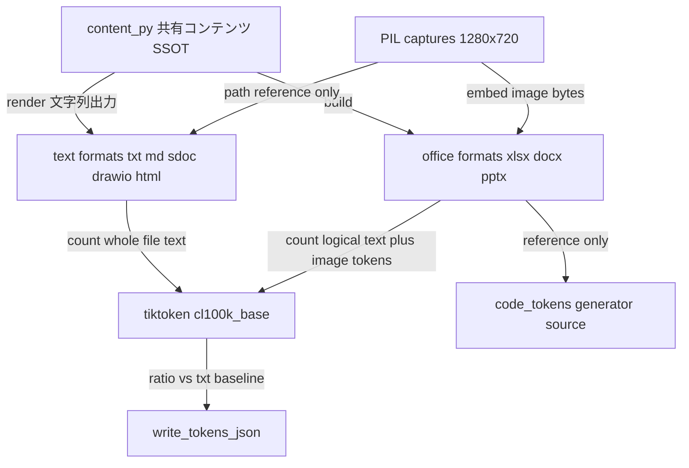
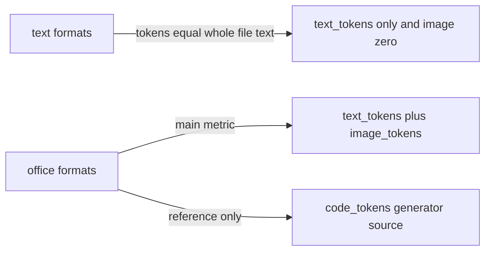

``````markdown
# 車線維持支援システム (LKAS) 仕様資料 — 書き込み側トークン計測レポート

> 本レポートは「書き込みコンテキスト(各形式を生成する際に書き出した内容)」の実測結果である。読み込み側トークンの計測は別セッションの責務であり、本書には含まない。
> 全トークン値は **tiktoken `cl100k_base` による近似値**である(Anthropic 本番トークナイザとは数え方が異なるため絶対値は近似)。本計測の主目的は **`.txt` を基準(1.00)とした形式間の相対倍率の比較**であり、近似トークナイザでこの目的は達成できる。

---

## エグゼクティブサマリー

同一の意味内容を持つ LKAS ソフトウェア仕様検討資料を 8 形式で生成し、各ファイルへ書き込んだ内容のトークン数を tiktoken (`cl100k_base`) で実測した。本文は日本語 4,335 字(A4 約 5 枚相当)、図は構成図・状態遷移図・シーケンス図・処理フローの 4 種、表はパラメータ 14 行・インタフェース 12 行、画面キャプチャ 2 枚(各 1280x720)で構成し、図表が残り約 50% を担う。内容一致は 253 個の必須文字列照合で全形式 **欠落 0** を確認済み。

**実測トークン表(tiktoken cl100k_base 近似 / `.txt` 合計 = 1.00):**

| 形式    | テキスト由来 | 画像由来 |     合計 | .txt基準倍率 | (参考)生成コード |
| ------- | -----------: | -------: | -------: | -----------: | ---------------: |
| txt     |        7,827 |        0 |    7,827 |        1.000 |                - |
| md      |        7,691 |        0 |    7,691 |        0.983 |                - |
| sdoc    |        8,457 |        0 |    8,457 |        1.080 |                - |
| drawio  |       31,474 |        0 |   31,474 |        4.021 |                - |
| html    |       16,419 |        0 |   16,419 |        2.098 |                - |
| xlsx    |        7,452 |  2,457.6 |  9,909.6 |        1.266 |            1,197 |
| docx    |        7,452 |  2,457.6 |  9,909.6 |        1.266 |              872 |
| pptx    |        6,993 |  2,457.6 |  9,450.6 |        1.207 |            2,180 |

**要点:**

- **drawio が突出して重い(4.02 倍)。** mxGraph XML は全図形・全コネクタを style 文字列と座標付き XML セルで表現するため。
- **html が次に重い(2.10 倍)。** インライン SVG の polyline / rect / text 座標列に加え HTML 表と CSS が嵩む。
- **sdoc は txt をやや上回り(1.08 倍)、md はやや下回る(0.98 倍)。** どちらも図は mermaid。md は mermaid が簡潔で ASCII アートより軽い。sdoc は RST 表と StrictDoc タグの付帯分が増える。
- **office 系は 1.21〜1.27 倍。** テキスト由来(論理内容)は txt より軽いが、埋め込み画像 2 枚分の 2,457.6 トークンが加算されるため合計で txt を上回る。
- office の「テキスト由来」は **(a) 論理内容ベース**(セル・段落・図形のテキスト値合計)で、他形式と公平に比較する主指標。**(b) 生成コード**は参考値。

---

## 1. 計測方法

**計測パイプライン:**



全形式を単一の共有コンテンツ(本文・表・図のノード/エッジ/座標)からレンダリングし、内容の一致を構造的に保証する。テキスト系 5 形式はファイル本文全体を、office 系 3 形式は (a) 論理内容(セル/段落/図形のテキスト値)をそれぞれ tiktoken でカウントする。

**形式別のトークン構成:**



テキスト系は画像をパス参照のみとするため画像由来トークンは 0。office 系は capture1 / capture2 を画像実体として埋め込むため、Anthropic 公式の画像トークン概算式で加算する。

**画像由来トークンの算出式:**

```text
T_image = (W * H) / 750 * 2   (capture is 1280 x 720, two images embedded)
```

数式表現は次のとおり。

$$
T_{image} = \frac{W \times H}{750} \times 2 = \frac{1280 \times 720}{750} \times 2 = 2457.6
$$

この 2,457.6 トークンは office 系(xlsx / docx / pptx)の合計にのみ加算する。テキスト系 5 形式はパス参照のみのため 0。

---

## 2. 成果物一覧(`samples/`、計 11 ファイル / 605,187 bytes)

| ファイル          |   bytes | 図の表現方法                                          |
| ----------------- | ------: | ----------------------------------------------------- |
| spec_lkas.txt     |  20,533 | アスキーアート + 整形プレーン表 / 画像はパス参照      |
| spec_lkas.md      |  18,603 | mermaid + Markdown 表 / 画像参照                       |
| spec_lkas.sdoc    |  21,079 | StrictDoc + RST(list-table / code-block 内 mermaid) |
| spec_lkas.drawio  |  86,423 | mxGraph XML ネイティブ図形・コネクタ + 表グリッド     |
| spec_lkas.html    |  41,104 | インライン SVG + HTML table / img 参照                |
| spec_lkas.xlsx    |  89,093 | セルグリッド表 + 画像実体 2 枚                         |
| spec_lkas.docx    | 117,444 | Word 表 + 画像実体 2 枚                                |
| spec_lkas.pptx    | 130,259 | 実オートシェイプ + コネクタ + 画像実体 2 枚           |
| capture1.png      |  39,017 | ダミー HMI(LKAS ACTIVE 画面)                        |
| capture2.png      |  38,832 | ダミー HMI(車線逸脱警報画面)                        |
| write_tokens.json |   2,800 | 計測結果(機械可読)                                  |

**画面キャプチャ実解像度(ディスクから再読取り):**

```text
capture1.png : 1280 x 720
capture2.png : 1280 x 720
```

各 office ファイルに画像実体が 2 枚ずつ埋め込まれていること(xlsx: xl/media、docx: word/media、pptx: ppt/media)、および 3 ファイルとも再オープン可能(xlsx 198 行 / docx 段落 55・表 7 / pptx 16 スライド)であることを確認済み。

---

## 3. 形式別の考察

- **txt(基準 1.000)** — ASCII アートと整形表の罫線・パディング空白がそのままトークンになる。図 4 種をすべて文字で描くため、本文+表+図でまとまった量になる。
- **md(0.983)** — 図は mermaid。flowchart / stateDiagram / sequenceDiagram は簡潔な記法で、ASCII アートより軽い。表も Markdown 表で軽量。結果として txt をわずかに下回る。
- **sdoc(1.080)** — 図は md と同じ mermaid をRST の code-block として埋め込み、表は RST list-table。`[[SECTION]]` / `[TEXT]` / `[REQUIREMENT]` / `STATEMENT` 等のタグと RST 付帯分で txt をやや上回る。
- **drawio(4.021)** — 最も重い。1 図形ごとに style 文字列と座標(mxGeometry)を持つ XML セルになり、エッジも始点・終点・waypoint の座標を保持する。本文・表もセル化するため XML が膨らむ。
- **html(2.098)** — インライン SVG が冗長。各図形は座標つき rect / polygon、各エッジは polyline の座標列、ラベルは text 要素になる。加えて HTML table と CSS。
- **xlsx / docx(ともに 1.266)** — テキスト由来は同一の論理内容(7,452)。図は関係表(セル/Word 表)で表現するため ASCII アートより軽い。画像 2 枚分 2,457.6 が加算されて合計で txt を上回る。
- **pptx(1.207)** — テキスト由来が最小(6,993)。図を実オートシェイプで「1 ノード 1 回」描くため、関係表のようにノード名が源/宛先で重複しない。画像 2 枚分が加算される。

---

## 4. 内容一致(自己チェック)と検証

- **内容一致:** 本文 34 段落・両表の全セル値・全図のノード/エッジ/状態/参加者/メッセージ・全キャプションからなる **必須文字列 253 個** を、8 形式すべての抽出テキストに対し包含判定し、**欠落 0(完全一致)** を確認。drawio は XML パース後の値、html はエンティティ復元後で照合し、エスケープ差を吸収した。
- **図の表現は形式ごとに異なる(仕様どおり)。** 一致しているのは論理内容(ラベル・ノード・エッジ・本文・表値)であり、表現方法(アスキー / mermaid / SVG / mxGraph / 実図形 / 関係表)は形式ネイティブで異なる。
- **.sdoc 検証:** `strictdoc export` が **exit 0(Export completed)で通過**。書き出し HTML にパラメータ値・インタフェース値・capture1.png 参照・mermaid 本文・要求 UID が出力されることを確認(RST 描画成立)。

---

## 5. 測定環境

```text
Python        3.13.3
tiktoken      0.13.0   (encoding: cl100k_base)
openpyxl      3.1.5
python-docx   1.2.0
python-pptx   1.0.2
Pillow        12.2.0
strictdoc     0.23.1
```

計測結果は `samples/write_tokens.json` に格納済み(meta: トークナイザ・近似注記・画像式・解像度・各内訳の定義・ライブラリ版数 / formats: 8 形式キーで text_tokens・image_tokens・total・ratio、office は code_tokens も)。後続の読み込み計測セッションが転記可能な形式である。

---

## 6. 注記(近似・制約・推測の有無)

- **推測・捏造で埋めた数値は無い。** トークン値は全て tiktoken 実測、画像トークンは検証済み解像度に式適用、バイトサイズ・解像度・埋め込み枚数はディスクから実測。
- **全トークンは tiktoken cl100k_base の近似値**(Anthropic 本番トークナイザとは数え方が異なる)。目的である `.txt` 基準の相対倍率比較には十分。
- **xlsx / docx の図表現について(既知の制約・許容済み):** openpyxl と python-docx には図形/コネクタを描画する公開 API が無いため、両形式の図はネイティブの表(セルグリッド / Word 表)による関係表で表現した(pptx のみ実オートシェイプ + コネクタで作図)。生 XML 注入での図形化はファイル破損リスクが高いため採用しない。**この相違は主指標である論理内容トークン(テキスト値のみ集計)には影響しない。** 本方針はユーザー承認済み(現状維持)。
- **`.xml` 単独ファイルは作成していない。** 本セッション・後続セッション双方の対象ファイル一覧が 8 形式で `.html` のみを含み一致するため、計測規則中の「html/xml」は markup 系のカテゴリ表記と判断した。
``````
