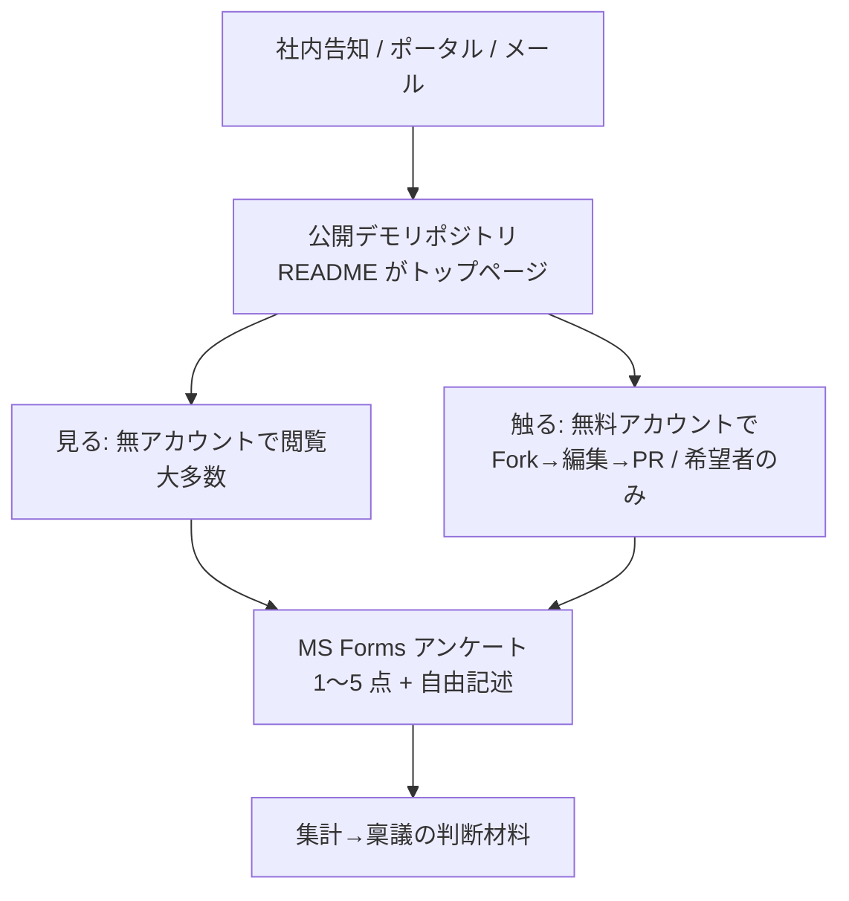

# GitHub 導入トライアル — 提案書 兼 手順書

> 〜1000 名規模で GitHub を試用し、社員の反応を確認して稟議を通すための、提案と実施手順。
> **想定読者**: 起案者・情報システム/セキュリティ・承認者
> **作成日**: 2026-06-19

---

## 0. 結論(先出し)

**無料の GitHub に「公開デモ」を 1 つ用意**し、

- **大多数**はアカウント無しで**閲覧**(README・ドキュメント・図・PR・レビューを見る)
- **希望者だけ**が無料アカウントを作り、**Fork → 編集 → プルリク**で体験
- 反応は **Microsoft Forms**(1〜5 点)で回収

**サーバ構築もライセンス購入も不要。コスト $0。** 本物の GitHub をそのまま見せるので、稟議の評価対象(=GitHub)と一致し、誠実。

---

## 1. 背景と目的

- GitHub を導入したいが、まず**社員に体験させて反応を確認**し、稟議を通したい。
- 本番導入(ライセンス購入・全社アカウント作成)を先に行うと、それ自体が「導入済み」となり**トライアルの意味がない**。
- よって、**本番導入をせずに**、1000 名規模で「GitHub とはこういうものだ」というイメージを持ってもらう方法が必要。

## 2. 課題の整理(よくある誤解の解消)

| 誤解 | 事実 |
|---|---|
| 試す=ライセンス購入が必要 | **不要**。GitHub には無料プランがあり、**公開リポジトリは誰でも無料・無アカウントで閲覧**できる。 |
| 試す=全員のアカウント作成が必要 | 閲覧は**不要**。編集する人だけアカウントが要る。 |
| 本当の論点 | 「1000 人分の**本番アカウント**を作る」こと自体が実質導入。→ だから **「見せる(閲覧)」と「触らせる(編集)」を分離**するのが鍵。 |

## 3. 方針(全体像)



3 つの動線:
1. **閲覧動線** … リンクを開くだけ。ログイン不要。
2. **ハンズオン動線** … 無料アカウント作成 → Fork → 編集 → プルリク。
3. **アンケート動線** … デモの README から Forms へ。Forms 説明文にもデモ URL を記載し相互リンク。

## 4. なぜこの方式か(比較と代替案)

| 観点 | 採用: 本物 GitHub 公開デモ | 代替: 社内 self-host (Gitea) |
|---|---|---|
| イメージの忠実さ | ◎ 本物 UI そのまま | ○ GitHub 風(同一ではない) |
| 閲覧のアカウント | 不要 | 不要(匿名閲覧 ON) |
| コスト | **$0** | サーバ 1 台 |
| 運用 | **不要** | 構築・保守が必要 |
| 内容の公開 | インターネット公開(非機密のみ) | 社内限定にできる |
| 稟議の誠実さ | ◎ 本物を評価 | △「代替で試した」と注記が必要 |

- **検討した代替案(社内 Gitea を self-host)**: 運用が必要なため今回は見送り。ただし将来「**外部に一切出せない**」要件になった場合の**控え**として有効(別途、ローカル検証環境あり)。

## 5. 着手前チェック(必ず確認)

- [ ] **公開範囲**: デモ内容はインターネットに公開される。**非機密のサンプルのみ**にする。
- [ ] **社内ポリシー**: 公開リポジトリ/外部公開の可否を情報システム・法務に確認。
- [ ] **アカウント作成**: ハンズオン参加者は**無料 GitHub アカウント**(規約同意・メール)を作る。会社として個人アカウント作成が許容されるか確認。任意参加とする。
- [ ] **計測の限界**: 匿名閲覧は誰が見たか個別追跡不可。母数は Forms 回答で把握。

## 6. 実施手順(運営側)

### Phase 1 — 準備(アカウント / 置き場所)
1. 公開先を決める。
   - **簡単**: 個人の無料アカウントの**公開リポジトリ**1 つ。
   - **体裁重視**: 無料の **Organization** を作成(github.com → Settings → Organizations → New → **Free**)し、その下に公開リポジトリ。
2. 動作確認用に `gh` CLI を使う場合は `gh auth status` で認証を確認。

### Phase 2 — デモリポジトリ作成と内容投入

**Web で行う場合**: 「New repository」→ Public → README 付きで作成 →「Add file」で `.md` や図をアップロード。

**`gh` CLI で行う場合**:
```bash
# 1) 公開リポを作成して clone
gh repo create <owner>/github-demo --public \
  --description "GitHub 体験デモ(社内トライアル)" --clone
cd github-demo

# 2) README とサンプル文書・図を追加(中身は第 7 章参照)
#    docs/ に .md、図は PNG/SVG を置き .md から参照
git add -A
git commit -m "Add demo docs (README, Mermaid, diagram)"
git push

# 3) “レビュー文化”を見せる例 PR を作る
git switch -c fix-typo
#    … docs の文言を 1 か所修正 …
git commit -am "Fix wording in 手順書"
git push -u origin fix-typo
gh pr create --base main --head fix-typo \
  --title "手順書の誤記を修正" \
  --body "気づいた点を直しました。レビューお願いします。"
gh pr comment <PR番号> --body "LGTM。ついでに表記ゆれも統一しましょう。"
gh pr review  <PR番号> --approve
gh pr merge   <PR番号> --squash --delete-branch

# 4) Issue を数件
gh issue create --title "用語集を追加したい" --body "略語が分かりにくいので一覧が欲しい。"
```

### Phase 3 — アンケート(Forms)準備
- 第 9 章の設問で Microsoft Forms を作成。
- Forms の説明文に**デモ URL** を記載。デモの README に**「アンケートへ回答」ボタン**(Forms URL)を記載。

### Phase 4 — 告知・展開
- メール/社内ポータルで「デモ URL」「体験期間」「所要 5〜10 分」「アンケート依頼」を案内。
- 「見るだけで OK・触りたい人は手順あり」と明記(心理的ハードルを下げる)。

### Phase 5 — 集計・稟議
- Forms 結果(平均点・分布・自由記述・属性別)を集計。
- 「現行手段との比較」「使いたい意向率」を主要指標に、稟議資料へ。

## 7. デモリポジトリの中身(推奨構成)

空のリポでは響かない。**協働の価値(レビュー・履歴・差分)が見える**よう作り込む。

```
github-demo/
  README.md              # トップページ: 目的 / 見る手順 / 触る手順 / アンケートボタン
  docs/
    01-議事録サンプル.md
    02-手順書サンプル.md   # Mermaid フロー図を含む
    03-FAQ.md
    architecture.svg       # draw.io から書き出した図(.md から参照)
  CONTRIBUTING.md        # 「触ってみる」手順(Fork→編集→PR)
```
- **Mermaid**: ` ```mermaid ` ブロックは GitHub 上で自動描画。
- **draw.io**: PNG/SVG に書き出してコミットし `` で参照(生 `.drawio` は不可)。
- **例 PR を 2〜3 本**:レビューコメント → Approve → Merge のスレッドを残す(レビュー文化の見せ場)。
- **Issue を数件**:改善要望など。

## 8. 参加者向けガイド(配布用・1 枚)

### A. 見るだけ(アカウント不要・2 分)
1. 配布リンクを開く(ログイン不要)。
2. **README** を読む → `docs/` の `.md` を開く(図やフロー図が表示される)。
3. 上部 **「Pull requests」** タブ → 例 PR を開き、**差分**と**レビューコメント**を見る。
4. **「Issues」** タブで改善要望のやり取りを見る。
5. **アンケートに回答**(README のボタン)。

### B. 触ってみる(無料アカウント・10 分)
1. github.com 右上 **Sign up** で無料アカウント作成。
2. デモリポで **「Fork」**(自分のコピーを作る)。
3. 自分の Fork で `.md` を開き **鉛筆アイコン**で編集 → **Commit**。
4. **「Contribute → Open pull request」** で元リポへプルリク。
5. コメントやレビューのやり取りを体験 → **アンケートに回答**。

## 9. アンケート設問(Microsoft Forms コピペ用)

1. **GitHub を使ってみてどうでしたか?**(単一選択:1 悪い / 2 / 3 / 4 / 5 良い)
2. **今のやり方(共有フォルダ・メール等)と比べてどうですか?**(1 もっと悪い 〜 5 もっと良い)
3. **業務で使いたいと思いますか?**(はい / 条件付きで はい / いいえ)
4. **特に良かった点**(自由記述)
5. **不安・分かりにくかった点**(自由記述)
6. **あなたの関わり方**(見ただけ / 実際に編集・PR を試した)
7. **所属・役割**(任意:部署 / 職種)

## 10. スケジュール目安

| 週 | 運営の作業 |
|---|---|
| 1 週目 | 公開ポリシー確認 → デモリポ作成・内容投入 → Forms 作成 |
| 2 週目 | 社内告知 → 体験期間(随時アンケート回収) |
| 3 週目 | 集計 → 稟議資料化・報告 |

## 11. リスクと対策

| リスク | 対策 |
|---|---|
| 公開=全世界に見える | 非機密サンプルのみ。社内ポリシーを事前確認。 |
| 外部に一切出せない要件 | 今回前提(公開 OK)では不要。要件化したら社内 self-host(Gitea)へ切替。 |
| 公開リポへの想定外の PR/コメント | デモ用途として許容。不要なら Issues/PR 機能を制限。 |
| アカウント作成への抵抗 | 任意参加・少人数。「見るだけ」で十分と明記。 |
| 反応の母数把握 | Forms 回答で代替(閲覧者の個別追跡は不可)。 |

## 想定コストとスケール

- 費用 **$0**(GitHub Free・公開リポ)。閲覧者数は無制限、1000 名同時閲覧も問題なし。
- ハンズオンのみ無料アカウントが必要(費用は発生しない)。

---

## 付録 A. `gh`(GitHub CLI)早見表
```bash
gh auth status                         # 認証確認
gh repo create <owner>/<name> --public --clone
gh pr  create --base main --head <branch> --title "..." --body "..."
gh pr  review <n> --approve
gh pr  comment <n> --body "..."
gh pr  merge <n> --squash --delete-branch
gh issue create --title "..." --body "..."
```

## 付録 B. 会社の Claude Code に作らせる場合のプロンプト
> 下記をそのまま貼り付けると、デモリポの中身一式(ローカル)を生成できます。公開は内容確認後に自分で実施。

```text
非機密の「GitHub 体験デモ」用リポジトリの中身を、カレントディレクトリにローカル生成してほしい(まだ push はしない)。
- README.md: 目的 / 「見る手順」/「触る手順(Fork→編集→PR)」/ 末尾に「アンケートへ」リンク(URL は後で差し替えるプレースホルダ)
- docs/ に日本語サンプル .md を 3 本(議事録・手順書・FAQ)。手順書には mermaid のフロー図を 1 つ入れる。
- docs/architecture.svg を 1 枚(簡単な構成図の SVG を直接生成)。手順書の .md から  で参照。
- CONTRIBUTING.md: 「触ってみる」手順(無料アカウント作成→Fork→Web 編集→PR)。
- 内容はすべて非機密のダミー。英語ではなく日本語で。
最後に、push する場合の gh コマンド例(公開リポ作成→commit→push→例 PR/Issue 作成)を出力して。実際の push はしないこと。
```

---

> このドキュメントは**社内検討用**です。公開リポジトリに含めて push すると外部公開されます。取り扱いに注意してください。
