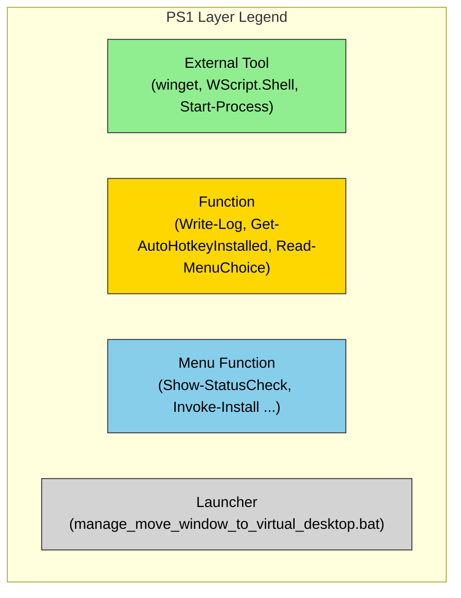
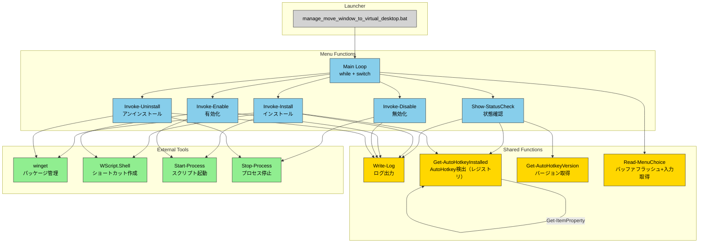
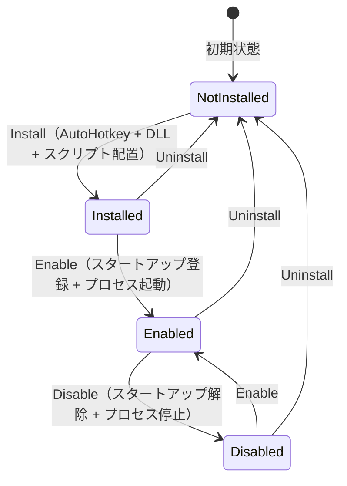
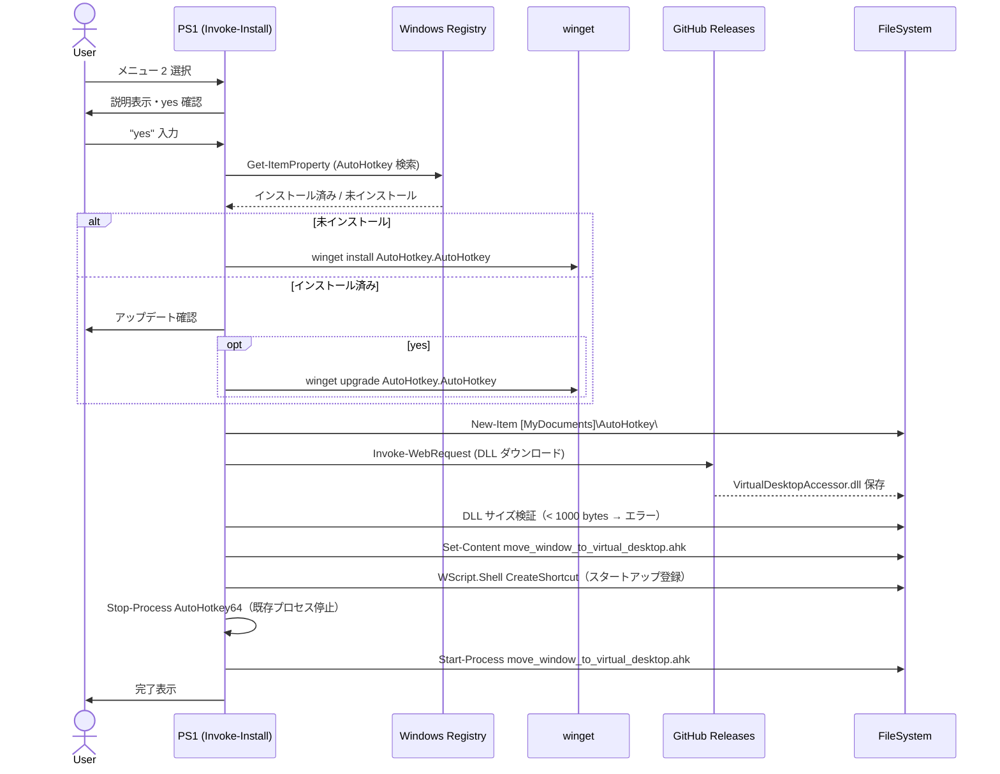

# spec-manage_move_window_to_virtual_desktop

**Document ID:** spec-manage_move_window_to_virtual_desktop  
**Version:** 2.3.0
**Status:** Draft  
**Date:** 2026-03-29  

---

## Chapter 1. Foundation（基本事項）

### 1.1 Background（背景）

Windows 11 の仮想デスクトップ機能は、複数ワークスペースによる作業効率向上に有効である。しかし、アクティブウィンドウを隣の仮想デスクトップへ移動するキーボードショートカットは Windows 11 の標準機能には存在しない（Win+Ctrl+← / → はデスクトップ切り替えのみでウィンドウは移動しない）。サードパーティツールの AutoHotkey と VirtualDesktopAccessor.dll を組み合わせることでこの機能を実現できるが、インストール・設定・有効化・無効化・アンインストールを手動で行うには複数の手順が必要であり、技術的な知識を要する。

v1.x では Windows バッチファイル（.bat）のみで実装したが、cmd.exe の構造的なバグ（if/else 複合ブロック内での call によるファイルポインタ破損、%errorlevel% のパース時展開、キーボードバッファのブリードスルー等）が繰り返し発生したため、v3.0.0 で PowerShell スクリプト（.ps1）に全面移植した。

### 1.2 Issues（課題）

| # | 課題 |
|---|------|
| I-1 | Win+Ctrl+Shift+← / → のショートカットが Windows 11 標準では存在しない |
| I-2 | AutoHotkey と VirtualDesktopAccessor.dll の手動セットアップは手順が多く煩雑 |
| I-3 | 機能の有効化・無効化・アンインストールを簡単に行う手段がない |
| I-4 | PowerToys を既に使用しているユーザーとの競合リスクがある |

### 1.3 Goals（目標）

| # | 目標 |
|---|------|
| G-1 | Win+Ctrl+Shift+← / → でアクティブウィンドウを隣の仮想デスクトップへ移動できる |
| G-2 | バッチファイルをダブルクリックするだけで、インストールから起動まで完結する |
| G-3 | 有効化・無効化・アンインストールをメニューから操作できる |
| G-4 | 全操作がログファイルに記録され、問題発生時に診断できる |

### 1.4 Approach（解決方針）

- **ツール:** AutoHotkey v2 + VirtualDesktopAccessor.dll
- **インストール手段:** AutoHotkey は winget、DLL は GitHub Releases から Invoke-WebRequest で取得
- **インターフェース:** `.bat`（起動ランチャー）+ `.ps1`（全ロジック）による CLI メニュー
- **スタートアップ登録:** Windows スタートアップフォルダへのショートカット配置
- **ログ:** スクリプトと同フォルダに `.log` ファイルを生成（UTF-8）

### 1.5 Scope（範囲）

**In-scope（対象）:**
- AutoHotkey v2 のインストール・アップデート（winget 経由）
- VirtualDesktopAccessor.dll のダウンロード
- AutoHotkey スクリプトの生成・配置
- スタートアップ登録・解除
- 状態確認・有効化・無効化・アンインストール
- 全操作のログ記録

**Out-of-scope（対象外）:**
- PowerToys の設定変更
- 仮想デスクトップの数・名前の管理
- Win+Ctrl+Shift+← / → 以外のショートカット追加
- GUI の提供

### 1.6 Constraints（制約事項）

| # | 制約 |
|---|------|
| C-1 | Windows 11 24H2（OS Build 26100.2605）以降でのみ動作する（VirtualDesktopAccessor.dll の要件） |
| C-2 | インターネット接続が必要（Install 時。winget および GitHub へのアクセス） |
| C-3 | AutoHotkey v2 を前提とする（v1 とは構文互換性なし） |
| C-4 | PowerShell の実行ポリシーを `-ExecutionPolicy Bypass` で一時的に回避して .ps1 を実行する |

### 1.7 Limitations（制限事項）

| # | 制限 |
|---|------|
| L-1 | Enable / Disable 時の Stop-Process は AutoHotkey64.exe プロセス全体を停止するため、他の AutoHotkey スクリプトも停止される |
| L-2 | winget install / upgrade / uninstall の実行に最大 2 分程度かかる場合がある（AutoHotkey のインストール検出にはレジストリを使用するため Status Check は高速） |
| L-3 | Windows Update による VirtualDesktopAccessor.dll の互換性破壊が起きた場合、DLL の URL を手動で更新する必要がある |

### 1.8 Glossary（用語集）

| 用語 | 定義 |
|------|------|
| 仮想デスクトップ | Windows 11 の Task View で管理される独立した作業画面 |
| AutoHotkey (AHK) | Windows 向けオープンソーススクリプト言語。キーボードショートカット定義に使用 |
| VirtualDesktopAccessor.dll | Windows の仮想デスクトップ API を AutoHotkey から呼び出すための DLL。Ciantic 作 |
| winget | Windows Package Manager CLI。Microsoft 公式のパッケージ管理ツール |
| スタートアップ登録 | `$env:APPDATA\Microsoft\Windows\Start Menu\Programs\Startup` へのショートカット配置 |
| ショートカット | 本書では「キーボードショートカット」を指す |
| アクティブウィンドウ | 現在フォーカスされているウィンドウ |
| ランチャー | .bat ファイル。PowerShell スクリプトを起動する薄いラッパー |

### 1.9 Notation（表記規約）

RFC 2119 / RFC 8174 準拠。

| キーワード | 意味 |
|------------|------|
| SHALL / MUST | 必須。例外なく実装する |
| SHOULD | 推奨。正当な理由がある場合のみ省略可 |
| MAY | 任意。実装してもしなくてもよい |

EARS 構文中の `shall` は SHALL と同義。

---

## Chapter 2. Requirements（要求）

### 2.1 Functional Requirements（機能要求）

| ID | 要求（EARS） | 和訳 |
|----|-------------|------|
| FR-1 | The system shall display a numbered menu with 6 items: Status Check, Install, Enable, Disable, Uninstall, Exit. | システムは、Status Check・Install・Enable・Disable・Uninstall・Exit の6項目を持つ番号付きメニューを表示しなければならない。 |
| FR-2 | When menu item 1 is selected, the system shall display the installation status of AutoHotkey, VirtualDesktopAccessor.dll, the AHK script, startup registration, and the running process. | メニュー項目 1 が選択されたとき、システムは AutoHotkey・VirtualDesktopAccessor.dll・AHK スクリプト・スタートアップ登録・実行中プロセスのインストール状態を「対象 : 状態」形式で表示しなければならない。 |
| FR-3 | When menu item 2 (Install) is selected and confirmed, the system shall install AutoHotkey v2 via winget, download VirtualDesktopAccessor.dll, create the AHK script, register startup, and launch the script. | メニュー項目 2（Install）が選択され確認されたとき、システムは winget で AutoHotkey v2 をインストールし、VirtualDesktopAccessor.dll をダウンロードし、AHK スクリプトを生成し、スタートアップ登録を行い、スクリプトを起動しなければならない。 |
| FR-4 | While AutoHotkey is already installed, when Install is selected, the system shall ask the user whether to update AutoHotkey. | AutoHotkey がインストール済みの状態で Install が選択されたとき、システムはユーザーに AutoHotkey のアップデート要否を確認しなければならない。 |
| FR-5 | When menu item 3 (Enable) is selected, the system shall register startup and launch the AHK script. | メニュー項目 3（Enable）が選択されたとき、システムはスタートアップ登録を行い AHK スクリプトを起動しなければならない。 |
| FR-6 | When menu item 4 (Disable) is selected, the system shall remove the startup shortcut and stop the AutoHotkey process. | メニュー項目 4（Disable）が選択されたとき、システムはスタートアップショートカットを削除し AutoHotkey プロセスを停止しなければならない。 |
| FR-7 | When menu item 5 (Uninstall) is selected, the system shall ask the user to choose between: (a) remove script and DLL only, (b) remove script, DLL, and AutoHotkey, or (c) back to menu. | メニュー項目 5（Uninstall）が選択されたとき、システムはユーザーに（a）スクリプトと DLL のみ削除、（b）スクリプト・DLL・AutoHotkey をすべて削除、または（c）メニューに戻る、のいずれかを選択させなければならない。 |
| FR-8 | The system shall write all operations with timestamps to a log file located in the same folder as the script files. | システムは、すべての操作をタイムスタンプ付きでスクリプトファイルと同じフォルダのログファイルに書き込まなければならない。 |
| FR-9 | The system shall display log messages on the console simultaneously with writing to the log file. | システムは、ログファイルへの書き込みと同時にログメッセージをコンソールにも表示しなければならない。 |
| FR-10 | If a winget operation is about to execute, the system shall display a notice that it may take up to 2 minutes. | winget 操作が実行される直前に、システムは最大 2 分かかる可能性がある旨の案内を表示しなければならない。 |
| FR-11 | When any destructive operation (Install, Uninstall) is about to execute, the system shall require the user to type "yes" to confirm. | 破壊的な操作（Install・Uninstall）が実行される直前に、システムはユーザーに "yes" の入力による確認を求めなければならない。 |
| FR-12 | If the downloaded VirtualDesktopAccessor.dll is smaller than 1000 bytes, the system shall treat it as corrupt, delete it, and report an error. | ダウンロードされた VirtualDesktopAccessor.dll が 1000 bytes 未満の場合、システムはそれを破損と判断し、削除してエラーを報告しなければならない。 |
| FR-13 | After each menu operation completes, the system shall return to the main menu. | 各メニュー操作が完了した後、システムはメインメニューに戻らなければならない。 |
| FR-14 | The system shall flush the keyboard input buffer before reading each menu choice. | システムはメニュー選択を受け付ける前に、キーボード入力バッファをフラッシュしなければならない。 |

### 2.2 Non-Functional Requirements（非機能要求）

| ID | 要求（EARS） | 和訳 |
|----|-------------|------|
| NFR-1 | The PowerShell script SHALL use full descriptive names for all variables and functions (no abbreviations). | PowerShell スクリプトはすべての変数・関数名に省略なしの完全な説明的名称を使用しなければならない。 |
| NFR-2 | The log file SHALL be created in the same directory as the script files (`$PSScriptRoot`). | ログファイルはスクリプトファイルと同じディレクトリ（`$PSScriptRoot`）に生成されなければならない。 |
| NFR-3 | The system SHOULD complete Status Check within 10 seconds under normal conditions. | システムは通常の環境において Status Check を 10 秒以内に完了することが推奨される。 |
| NFR-4 | The system SHALL NOT require a system restart after any operation. | システムはいかなる操作後もシステム再起動を必要としてはならない。 |
| NFR-5 | The log file SHALL be written in UTF-8 encoding. | ログファイルは UTF-8 エンコーディングで書き込まなければならない。 |

---

## Chapter 3. Architecture（アーキテクチャ）

### 3.1 Architecture Concept（アーキテクチャ方式）

PowerShell スクリプト固有の2層構造を採用する。ランチャー（.bat）は PowerShell の実行ポリシーを回避して .ps1 を呼び出すだけの薄いラッパーであり、全ロジックは .ps1 に集約する。



| レイヤー | 役割 | 色 |
|----------|------|----|
| Launcher | .bat から `-ExecutionPolicy Bypass` で .ps1 を起動するだけ | グレー `#D3D3D3` |
| Menu Function | メニュー表示・ユーザー入力・処理フロー制御 | 青 `#87CEEB` |
| Function | 再利用可能な共通処理（ログ・レジストリ検索・入力取得） | ゴールド `#FFD700` |
| External Tool | winget・WScript.Shell・Start-Process 等の外部ツール呼び出し | 緑 `#90EE90` |

### 3.2 Components（コンポーネント）



### 3.3 File Structure（ファイル構成）

```
[任意のフォルダ]/
├── manage_move_window_to_virtual_desktop.bat   # ランチャー（ダブルクリック起動用）
├── manage_move_window_to_virtual_desktop.ps1   # 全ロジック（PowerShell スクリプト）
└── manage_move_window_to_virtual_desktop.log   # ログファイル（自動生成・UTF-8）

[MyDocuments]\AutoHotkey\                         # [Environment]::GetFolderPath('MyDocuments') で解決
├── VirtualDesktopAccessor.dll                  # ダウンロードされる DLL
└── move_window_to_virtual_desktop.ahk          # 生成される AHK スクリプト

$env:APPDATA\Microsoft\Windows\Start Menu\Programs\Startup\
└── move_window_to_virtual_desktop.lnk          # スタートアップショートカット（自動生成）
```

### 3.4 Domain Model（ドメインモデル）

**状態遷移図:**



| 状態 | 定義 | 到達条件 |
|------|------|---------|
| NotInstalled | DLL・スクリプト・スタートアップが存在しない | 初期状態、またはアンインストール後 |
| Installed | DLL・スクリプトが存在するがスタートアップ未登録・プロセス未起動 | Install 時にスタートアップ登録が WARNING で失敗した場合のみ到達しうる（通常の Install は Enabled まで一気に遷移する） |
| Enabled | スタートアップ登録済み・プロセス起動中 | Install 正常完了後、または Enable 実行後 |
| Disabled | DLL・スクリプトは存在するがスタートアップ未登録・プロセス停止 | Disable 実行後 |

### 3.5 Behavior（振る舞い）

**Install フロー:**



### 3.6 Decisions（設計判断）

#### ADR-001: AutoHotkey のインストール検出にレジストリ（Get-ItemProperty）を使用

- **Status:** Accepted
- **Context:** `winget list` はソースインデックス更新を内部でブロッキング実行するためハングが発生した。`--disable-interactivity` 付与後も環境によっては改善されなかった（実運用で確認）。
- **Decision:** `Get-ItemProperty` で `HKLM:\SOFTWARE\Microsoft\Windows\CurrentVersion\Uninstall\*` → `HKCU:\...` の順に `DisplayName` が AutoHotkey を含むキーを検索する。
- **Consequences:** ネットワーク通信なしで瞬時に完了。winget 以外の手段でインストールされた AutoHotkey も検出できる。

#### ADR-002: winget に --disable-interactivity を付与

- **Status:** Accepted
- **Context:** winget が対話入力を待ってハングする事例が確認された
- **Decision:** Install / Upgrade / Uninstall の全 winget 呼び出しに `--disable-interactivity --accept-source-agreements` を付与する
- **Consequences:** winget の進捗表示が簡素化されるが、ハングを防止できる

#### ADR-003: DLL を直接生成せず GitHub からダウンロード

- **Status:** Accepted
- **Context:** DLL はバイナリファイルであり、スクリプトからは生成不可能
- **Decision:** `Invoke-WebRequest` で GitHub Releases から取得する
- **Consequences:** インターネット接続が必須になる。URL は DLL の新バージョンリリース時に手動更新が必要

#### ADR-004: Stop-Process で AutoHotkey64.exe プロセス全体を停止

- **Status:** Accepted
- **Context:** PowerShell から特定の AHK スクリプトインスタンスのみを停止する確実な手段がない
- **Decision:** `Get-Process -Name 'AutoHotkey64' | Stop-Process -Force` で全インスタンスを停止する
- **Consequences:** 他の AHK スクリプトも停止される（Limitation L-1 に記載）

#### ADR-005: ロジックを PowerShell スクリプト（.ps1）に全面移植

- **Status:** Accepted
- **Context:** cmd.exe バッチファイルで以下の構造的バグが繰り返し発生した。（1）if/else 複合ブロック内での `call :サブルーチン` によるファイルポインタ破損（両ブランチが実行される）、（2）パイプ後の `%errorlevel%` がパース時に展開され正しく判定されない、（3）長時間処理中のキーボードバッファが `set /p` に流入しメニューが意図せず実行される。これらは cmd.exe の仕様に起因する根本的な問題であり、バッチ内での修正に限界があった。
- **Decision:** 全ロジックを `.ps1` に移植。`.bat` は `-ExecutionPolicy Bypass` で `.ps1` を呼び出すだけのランチャーとする。
- **Consequences:** PowerShell の正常な制御フロー・ネイティブレジストリアクセス・`[Console]::KeyAvailable` ループによるバッファフラッシュにより、これまでのバグが構造的に解消される。実行ポリシー `Bypass` が必要になるが、ランチャー BAT から一時的に付与するため恒久的な設定変更は不要。

#### ADR-006: キーボードバッファフラッシュに `[Console]::KeyAvailable` ループを使用

- **Status:** Accepted (Updated)
- **Context:** `[Console]::In.DiscardBufferedData()` は PowerShell を直接起動した場合は動作するが、バッチファイル（.bat）経由で起動すると `Console.In` が `SyncTextReader` ラッパーになるためメソッドが存在せずエラーになる。
- **Decision:** `while ([Console]::KeyAvailable) { [Console]::ReadKey($true) | Out-Null }` でバッファ内の全キー入力を読み捨てる。
- **Consequences:** .bat 経由・直接起動の両方で動作する。KeyAvailable が false になるまでループするため確実にフラッシュできる。

#### ADR-007: レジストリ検索で `Where-Object` の代わりに `ForEach-Object` + `PSObject.Properties` を使用

- **Status:** Accepted
- **Context:** `Set-StrictMode -Version Latest` が有効な状態で、`Where-Object { $_.DisplayName -match 'AutoHotkey' }` を実行すると、`DisplayName` プロパティを持たないレジストリエントリに対して `PropertyNotFoundException` が発生する。`$_.DisplayName -and` ガードを先に置いても、StrictMode 下では `-and` の左辺評価時点で同じ例外が発生するため解消されない。
- **Decision:** `Where-Object` を `ForEach-Object` に置き換え、`$_.PSObject.Properties['DisplayName']` でプロパティの存在を先に確認してからアクセスする。`Get-AutoHotkeyInstalled` と `Get-AutoHotkeyVersion` の両関数に適用。
- **Consequences:** `Set-StrictMode -Version Latest` を維持したまま安全にレジストリ検索が可能になる。`PSObject.Properties` による存在チェックは StrictMode の影響を受けない。

#### ADR-008: ドキュメントフォルダのパス解決に `[Environment]::GetFolderPath('MyDocuments')` を使用

- **Status:** Accepted
- **Context:** PS1 が `$env:USERPROFILE\Documents` でファイルを配置していたが、OneDrive フォルダリダイレクトが有効な環境ではシェルの「マイドキュメント」フォルダが `C:\Users\<user>\OneDrive\Documents` にリダイレクトされる。AHK の `A_MyDocuments` はシェルフォルダを参照するため、PS1 が配置した DLL を AHK が見つけられず `LoadLibrary` が失敗し、`DllCall` で "Call to nonexistent function" エラーが発生した。
- **Decision:** `$env:USERPROFILE\Documents` の代わりに `[Environment]::GetFolderPath('MyDocuments')` を使用し、AHK の `A_MyDocuments` と同じパスを解決する。
- **Consequences:** OneDrive リダイレクト環境・非リダイレクト環境の両方で PS1 と AHK のパスが一致する。

---

## Chapter 4. Specification（仕様）

### 4.1 Scenarios（シナリオ）

```gherkin
Feature: manage_move_window_to_virtual_desktop

  Background:
    Given Windows 11 24H2 (Build 26100.2605 以降) が動作している
    And manage_move_window_to_virtual_desktop.bat をダブルクリックで起動している

  Rule: メニュー操作

    Scenario: SC-001 メインメニュー表示 (traces: FR-1)
      When バッチファイルを起動する
      Then 1〜6 の番号付きメニューが表示される
      And ログファイルのパスが表示される
```

**Result:** SKIP
**Remark:** 未テスト

---

```gherkin
    Scenario: SC-002 無効な選択肢の入力 (traces: FR-1)
      Given メインメニューが表示されている
      When "7" を入力する
      Then エラーメッセージが表示される
      And メニューに戻る
```

**Result:** SKIP
**Remark:** 未テスト

---

```gherkin
  Rule: Status Check

    Scenario: SC-010 未インストール状態の確認 (traces: FR-2)
      Given AutoHotkey が未インストール
      And VirtualDesktopAccessor.dll が存在しない
      When メニューで 1 を選択する
      Then "AutoHotkey : Not installed" と表示される
      And "VirtualDesktopAccessor.dll : Not found (パス)" と表示される
      And "move_window_to_virtual_desktop : Not found (パス)" と表示される
      And "Startup shortcut : Not registered (パス)" と表示される
      And "AutoHotkey64.exe (process) : Not running" と表示される
```

**Result:** PASS
**Remark:** ログで確認済み（10:02セッション）

---

```gherkin
    Scenario: SC-011 winget 実行前の所要時間案内 (traces: FR-10)
      When メニューで 2 (Install) を選択し yes と入力する
      Then "(Checking registry for installed AutoHotkey ...)" のメッセージが表示される
```

**Result:** SKIP
**Remark:** 未テスト

---

```gherkin
  Rule: Install

    Scenario: SC-020 yes 以外の入力でインストールキャンセル (traces: FR-11)
      Given メニューで 2 (Install) を選択した
      When Enter キーを押す（yes 以外）
      Then "Install cancelled" と表示される
      And メニューに戻る
      And AutoHotkey はインストールされない
```

**Result:** SKIP
**Remark:** 未テスト

---

```gherkin
    Scenario: SC-021 新規インストール完了 (traces: FR-3)
      Given AutoHotkey が未インストール
      And インターネット接続がある
      When メニューで 2 を選択し "yes" と入力する
      Then AutoHotkey がインストールされる
      And [MyDocuments]\AutoHotkey\ フォルダが作成される
      And VirtualDesktopAccessor.dll がダウンロードされる
      And move_window_to_virtual_desktop.ahk が生成される
      And スタートアップショートカットが作成される
      And AutoHotkey プロセスが起動する
      And Win+Ctrl+Shift+Right/Left でウィンドウが移動できる
```

**Result:** SKIP
**Remark:** 未テスト（v3.0.0 での動作確認が必要）

---

```gherkin
    Scenario: SC-022 既インストール時のアップデート確認 (traces: FR-4)
      Given AutoHotkey がインストール済み
      When メニューで 2 を選択し "yes" と入力する
      Then "AutoHotkey is already installed." と表示される
      And "Update to latest version? (yes/no):" と表示される
```

**Result:** SKIP
**Remark:** 未テスト

---

```gherkin
    Scenario: SC-023 破損 DLL の検出 (traces: FR-12)
      Given ダウンロードされた DLL が 1000 bytes 未満
      When Install を実行する
      Then "Downloaded file appears to be corrupt" エラーが表示される
      And DLL ファイルが削除される
      And メニューに戻る
```

**Result:** SKIP
**Remark:** 未テスト

---

```gherkin
  Rule: Enable / Disable

    Scenario: SC-030 有効化（Enable）(traces: FR-5)
      Given Install 完了済み
      And AutoHotkey プロセスが停止している
      When メニューで 3 を選択する
      Then スタートアップショートカットが作成される
      And AutoHotkey プロセスが起動する
      And ショートカットキーが動作する
```

**Result:** SKIP
**Remark:** 未テスト

---

```gherkin
    Scenario: SC-031 無効化（Disable）(traces: FR-6)
      Given Enabled 状態
      When メニューで 4 を選択する
      Then スタートアップショートカットが削除される
      And AutoHotkey プロセスが停止する
      And ショートカットキーが動作しなくなる
      But DLL とスクリプトファイルは保持される
```

**Result:** SKIP
**Remark:** 未テスト

---

```gherkin
  Rule: Uninstall

    Scenario: SC-040 スクリプトと DLL のみ削除（選択肢 a）(traces: FR-7)
      Given Enabled または Disabled 状態
      When メニューで 5 を選択し "a" → "yes" と入力する
      Then AutoHotkey プロセスが停止する
      And スタートアップショートカットが削除される
      And move_window_to_virtual_desktop.ahk が削除される
      And VirtualDesktopAccessor.dll が削除される
      But AutoHotkey 本体はアンインストールされない
```

**Result:** SKIP
**Remark:** 未テスト

---

```gherkin
    Scenario: SC-041 AutoHotkey も含めて削除（選択肢 b）(traces: FR-7)
      Given Enabled または Disabled 状態
      When メニューで 5 を選択し "b" → "yes" と入力する
      Then SC-040 の全削除が実行される
      And AutoHotkey 本体が winget でアンインストールされる
```

**Result:** SKIP
**Remark:** 未テスト

---

```gherkin
  Rule: Input Buffer

    Scenario: SC-060 長時間処理後のメニュー入力が正常に動作する (traces: FR-14)
      Given Install 実行中（winget install で約2分待機中）
      When ユーザーがキーボードで "1" を押す
      Then Install 完了後のメニュー表示では "1" の入力が無視される
      And ユーザーが改めてメニュー選択を行える
```

**Result:** SKIP
**Remark:** 未テスト（v3.0.0 での動作確認が必要）

---

```gherkin
  Rule: Logging

    Scenario: SC-050 ログファイルへの記録 (traces: FR-8, FR-9)
      When 任意のメニュー操作を実行する
      Then 操作内容がタイムスタンプ付きでログファイルに書き込まれる
      And 同内容がコンソールにも表示される
```

**Result:** PASS
**Remark:** ログファイル内容でタイムスタンプ記録を確認済み

---

### 4.2 Configuration（設定定義）

PowerShell スクリプト先頭の変数定義セクションで管理する。

| 変数名 | デフォルト値 | 説明 |
|--------|-------------|------|
| `$AutoHotkeyFolder` | `[Environment]::GetFolderPath('MyDocuments')\AutoHotkey` | DLL・スクリプトの配置フォルダ（OneDrive リダイレクト対応、ADR-008） |
| `$AutoHotkeyScript` | `$AutoHotkeyFolder\move_window_to_virtual_desktop.ahk` | 生成・起動する AHK スクリプトのパス |
| `$VirtualDesktopAccessorDll` | `$AutoHotkeyFolder\VirtualDesktopAccessor.dll` | ダウンロードする DLL のパス |
| `$VirtualDesktopAccessorUrl` | GitHub Releases URL | DLL のダウンロード URL |
| `$StartupFolder` | `$env:APPDATA\Microsoft\Windows\Start Menu\Programs\Startup` | スタートアップフォルダ |
| `$StartupShortcut` | `$StartupFolder\move_window_to_virtual_desktop.lnk` | スタートアップショートカットのパス |
| `$LogFile` | `$PSScriptRoot\manage_move_window_to_virtual_desktop.log` | ログファイルパス |

### 4.3 Error Handling（エラー処理）

| エラー条件 | 対応 |
|-----------|------|
| winget install 失敗（`$LASTEXITCODE -ne 0`） | エラー表示・ログ記録・メニューへ戻る |
| DLL ダウンロード失敗（try/catch） | エラー表示・ログ記録・メニューへ戻る |
| DLL ダウンロード後ファイル不存在 | エラー表示・ログ記録・メニューへ戻る |
| DLL サイズ < 1000 bytes | 破損と判定・DLL 削除・エラー表示・メニューへ戻る |
| スタートアップ登録失敗（ショートカット不存在） | WARNING 表示・手動登録方法を案内・処理継続 |
| Enable 時にスクリプト不存在 | エラー表示・Install を促す・メニューへ戻る |
| Enable 時に DLL 不存在 | エラー表示・Install を促す・メニューへ戻る |

---

## Chapter 5. Test Strategy（テスト戦略）

本ツールは PowerShell スクリプトであり自動テストフレームワークは使用しない。すべてのテストは手動実施とする。

| テストレベル | 対象 | 方針 | ツール | 合格基準 |
|-------------|------|------|--------|---------|
| 手動機能テスト | 全メニュー項目（SC-001〜SC-060） | Chapter 4.1 の Gherkin シナリオを手順書として使用 | 目視確認 | 全 Scenario が PASS または CONDITIONAL |
| ログ検証 | ログファイルの内容 | 各操作後にログファイルを確認 | テキストエディタ | タイムスタンプ・操作内容が正しく記録されている |
| 回帰テスト | Windows Update 後の動作確認 | DLL 互換性の確認を優先 | 目視確認 | SC-021 が PASS |
| 入力バッファテスト | 長時間処理後のメニュー入力 | winget install 中にキーを押し、完了後メニューが正常動作するか確認 | 目視確認 | SC-060 が PASS |

---

## Chapter 6. Design Principles Compliance（SW設計原則 準拠確認）

PowerShell スクリプトに適用可能な原則を対象とする。

| カテゴリ | 識別名 | 正式名称 | 確認観点 | 判定 |
|---------|--------|---------|---------|------|
| 命名 | Naming | — | 変数・関数名が意図を表しているか。略称を使っていないか | ✅ OK |
| 簡潔性 | KISS | Keep It Simple, Stupid | PowerShell で実現できる最もシンプルな実装を選んでいるか | ✅ OK |
| 簡潔性 | YAGNI | You Aren't Gonna Need It | 今必要でない機能を実装していないか | ✅ OK |
| 簡潔性 | DRY | Don't Repeat Yourself | AutoHotkey 検出が `Get-AutoHotkeyInstalled` に一元化されているか | ✅ OK |
| 責務分離 | SRP | Single Responsibility Principle | 各関数（Show-StatusCheck 等）が単一の責務を持つか | ✅ OK |
| 責務分離 | SoC | Separation of Concerns | ログ出力・レジストリ検索・入力取得が独立した関数に分離されているか | ✅ OK |
| 責務分離 | SLAP | Single Level of Abstraction Principle | Menu Function 内でユーティリティ関数を呼ぶ抽象度が統一されているか | ✅ OK |
| 可読性 | POLA | Principle of Least Astonishment | メニュー番号と処理内容が直感的に一致するか | ✅ OK |
| エラー | Error Propagation | — | エラーが try/catch で捕捉され表示・ログ記録されているか | ✅ OK |
| 資源管理 | Resource Lifecycle | — | ログファイル・一時ファイルが適切に管理されているか | ✅ OK |
| 並行性 | Concurrency Safety | — | キーボードバッファが `[Console]::KeyAvailable` ループで確実にフラッシュされているか | ✅ OK |

---

## Appendix（付録）

### A.1 References（参考文献）

1. Ciantic. [VirtualDesktopAccessor](https://github.com/Ciantic/VirtualDesktopAccessor) — DLL 本体・リリースページ
2. AutoHotkey Foundation. [AutoHotkey v2 Documentation](https://www.autohotkey.com/docs/v2/)
3. Microsoft. [winget Documentation](https://learn.microsoft.com/en-us/windows/package-manager/winget/)
4. Microsoft. [PowerShell Documentation](https://learn.microsoft.com/en-us/powershell/)
5. Bradner, S. [RFC 2119](https://datatracker.ietf.org/doc/html/rfc2119) — IETF, 1997

### A.2 Licenses（ライセンス）

| コンポーネント | ライセンス |
|--------------|-----------|
| AutoHotkey v2 | GNU General Public License v2 |
| VirtualDesktopAccessor.dll | MIT License (© Jari Pennanen, 2015-2024) |

### A.3 Changelog（変更履歴）

| バージョン | 日付 | 変更内容 |
|-----------|------|---------|
| 2.3.0 | 2026-03-29 | ADR-008 追加（OneDrive フォルダリダイレクト対応）。v3.0.5 のパス解決修正に対応 |
| 2.2.0 | 2026-03-29 | v3.0.4 対応。Get-AutoHotkeyInstalled の DisplayVersion ガード追加。SC-011 のメッセージ文言修正。ADR-005・Ch6 の DiscardBufferedData 参照を KeyAvailable ループに更新 |
| 2.1.0 | 2026-03-29 | ADR-007 追加（Where-Object → ForEach-Object + PSObject.Properties）。v3.0.3 の StrictMode 競合修正に対応 |
| 2.0.0 | 2026-03-29 | v3.0.0 実装に合わせて全面改訂。PowerShell 移植に伴い Ch1〜Ch6 を更新。ADR-005・006 追加。FR-14・NFR-5 追加。SC-060 追加 |
| 1.0.0 | 2026-03-29 | 初版作成 |
